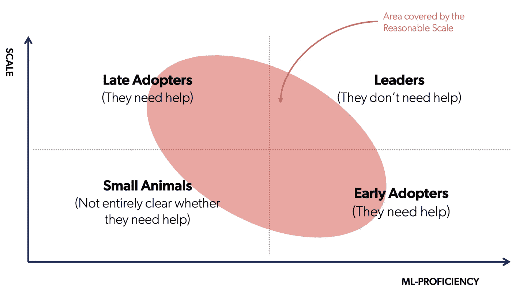

# 规模合理的 ML 和 MLOps

> 原文：<https://towardsdatascience.com/ml-and-mlops-at-a-reasonable-scale-31d2c0782d9c?source=collection_archive---------17----------------------->

## [在启动规模有效地做 ML](https://towardsdatascience.com/tagged/mlops-without-much-ops)；[业内笔记](https://towardsdatascience.com/tagged/notes-from-industry)

## 没有太多操作的 MLOps 第 2 集

与[安德里亚·波洛尼奥里](https://medium.com/@apolonioli)和[雅格布·塔利亚布埃](https://medium.com/@jacopotagliabue)

斯蒂芬妮·勒布朗通过 [Unsplash](https://unsplash.com/photos/sGzCGGc_aaA) 拍摄的照片

虽然生产中使用的机器学习(ML)应用程序的数量正在增长，但我们没有一天不读到一些关于大多数企业仍然难以获得正投资回报的报道(见[此处](https://info.algorithmia.com/hubfs/2019/Whitepapers/The-State-of-Enterprise-ML-2020/Algorithmia_2020_State_of_Enterprise_ML.pdf)和[此处](https://sloanreview.mit.edu/projects/winning-with-ai/))。

你可能会注意到一件事:从来没有人谈论大型科技公司如何努力在生产中获得 ML 的好处。那是因为他们不是。谷歌、脸书、网飞和其他顶级玩家都非常擅长操作 ML，他们最不担心的就是糟糕的投资回报率。

对于那些不得不应对大型科技公司所没有的限制的公司来说，这个门槛总是被认为太高。有趣的是，绝大多数公司都是那样的。大多数公司不像谷歌:他们不能雇佣他们梦想的所有人才，他们没有每天数十亿的数据点，他们不能指望几乎无限的计算能力。

在大型科技公司之外的所有最美好的形式中，我们特别感兴趣的是一个不断增长的——我们认为，服务不足的——与 ML 系统特别相关的部分。

> 我们把这个细分市场称为 **'** 合理规模的公司 **'** (相对于 FAANG 公司不合理的庞大规模)。

合理规模概念所涵盖的概念范围。作者图片。

在这篇文章中，我们将尝试充实我们所说的合理规模的公司。最重要的是，我们希望研究这些组织每天都必须处理的约束。如果这些限制中的一些(或全部)引起了你的共鸣，那么恭喜你:你可能正在一家规模合理的公司做 ML。

> 好消息是，对于处于合理规模的 ML 来说，这实际上是一个伟大的时代。历史上第一次，DataOps 和 MLOps 工具包变得足够丰富、可组合和灵活，可以构建可靠、可复制和可伸缩的端到端管道:不要担心，本系列即将发布的文章将向您展示如何实现。

在转向当前 MLOps 格局的*[*绽放嗡嗡的困惑*](https://en.wikipedia.org/wiki/William_James)*之前，重要的是阐明定义我们问题空间的硬约束，并制定一些设计原则。**

# ****合理规模****

****合理规模(RS)** 的定义是多方面的。它应该足够灵活，能够包含不同行业中的许多用例。在光谱中，我们可以发现数字本地创业公司正在飞速发展，以及大型传统企业在生产中为有限的用例开发 ML 应用程序。与此同时，这个定义意味着为现在大量的开源工具和 MLOps 产品捕捉一定的采用目标。**

**我们用来定义 RS 公司的维度如下:**

## ****1。货币影响:**RS 的 ML 模型每年创造数十万到数千万美元的货币收益(而不是数亿或数十亿美元)。**

**凭直觉，我们想说的是，RS 的成功模式很少有那种把 BERT 模型[应用到 Google 搜索](https://blog.google/products/search/search-language-understanding-bert/)或者改进[亚马逊的推荐](https://www.amazon.science/the-history-of-amazons-recommendation-algorithm)的影响力。RS 公司的 ML 可以产生相当大的影响，但这种影响的绝对规模很少达到大数据公司的规模。**

**另一种稍微正式一点的思考方式是，看看 RS 公司投资 ML 的<https://www.investopedia.com/terms/n/npv.asp>**(**【NPV】**)净现值状态。如前所述，RS 公司有不同的规模，并且在许多方面存在差异，从业务成熟度到运营效率，从财务杠杆到流动性。它们可能是蓬勃发展的公司，收入增长迅速，但不一定盈利，如直接面向消费者的品牌，如 [Warby Parker](https://www.forbes.com/sites/greatspeculations/2021/09/27/warby-parkers-direct-listing-still-overvalued-after-updated-revenue-guidance/?sh=5dd88a5f5baf) 和 [Casper](https://techcrunch.com/2020/01/10/casper-files-to-go-public-shows-you-can-lose-money-selling-mattresses/) 或数字本地玩家，如 [Tubi](https://tubitv.com/) 或[Lyst](https://www.lyst.com/)；或者他们可以是已经实现盈利的老牌企业，比如零售商翠鸟、马克斯和斯潘塞。****

****关键的一点是，所有这些组织都应该遵循[资本预算](https://www.investopedia.com/articles/financial-theory/11/corporate-project-valuation-methods.asp)的一个关键原则，即它们应该承担那些将增加其盈利能力的项目。****

****正的 NPV 通常表明应该进行投资，除非其他项目有更高的 NPV。对 ML 的投资也不例外，NPV 与 ML 应用对公司的影响以及公司的规模相关。当公司太小时，ML 投资的 NPV 可能是负的或适中的，这意味着该项目根本不应该进行，或者实际上不可能优先于具有可比 NPV 的竞争项目(例如，因为后者可能具有更短的回收期或通常被认为风险更小)。****

> ****RS 的概念旨在描述一系列公司，尽管它们之间存在差异，但面临类似的问题，并且都将从采用类似的原则中受益。如果你在这个范围的某个地方，你的 ML 投资的预计 NPV 可能有一个 100，000，000 美元的上限。****

# ******2。团队规模:** RS 公司有几十个工程师(而不是几百或几千)。****

****FAANG 公司在获得和留住人才方面没有真正的困难(例如，网飞每年收到大约 [35 万份工作申请](https://www.linkedin.com/pulse/exactly-what-takes-get-job-netflix-according-its-head-daniella-conesa/))。遥感公司不能指望这样的流量。他们的 ML 团队由数十名数据科学家组成，ML 工程师和 rs 公司需要以一种确保生产力和最大化其产出的方式组织这些团队。这并不容易。这些公司中的 ML 人员面临许多挑战，因为他们的雇主通常是 ML 工具的后期采用者，并且在整个堆栈中往往不够成熟。****

> ****为了对较小的团队进行优化，RS 公司通常会努力将运营摩擦降至最低，即想办法让 ML 开发人员和数据科学家尽可能少地依赖其他团队来获取数据、调配 GPU、服务模型等。****

****这很有意义，因为 ML 系统的开发依赖于所解决问题的类型，所以数据科学家需要能够根据数据集、数据类型、算法和安全约束来选择工具、架构和建模。此外，ML 系统不是针对静态环境部署的，因此数据科学家需要了解数据中的变化、模型中的变化、敌对攻击等等。****

****与此同时，重要的是不要让数据科学家参与太多的辅助任务，因为这需要他们开发太多的补充技能:如果现在他们的工作是供应 GPU，我们只是转移了负担，而不是提高速度。取得恰当的平衡绝非易事。****

## ******3。数据量:** RS 公司处理的是 TB(而不是 Pb 或 EB)。****

****FAANG 公司拥有来自数十亿用户的数据，以不断训练他们的模型。例如，WhatsApp 用户每天交换多达[1000 亿条消息](https://techcrunch.com/2020/10/29/whatsapp-is-now-delivering-roughly-100-billion-messages-a-day/)，亚马逊仅在美国就有[1 . 53 亿会员](https://www.digitalcommerce360.com/article/amazon-prime-membership/)。谷歌有 8 个(！)产品[每个都有超过 10 亿用户](https://www.fastcompany.com/90208580/google-drive-will-surpass-a-billion-users-this-week#:~:text=That%20means%20Google%20Drive%20will,Google%20Play%20Store%2C%20and%20Android.)。****

****相反，对于遥感公司来说，由于数据稀缺、隐私保护、法规遵从性或仅仅是规模等问题，收集大量训练集通常是不可行的。⁴****

****考虑一个相当数据密集型的空间，如电子商务。根据我们自己的数据，我们知道拥有网站的价值数十亿美元的零售商，在 Alexa 排名中排名在 25k 到 4k 之间，每月产生 150 万到 1000 万的独立访客。这令人印象深刻:1000 万人是墨西哥城的人口。但是…如果我们以亚马逊为例，每月的独立访问者数量级为 2 亿。这大约是加拿大人口的六倍。超大城市的规模到此为止！****

********

****作者图片****

****此外，96 %的企业在 ML 项目中遇到[数据质量和标签挑战](https://cdn2.hubspot.net/hubfs/3971219/Survey%20Assets%201905/Dimensional%20Research%20Machine%20Learning%20PPT%20Report%20FINAL.pdf)，对于某些用例，由于新冠肺炎疫情等中断，数据量挑战[只会变得更加严重](https://info.cambridgesemantics.com/hubfs/Top_Trends_in_Data_and_Analytics_2021.pdf)。⁵****

****遥感可用的数据量有限，这一事实会影响到最佳数据量。也许，过度关注顶级建模在战略上是不明智的。例如，就成本/收益比而言，同类最佳的模型可能不是最佳的，或者在许多情况下，如果它们过于渴求数据，甚至可能不是可行的选择。****

> ****正如最初支持以数据为中心的人工智能的人所建议的那样，专注于干净、标准化和可访问的数据对遥感公司来说有更多的边际收益。****

## ******4。计算资源:** RS 公司的计算预算是有限的。****

****ML 模型的复杂性一直在稳步增长，DL 在计算基础设施方面的要求尤其苛刻。计算方面的支出普遍在上升，成本也是如此。****

****现在，即使大型科技公司对计算的需求在不断上升([只是一个例子](https://arxiv.org/pdf/2003.09518.pdf))，这些公司拥有几乎无限的计算资源。现实一点:亚马逊和谷歌实际上拥有他们的云提供商。****

****对于其他人来说，性能提升的成本可能会令人望而却步。例如， [Strubell 等人](https://aclanthology.org/P19-1355/)最近根据美元对模型培训和开发成本进行了基准测试，对于机器翻译任务，他们估计使用神经架构搜索进行英语到德语翻译时，BLEU 分数增加 0.1 会导致计算成本增加 150，000 美元。****

****在 rs 公司中，影响计算效率最大的因素之一是从端到端的角度来看 ML 系统的低效设计(包括数据堆栈)。在 RS，关注点需要在尽可能降低成本和尽可能提高扩展效率之间平分秋色。****

> ****吊诡的是，谷歌从 1 GPU 到 1000 GPUs 比大多数 RS 公司从 1 GPU 到 3 GPU 更容易。例如，许多遥感公司使用分布式计算系统，如 Spark，这是不太可能需要的。高效的垂直设计可以实现很多目标，这种设计包含以最少的努力并且仅在需要时扩展计算资源的[方式](https://outerbounds.co/)。****

# ******下一个帖子无耻吊人胃口******

****这四个维度定义了我们所说的 RS 公司。你不一定要同时找到与所有这些相关的严格约束，它们也不应该准确地描述你公司的情况。然而，如果您发现自己经常想知道如何从货币角度估计 ROI，或者如何在预算限制的情况下对计算效率建模，或者如何选择正确的策略来停止让您的数据科学家将大部分时间花在数据质量上，那么…您可能在 RS 公司。****

****在下一篇文章中，我们将详细介绍你可以做些什么，并讨论四个简单的支柱，它们构成了我们作为 as ML 从业者的精神和实践指南:****

********

****图片来自 [Shutterstock](https://www.shutterstock.com/it/image-vector/circle-ink-brush-stroke-japanese-calligraphy-1676300638)****

> *****●数据>建模*****
> 
> *****● Log ≠变换*****
> 
> *****● PaaS/FaaS > IaaS*****
> 
> *****●垂直>分布式*****

****不要担心，彻底地浏览这个框架需要时间，而且会有你可以实际使用的东西，比如大量的开源代码和文档。****

# ****笔记****

****请注意，我们将要介绍的维度是高度相关的，但也有一些例外:例如，在 Adtech 中，你会得到大量的数据，需要大量的计算资源，但可能不需要太多的工程师。****

****即给定利率(贴现率)的(贴现)未来净现金流(收益和成本之间的差额)的现值。****

****这一点的一个重要推论是，在 ML 采用周期的开始，组织应该总是从 RS 开始，不管它们的全球规模如何，因为如果没有至少一个实际的例子，很难估计 ROI。我们在本系列中描述的技术栈和实践也非常适合刚起步的大企业。****

****⁴关于 B2B 的注释:如果从整体上考虑，一些 RS 在处理的数据方面可能相当大，但是实际上数据是由客户存储的。例如，Coveo 就是其中之一，当我们进行[产品开发](https://arxiv.org/abs/2007.14906)时，我们必须特别强调这一点。****

****⁵:缓解数据匮乏的挑战有多种选择。例如，数据丰富允许 RS 公司添加第三方数据，以使模型更加准确。合成数据是另一种选择(即不是从直接测量中获得的数据)，使用的方法包括从真实数据中进行严格的统计采样、生成对抗网络或创建模拟场景。这一领域的创新主要由早期创业公司引领，如 [MostlyAI](https://www.crunchbase.com/organization/mostly-ai) 或[render。AI](https://techcrunch.com/2021/10/05/rendered-ai-raises-6m-to-scale-physics-based-synthetic-data-developer-platform/) 而且值得关注。****

****这篇文章是关于启动阶段 MLOps 的迷你系列的第二篇。在这里可以找到[第 1 集](/mlops-without-much-ops-d17f502f76e8)。****

# ****承认****

****没有我们的*开源贡献者*的承诺，这个系列是不可能的:****

*   ****[Patrick John Chia](https://www.linkedin.com/in/patrick-john-chia-b0a34019b/) :局部流量和基线模型；****
*   ****[卢卡·比贡](https://www.linkedin.com/in/bigluck/):通用工程和基础优化；****
*   ****Andrew Sutcliffe :远程流；****
*   ****Leopoldo Garcia Vargas :质量保证和测试。****