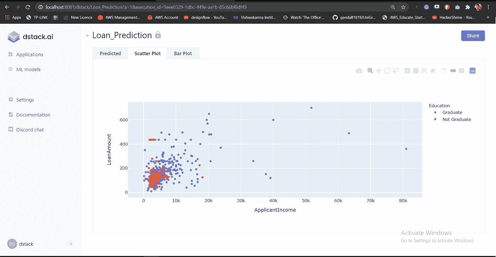
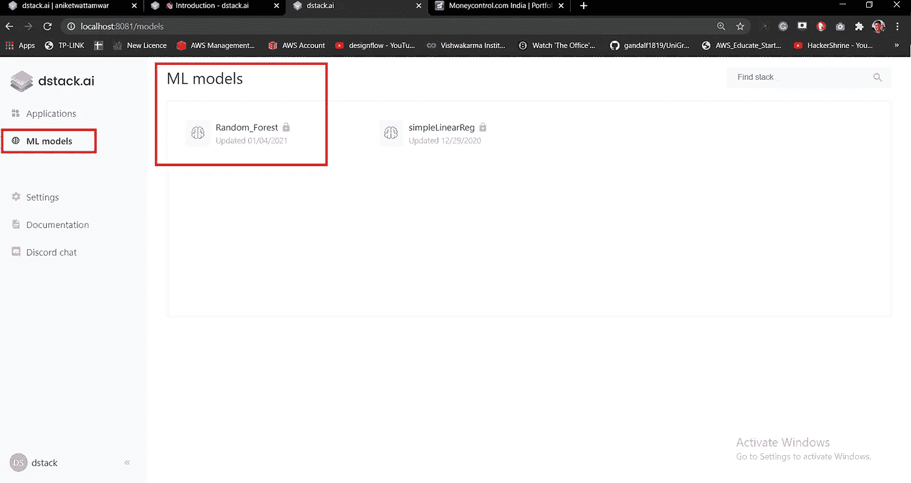
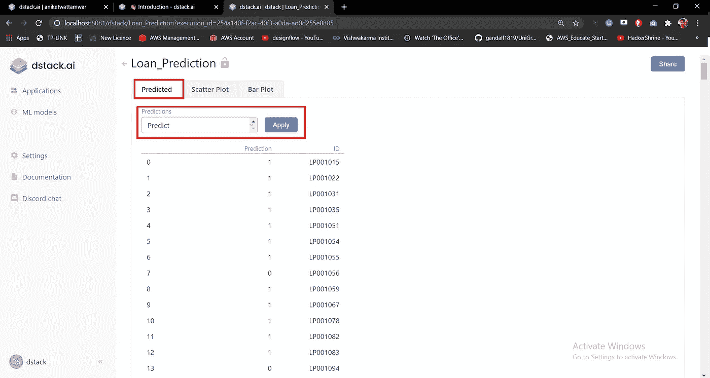

# 使用 dstack.ai 的 ML 应用程序

> 原文：<https://towardsdatascience.com/ml-apps-using-dstack-ai-953d20a489b?source=collection_archive---------81----------------------->

在这篇文章中，我们将看到如何使用 dstack.ai 来创建 ML 应用程序。我已经得到了贷款预测数据集。这个特殊的贷款预测应用程序有助于根据不同的参数预测客户是否应该获得贷款。这是一个基于分类的问题，给出的输出是/否(1/0)。

dstack.ai 是一个 python 框架，无需编写任何前端代码即可创建 ai 和 ML 应用。在我们开始之前，我假设您已经在系统上安装了 dstack server，并且它正在运行。您可以通过以下命令启动服务器。如果您希望更改端口，也可以这样做。

```
dstack server start --port 8081
```

让我们现在开始吧。

我们将使用贷款预测数据集，并将其部署在 dstack 上。

导入一些库以及 dstack 和 dstack 控件

```
import dstack as ds
import plotly.express as px
import matplotlib.pyplot as plt
import pandas as pd
import numpy as np
import dstack.controls as ctr
```

函数来获取训练和测试数据。ds.cache()用于快速检索数据，而不是在每次运行程序时加载数据

```
[@ds](http://twitter.com/ds).cache()
def get_data():
    data= pd.read_csv("D:\\ML_projects\\dstack_proj\\train_ctrUa4K.csv")
    return data[@ds](http://twitter.com/ds).cache()
def get_testdata():
    return pd.read_csv("D:\\ML_projects\\dstack_proj\\test_lAUu6dG.csv")
```

我们将制作 3 个 **ds.apps** 即预测图、散点图和条形图，然后将它们放在一个**框架**上作为**标签**供用户访问(见下图)。



仪表盘

首先，我们看剧情，然后再看 ML 部分。让我们创建两个函数 scatter_handler 和 bar_handler。

```
def scatter_handler():
     df = get_data()
     return px.scatter(df, x="ApplicantIncome", y="LoanAmount", color="Education")def bar_handler():
     df = get_data()
     return px.bar(df, x="Gender", y="Loan_Amount_Term",  color="Education", barmode="group")
```

这两个函数分别从 plotly.express 库中返回散点图和条形图

现在，我们需要将它们作为选项卡添加到框架中。为此，我们首先创建一个框架。您可以在上面的仪表板图像中看到这个框架。

```
frame = ds.frame(“Loan_Prediction”)
```

一旦完成，我们就把这些功能作为应用程序添加到框架中。

```
frame.add(ds.app(scatter_handler), params={“Scatter Plot”: ds.tab()})frame.add(ds.app(bar_handler), params={“Bar Plot”: ds.tab()})
```

我们将 function created 作为参数传递给 ds.app 函数，并以 tab 的形式提及它。

然后，我们将该帧推送到 dstack 应用程序。

```
url = frame.push()
print(url)
```

运行应用程序时，您现在可以查看 dstack 应用程序。

我们来看看带 dstack 的 ML 部分

```
train_data = get_data()
y = train_data.iloc[:,-1]
train_data = train_data.drop(['Loan_ID','Loan_Status'],axis=1)
test_data = get_testdata()
ids = test_data.iloc[:,0]
test_data = test_data.drop(['Loan_ID'],axis=1)def encoding(data):
     data = pd.get_dummies(data, columns=["Gender","Married","Education","Self_Employed","Property_Area"],drop_first=True) return data
train = encoding(train_data)
test = encoding(test_data)
```

我们获得训练和测试数据，并将输出从训练数据中分离出来。然后我们进行编码，将我们的分类转换成数值。这是一个简单的数据预处理，确保在对数据使用任何 ML 模型之前完成所有必要的步骤。

```
from sklearn.ensemble import RandomForestClassifier
random = RandomForestClassifier()
random.fit(train,y)
```

我们正在训练一个来自 sklearn 的简单随机森林算法。

```
ds.push("Random_Forest", random, "Random Forest Loan Prediction")
```

一旦模型训练完毕，您就必须推送至 dstack 应用程序。它看起来会像这样。



作者图片

这是您所有模型的存储位置，您可以使用它。要使用该模型，您必须拉动它。

```
model = ds.pull('/dstack/Random_Forest')
```

一旦你得到了它，你就可以用它来预测你的测试数据。我们将在 dstack 中创建一个名为 Combobox 的下拉列表，它将包含一个名为“Predict”的值。

```
values = ctrl.ComboBox(data=['Predict'],label="Predictions",require_apply=True)
```

创建一个根据测试数据预测模型的函数。

```
def get_predicted(values: ctrl.ComboBox):
     y_pred = model.predict(test)
     y_pred = pd.DataFrame(y_pred)
     y_pred = y_pred.rename(columns={0:'Prediction'})
     y_pred['ID'] = ids
     return y_pred
```

我们现在必须创建一个应用程序，并将该功能作为选项卡添加到框架中。

```
p_app = ds.app(get_predicted, values = values)
frame.add(p_app, params={"Predicted": ds.tab()})url = frame.push()
print(url)
```

就是这样。当您现在运行应用程序时，它会向您显示预测的选项卡。当你点击申请，它会显示你的贷款状态的预测值。



作者图片

# 在 dstack.cloud 上部署应用

您也可以在 dstack.cloud 上部署您的应用程序。以下步骤将帮助您完成此操作(您必须拥有 dstack.cloud 帐户)。

*   转到 C:/Users/ <your-account>/。数据堆栈</your-account>
*   在该文件夹中，在记事本中打开 config.yaml 文件，并添加以下内容。

```
---
profiles:
  default:
    user: <user-name>
    token: <token-number>
    server: [https://dstack.cloud/api](https://dstack.cloud/api)
```

*   请确保在 dstack.cloud 帐户设置选项卡中输入您的用户名和令牌号。
*   保存文件
*   回到你的代码
*   在代码中，转到编写 ds.pull()的部分，在这个函数中添加您的用户名。

```
model = ds.pull('/aniketwattamwar/Random_Forest')
```

*   一旦完成，就运行你的 python 文件 ***(现在不要本地启动你的服务器)***
*   现在，您可以将应用程序链接分享给任何人。点击下面的链接打开 dstack 应用程序。

[负荷预测数据堆栈应用](https://dstack.cloud/aniketwattamwar/Loan_Prediction)

[这里的](https://docs.dstack.ai/concepts/sharing)是 dstack.cloud 上的文档链接

可以在我的 Github 上找到代码:[https://Github . com/aniketwattamwar/Create-ML-apps-using-dstack . ai](https://github.com/aniketwattamwar/Create-ML-apps-using-dstack.ai)

希望这有所帮助。

和平。