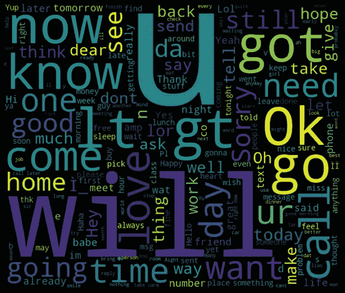
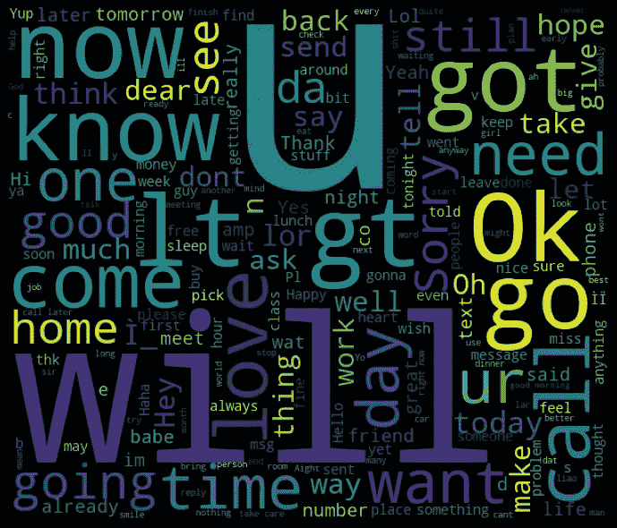
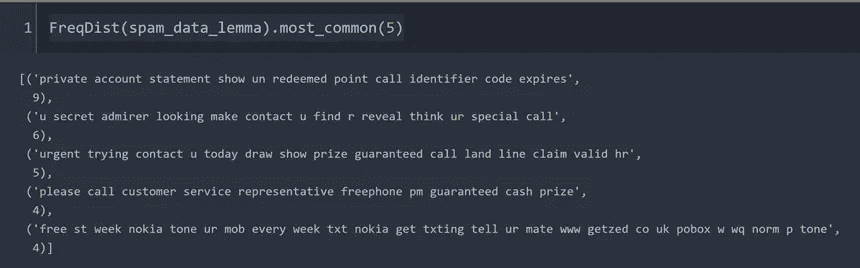
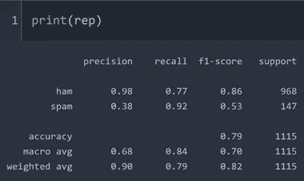
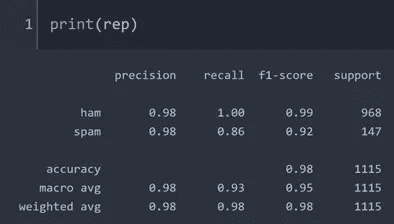
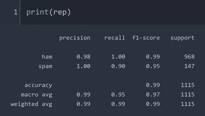

# 垃圾邮件检测的 ML 分类器性能比较-第 1 部分

> 原文：<https://towardsdatascience.com/ml-classifier-performance-comparison-for-spam-emails-detection-77749926d508?source=collection_archive---------20----------------------->

## 应用朴素贝叶斯、SVC 和随机森林进行邮件分类



作者图片

pam 邮件检测是机器学习算法的一个重要应用，用于过滤掉不想要的邮件。在自然语言处理领域，对于这种类型的分类有几种算法。通常垃圾邮件有一些典型的词，这使得这封邮件很明显是垃圾邮件。在本文中，我们将使用 nltk 包完成垃圾邮件和非垃圾邮件的文本处理。特别是，我们将看到 NLP 的词干化和词汇化过程。我们还将实现 NB 分类器以及 SVC 和随机森林分类器来检测垃圾邮件，并比较分类器的准确性。让我们开始吧。

根据 [nltk 文档](https://www.nltk.org/)，“nltk 是构建 Python 程序来处理人类语言数据的领先平台”。使用 nltk 处理和标记文本是非常简单的，比如我们将在后面看到的词干化和词汇化。

首先，我们需要导入必要的包。

> 数据记录单

导入包含垃圾邮件和非垃圾邮件标签文本的 csv 文件后，我创建了两个数据框:一个用于真实电子邮件，另一个用于垃圾邮件，我们将利用它们进行分析。

> 词干和词尾

让我们先做词干，然后再把这袋单词做词条整理。根据斯坦福大学 NLP 小组的说法，“词干通常指的是一种粗糙的启发式过程，即砍掉单词的结尾，希望在大多数情况下正确实现这一目标，并且通常包括去除派生词缀。词汇化通常是指使用词汇和词的形态分析来正确地做事情，通常旨在只删除屈折词尾，并返回词的基本形式或词典形式，这就是所谓的词汇。这里，词干分析分别应用于所有数据、垃圾邮件数据和真实数据。

然后将该分类器分别应用于所有数据、垃圾数据和真实数据。

如果我们查看第一个数据文本的主干，我们会得到:

> *‘去句容点吧，去大世界吃自助餐，看电影’。*

lemmatizer 提供了:

> *‘去句容点疯狂可用 bugis n 大世界 la e buffet cine more wat’*

从第一个数据可以明显看出，词干和引理以不同的方式工作。例如，单词“availability”有词干“avail ”,但有引理“available”。

> Wordcloud

用数值标注后，让我们创建 wordcloud 来查看最常用的单词。


作者图片

垃圾邮件中有很多吸引人的词语，而真实邮件中的文字则非常随意，如下所示。



作者图片

> 频数分布

我们可能有兴趣看到垃圾邮件中最常用的词的最高谱。它可以通过如下的频率分布获得

> FreqDist({ ' . ':1004，“到”:608，“到”:542，'，':371，' a': 358，'你':189，' call': 187，'你':187，' or': 185，' &': 178，...})

在其他时候，我们可能会关注垃圾邮件中最常见的重复句子部分。



作者图片

很明显，像“私人账户声明”或“秘密崇拜者”这样的句子是垃圾邮件中最吸引人的短语。

> 离差图

我们可以获得目标词的离差图来查看分布。它将提供特定单词在单词总数中出现的信息。我选择了像“免费”、“私人”、“帐户”、“联系”这样的词来演示。


作者图片

> 分类者

这里我从 scikit-learn 库中创建了一个分类器。我们需要将文本转换成令牌计数矩阵，scikit-learn 的 CountVectorizer()可以方便地完成这项工作。我们将首先尝试朴素贝叶斯函数，它实现简单，训练时间也较少。出于训练的目的，我选择了 80%的数据。



作者图片

我总是需要一个精确和回忆的复习。精度是 TP(真阳性)与 TP 和 FP(假阳性)之和的比值。召回率是 TP 与 TP 和 FN 之和的比值(假阴性)。如果一个真正的垃圾邮件被错误地识别为真正的电子邮件，那就是假阳性。另一方面，如果一封真实的电子邮件被识别为垃圾邮件，那就是假阴性。

报告显示，该模型在检测垃圾邮件方面表现良好，但在检测垃圾邮件方面表现不佳。垃圾邮件的精度约为 0.38，表明从该模型中获得了大量假阳性。尽管模型精度为 0.79，但这可能会产生误导，因为垃圾邮件的召回率很高，而精度却很低。这表明该模型偏向于垃圾邮件。它能够正确识别大多数垃圾邮件，但也会错误地将一些火腿识别为垃圾邮件。

```
array([[744, 224],
       [ 12, 135]], dtype=int64)
```

混淆矩阵也显示了类似的情况。对角线没有最高的数字。这意味着朴素贝叶斯的性能不够好。

让我们试试支持向量分类以及随机森林算法。



作者图片

模型性能良好。火腿和垃圾邮件准确率和召回率都很高。最后让我们尝试随机森林作为一个分类器。



作者图片

随机森林在垃圾邮件检测案例中也是一个很好的分类器，对真实邮件和垃圾邮件都有很高的精确度和召回率。

> 结论

本文使用 nltk 库演示了自然语言处理的词干化和词汇化过程，并比较了几种二元分类算法。朴素贝叶斯产生较低的精确度，而 SVC 和随机森林提供较高的精确度、召回率以及精确度。交叉验证技术可以评估这些分类器的技能。现在，有许多开源平台可以进行训练和交叉验证，而不需要任何代码，我将在另一篇文章中讨论。

我的 [github 页面](https://mdsohelmahmood.github.io/2021/06/23/Spam-email-classification-using-NB-SVC-Random-Forest.html)提供了代码块。