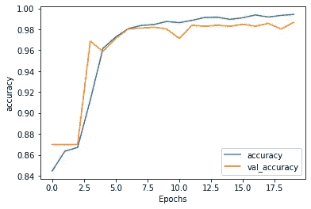
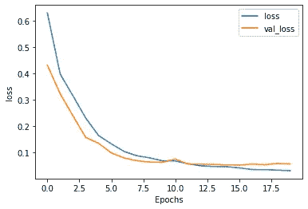
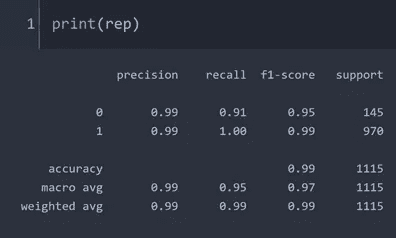

# 垃圾邮件检测的 ML 分类器性能比较(下)

> 原文：<https://towardsdatascience.com/ml-classifier-performance-comparison-for-spam-emails-detection-part-2-aae4ba42bc4b?source=collection_archive---------39----------------------->

## 使用 TensorFlow 检测垃圾邮件并评估模型

图片来自 [Unsplash](https://unsplash.com/photos/TaOGbz_S-Qw)

> **简介**

对自然语言进行分类是当今自然语言处理的巨大挑战之一。它涉及到能够有效区分目标文本和正常文本的技术。聊天机器人等其他服务也严重依赖用户输入的文本。他们需要处理大量的数据，以确定用户的需求，并引导用户走上正确的道路。

> **使用张量流**

在这个垃圾邮件分类器的第 1 部分中，我展示了如何使用 nltk 包对文本进行词干分析和词条分类，然后将其输入到分类器模型中进行训练，最后评估模型的性能。我已经展示了朴素贝叶斯、SVC 和随机森林作为电子邮件分类器的性能。

 [## 垃圾邮件检测的 ML 分类器性能比较-第 1 部分

### 应用朴素贝叶斯、SVC 和随机森林进行邮件分类

towardsdatascience.com](/ml-classifier-performance-comparison-for-spam-emails-detection-77749926d508) 

在本文中，我将演示如何使用 Tensorflow 对电子邮件进行标记和有效分类。让我们开始吧。

我已经包含了 pad_sequence，它将被用来使所有的文本数组大小相等。填充可以基于最大尺寸来完成，并且可以是后填充或前填充。接下来定义超参数

用户可以使用这些参数来防止过度拟合训练数据。例如，可以减少词汇大小，以最小化低频词的过度匹配。此外，嵌入维度越低，模型的训练速度就越快。我还包括了一个词汇以外的单词令牌。我将使用第 1 部分中使用的相同数据集。

我通常将整个数据集的 80%用于训练，剩下的将用于测试。测试数据集以前从未被模型看到过。

> **编码标签**

由于数据集具有字符串形式的标签，因此它将通过编码为 0 和 1 (0 表示垃圾邮件，1 表示真实文本)来转换为整数。

接下来要做的是将文本和标签转换成 numpy 数组并输入到模式中。标记化也被启动并适应来自数据集的文本。

如前所述，需要进行填充以使数组长度相等。

> **型号定义**

然后用双向 LSTM RNN 算法定义该模型。这里使用双向 LSTM 来获得 RNN 的最佳性能。

> **训练模型**

在 20 个时期之后，该模型被很好地训练，并且验证数据(这里是测试数据)的准确度约为 98%

作者图片

作者图片

接下来，将仅使用 model.predict 方法来获得超出精度数的模型性能参数。

作者图片

该报告显示，该模型对于两种文本类别都具有非常好的精确度、召回率和 F1 分数(0 和 1: 0 表示垃圾邮件，1 表示真实邮件)。对于 0，召回率比精确度低一点，这表明存在一些假阴性。该模型错误地将一些真实的电子邮件识别为垃圾邮件。

我们可以识别任何样本文本，以检查它是垃圾邮件还是真实的。由于已经定义了记号赋予器，我们不再需要再次定义它。我们所需要的就是对样本文本进行标记，用 0 填充它，然后传递给模型进行预测。选择一些朗朗上口的词，如“赢家”，“免费”，“奖”，最终会使这个文本被检测为垃圾邮件。

> **结论**

本文演示了如何使用 Tensorflow 来有效地训练一个具有高精度的 NLP 模型，然后评估模型的性能参数，如精度、召回率和 F1 分数。对于这个小数据集，20 个历元似乎可以生成一个验证准确率约为 98%的优秀模型。

[Github 页面](https://mdsohelmahmood.github.io/2021/06/23/Spam-email-classification-Part2-Tensorflow.html)