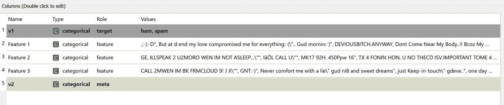
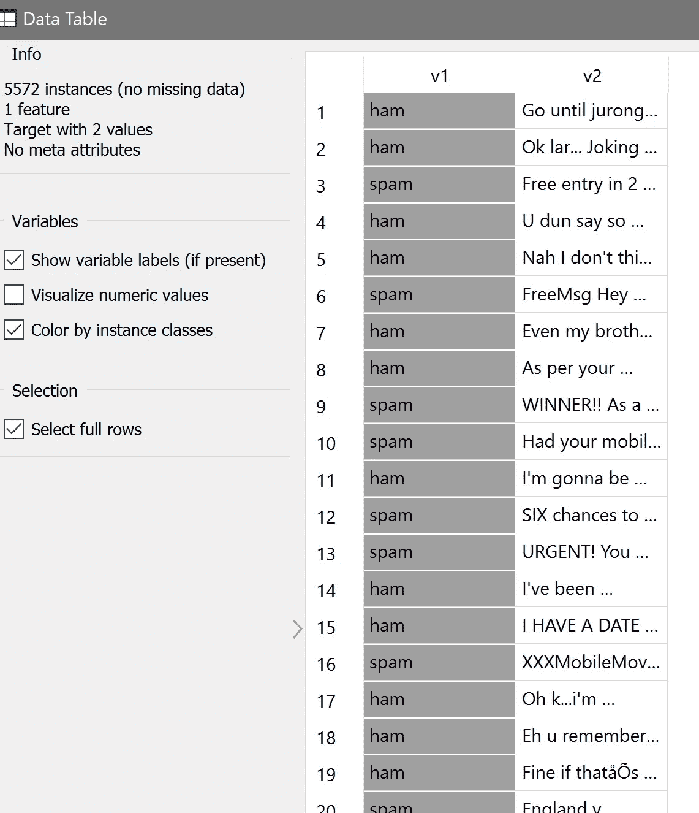
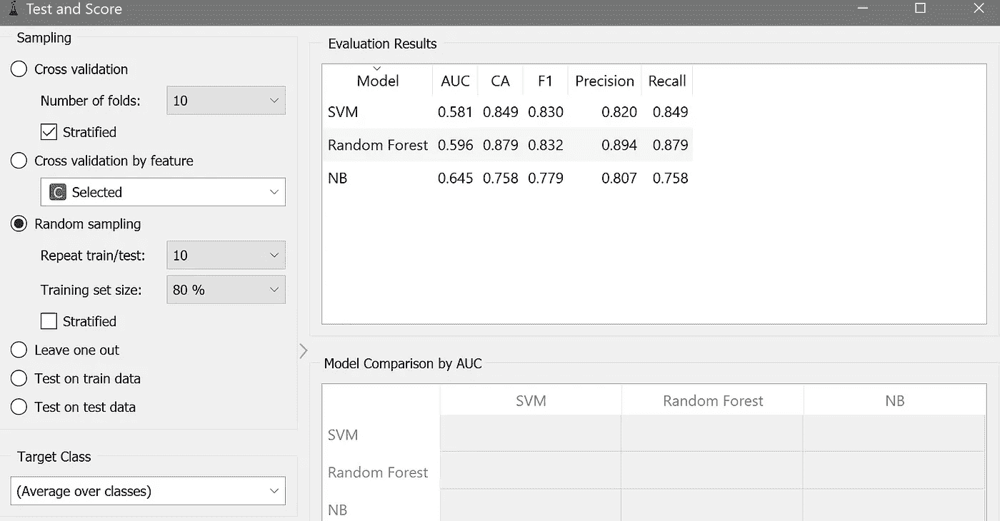
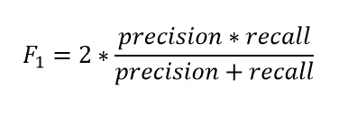

# 垃圾邮件检测的 ML 分类器性能比较(三)

> 原文：<https://towardsdatascience.com/ml-classifier-performance-comparison-for-spam-emails-detection-part-3-997da3895fcf?source=collection_archive---------41----------------------->

## 基于开源组件的 Orange 数据挖掘在垃圾邮件检测中的应用

图片来自 [Unsplash](https://unsplash.com/photos/9002s2VnOAY)

> **简介**

人工智能长期以来一直掌握在高效的程序员和喜欢写代码和玩代码的语言书呆子手中。随着一些可视化拖放式 ide 的出现，新手不需要编写大量代码。相反，这些分析平台使广大普通人能够跳入机器学习的世界，而无需学习编写代码和处理繁琐的编程语法。

> **Widget 环境**

Anaconda 提供 Orange 作为开源视觉分析平台，用户可以用最少的编码经验进行机器学习。在本文中，我将介绍用 Orange 编写的垃圾邮件分类器。下图是这个分类器问题的总体演示。我采用了朴素贝叶斯、随机森林和 SVM 算法，并评估了它们在这个数据集上的性能。

Orange 提供了一个拖放窗口小部件环境，不需要任何编码，如下所示。

作者图片

首先，我们需要在文件小部件中加载 csv 文件。当我们加载 csv 文件时，我们将忽略任何不需要的列。对于本文中的文本分类器，我们只需要文本和该文本的标签。在这里，标签列的角色应该是“目标”。

作者图片

> **特性和目标**

要素是基础数据，模型将在此基础上接受训练，以正确标注目标中提到的数据。在 Select Columns 小部件中，我已经区分了目标列和特性列。我们只有一列文字，因此这里只有一个特性。

作者图片

可以在数据微件中可视化所需的数据，以确保不存在不需要的要素。

作者图片

接下来，所有三个分类器小部件都被放置在工作区中，并与数据表连接。我保留了所有分类器小部件中的默认设置，并更改了测试和评分小部件中的训练和测试过程。

> **测试分数**

作者图片

在左边，很明显，随机抽样使用了 80%的数据进行训练。在这里，右边面板上数据的解释很重要。下表比较了所选三种算法的性能。AUC 代表“曲线下面积”,它被用作模型的能力量规以区分类别。AUC 越高，通常表明模型性能越好，但还有一些其他性能参数需要考虑。CA 是“分类准确率”。在第 1 部分的文章中讨论了精度和召回率的复习。F1 分数是另一个性能参数，在计算中考虑了精确度和召回率。一些模型可能产生高精度但低召回，反之亦然。因此，一些分析师对 F1 分数更感兴趣，F1 分数定义为

我们的表格显示 SVM 和随机森林都比朴素贝叶斯有更高的准确率。这里所有的分数都是班级的平均值。

 [## 垃圾邮件检测的 ML 分类器性能比较-第 1 部分

### 应用朴素贝叶斯、SVC 和随机森林进行邮件分类

towardsdatascience.com](/ml-classifier-performance-comparison-for-spam-emails-detection-77749926d508) 

最后，我们需要检查每个分类器的混淆矩阵。混淆矩阵部件提供了这些分类器的所有矩阵。

> **结论**

在本文中，我展示了一种使用 Orange 实现简单文本分类器的简单方法。这个开源分析平台有很多超出这里讨论的东西。Orange 的窗口小部件环境非常吸引人，可以在没有任何编码的情况下高效地执行 ML 分类器。