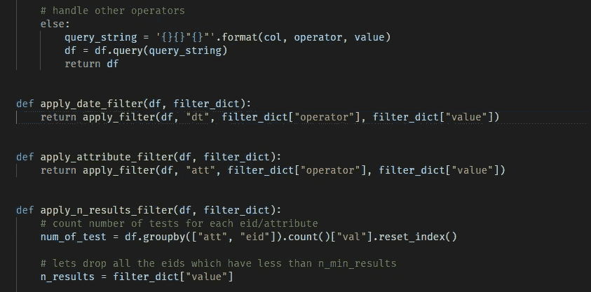

# 交错的时间序列数据集

> 原文：<https://towardsdatascience.com/ml-dataset-creator-5de9f1b6972c?source=collection_archive---------36----------------------->

## [行业笔记](https://towardsdatascience.com/tagged/notes-from-industry)

## 从参差不齐的时间序列数据中创建更好的数据集

> 为机器学习构建数据集是一个耗时的过程。我发现我倾向于在准备和清理数据集的项目上花费大约 70–80%的时间。

我处理数据集的方式通常遵循类似的路径。我过滤数据，只保留相关的样本和特征，然后进行清理。清理过程本身通常会根据数据类型而变化，但是一个简单的解决方案是，如果您有足够的数据来获得足够的样本大小，就删除脏行。

一旦数据被清理，我就开始将它处理到适当的级别。通常当我处理时间序列数据时，这种操作包括某种形式的量化。有时，时间序列数据很好，很干净，事件以固定的间隔发生，但在处理医疗保健相关数据时，情况很少如此。人们不会生病，也不会按照时间表去看医生，这种样本的随机分布就是我喜欢称之为“交错时间序列”的数据。这些数据的参差不齐意味着量化是唯一的选择。我用“量化”这个词来描述聚合/平均和输入值的过程，以将数据转换成均匀分布的格式。这可能意味着取一个月内所有测量值的平均值，并估算没有数据的月份的数据。

对于医疗保健环境中的 ML 模型来说，需要准备好数据以便将事件的绝对时间转换为彼此相对，这是相对常见的。这意味着第一时间步代表所有患者的给定疾病的发作或所有患者第一次入院。我通常把这个动作称为滚动，这来自滚动和轴的数字动作，对我来说，它很好地描述了这种情况。

需要注意的一件重要事情是，一旦所有的清理、量化(不包括插补)和滚动完成，我通常会将缺失数据的插补留到最后一步。这意味着，对于疾病进展这样的事情，插补可以以更直观的方式进行。与滚动发生之前的情况不同，在给定的时间步长，整个群体的平均值编码了一点有用的信息。

作者图片

这样做了很多次后，我意识到这将是构建一个简单的库来为我的许多项目处理这些标准函数的完美想法。除了简化构建过程，我意识到这个库可以处理版本数据集。这是以可脚本化和可配置的方式完成的，对于像 autoML 这样的概念非常有用，允许数据集构造的参数成为超参数优化空间的一部分！

我如何编写一个库来做这样的事情，并期望它可以用于其他数据集？很简单——EADV 格式。EADV 代表实体、属性、日期时间、值。实体表示某个事物(例如，一个人)的唯一实例，它可以有多个属性(例如脉搏率)，并且这些多个属性可以有多个日期时间标记和值(它们的脉搏在 01/01/2008 14:21:04 上为 80bpm)。使用这种格式，基本上可以将非常复杂的数据表示为一个四列表。您可以将任何时间序列数据集转换成这种格式，正因为如此，这个库可以发挥它的魔力！

在我们生成数据集之前，需要对代码进行一些初始清理，以便稍后对数据集进行假设。这些事情包括将所有特性重命名为它们的小写对应项，如果您有两位数年份列的数据，则修复日期。

一旦我们有了干净的输入数据，我们就可以产生实际的 ML 数据集。这是使用下面的函数来完成的，该函数过滤、量化、滚动和估算！

这里有一个用 JSON 编写的示例配置文件，描述了我在工作中构建回归器所需的真实数据集的一些操作。