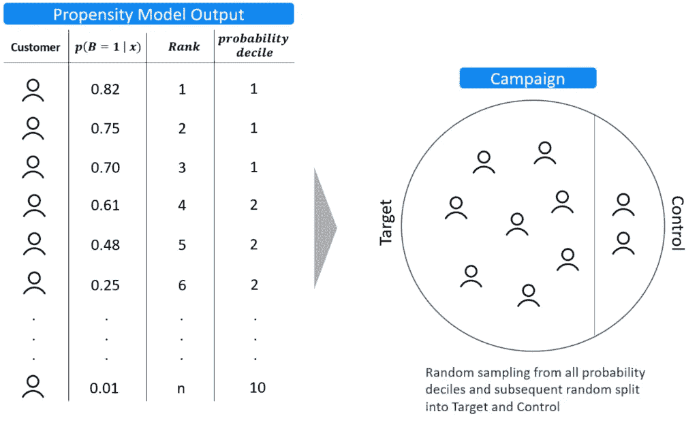
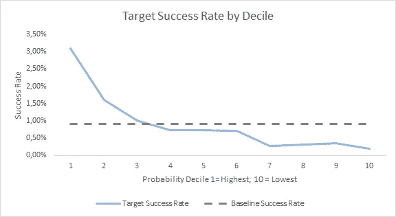
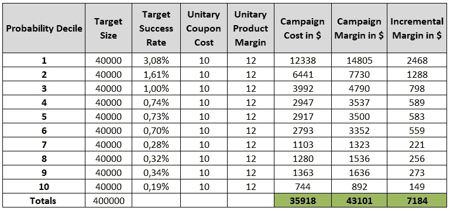
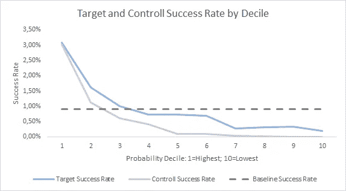
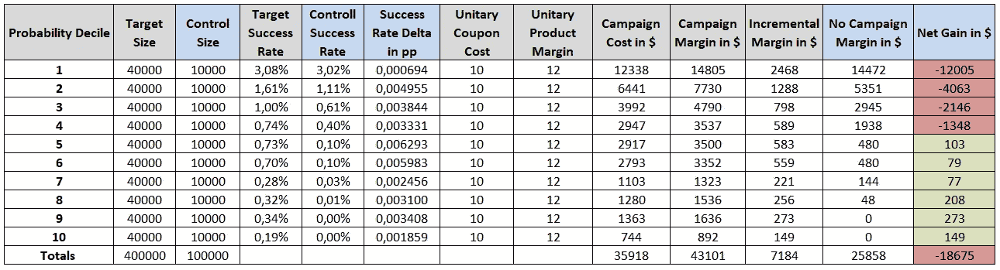
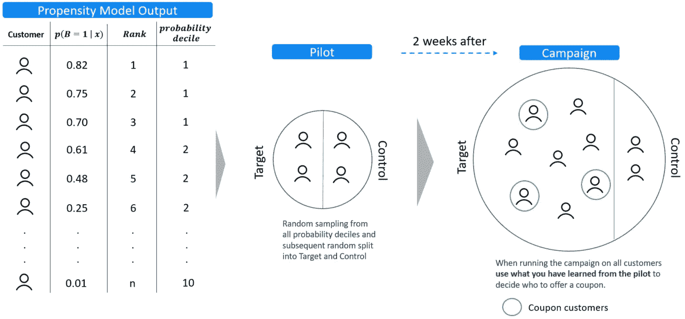
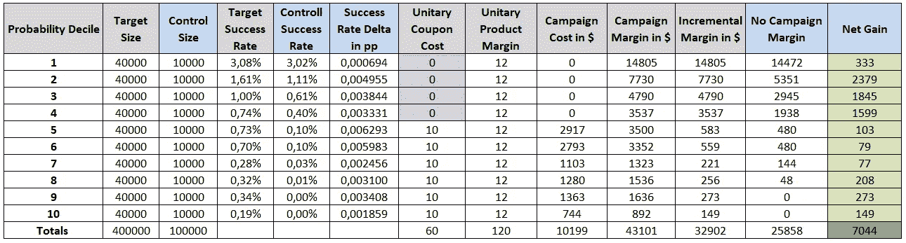

# Ml 驱动的营销活动目标

> 原文：<https://towardsdatascience.com/ml-driven-marketing-campaigns-targets-77d7b9a76be2?source=collection_archive---------8----------------------->

## 为营销活动创建 ml 驱动的目标是一项困难的工作，而且通常很难理解。你怎样才能避免给你的公司带来损失？

[附身摄影](https://unsplash.com/@possessedphotography?utm_source=medium&utm_medium=referral)在 [Unsplash](https://unsplash.com?utm_source=medium&utm_medium=referral) 上拍照

使用机器学习模型来创建营销活动的目标可能是“在我的测试集上看起来不错”/“哦，它在现实世界中不起作用”比率最高的任务之一。

我们来设定场景。你被一家数码糖果店公司聘为数据科学家。你的任务是优化营销活动，特别是邮寄或推送通知活动，在这些活动中，你通常会奖励优惠券以换取购买产品。在一个虚构的例子中，假设这是一个精美的比利时巧克力盒，利润为 12 美元。你为产品提供 10 美元的优惠券。作为一名数据科学家，你已经建立了一个性能良好的机器学习模型，该模型可以识别更有可能购买产品的客户。

你的模型是一个二元分类器，它通过点击你网站上的横幅来查看在过去 12 个月中购买了盒子的客户，并将他们与那些曾经在你网站上但**没有**点击横幅的客户进行比较。给定一组特征 *x* ，它产生成为买家的概率 *B* ，然后将非买家从最不可能成为买家的顺序排列。这些模型通常被称为营销倾向模型[1]。

你负责第一次竞选。为了在真实场景中测试模型，您从所有概率十分位数中随机选择客户，并将他们分成 80%的目标组和 20%的对照组。目标将收到轻推(电子邮件+优惠券)，而控制将被搁置。

**图 1:** 右边是我们的**比利时巧克力倾向模型的输出。** P(B = 1 | x)是给定一些特征成为买家的概率，Rank 是顺序，probability decile 是基于概率所属的十分位数的聚类标签。左边是我们如何分成目标组和对照组。图片由作者提供。

活动结束后，你会急于查看结果。这个模型有效吗？根据图 2，似乎是这样的！您的模型正确地预测到，您认为更有可能购买的客户确实是成功率最高的客户(买家/总十分位数客户)。前十分之一的顾客购买的可能性是第三十分之一的顾客的 3 倍，以此类推。

**图 2:**x 轴上，概率十分位数客户所属；y 轴上的成功率定义为购买该产品的客户总数/该十分位数的客户总数。基线(水平灰线)是在目标群体中观察到的总体成功率。图片由作者提供。

让我们看看这在经济方面是如何实现的。考虑到成功率、优惠券成本和产品利润，我们的活动产生了大约 7200 美元的增量利润。确实不算太坏。如果你每个月都这样做，你可以预期获得 86，000 美元的额外利润。

**图 3。** **目标成功率** =总购买者/十分位数目标规模；**以$** 表示的活动成本:目标规模*目标成功率*单位优惠券成本。**以$** 表示的活动利润:目标规模*目标成功率*单一产品利润。**增量利润(单位:**):活动利润(单位:**)—活动成本(单位:)图片由作者提供。**

**在这一点上，你绝对是房间里的英雄。但是之后你决定在给定十分位数的情况下检查对照组的表现。**

****

****图 4:**x 轴上，概率十分位数客户所属；y 轴上的成功率定义为购买该产品的客户总数/该十分位数的客户总数。基线(水平灰线)是在目标群体中观察到的总体成功率。图片由作者提供。**

**没错，你的模型很擅长预测谁会购买该产品，事实上，在对照组中也观察到了类似的表现。然而，与对照组相比，该运动在中间和最低概率十分位数中取得了最高的提升。看看这场运动的经济学会让事情变得更清楚(希望如此)。**

****

****图 5:** 图 3 增加的计算列有:**控制成功率** =控制组总购买者/控制规模；**PP 中的成功率增量**:目标成功率——控制成功率。**美元无活动利润**:控制成功率*目标规模*单一产品利润；**美元中无活动利润**:美元中的增量利润—美元中无活动利润。图片由作者提供。**

**您包括关于控制组大小和控制成功率的数据。有了这个额外的部分，就有可能计算出一个以$ 为单位的**无活动利润，这个利润相当于你在给定对照组成功率和给定没有奖励券的情况下观察到的利润。关键指标是**净收益**，这是增量利润和无活动利润之间的差额。正如我们所看到的，前十分位数的净收益为负，这意味着对于这些客户，我们最好不要开展活动。从第五十分位数开始，事情开始发生变化。总的来说，你从庆祝 7k 的利润变成了不得不解释 18k 的损失。****

**简单地说，你在解决错误的事情。预测谁会买我们的比利时巧克力盒和估计谁会买我们的比利时巧克力盒**并不一样。你偶然遇到了那些无论如何都会购买该产品的交易追逐者。事实上，这个任务应该被设计成一个**因果问题**而不是一个预测问题。****

**借用拉德克利夫&萨里的话[1]:**

> **当今最有针对性的营销活动；即使是在**增量**影响的基础上进行衡量，也是以**非增量**车型为目标。**

## **你怎么解决这个问题？**

**如果你有足够大的客户群(有多大),为了最大限度地降低在无效活动中浪费资金的风险，你应该考虑分两步进行活动。开放式问题)和可以支持一定程度的定制的营销软件。**

****第一步:**从您的倾向十分位数中随机抽样进行试点。将您的目标分成大小相等的目标和控制组，以便获得足够的数据来获得具有统计意义的结果。**

****第二步:**试运行后不久，分析结果。找到与对照组相比有报酬提升的倾向十分位数(或使用你可能有的任何其他聚类方法)。**

****第三步:**在符合条件的客户群中开展活动，保存您为试点项目抽样的客户。这次你可以允许一个小得多的控制组。宣传活动应该在试播几周后开始。很明显，你不能把你在圣诞节做的一个试验的结论用于七月的活动(过度适应是你最大的敌人)。**

****

****图 6:** 在开展活动之前，先进行一次小规模试点，以确定可能会购买你的产品的人群。作者图片**

**回到竞选经济学，这相当于为无利可图的概率十分位数(紫色的那个)挡住了优惠券。**

****

****图 7。**与图 5 相同的计算，但是这次前四个概率十分位数的单位优惠券成本被设置为 0(没有提供优惠券)，使商业案例回到正。图片由作者提供。**

**如果你那样做了，你会看到 7000 美元的实际净收益。略低于你最初的预期，但肯定比你的损失大得多。**

## **接下来是什么？**

**为一场运动找到合适的目标是困难的，有时甚至是麻烦的。一个关键的要点是，只要你的客户群发生变化并与你的产品互动，就必须把它当作一个持续的实验。当您受到预算和联系压力的限制时，这就变成了一项数据密集型活动，应该由正确的分析能力和营销自动化软件来支持。**

**机器学习可以成为一个强大的锦囊妙计，通过适当地使用监督或无监督的倾向模型，或利用因果推理技术，如增量提升模型[2]。这些可以介入试点和实际活动之间的评估阶段，取代我上面介绍的识别无优惠券客户的简单方法。**

**在下一篇文章中，我将介绍 X-Learner，这是一个因果推理提升模型，用于识别更有可能将您期望的行动**作为您活动的效果**的客户。也许你不会永远摆脱那些追逐交易的人，但你肯定会让他们不好过。**

## **参考**

**[1] Radcliffe N .和 Surry P .“基于重要性的隆起树的真实世界隆起建模”白皮书 TR-2011–1，随机解决方案(2011 年)**

**[2] Rodrigues J .应用数据科学技术获得可操作的消费者洞察。Addision-Wesley (2020)。关于因果推理方法的部分是我第一次遇到隆起建模的想法的地方。**