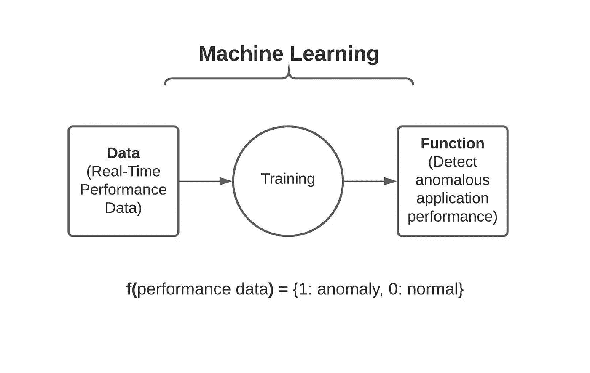
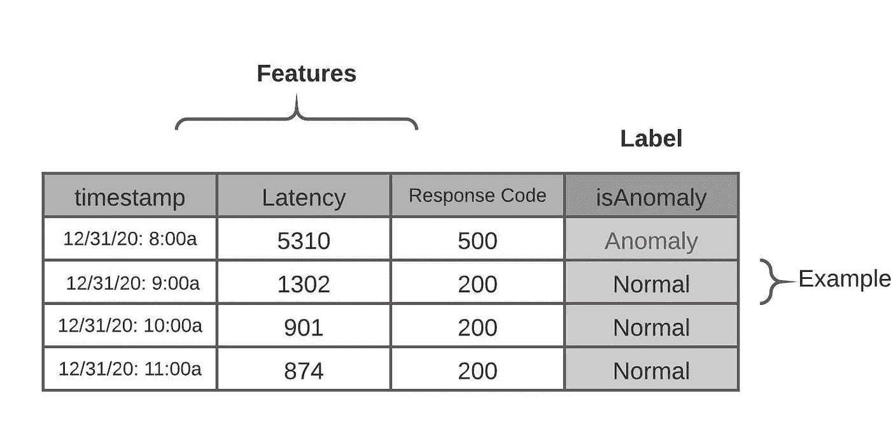
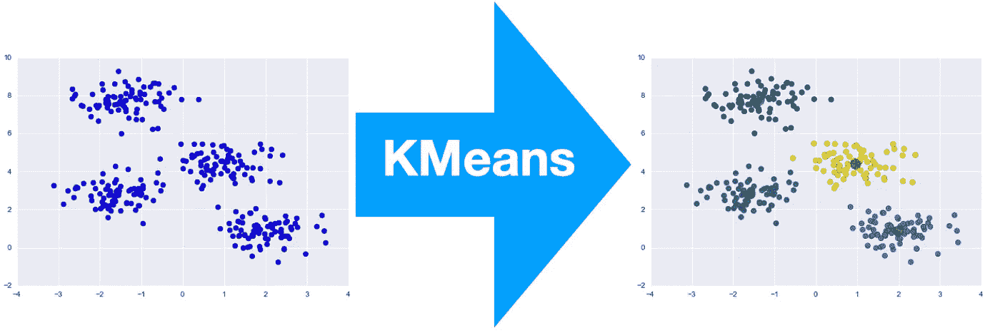
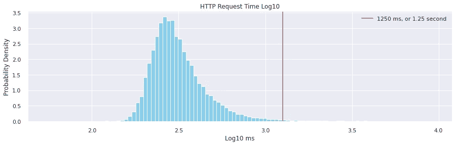
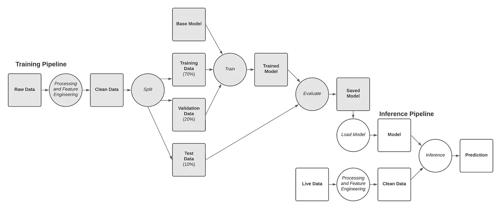
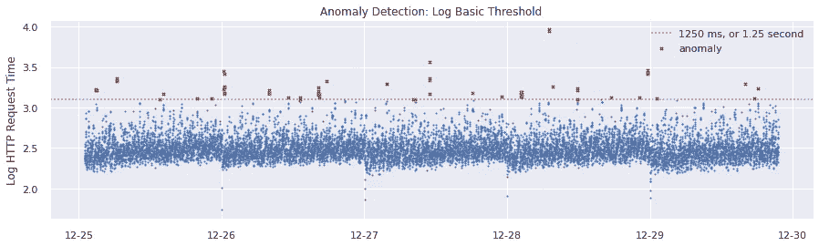
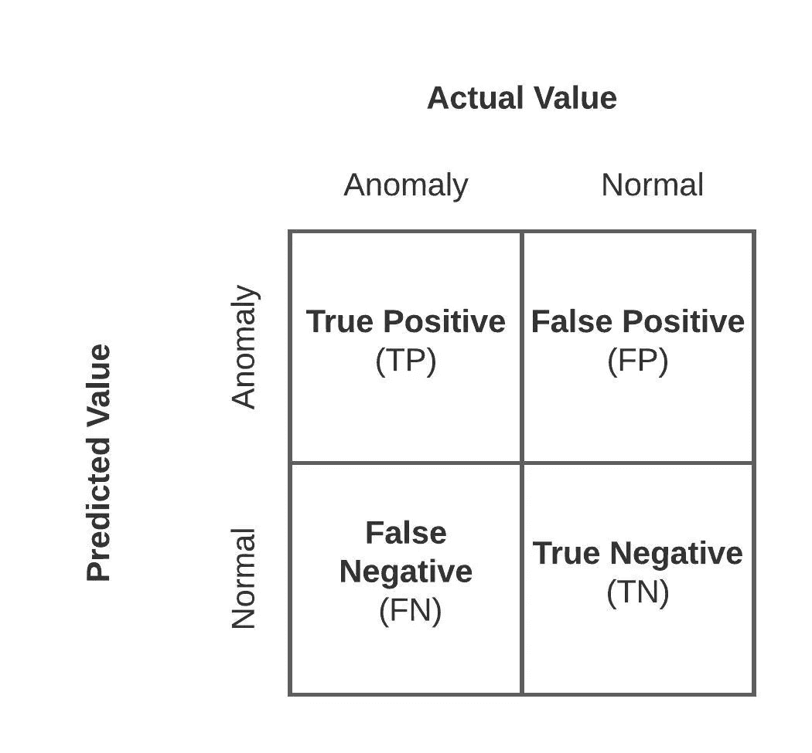
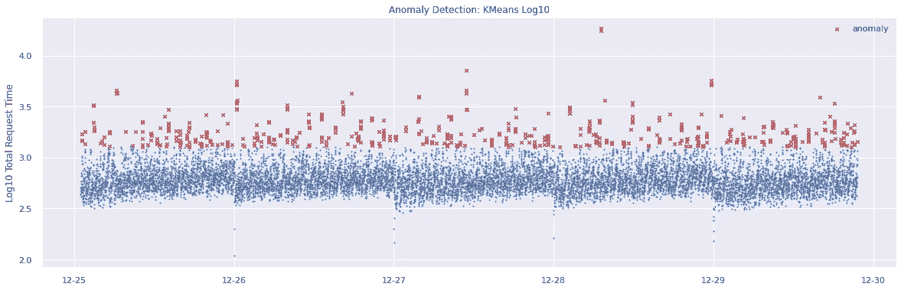
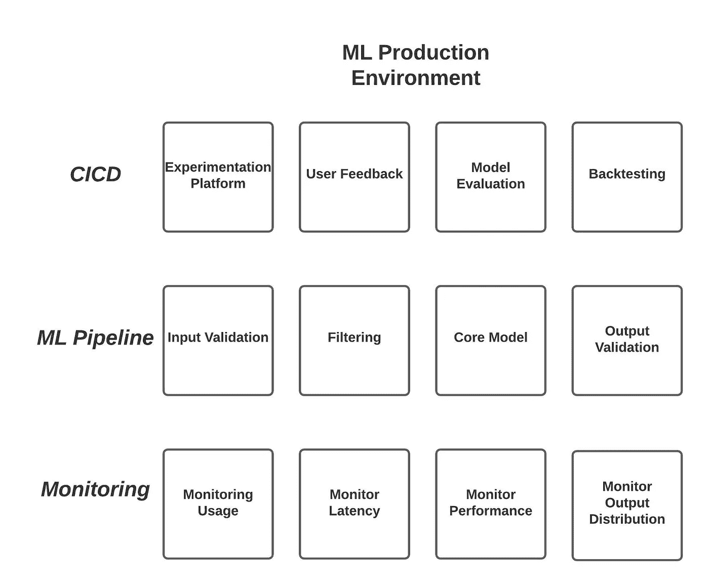

# 面向产品经理的 ML

> 原文：<https://towardsdatascience.com/ml-for-product-managers-a214d823629d?source=collection_archive---------8----------------------->

## *运送公司下一件大事的五个步骤。*

由 [Charles Deluvio](https://unsplash.com/@charlesdeluvio?utm_source=medium&utm_medium=referral) 在 [Unsplash](https://unsplash.com?utm_source=medium&utm_medium=referral) 上拍摄的照片

所以，你是一名项目经理，有很多关于人工智能如何变革行业，你的公司如何由数据驱动，或者你的产品如何具有深度分析焦点的讨论。但是这到底是什么意思呢？如果不了解数据驱动的应用程序是如何工作的，你的 PRD 将会是空话连篇。我们可以在圈子里谈论分析的价值，但如果不了解如何将机器学习产品化，我们将永远不会真正实现。

本文将向您介绍构建和部署机器学习模型的五个步骤，并使用时序异常检测来演示一个真实世界的示例。最好的部分:这种提炼的方法将适用于任何产品或功能(谈论迁移学习！)

概括地说，这是大规模销售 ML 的五个步骤。

1.  **确定 ML 方法**
2.  **建立管道**
3.  **特征工程**
4.  **训练你的模型**
5.  **展开**

# **1。根据产品目标确定 ML 方法**

产品目标决定了技术方法。通过首先理解我们的用例，我们可以探索它如何适应 ML 范例。

**产品目标:**假设你的产品是给一个应用程序所有者的，他负责向董事会报告他们的应用程序。他们只想知道他们的应用程序执行得如何，没有时间去考虑过多的技术细节。他们对应用程序的可靠性感到失望，并希望获得实时信息，这样他们就不会因中断而措手不及。

从这些客户对话中，我们发现了产品的目标:如果用户的应用程序停止工作，提醒用户。

**神智检查:**在潜入 ML 兔子洞之前，先问:

1.  你真的在解决一个有价值的问题吗？

从新闻稿开始，确定项目是否值得投资。我们的解读是:通过消除手动监控应用程序性能的必要性，节省了数百个工时和无数次客户对话。最终，这种异常检测将使人们不必部署资源来主动监控他们的应用程序。这似乎很有价值。

2 *。真的需要 ML 吗？*

在许多情况下，基于启发式的方法会更好。对于我们的例子，这意味着基于 HTTP 响应代码和响应时间阈值的某种组合来创建一个决策树，以确定应用程序是否正在执行。需要为每个指标建立决策树和手动阈值，所有服务都有自己的“正常”定义。在这里，这种基于规则的方法无法扩展。为了对大规模应用性能进行分类，我们已经确认需要 ML。

机器学习使用数据来训练函数(图片由作者提供)

**ML 框架:**现在我们已经验证了这个想法，让我们根据机器学习来设计产品目标。机器学习使用数据来学习一个函数。我们已经收集的历史应用程序行为(数据)训练我们的模型来预测我们的应用程序行为是否正常(函数)。然后，我们可以通过这个训练有素的模型持续提供性能数据，以实时确定我们的应用程序是否正常工作。

重新表述我们的产品目标，我们希望使用性能信息来检测应用程序中的行为异常。

**数据选择:**数据为机器学习提供动力。为了选择一个模型并了解我们的结果是否可能，我们需要了解可用的数据。数据可以分为[两类](https://developers.google.com/machine-learning/crash-course/framing/ml-terminology)——特征和标签。标签是 ML 模型的输出，对我们来说，这是正常或异常应用程序行为的布尔结果。特征是负责这种分类的其他输入变量。

数据分类(按作者分类的图片)

因为我们的函数需要应用程序性能数据，所以我们可以使用计时信息(HTTP 响应时间)、性能数据(HTTP 响应代码)作为特性。这些数据是由一个[综合监控系统](https://en.wikipedia.org/wiki/Synthetic_monitoring)生成的——定期 ping 一个特定的网址并记录响应。与该数据相关的是时间信息(从测量开始的时间戳，可用于季节性)。虽然我们的数据包含这些性能特征，但它不包含任何标签——没有人检查过所有过去的点并标记出哪些是异常的，哪些不是。图中的‘标签’栏对我们来说是不存在的，这就限制了我们可以使用的可能模型。

**模型选择:**不同的模型更适合不同的任务，都是对数据做出不同的假设。在选择模型之前，我们必须考虑许多会影响部署的因素:数据可用性、延迟和实现的容易程度。

*数据可用性*是指在训练和预测过程中有哪些数据可用。有监督和无监督这两种主要模型类型之间的选择取决于数据可用性。监督模型训练包含要素和标注的数据，而非监督模型只需要要素。我们有上面讨论的性能指标，但没有标签，这意味着我们需要使用一种无监督的方法。

*潜伏期*是产品对预测时间的要求。这里的两个考虑因素是流或批处理。流处理模型对数据立即运行，而批处理模型以固定的时间间隔对收集的数据运行分析(允许处理时间较长的方法)。仅仅向用户显示带有异常的标记图或让他们挖掘他们的指标不会减少操作员对屏幕的需求。从描述的用例来看，应用程序所有者希望最大限度地减少他们盯着原始指标看的时间。我们的产品需要一个指向流处理的近实时分类。

*实现的容易程度*影响我们开发模型的速度。训练一个复杂的端到端管道是一个微妙的过程。我们必须考虑性能-复杂性的权衡。虽然更复杂的模型可能会给出更好的结果，但它也会增加大量的开发时间。对于实现，我们将从一个简单的基础模型开始，它将支持快速开发、迭代和调试。

下面是来自领先的 python ML 库 [scikit-learn](https://scikit-learn.org/stable/tutorial/machine_learning_map/index.html) 的模型选择流程图。有关不同型号的更多信息，请点击[此处](/all-machine-learning-models-explained-in-6-minutes-9fe30ff6776a)。

ML 型号选择流程图(来源: [Scikit-Learn](https://scikit-learn.org/stable/tutorial/machine_learning_map/index.html) )

我们的数据中缺乏标签，这要求我们使用一种无监督的方法，特别是基于[聚类的方法](https://scikit-learn.org/stable/modules/clustering.html)。因为我们要为已知数量的类别预测一个标签，所以我们使用 [KMeans](https://aihub.cloud.google.com/p/products%2F0e0d2ed0-5563-4639-b348-53a83ac4ff4e) 。我们将运行 K 均值，其中 K=2，正常和异常。下面是 KMeans 如何将原始数据分组到已知聚类中的直观描述。

KMeans 解释道(来源:[谷歌 AIHub](https://aihub.cloud.google.com/p/products%2F0e0d2ed0-5563-4639-b348-53a83ac4ff4e) )

为了使模型更加复杂，我们可以利用时间序列方面，使用 [ARIMA](https://en.wikipedia.org/wiki/Autoregressive_integrated_moving_average) (自回归综合移动平均)模型或 RNN(递归神经网络)。然而，我们将从 KMeans 开始，因为它易于实现，以便快速构建一个基础模型。如果我们需要额外的性能或功能，我们可以稍后更换为 ARIMA 型号。

**创建指标:**指标帮助我们跟踪产品进度，比较不同的实现。为了判断我们的模型，我们将考虑培训绩效、模型绩效和业务绩效的指标。虽然我们可能会在早期查看培训和模型度量来指导培训，但我们最终的生死取决于业务绩效。我们的产品目标应该由业务指标的端到端性能来判断。

*培训绩效*由作为 ML 流程一部分的优化指标来衡量。根据选择的型号，有许多正在使用的。对于监督方法，人们通常使用混淆矩阵、ROC 曲线或校准曲线(更多关于这些[这里](/20-popular-machine-learning-metrics-part-1-classification-regression-evaluation-metrics-1ca3e282a2ce))。因为我们使用的是[无监督方法](https://scikit-learn.org/stable/modules/clustering.html#clustering-performance-evaluation)，我们将使用轮廓系数。这是我们可以使用的仅有的[聚类指标](https://scikit-learn.org/stable/modules/clustering.html#clustering-performance-evaluation)之一，因为它不需要训练数据中的标签。[轮廓系数分数](https://scikit-learn.org/stable/modules/clustering.html#silhouette-coefficient)与具有更好定义的聚类(异常和正常)的模型相关。

*模型性能*是评估 ML 方法有效性的指标。对于许多产品来说，这意味着使用该模型的用户与能够从中受益的用户总数的百分比。因为我们的产品是一个警报系统，模型性能最终取决于我们检测所有异常的能力。这确保了我们的客户(应用程序所有者)不会被遗漏的错误弄得措手不及。用 ML 术语来说，我们正在优化[召回](/accuracy-precision-recall-or-f1-331fb37c5cb9)，或捕获的异常百分比。

我们需要某种形式的用户反馈来了解我们的模型在生产中的表现。这通常看起来像我们前端的数据收集机制。用户反馈可以像用户在查看预测的异常时选择的拇指向上/向下那样明显，也可以像用户根据前端采取的行动直观地看到标签那样无摩擦。

基于用户交互隐式分配标签称为弱标签。这些弱标签的大量收集最终会让我们使用更强大的监督学习方法来代替。每个数据驱动的应用程序都必须将收集用户反馈作为重中之重。

*业务绩效*指标反映了模型相对于产品目标的成功程度。我们也可以创建[护栏指标](/measuring-success-ef3aff9c28e4)，它们不应该下降到某个点以下。

因为我们正在训练我们的模型不遗漏任何关键错误，所以我们可能会向用户呈现大量的警报。这种[警报疲劳](https://en.wikipedia.org/wiki/Alarm_fatigue)可能会让我们的模型在生产中用处不大，因为用户会停止关注。为了确保客户不会开始忽视我们，我们最终关心的是相关警报的百分比。判断这一点的一个隐含方法是被处理的警报的百分比。用 ML 术语来说，这叫做[精度](/beyond-accuracy-precision-and-recall-3da06bea9f6c)。当与作为护栏指标的召回相结合时，为了确保我们不会遗漏高重要性异常，我们有一个强大的系统来了解我们数据的性能。

其他需要考虑的因素还有速度和新鲜度。速度是推断需要多长时间，新鲜度衡量我们的训练数据与实时数据相比有多好。为了准确起见，训练数据需要与输入数据相似。当实时数据的分布发生变化时，模型也需要重新训练。

**探索性数据分析(EDA):** 在我们训练一个模型之前，我们需要对底层数据有一个很好的了解。使用像谷歌的[数据工作室](https://datastudio.google.com/)这样的可视化工具可以帮助我们测试关于值和分布的假设，识别关键变量，并检测数据中的结构。为了更深入地挖掘，我们可以使用一个 [Jupyter 笔记本](https://jupyter.org/)和 [pandas](https://pandas.pydata.org/) ，一个 python 数据分析工具。

检查我们的数据，我们看到最大值比第 75 百分位大得多，这表明对其使用异常检测可能是一个有意义的数据集-异常应该会出现。

深入研究 http 请求时间，我们看到主要的左侧集群是正态分布的(图中的对数正态)，右侧有几个点。这种探索性的数据分析让我们对我们的 KMeans 方法更有信心。事实上，我们可以开发一个简单的试探法，如果 http 请求时间大于 1.25 秒，那么它就是异常的。

http 响应时间的分布(图片由作者提供)

# **2。建立管道**

端到端的管道便于迭代。我们的模型越快失败，我们就能越快取得进展。评估模型性能可以快速确定下一个需要改进的地方。

*关于部署管道的技术信息，请参考来自谷歌云平台(GCP)或亚马逊网络服务(AWS)的* [*各种*](https://cloud.google.com/blog/products/data-analytics/anomaly-detection-using-streaming-analytics-and-ai) [*教程*](https://aws.amazon.com/sagemaker/pipelines/) *。*

训练和推理管道(图片由作者提供)

ML 需要一个训练和推理管道。训练管道(稍后讨论)创建我们的模型，推理管道进行预测。

**构建推理管道:**从部署推理管道开始。通过快速交付基本模型，我们可以开始收集使用数据，以支持进一步的培训和性能提升。这个初始模型是基于来自主题专家(SME)知识的简单启发。

使用 1250 ms 的 HTTP 请求时间作为阈值，让我们通过这个基本模型运行我们的训练数据。由于数据的分散，我们将绘制请求时间的日志，以使结果更容易理解。

使用阈值对训练数据集进行异常检测(图片由作者提供)

**测试工作流程:**在我们可以服务我们的简单模型之后，让我们调查一下我们关于用户体验和模型结果的假设。

用户体验是一个重要的考虑因素，因为可用性将推动我们的模型的使用。询问展示我们产品的最佳方式是什么？我们如何确保结果被有效地呈现出来？哪些数据如果返回实际上会有帮助？迫使我们考虑我们的前端设计。向用户发送没有因果关系的异常信息会导致用户疲劳，并立即让人们远离我们的产品。相反，有用的结果包含关于异常的重要性和导致异常分类的特定因素的数据。

模型结果也是一个必要的考虑因素。提问:*我们是否得到了重要的结果？训练数据是否准确，是否具有代表性？怎样才能消除偏见？最初的运行表明，严重的异常被发现，但是大部分的变化和细微差别仍然没有被检查。因为有许多其他指标构成了异常分类(不仅仅是 HTTP 请求时间)，所以我们需要开发一个考虑这些特性的更好的模型。*

# **3。特征工程**

了解您的数据将带来最大的性能提升。探索要有效率，从容易处理的数据集开始。查看数据集以了解其特征是开发实体模型和特征工程管线的最简单方法。这通常会消耗大部分开发时间。

确保您的数据已格式化，具有在预测时可用的清晰的输入和输出。通过手动验证标签或特征值，确保数据字段没有丢失、损坏或不精确。检查数据量(确保您至少有 10k 个示例)，如果需要，生成合成数据。查看集群和汇总统计数据。检查我们的训练集，我们可以丢弃所有没有有意义的(空的或 na)计时数据的例子。

从季节性、[特征交叉](https://developers.google.com/machine-learning/crash-course/feature-crosses/video-lecture)或其他你观察到的有意义的模式中创建特征。我们可以向量化以从原始数据中创建新的特征，并且[降低维度](/a-complete-guide-to-principal-component-analysis-pca-in-machine-learning-664f34fc3e5a)(在尽可能保留结构的同时以更少的维度表示向量)。这些特征使得检测神经网络中的非线性关系更加容易。确保保存用于创建新要素的变换和过程，因为它也必须在预测时对输入数据运行，否则模型将无法正常运行。

我们将为一天中的每一个小时和一周中的每一天创建特征，以及两者之间的交叉特征。此外，我们将创建一个名为“total”的新特性，它是 tlsHandshakeMs、httpRequestTimeMs 和其他计时指标的总和。

创建其他模型有助于培训过程。一个“[错误模型](/how-to-do-error-analysis-to-make-all-of-your-models-better-a13c4ca643a)可以被训练来检测你的模型在什么类型的例子上失败。如果您正在使用监督训练模型，则可以使用“标记模型”来查找下一步要标记的最佳示例。该模型检测有标签和无标签的例子，允许您标记那些与有标签的例子最不同的无标签的例子。因为我们坚持使用简单的、无人监管的方法，所以我们现在可以忽略创建这些模型。

# **4。训练你的模型**

现在我们已经有了工程特征，我们可以通过拆分数据、判断预测性能和评估特征性能来训练我们的模型。

**分割数据:**为了确保我们能够验证训练好的模型的结果，我们需要留出数据。具体来说，我们 70%的数据用于训练，20%用于验证，10%用于测试。训练数据优化模型的权重，验证集[调整超参数](/hyperparameter-tuning-c5619e7e6624)(网络深度、每层过滤器数量和权重衰减)，测试集是我们评估模型的方式。

确保验证和测试数据集尽可能接近生产，以防止[数据泄露](/data-leakage-in-machine-learning-10bdd3eec742)(未来数据用作训练特征，数据集之间的重复意味着过度拟合带来的超大性能)。确保数据被正确地[分割](/data-splitting-technique-to-fit-any-machine-learning-model-c0d7f3f1c790)。

**调试:**异常高的性能通常表示数据泄漏或错误。谷歌已经写了大量关于人工智能系统潜在测试的文章。要调试模型，

1.  首先，确保模型连接正确，以便数据从输入流向预测
2.  接下来，确保模型能够符合训练数据
3.  最后，假设数据在合理的范围内，检查模型是否能拟合看不见的数据

**判断性能:**选择一个合适的代价函数来优化你的模型。检查测试和训练数据的成本函数有助于估计模型中的[偏差-方差权衡](/understanding-the-bias-variance-tradeoff-165e6942b229)，即我们的模型在不仅仅记忆训练集的具体细节的情况下已经学习了有价值的概括信息的程度。具体来说，检查:

我们的异常检测用例的混淆矩阵(图片由作者提供)

*   [混淆矩阵](/understanding-confusion-matrix-a9ad42dcfd62):输出可以是两个或两个以上类别的机器学习分类问题的性能度量。这是一个包含预测值和实际值的 4 种不同组合的表格
*   [ROC 曲线](/understanding-auc-roc-curve-68b2303cc9c5):显示一个模型区分不同类别的能力。产品经理受益于根据产品需求添加对应于允许的假阳性(FP)或假阴性(FN)率的垂直线或水平线
*   校准曲线:TP 相对于置信水平的分数

**评估特征:**通过检查分类器，检查哪些特征有助于分类。如果使用神经网络，使用黑盒解释器，如[莱姆](/understanding-model-predictions-with-lime-a582fdff3a3b)或 [SHAP](/explain-any-models-with-the-shap-values-use-the-kernelexplainer-79de9464897a) 。

因为我们使用的是无人监督的方法，我们可以忽略所有这些。由于我们的数据不包含标签，我们实际上无法用这些方法来验证模型。因此，我们将所有数据发送到培训中。相反，我们可以使用[轮廓分数](https://scikit-learn.org/stable/modules/generated/sklearn.metrics.silhouette_score.html)来检查我们的输出。在我们的 KMeans 模型中，这个指标返回 0.802(其中 1 是最好的，1 是最差的)。可视化分类标签表明，这种无监督的方法产生了合理的结果。

使用 KMeans 对训练数据集进行异常检测(图片由作者提供)

在我们的延迟指标中，简单模型的优势显而易见。在具有 4 个 vCPUs 和 15gb RAM 的机器上，训练平均花费了 0.516 秒。所有训练数据的推断花费了 0.004 秒。这远远低于任何合理的人类反应时间。

然而，我们的模型产生了很多警告。这强调了收集用户反馈的必要性。如果我们有关于哪些异常是有帮助的数据，我们可以使用监督方法进一步调整我们的模型，以便只提供可操作的警报——我们的用户实际需要的警报。

# **5。展开**

现在模型已经训练好了，我们执行最终验证，构建生产环境，并开始监控。这里是必要组件的高级视图。

ML 生产环境的组成部分(图片由作者提供)

*最终确认*是将模型投入生产前的最后一次完整性检查。提问:*你的模型根据训练数据做出了什么假设？训练数据收集的怎么样？这与生产数据有意义的不同吗？数据集的代表性是否足以产生有用的模型？*

还需要考虑预期用途和范围。确认所使用的数据已被授权收集、使用和存储。通过确保没有测量错误、损坏的数据以及所有要素类的正确表示来消除训练偏差。通过采用反馈循环和对所有训练数据子集进行基准测试，消除系统偏差和建模问题。通过部署检测使用活动变化的监控系统来防御对手。

*构建一个可靠的生产环境*，以正确运行您的模型，通过工程实现:

*   **失败** (I/O 检查):通过确保输入数据在训练数据的范围和分布内来净化输入数据。创建第二个“故障检测模型”来预测最有可能失败的输入，或者创建一个“过滤模型”来预先筛选推论。如果这些模型表明一个潜在的可疑的结果，退回到一个简单的模型或启发式提供一个合理的输出。
*   **性能**:如果适用的话，通过缓存来提高性能(在处理重复输入时，通常使用最近最少使用的缓存或 LRU 缓存)。确保管理模型和数据生命周期管理(何时根据漂移迹象重新训练模型)、可再现性、弹性和管道灵活性。
*   **反馈:**收集隐性反馈对判断绩效至关重要。考虑查看用户执行的操作，以推断模型是否提供了有用的结果。
*   **CICD:** 为了实现机器学习的 CICD，考虑以影子模式部署(与现有模型并行，对照生产模型检查结果)。既可以使用 A/B 测试，也可以使用[多臂土匪](https://en.wikipedia.org/wiki/Multi-armed_bandit)(在生产中探索/利用多个模型)。

*监控模型*以告知生产环境的弹性。具体来说，看一段时间内的准确率和使用情况。精度随时间变化，以通知刷新率，或何时重新训练模型。大多数模型需要定期更新，以保持一定的性能水平。监控可以检测模型何时不再新鲜，何时需要重新训练。使用情况可以显示滥用的模式(例如，异常的登录次数)。类似地，监控前面概述的性能和业务指标。

那么，你打算什么时候运送你的下一个大东西？