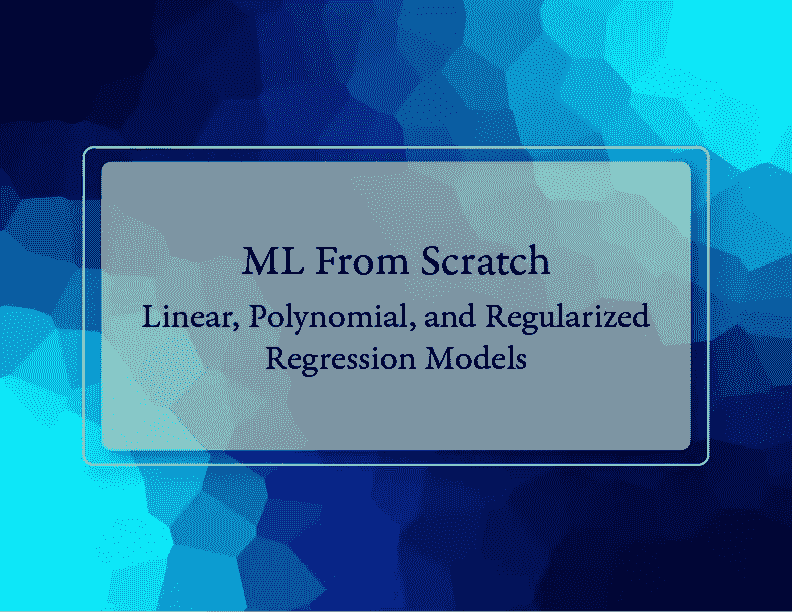
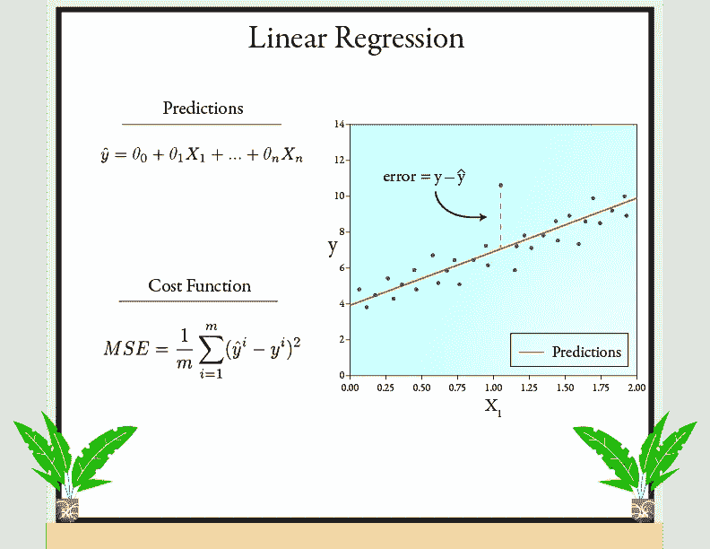
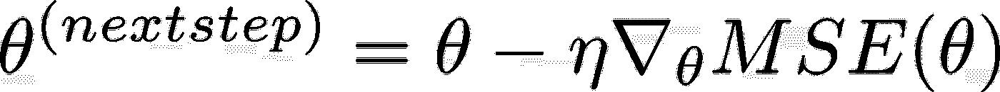
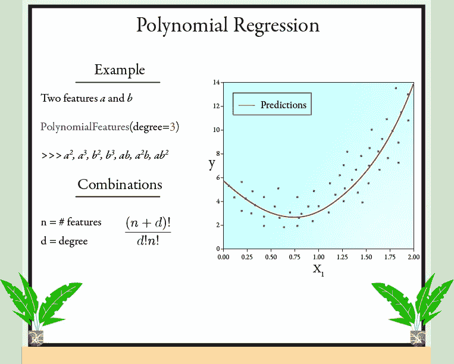
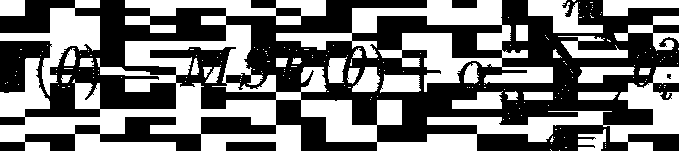
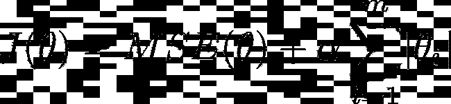
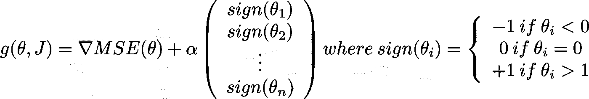
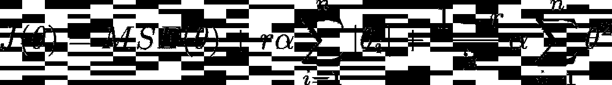

# ML 从零开始:线性、多项式和正则化回归模型

> 原文：<https://towardsdatascience.com/ml-from-scratch-linear-polynomial-and-regularized-regression-models-725672336076?source=collection_archive---------15----------------------->

## 通过在 python 中从头实现线性模型，深入了解回归中使用的线性模型。



封面照片——卢克·纽曼拍摄

在这个新的系列中，我通过编写干净的、可重用的、有良好文档记录的带有测试用例的代码来提高我的编码技能和习惯。这是我以面向对象的方式从头开始实现线性、多项式、脊形、套索和 ElasticNet 回归的系列文章的第一部分。

我们将从一个简单的 LinearRegression 类开始，然后在它的基础上以类似于 Scikit-Learn 的简单风格创建一个完整的线性模型模块。我的实现绝不是最优的解决方案，只是为了增加我们对机器学习的理解。

在这个库中，你会找到这个博客中的所有代码，包括每个类和函数的测试用例。

要查看 Github 资源库，请访问[此处](https://github.com/lukenew2/mlscratch)。

## 装置

为了使用类和函数进行测试，创建一个虚拟环境并 pip 安装项目。

```
 $ pip install mlscratch==0.0.1
```

要从 Github 下载本地存储库中的所有源代码，请创建一个虚拟环境，并在您的终端中运行以下命令。

```
 $ git clone https://github.com/lukenew2/mlscratch
    $ cd mlscratch
    $ python setup.py install
```

# 线性回归

通常，任何人在他们的数据科学之旅中学习的第一个模型是*线性回归*。简单地说，线性回归模型通过计算每个自变量的参数权重加上一个称为*偏差项*(也称为*截距项*)的常数，来表示因变量标量变量 **y** 和自变量 **X** 之间的关系。

我们通过将特征权重向量**θ、**乘以独立变量 **X** 来进行预测。

就是这样！这就是线性回归模型的全部内容。让我们看看我们是如何训练它的。



图一。线性回归——卢克·纽曼

训练模型意味着找到最适合训练数据集的参数。为此，我们需要能够衡量模型与数据的吻合程度。对于线性回归，我们找到最小化均方误差(MSE)的**θ**的值。有多种优化算法可以做到这一点，所以我们来看几个。

## 普通最小二乘法

我们要从头开始编码的第一种方法叫做*普通最小二乘法* (OLS)。OLS 计算出 **X** 的伪逆，并将其乘以目标值 **y** 。在 python 中，这个方法很容易使用 **scipy.linalg.lstsq()** 来实现，Scikit-Learn 的 **LinearRegression()** 类使用的就是这个函数。

我们将尝试通过使用 **fit()** 和 **predict()** 方法，使我们的库类似于 Scikit-Learn 的库。我们还将赋予它属性 **coef_** ，它是在训练期间计算的参数。

模块 1。回归. py

要编写 **fit()** 方法，我们只需向我们的特征数组添加一个偏差项，并使用函数 **scipy.linalg.lstsq()** 执行 OLS。我们将计算出的参数系数存储在我们的属性 **coef_** 中，然后返回 self 的一个实例。 **predict()** 方法甚至更简单。我们所做的就是为偏差项的每个实例加 1，然后取特征矩阵和我们计算的参数的点积。

当特征的数量变得非常大时，普通的最小二乘法会变得非常慢。在这些情况下，最好使用另一种称为*梯度下降*的优化方法。

## 批量梯度下降

梯度下降是一种通用优化算法，通过对参数进行微调来搜索最优解。首先，用随机值填充**θ**(这种方法称为*随机初始化*)。然后，调整参数，直到算法通过向降低成本函数的方向行进而收敛到最小解。在我们的情况下，这意味着减少 MSE。

为了沿着降低成本函数的方向行进，你需要计算包含成本函数所有偏导数的梯度向量。


等式 1。成本函数的梯度向量

计算完梯度向量后，在梯度向量指向的相反方向上更新参数。这就是学习率 (η)发挥作用的地方。学习速度决定了你朝那个方向迈出的步伐的大小。



等式 2。梯度下降步骤

*批量梯度下降*是梯度下降的一个版本，我们在每一步计算整个数据集的梯度向量。这意味着批量梯度下降不适用于非常大的训练集，因为它必须加载整个数据集来计算下一步。如果你的数据集非常大，你可能想使用*随机梯度下降*或*小批量梯度下降*，但我们不会在这里涵盖这些。只要知道他们的存在。

让我们编辑当前模块，以包括使用批量梯度下降进行训练的选项。因为我们还将创建一个 Ridge、Lasso 和 ElasticNet 类，所以我们将创建一个所有回归变量都可以继承的基本 Regression()类。

模块 2。回归. py

现在，我们有了一个全功能的线性回归模型，能够使用批量梯度下降和普通最小二乘法进行训练。但是，如果我们的数据不是一条直线呢？如果是这样的话，我们就需要一个更复杂的模型来拟合非线性数据，比如多项式回归。

# 多项式回归

使用线性模型对非线性数据进行建模的一种简单方法是添加每个特征的幂作为新特征，然后在这个扩展的特征集上训练模型。这种技术被称为多项式回归。

当您有多个特性时，这种技术能够发现特性之间的关系，因为您将所有特性的组合添加到给定的程度。



图二。多项式回归——卢克·纽曼

好了，现在我们知道多项式回归与线性回归相同，只是我们在训练之前向数据集添加了多项式要素。我们不是创建一个单独的**多项式回归()**类，而是添加一个预处理类，它可以在训练之前转换您的数据。这样，一旦我们建立了正则化的线性模型，它们也将能够执行多项式回归。

我们将以类似于 Scikit-Learn 的预处理类的方式对其进行编码。它将有一个 **fit()** 、 **transform()** 和 **fit_transform()** 方法。

模块 3。预处理. py

如果此时尝试执行多项式回归，可能会在训练过程中出错。这是因为您使用梯度下降作为训练算法。当我们变换要素以添加多项式项时，如果我们使用梯度下降等迭代训练算法，则规范化数据非常重要。如果我们不这样做，我们就有遭遇*爆炸梯度*的风险。

## 数据标准化

有许多方法可以标准化数据，但是我们将坚持使用最简单的一种。通过减去平均值并将每个实例除以每个特征的标准偏差，我们有效地*标准化了*我们的数据。这意味着我们所有的特征都以平均值 0 和单位方差为中心。

让我们将一个名为 **StandardScaler()** 的类添加到我们的预处理. py 模块中。我们将在这里包含一个 **inverse_transform()** 方法，以防我们需要在数据被标准化后将其恢复到原始状态。

模块 4。预处理. py

使用我们的代码，多项式回归可以分三步实现。首先，向数据集中添加多项式要素。然后，使用 **StandardScaler()** 标准化我们的特征。最后，用 OLS 或批量梯度下降训练我们的线性回归模型。

# 正则化线性模型

使用多项式回归，我们很容易通过将 degree 参数设置得太高来过度拟合数据集。减少过度拟合的一种方法是正则化模型(即约束它):模型的自由度越少，它就越难过度拟合数据。

对于线性模型，正则化它们的一种方法是约束参数权重。让我们从零开始，通过编码*脊*、*套索*和*弹性*、网回归，来看看实现这一点的三种不同方式。

## 山脉

岭回归是线性回归的正则化形式，其中我们将正则化项添加到成本函数中，等于参数权重的 L2 范数的一半。使用岭回归，我们的成本函数看起来像:



等式 3。岭回归成本函数

其中α控制您希望添加到模型中的正则化程度。为了使用梯度下降从头实现这一点，我们还需要正则化项的偏导数。很简单，就是α乘以参数权重。

需要注意的是，正则项 sum 从 i=1 开始，而不是 0。这是因为我们没有正则化偏差项。

好了，我们知道了向 regression.py 模块添加 Ridge 所需的一切。首先，我们将创建一个计算 L2 范数和梯度向量的类。

模块 5。正则化. py

当我们调用这个类时，它将表现为一个函数并为我们计算正则项，当我们调用它的 **grad()** 方法时，它将计算梯度向量正则项。现在，我们只是使用我们的助手类来计算我们的基本回归类中梯度下降过程中的正则项。

模块 6。回归. py

在我们的基本回归类的 **fit()** 方法中，我们将正则化项添加到我们的误差度量 MSE 中，并将导数添加到梯度向量中。

接下来，我们更新了 LinearRegression 类，以包含 self.regularization 和 self . regulation . grad 属性，通过快速使用 lambda 函数，这些属性的值为 0。这意味着使用线性回归时没有正则化。

最后，我们创建我们的岭回归类，它继承了基本回归类，给它相同的属性和方法。我们唯一需要改变的是 **__init__()** 方法。

我们给它两个属性，alpha 和 self。正则化。Alpha 用于控制正则化和 self 的数量。正则化等于我们的 l2 _ 正则化类，它计算我们在梯度下降中使用的惩罚项。

## 套索

最小绝对收缩和选择算子(Lasso)回归的实现方式与岭回归完全相同，只是它增加了一个等于 L1 范数的正则化惩罚。



等式 4。Lasso 回归成本函数

因为 L1 范数在 0 处不可微，所以我们用等于符号函数的次梯度向量来计算梯度上的正则化罚值。



等式 5。Lasso 回归次梯度向量

要从头开始完成 Lasso 回归的实现，我们所要做的就是创建一个正则化类来帮助计算惩罚项，然后创建 Lasso 回归类。

首先，我们将 L1 正则化类添加到 regularization.py 模块中。

模块 7。正则化. py

其次，我们将创建一个新的 Lasso 类，它也将从我们的 regression.py 模块中的基本回归类继承。

模块 8。回归. py

Lasso 回归实现了一种要素选择形式，因为它倾向于消除最不重要的要素(即将其设置为零)。

## 弹性网

弹性网实现了对成本函数和梯度向量的脊和套索正则化项的简单混合。混合比 *r* 决定了每项包含多少。当 *r* = 0 时，弹性网相当于脊线，当 *r* = 1 时，相当于套索。



等式 6。弹性净成本函数

正如我们从头开始编写 Lasso Regression 时所做的那样，我们创建了一个正则化类来计算惩罚，并使 ElasticNet 类从基本 Regression 类继承。

模块 9。正则化. py

现在让我们编写 ElasticNet 回归类。

模块 10。回归. py

让我们快速地提一下你什么时候应该使用我们从头编码的每个模型。一般来说，使用稍微正则化的正则化线性模型几乎总是更可取的。

山脊线是一个很好的默认值，但是如果您预计只有少数要素有用，则应使用套索或弹性网，因为它们具有要素选择属性。当要素的数量大于训练实例的数量或者当多个要素高度相关时，Lasso 可能会表现不稳定。因此，通常优选弹性网。

# 包裹

这就完成了机器从头学习系列的这一部分。我们已经实现了用于回归的最常见的线性模型。

我怎么强调都不为过，从头开始编写机器学习模型将会成倍地增加你的 ML 知识，同时也增加你在 python 和面向对象编程方面的技能。

对于扩展这个项目的想法，我想包括小批量和随机梯度下降作为训练每个模型的选项。此外，实现某种形式的早期停止将进一步增加我们的机器学习知识。

一如既往，感谢阅读和所有的反馈非常感谢！

在本系列的下一部分中，我们将构建我们的库，从头开始编写用于分类的线性模型，包括 logistic 和 softmax 回归。

如果您喜欢这里的内容，请关注我！:-)