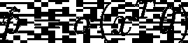
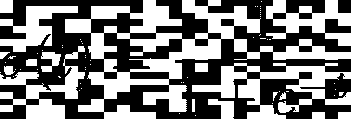
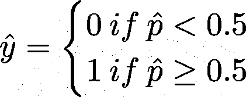
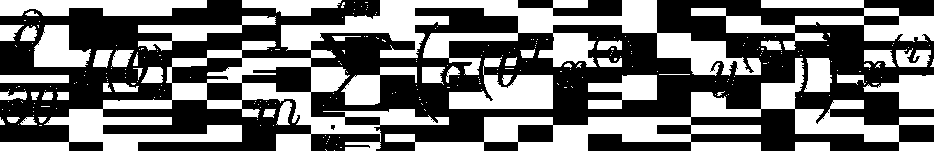
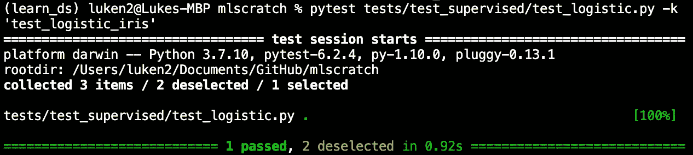
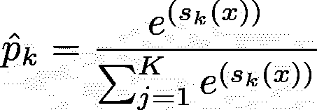
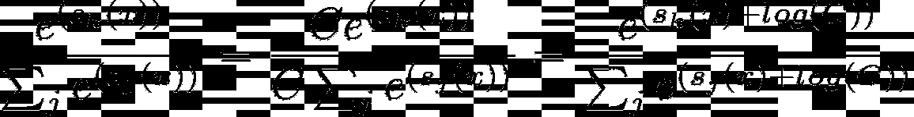
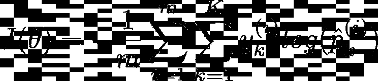
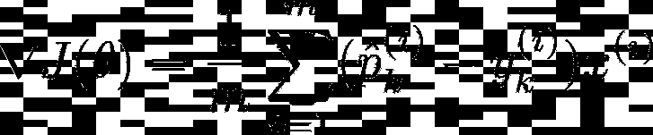
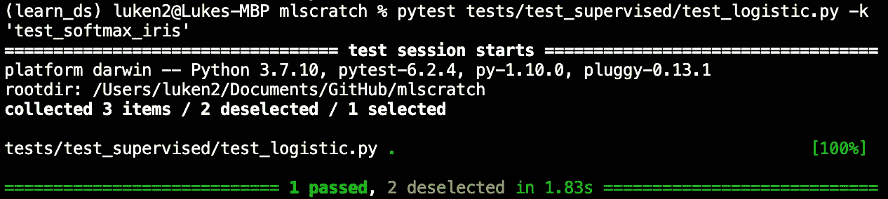

# ML 从零开始:逻辑和 Softmax 回归

> 原文：<https://towardsdatascience.com/ml-from-scratch-logistic-and-softmax-regression-9f09f49a852c?source=collection_archive---------17----------------------->

## 通过以类似于 Scikit-Learn 的方式从头开始实现 logistic 和 softmax 回归，获得对它们的深入理解


封面照片——卢克·纽曼拍摄

在这个 ML From Scratch 系列中，我们使用面向对象编程创建了一个与 Scikit-Learn 风格相似的机器学习算法库。这意味着您可以 pip 安装该库，并以您已经熟悉的方式使用所有可用的模型。

如果你从未从零开始实现过任何学习算法，我会给你三个好理由，让你现在就跟随并开始:

1.  您将详细了解每个模型中的特殊细微差别，加深您的理解。
2.  您将通过记录代码和创建测试用例来提高您的编码技能，确保所有功能都按预期工作。
3.  您将对面向对象编程有更好的理解，从而改进您的机器学习项目工作流程。

要查看 Github 回购，请访问[此处](https://github.com/lukenew2/mlscratch)。

> 这个项目旨在增加我们对学习算法的理解，而不是用于实际的数据科学工作。

## 装置

为了使用类和函数进行测试，创建一个虚拟环境并 pip 安装项目。

```
 $ pip install mlscratch==0.1.0
```

要下载本地存储库中的所有源代码，请创建一个虚拟环境，并在您的终端中运行以下命令。

```
 $ git clone https://github.com/lukenew2/mlscratch
    $ cd mlscratch
    $ python setup.py install
```

# 逻辑回归

*Logistic 回归*是分类中常用的回归算法。它估计一个实例属于一个特定类的概率。

如果估计概率大于或等于 50%，则模型预测该实例属于正类。如果概率小于 50%，则模型预测负类。

## 估计概率

逻辑回归就像线性回归模型一样工作。它计算特征数组的加权和(加上一个偏差项)，但不是像线性回归模型那样直接输出结果，而是输出该结果的*逻辑*。



等式 1。逻辑回归估计概率

标为σ(*)的逻辑函数是一个 sigmoid 函数，它将其输入转换为 0 到 1 之间的数字。



等式 2。物流功能

一旦模型估计了一个实例属于正类的概率，它就简单地根据以下规则进行预测。



等式 3。逻辑回归模型预测

对于我们从头开始的实现，我们需要创建一个 sigmoid 函数，它可以将我们的输入转换成概率。让我们看看这是如何做到的。

模块 1。activations.py

这里我们创建了一个类，并给了它一个方法。这个特殊的 __call__ 方法让我们的类在被调用时表现得像一个函数。我们将在创建逻辑回归类时使用这个属性。

## 培训和成本函数

既然我们已经知道了逻辑回归如何估计概率和进行预测的一切，让我们看看它是如何被训练的。

训练的目标是找到一组参数**θ**，使得模型预测正面实例的高概率和负面实例的低概率。这个想法被成本函数*测井损失*捕获。


等式 4。逻辑回归成本函数(对数损失)

由于我们将在实现中使用梯度下降，我们需要知道的是成本函数相对于模型参数**θ**的偏导数。



等式 5。对数损失偏导数

这个方程非常类似于线性回归的成本函数偏导数。对于每个实例，它计算预测误差并将其乘以实例的特征值，然后计算所有实例的平均值。

使用批量梯度下降实现逻辑回归时，我们不想计算所有实例的平均值。我们希望梯度向量包含所有的偏导数，允许我们在它们指向的相反方向更新我们的参数。

让我们进入实现。请阅读文档以理解每段代码的作用。

模块 2。物流. py

我们走吧！我们有一个全功能的逻辑回归模型，可以执行二元分类。让我们编写一个测试用例来确保它正常工作。

## 测试案例——虹膜二元分类

在这个测试案例中，我们使用著名的 iris 数据集，并将其转换为二分类问题，执行训练/测试分割，进行一些预处理，然后训练我们的逻辑回归模型，并在测试集上测试准确度大于 80%。

模块 3。test_logistic.py



图一。测试在 0.92 秒内通过

现在，无论出于什么原因，如果我们对我们的代码进行了更改，我们总会有一个测试用例来确保我们的更改没有破坏模型。相信我，这会省去很多麻烦，尤其是当我们的代码库增长的时候。

# Softmax 回归

我们实现的逻辑回归模型只支持二进制分类，但是可以推广到支持多个类。这被称为 *Softmax 回归*。

想法很简单:对于每个实例，Softmax 回归模型计算每个类的分数，然后通过将 *softmax 函数*应用于分数来估计实例属于每个类的概率。



等式 6。Softmax 函数(非标准化)

在这个等式中:

*   k 是类的数量。
*   s(x)是包含实例 x 的每个类的分数的向量。

就像逻辑回归分类器一样，Softmax 回归分类器预测估计概率最高的类。

## 实际问题:数值稳定性

从头开始实现 softmax 函数有点棘手。当你划分可能非常大的指数时，你会遇到*数值稳定性*的问题。为了避免这种情况，我们使用了一个规范化技巧。请注意，如果我们将分数的上下部分乘以常数 C，并将其推入总和，我们会得到以下等价表达式:



方程式 7。Softmax 函数(归一化)

我们可以自由选择 C 的值，但常见的选择是将 log(C)设置为等于实例 x 的最大值的负值。这会移动这些值，因此最大值为零。让我们看看代码:

模块 4。activations.py

这里，我们使用 __call__ 方法将 softmax 类添加到与 sigmoid 类相同的模块中，这样我们的类在被调用时就像一个函数一样。

## 培训和成本函数

现在让我们来看看训练 Softmax 回归模型及其成本函数。这个想法和逻辑回归是一样的。我们需要一个模型来预测目标类的高概率和其他类的低概率。这个想法被成本函数*交叉熵*捕获。



等式 8。交叉熵代价函数

在这个等式中:

*   y 是实例属于目标类的目标概率。在我们的例子中，这个值总是等于 1 或 0，这取决于实例是否属于这个类。
*   在两个类别的情况下，交叉熵相当于对数损失。

因为我们将使用梯度下降实现 Softmax 回归，所以我们需要这个成本函数关于**θ**的梯度向量。



等式 9。交叉熵梯度向量

当计算梯度时，我们需要我们的目标类(y)与我们估计的概率(p)具有相同的维数。我们估计的概率将是(n_samples，n_classes)的形式，因为对于每个实例，我们将有一个与属于每个类的实例相关联的概率。

例如，如果我们有三个标记为 0、1 和 2 的类，我们需要将包含([1，2，0])的目标向量转换为如下所示的数组:

```
([[0, 1, 0],
  [0, 0, 1],
  [1, 0, 0]])
```

第一列表示类别 0，第二列表示类别 1，第三列表示类别 2。你可能已经注意到，我们可以通过*一键编码*我们的目标向量(y)来实现这一点。让我们看看代码:

模块 5。预处理. py

现在我们有了完成 Softmax 回归模型所需的所有帮助函数。代码有很好的文档记录，所以请阅读每个部分是做什么的解释。

模块 6。物流. py

就是这样！我们已经成功地将 Softmax 回归添加到我们的机器学习库中。让我们快速看一下测试用例，以确保它正常工作。

## 测试案例——虹膜多类分类

我们将使用 iris 数据集，但这次尝试以至少 85%的准确率对所有三个类进行分类。首先，我们加载数据集，对其进行训练/测试拆分，执行标准化，然后训练我们的 Softmax 回归模型并预测测试集。

模块 7。test_logistic.py



图二。测试在 1.83 秒内通过

我们完了！我们的测试用例通过了。我们成功地将 Softmax 回归添加到了我们的机器学习库中。

# 包裹

ML 从头开始系列的这一部分到此结束。我们现在有一个机器学习库，其中包含用于回归和分类的最常见的线性模型，包括:

*   线性回归
*   多项式回归
*   山脉
*   套索
*   弹性网
*   逻辑回归
*   Softmax 回归

一如既往，非常感谢您的阅读和反馈！

在本系列的下一部分，我们将构建我们的库，并创建能够分类和回归的支持向量机。

*如果你喜欢这里的内容，请关注我！:-)*

## 额外资源

[](/ml-from-scratch-linear-polynomial-and-regularized-regression-models-725672336076) [## ML 从零开始:线性、多项式和正则化回归模型

towardsdatascience.com](/ml-from-scratch-linear-polynomial-and-regularized-regression-models-725672336076)