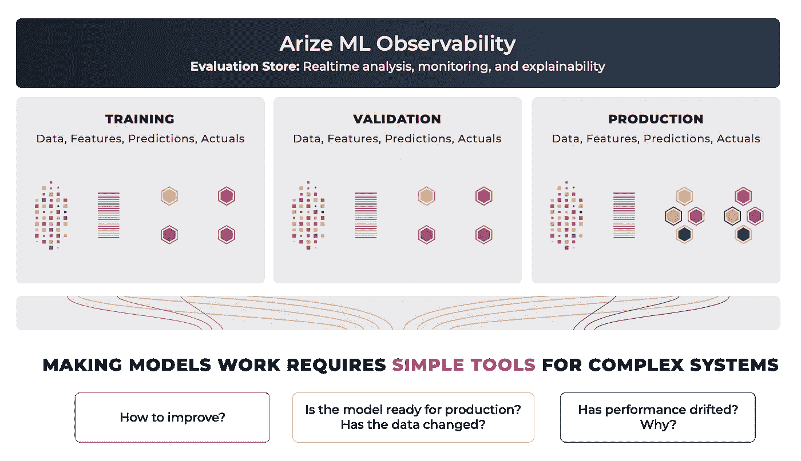
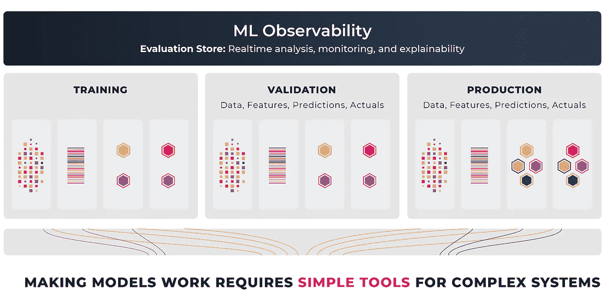
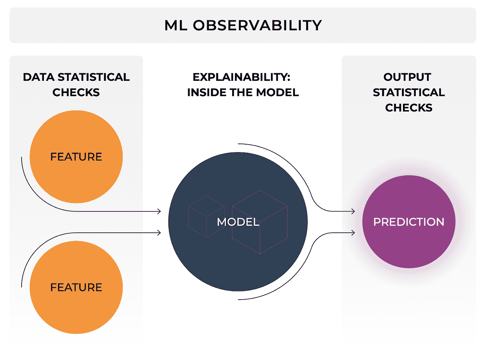

# ML 基础设施工具— ML 可观察性

> 原文：<https://towardsdatascience.com/ml-infrastructure-tools-ml-observability-8e4d7df6db43?source=collection_archive---------20----------------------->

## [ML 可观测性系列](https://towardsdatascience.com/tagged/ml-observability)

## 第 1 部分:ML 可观测性系列

作者的 ML 可观察性平台图片

几乎每个行业的企业都在采用机器学习(ML)。许多企业都在期待 ML 基础设施平台，以推动他们在业务中利用人工智能的运动。了解各种平台和产品可能是一项挑战。**ML 基础架构空间拥挤、混乱且复杂**。

为了理解生态系统，我们将机器学习工作流大致分为三个阶段——数据准备、模型构建和生产。了解工作流程每个阶段的目标和挑战有助于做出明智的决策，确定哪些 ML 基础设施平台最适合您的业务需求。

按作者列出的 ML 工作流图像

在我们的上一篇文章中，我们深入研究了 ML 工作流程的[数据准备](https://arize.com/blog/ml-infrastructure-tools-for-data-preparation/)和[模型构建](https://arize.com/blog/ml-infrastructure-tools-for-model-building/)部分。我们开始深入生产 ML，并详细讨论了[模型验证](/ml-infrastructure-tools-for-production-1b1871eecafb)和[模型部署](/ml-infrastructure-tools-for-production-part-2-model-deployment-and-serving-fcfc75c4a362)。在本帖中，我们将深入探讨并开始一系列关于 ML 可观测性的讨论。

# 什么是 ML 可观测性？

作为一个机器学习社区，我们已经在构建模型方面取得了巨大的进步，这些模型使计算机能够完成惊人的智能壮举。现在，这些模型已经在世界上做出决策，我们如何确保这些技术实际上是可行的，我们持续地高质量地交付它们，我们积极地改进它们，并确保研究结果与生产相匹配？大多数数据科学家很快意识到 Jupyter 笔记本不是真实的世界。模型的可观测性是弥合这一差距的关键。模型可观察性是基础平台，它使团队能够从实验室到生产不断交付和改进结果。

在这个博客系列中，我们将讨论模型可观察性的主题。我们将深入研究模型在现实世界中遇到的问题。我们还将看一看有助于理解模型行为的工具。

*模型可观测性只是 ML 监控的一个花哨词吗？*

模型可观察性始于在诸如培训、验证和生产等环境中收集模型评估的过程，然后通过分析将它们结合在一起，允许人们将这些点连接起来以解决 ML 工程问题。这些推理存储在一个模型评估存储中(这个术语归功于 Josh Tobin ),该存储托管原始推理数据。评估存储保存模型的响应，模型决策的签名，在每个环境中对每个模型版本的每个输入数据的响应。

作者的 ML 可观察性平台图片

ML 可观测性平台允许团队分析模型退化，并找出任何出现问题的根本原因。这种通过连接验证和生产之间的点来诊断模型问题的根本原因的能力是模型可观察性与传统模型监控的区别。虽然模型监控包括针对关键模型性能指标(如准确性或漂移)设置警报，但模型可观察性意味着更高的目标，即深入了解任何性能回归或异常行为。*我们对为什么*感兴趣。监控只对聚合和警报感兴趣。可观察性感兴趣的是我们可以从模型的预测、可解释性洞察、产品特征数据和训练数据中推断出什么，以理解模型动作背后的原因并构建工作流来改进。

作者的 ML 可观察性图像

由评估库支持的 ML 可观测性；

*   在生产、培训和验证数据集环境之间无缝移动
*   按环境本机支持模型评估分析
*   旨在分析预测的性能方面/部分
*   为故障排除和法规分析而设计的可解释性归因
*   基于基本事实的性能分析——精确度，F1，MAE
*   没有基础事实的代理性能——预测漂移
*   数据集和环境之间的分布漂移分析
*   旨在回答性能变化背后的原因
*   集成验证
*   旨在迭代和改进

## **为什么 ML 的可观察性很重要**

我们的团队曾亲自参与定价、预测、营销、信贷和交付时间估计等模型的开发工作。在所有情况下都有一个共同的故事线；我们会建立一个模型，部署它，它会在一个城市很好地工作，而不是在另一个城市。它在一组社区/客户/产品类型中很有效，而在其他产品中效果很差。这在一般情况下会很好，但在预测的结尾会很可怕。或者它在初始发布时工作得很好，然后模型会慢慢退化。其他时候，您可能会遇到由上游数据管道错误引起的瞬时变化，这将慢慢地损害训练数据。在所有这些案例中，很明显，当团队将模型部署到生产环境中时，ML 基础设施中缺少一个基础部分来帮助模型工作。

在机器学习的另一个常见用途中，如欺诈模型分析，理解绩效变化背后的*为什么*是极其重要的。在欺诈中，基于不良行为者的敌对行为，行为不断发生变化。这些不良因素会造成性能下降，可能会在监控系统中亮起红灯或绿灯。但是因果关系，“为什么”，通常是阻止欺诈计划的洞察力。

在为每个客户建立一个模型，根据客户特定数据进行训练的公司中，每个模型都接受不同的训练。团队可能会被显示数据/模型漂移的模型淹没，但是很难显示这种漂移是否是一个问题*。你如何在规模上解决问题，你的 ML 团队如何随着客户的增长而扩展？*团队希望快速了解问题在哪里大规模出现，快速将生产与验证进行比较，并满怀信心地快速解决问题。

没有工具来推理模型在野外犯的错误，团队在数据科学实验室投入了大量资金，但在现实世界中基本上是盲目的。*下面的博客将强调团队如何自信地交付模型，持续改进并获得竞争优势。我们将深入探讨 ML 可观察性和 ML 监控。*

# 下一个

我们希望您喜欢 ML 基础设施工具系列。接下来，我们将[深入](https://arize.com/blog/ml-infrastructure-tools-ml-observability/)ML 的可观测性。关于人工智能的可操作性，我们将深入探讨许多讨论不足且极其重要的话题！

## 联系我们

如果这个博客引起了你的注意，并且你渴望了解更多关于[机器学习可观察性](https://arize.com/platform-overview/)和[模型监控](https://arize.com/model-monitoring/)，请查看我们其他的[博客](https://arize.com/blog/)和 [ML 监控](https://arize.com/ml-monitoring/)上的资源！如果您有兴趣加入一个有趣的 rockstar 工程团队，帮助模型成功生产，请随时[联系](https://arize.com/contact/)我们，并在此处[找到我们的空缺职位](https://arize.com/careers/)！