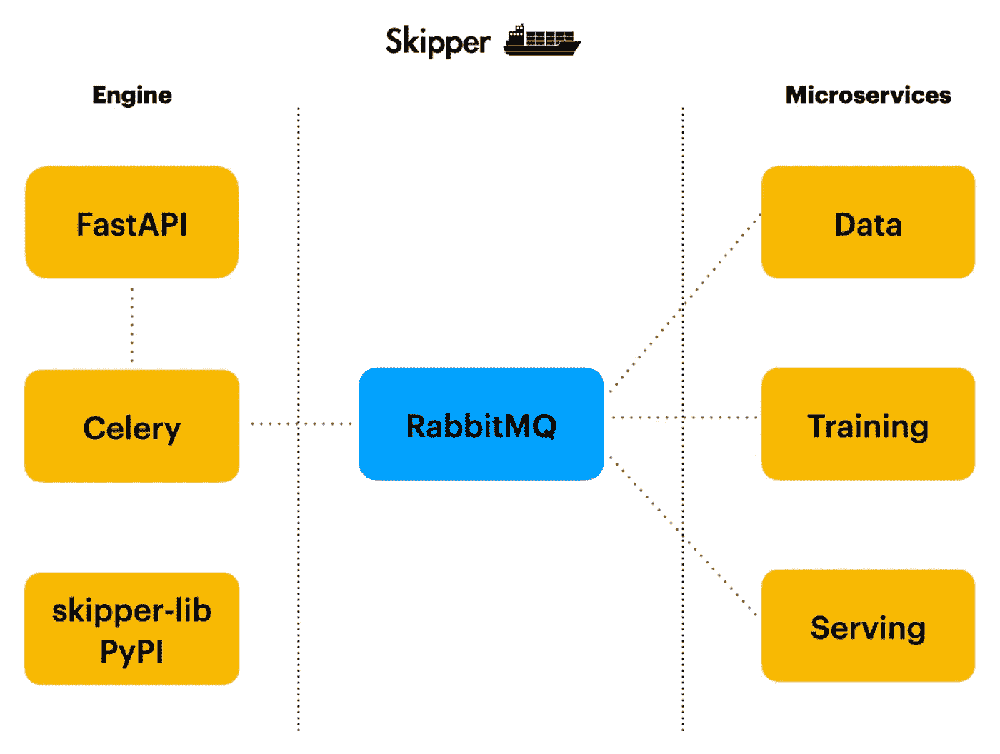

# 机器学习管道端到端解决方案

> 原文：<https://towardsdatascience.com/ml-pipeline-end-to-end-solution-5889690abbd8?source=collection_archive---------18----------------------->

## ML 实现往往很快变得复杂。本文将解释如何将 ML 系统分割成尽可能少的服务。


作者:安德烈·巴拉诺夫斯基

# 介绍

在实现了几个 ML 系统并在生产中运行它们之后，我意识到单片 ML 应用程序的维护负担很重。ML 应用程序代码复杂度呈指数增长。数据处理和准备、模型训练、模型服务——这些事情看起来很简单，但事实并非如此，尤其是在进入生产阶段之后。

数据结构在变化，这需要调整数据处理代码。新的数据类型正在出现，这需要保持模型最新并重新训练它。这些变化可能导致模型服务更新。当所有这些作为一个整体运行时，在不破坏其他东西的情况下修复一个东西变得如此困难。

性能是另一个重点。当系统被分成不同的服务时，就有可能在不同的硬件上运行这些服务。例如，我们可以使用 GPU 在 TensorFlow 云上运行培训服务，而数据处理服务可以在本地 CPU VM 上运行。

我做了研究，并检查了哪些选项可用于实施 ML 微服务。有各种各样的解决方案，但大多数对我来说都太复杂了。我决定实现自己的开源产品，它将依靠 Python、 [FastAPI](https://fastapi.tiangolo.com/) 、 [RabbitMQ](https://www.rabbitmq.com/) 和 [Celery](https://github.com/celery/celery) 来实现服务之间的通信。我叫它 Skipper，它在 [GitHub](https://github.com/katanaml/katana-skipper) 上。该产品正在积极开发中，不过已经可以使用了。

Skipper 的核心思想是为 ML 微服务实现提供一个简单可靠的工作流程，Web API 接口在前端。在接下来的阶段，服务将被打包到 Docker 容器中。我们将为在 Kubernetes 上运行服务提供支持。

# 解决方案架构



Skipper architecture，作者:Andrej Baranovskij

有两个主要模块——引擎和微服务。发动机本身可以当作微服，但我不叫它微服是有原因的。引擎部分负责提供 Web API 访问，从外部调用。它充当一组微服务的网关。Web API 是用 FastAPI 实现的。

Celery 用于处理通过 Web API 提交的长时间运行的任务。我们用 Celery 启动一个长期运行的异步任务，使用任务 ID 通过另一个端点检索结果。

通用逻辑封装到 Python 库，发布在 PyPI — [skipper-lib](https://pypi.org/project/skipper-lib/) 上。这个库的想法是允许用 RabbitMQ 任务代理发布/接收通用事件。在 Web API 引擎和微服务中使用相同的库。

微服务块更像是一个例子。它实现了一个样本服务，用于数据处理、模型训练和最终的模型服务。数据处理模型培训服务之间通过 RabbitMQ 队列进行通信。这个想法是，您可以将自己的服务插入到工作流中。

核心元素— RabbitMQ 代理。Skipper 使用 RabbitMQ RPC 调用在服务之间发送消息。没有协调器来管理通信。通信基于服务发送和接收的事件运行。

# 引擎和 Web API 服务

Web API 是用 FastAPI 实现的。有一个 *router.py* 脚本，其中实现了端点。

长时间运行的任务，比如模型训练是在异步模式下启动的，使用 Celery 分布式任务队列。我们调用*进程 _ 工作流*任务，并获取其 ID:

```
@router_tasks.post('/execute_async', 
                   response_model=WorkflowTask, 
                   status_code=202)
def exec_workflow_task_async(workflow_task_data: WorkflowTaskData):
    payload = workflow_task_data.json()

    task_id = process_workflow.delay(payload)

    return {'task_id': str(task_id),
            'task_status': 'Processing'}
```

任务状态通过另一个端点来检查，我们发送任务 ID 并查询 Celery API 来获得状态:

```
@router_tasks.get('/workflow/{task_id}',
                  response_model=WorkflowTaskResult,
                  status_code=202,
                  responses={202: 
                            {'model': WorkflowTask, 
                            'description': 'Accepted: Not Ready'}})
async def exec_workflow_task_result(task_id):
    task = AsyncResult(task_id)
    if not task.ready():
        return JSONResponse(status_code=202,
                            content={'task_id': str(task_id),
                                     'task_status': 'Processing'})
    result = task.get()
    return {'task_id': task_id,
            'task_status': 'Success',
            'outcome': str(result)}
```

应该快速完成的任务(例如，预测任务)会直接执行，而不会启动芹菜任务。事件被发送到 RabbitMQ 代理，结果以同步模式返回:

```
@router_tasks.post('/execute_sync',
                   response_model=WorkflowTaskResult,
                   status_code=202,
                   responses={202: 
                            {'model': WorkflowTaskCancelled,
                             'description': 'Accepted: Not Ready'}})
def exec_workflow_task_sync(workflow_task_data: WorkflowTaskData):
    payload = workflow_task_data.json()

    queue_name = None
    if workflow_task_data.task_type == 'serving':
        queue_name = 'skipper_serving'

    if queue_name is None:
        return JSONResponse(status_code=202,
                            content={'task_id': '-',
                                  'task_status': 'Wrong task type'})

    event_producer = EventProducer(username='skipper',
                                   password='welcome1',
                                   host='localhost', 
                                   port=5672)
    response = json.loads(event_producer.call(queue_name, payload))

    return {'task_id': '-',
            'task_status': 'Success',
            'outcome': str(response)}
```

芹菜任务在 *tasks.py* 脚本中实现。它的工作是向 RabbitMQ 提交一个新事件，并等待响应。

# Skipper 库

该库有助于封装通用逻辑，而无需重复相同的代码。我用一个叫做[诗歌](https://python-poetry.org/)的工具在 PyPI 上建立并发布了一个库。

该库有助于简化与 RabbitMQ 的交流。它实现了事件生产者和接收者。

事件生成器使用 RPC 将任务提交到队列，并等待响应:

```
def call(self, queue_name, payload):
    self.response = None
    self.corr_id = str(uuid.uuid4())
    self.channel.basic_publish(
        exchange='',
        routing_key=queue_name,
        properties=pika.BasicProperties(
            reply_to=self.callback_queue,
            correlation_id=self.corr_id
        ),
        body=payload
    )
    while self.response is None:
        self.connection.process_data_events()
    return self.response
```

事件接收器侦听来自 RabbitMQ 队列的消息，调用服务，并返回响应:

```
def on_request(self, ch, method, props, body):
    service_instance = self.service_worker()
    response, task_type = service_instance.call(body)

    ch.basic_publish(exchange='',
                     routing_key=props.reply_to,
                     properties=pika.BasicProperties(
                                 correlation_id=props.correlation_id
                                ),
                     body=response)
    ch.basic_ack(delivery_tag=method.delivery_tag)

    print('Processed request:', task_type)
```

# 服务

实现的服务的主要目标是提供一个如何使用工作流的例子。如果你使用 skipper-lib 进行事件通信，你可以插入你自己的服务。

所有服务都遵循相同的代码结构。

# 培训服务

顾名思义，该服务负责运行模型培训。

业务逻辑在 *training_service.py* 脚本中实现。有一个方法叫做*调用*。该方法由来自 *skipper-lib* 的事件接收器自动执行。在此方法中，您应该读取输入数据，调用模型训练逻辑并返回结果:

```
def call(self, data):
    data_json = json.loads(data)

    self.run_training(data)

    payload = {
        'result': 'TASK_COMPLETED'
    }
    response = json.dumps(payload)

    return response, data_json['task_type']
```

该服务发送事件来请求数据。我们也为此使用了 *skipper-lib* :

```
def prepare_datasets(self, data):
    event_producer = EventProducer(username='skipper',
                                   password='welcome1',
                                   host='localhost', 
                                   port=5672)
    response = event_producer.call('skipper_data', data)
```

要启动服务，运行 *main.py* 脚本:

```
from skipper_lib.events.event_receiver import EventReceiver
from app.training_service import TrainingServiceevent_receiver = EventReceiver(username='skipper',
                               password='welcome1',
                               host='localhost',
                               port=5672,
                               queue_name='skipper_training',
                               service=TrainingService)
```

训练服务被配置为监听 *skipper_training* 队列。

# 数据服务

该服务接收事件以准备数据并将其返回给调用者。一次返回多个数据集，例如，训练和验证数据、目标值。Numpy 数组被转换成列表并用 *json.dump:* 序列化

```
data = [norm_train_x.tolist(),
        norm_test_x.tolist(),
        norm_val_x.tolist(),
        train_y,
        test_y,
        val_y]

response = json.dumps(data)
```

培训服务将使用 *json.loads* 函数反序列化数据，然后它将再次创建 Numpy 数组结构。这样，只对数据服务进行一次调用，所有数据结构都在一次调用中传输。

要启动服务，运行 *main.py* 脚本:

```
event_receiver = EventReceiver(username='skipper',
                               password='welcome1',
                               host='localhost',
                               port=5672,
                               queue_name='skipper_data',
                               service=DataService)
```

数据服务被配置为监听 *skipper_data* 队列。

# 发球服务

此服务加载由培训服务保存的模型。它加载由数据服务保存的用于数据标准化的数字。我们需要根据用于模型训练的相同统计数据来标准化数据。

服务方法实现:

```
def call(self, data):
    data_json = json.loads(data)
    payload = pd.DataFrame(data_json['data'], index=[0, ])
    payload.columns = [x.upper() for x in payload.columns]

    train_stats = pd.read_csv(
                 '../models/train_stats.csv', 
                 index_col=0)
    x = np.array(self.norm(payload, train_stats))

    models = self.get_immediate_subdirectories('../models/')
    saved_model = tf.keras.models.load_model(
                     '../models/' + max(models))

    predictions = saved_model.predict(x)

    result = {
        'price': str(predictions[0][0][0]),
        'ptratio': str(predictions[1][0][0])
    }
    response = json.dumps(result) return response, data_json['task_type']
```

要启动服务，运行 *main.py* 脚本:

```
event_receiver = EventReceiver(username='skipper',
                               password='welcome1',
                               host='localhost',
                               port=5672,
                               queue_name='skipper_serving',
                               service=ServingService)
```

服务服务被配置为监听 *skipper_serving* 队列。

# 结论

这篇文章的主要思想是解释如何将 ML 实现分成不同的服务。这将有助于管理复杂性，并提高解决方案的可扩展性。希望您会发现 Skipper 对您自己的实现很有用。尽情享受吧！

## 源代码

*   [GitHub](https://github.com/katanaml/katana-skipper) 回购。按照自述文件获取设置说明

## YouTube——观看演示