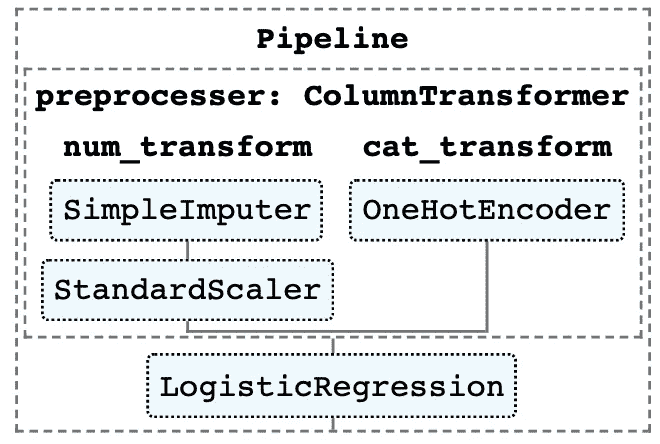
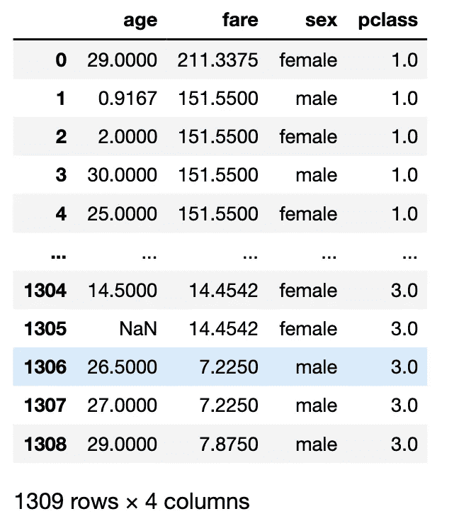

# Scikit-Learn 中带网格搜索的 ML 管道

> 原文：<https://towardsdatascience.com/ml-pipelines-with-grid-search-in-scikit-learn-2539d6b53cfb?source=collection_archive---------15----------------------->

## ML 管道是 Scikit-Learn 和 Spark MLlib 提供的一个重要特性。它将数据预处理、特征工程和 ML 模型统一在同一个框架下。这种抽象极大地提高了任何 ML 项目的可维护性，如果您真的想将您的模型投入生产，那么应该考虑这种抽象。

让我们先概述一下使用 ML 管道的一些主要好处。

*   **用于数据转换和建模的统一 API**
*   **在模型服务期间不需要额外的预处理步骤**
*   **联合网格搜索可能包括数据预处理步骤/参数和模型选择/参数**
*   **兼容 Spark 等大数据框架**

对一些人来说，最后一点可能不是很明显。想象一下，如果有一天你的模型需要对大量数据进行训练。您可能没有更好的选择，只能使用 Spark 这样的分布式框架。使用 ML 管道将使迁移到 Spark 变得轻而易举。一个原因是`Spark MLlib`有类似的 ML 管道特性。另一个更根本的原因是**函数式编程。**

ML pipeline 与**函数式编程**(Spark 也紧随其后)有许多相似之处，因为它将转换和估算器(模型)视为数据上的操作符。数据保持**不变性(FP 的核心理念)**，因为它们只是通过管道的不同组件，在这个过程中被转换成新的格式。在管道的末端，我们得到一些预测结果。



示例管道(图片由作者提供，使用 scikit-learn 生成)

在示例管道中，我们有一个`preprocessor`步骤，它属于`ColumnTransformer`类型，包含两个子管道:

*   `num_transform`是用于数字列的子管道，它填充空值并将列转换为标准分布
*   `cat_transform`是另一个用于分类列的子管道，它执行一键编码

在`preprocessor`转换器之后，我们有一个`estimator`，在本例中是默认的逻辑回归器。

通过这种管道，人们可以将数据预处理与建模结合在一起，甚至通过创建定制的转换器来包括更复杂的特征工程。

要创建自己的转换器，你需要创建一个从`sklearn.base.BaseEstimator`和`sklearn.base.TransformerMixin`继承的类，并实现`fit`和`transform`方法。

# 如何创建管道？

让我们来看一个正在运行的例子([完整的代码可以在 Github](https://github.com/wlongxiang/mlpipeline/blob/main/ml_pipeline_with_grid_search.ipynb) 上找到)，它包含了泰坦尼克号上乘客的特征和标签，这些标签表明其中一人是否幸存。

我们想要建立一个分类器来预测一个给定的乘客是否会幸存。

```
from sklearn.datasets import fetch_openml
import numpy as npnp.random.seed(0)# Load data from [https://www.openml.org/d/40945](https://www.openml.org/d/40945)
X, y = fetch_openml("titanic", version=1, as_frame=True, return_X_y=True)
```

我们将考虑以下 4 个特征，其中`age`和`fare`是数字，而`sex`和`pclass`是分类的(注意:也可以将`pclass`视为数字，但这与这里的讨论无关)。



现在，让我们构建管道来进行前面提到的一些数据预处理。

```
numeric_features = ["age", "fare"]
numeric_transformer = Pipeline(steps=[
    ("imputer", SimpleImputer(strategy="mean")),
    ("scaler", StandardScaler())
])categorical_features = ["sex", "pclass"]
categorical_transformer = OneHotEncoder(handle_unknown="ignore")preprocessor = ColumnTransformer(transformers=[
    ("num_transform", numeric_transformer, numeric_features),
    ("cat_transform", categorical_transformer, categorical_features)
])pipeline = Pipeline(steps=[("preprocesser", preprocessor), ("classifier", LogisticRegression())])
pipeline
```

或者，有一个稍微紧凑一点的 API `make_pipeline`和`make_column_transformer`，其中我们不需要显式地传递每个步骤的名称。**然而，下面的部分将基于之前的详细版本，因为我们喜欢按照我们喜欢的方式命名事物:)。**

```
from sklearn.compose import make_column_transformer
from sklearn.pipeline import make_pipelinenumeric_transformer = make_pipeline(
    SimpleImputer(strategy='mean'),
    StandardScaler())categorical_transformer = make_pipeline(OneHotEncoder(handle_unknown='ignore'))preprocessor = make_column_transformer(
    (numeric_transformer, numeric_features),
    (categorical_transformer, categorical_features))pipeline = make_pipeline(preprocessor, LogisticRegression())
pipeline
```

一个方便的提示，通过包含下面的代码，可以在 Jupyter notebook 中可视化管道。它创建了一个很好的图表，如前所示。

```
from sklearn import set_config
set_config(display='diagram')
pipeline
```

# 如何培养一个模特？

训练一个模型和训练一个纯粹的评估者没有什么不同。你就叫`fit`。下面我们首先做一个标准的列车测试数据分割来测试模型性能。然后，你就在你的训练数据上调用`pipeline.fit()`，就这样。

```
X_train, X_test, y_train, y_test = train_test_split(X, y, test_size=0.2, random_state=0)
pipeline.fit(X_train, y_train)
score = pipeline.score(X_test, y_test)
print(score)
0.7977099236641222
```

实际情况是，训练数据经过管道中定义的步骤(包括分类器估计器)，就好像它是一个模型一样。

# 如何保存和加载模型？

在这一点上，有人可能想知道我是否也可以保存我的流水线模型，就像我过去保存独立模型一样？答案是肯定的。

将数据处理和建模放在一个保存的模型中还有一个好处。**现在你不需要考虑在预测时间采取什么样的预处理步骤，它们已经是模型不可分割的一部分**。这可以防止生产中出现奇怪的预测结果。

```
import joblib
joblib.dump(pipeline, 'your_pipeline.pkl')joblib.load('your_pipeline.pkl').score(X_test, y_test)
0.7977099236641222
```

我们使用`joblib`来保存和加载管道，并且它产生相同的分数，这验证了正确性，并且我们确实看到不需要预处理，就像承诺的那样。

# 如何在管道上进行网格搜索？

ML 管道使我们不仅能够搜索估计器的参数，而且能够搜索所有预处理步骤的参数。换句话说，我们现在可以一起调优 ML 模型和预处理选项。

出于论证的目的，比方说，我们不确定通过`mean`或`median`策略填充空值是否是更好的选择，我们也不确定`LogisticRegressor`需要多少正则化。因此，我们想找出最佳缺失值填充策略和最佳正则化权重。为此，我们可以按如下方式构建参数网格:

```
param_grid = [
    {
        "preprocesser__num_transform__imputer__strategy": ["mean", "median"],
        "classifier__C": [0.1, 1.0, 10.0, 100.0],
        "classifier": [LogisticRegression()]
    }
]
```

注意: **sklearn 使用双下划线作为分隔符**。`classifier` key 与流水线定义中估计器的流水线名称相同，`classifier__C`基本上告诉网格搜索器我们想要尝试为`C`提供的这些值，T5 是分类器`LogisticRegressor`定义正则化权重的参数。

您可能会注意到，您还可以连接双下划线语法。`preprocesser__num_transform__imputer_strategy`为`imputer`步骤的`strategy`参数定义不同的试验值。

最后，我们可以开始网格搜索，因为我们有 2 个值用于`strategy`和 4 个值用于`C`，在搜索空间中总共有`2*4=8`个候选 to。

```
grid_search = GridSearchCV(model, param_grid, cv=10, verbose=1,n_jobs=-1)
grid_search.fit(X_train, y_train)
```

输出如下所示，因为我们对每个组合进行了 10 次交叉验证，所以我们总共需要拟合 80 个模型！人们可以看到网格搜索是多么容易爆炸。

```
Fitting 10 folds for each of 8 candidates, totalling 80 fits[Parallel(n_jobs=-1)]: Using backend LokyBackend with 4 concurrent workers.
[Parallel(n_jobs=-1)]: Done  80 out of  80 | elapsed:    4.5s finished
```

如果我们想尝试不同的分类器呢？我们可以构建更复杂的参数网格来实现这一点。

```
param_grid = [
    {
        "preprocesser__num_transform__imputer__strategy": ["mean", "median"],
        "classifier__C": [0.1, 1.0, 10.0, 100.0],
        "classifier": [LogisticRegression()]
    },
    {
        "preprocesser__num_transform__imputer__strategy": ["mean", "median"],
        "classifier__n_estimators": [10, 100, 1000],
        "classifier": [RandomForestClassifier()]
    }
]
grid_search = GridSearchCV(model, param_grid, cv=10, verbose=1,n_jobs=-1)
grid_search.fit(X_train, y_train)
```

在上面的代码中，我们使用参数网格中的两个字典来添加一组额外的搜索选项，它使用随机森林分类器而不是逻辑回归器。

有人可能会问，现在的组合数是多少？由于每个字典都定义了不同的集合，**我们应该跨字典累加，在字典内相乘**。这给了我们`2*4*1 + 2*3*1 = 14`个候选人。

这在输出中得到验证:

```
Fitting 10 folds for each of 14 candidates, totalling 140 fits[Parallel(n_jobs=-1)]: Using backend LokyBackend with 4 concurrent workers.
[Parallel(n_jobs=-1)]: Done  76 tasks      | elapsed:    1.5s
[Parallel(n_jobs=-1)]: Done 140 out of 140 | elapsed:   26.6s finished
```

# 摘要

我们已经通过一个运行示例讨论了使用 ML 管道的主要好处。

我们也看到了管道概念是多么方便，同时又是多么强大。在我们看到进行联合网格搜索是多么容易之后，后一点就变得很明显了。

最后但同样重要的是，看到`Spark MLlib`与`scikit-learn`中的 ML pipeline 具有几乎相同的特性并不令人惊讶，感兴趣的读者可以查看:【https://spark.apache.org/docs/latest/ml-pipeline.html】，或者我可能会就此写另一篇博客。

# 笔记

1.  GitHub 上可用的代码:[https://GitHub . com/wlongxiang/ml pipeline/blob/main/ml _ pipeline _ with _ grid _ search . ipynb](https://github.com/wlongxiang/mlpipeline/blob/main/ml_pipeline_with_grid_search.ipynb)
2.  制作自己的变形金刚需要阅读的一些资料:[https://sk learn-template . readthedocs . io/en/latest/user _ guide . html](https://sklearn-template.readthedocs.io/en/latest/user_guide.html)