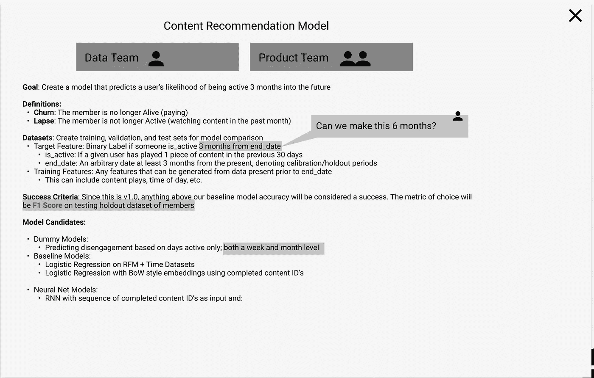
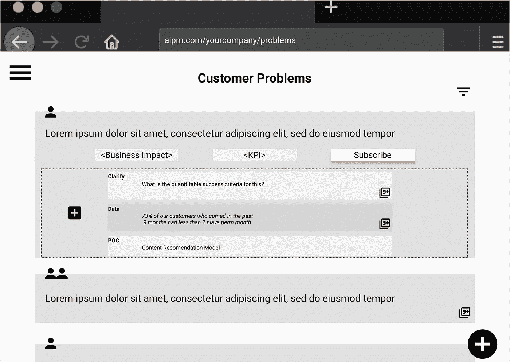

# ML 产品管理有一个翻译问题

> 原文：<https://towardsdatascience.com/ml-product-management-has-a-translation-problem-65e87df655b1?source=collection_archive---------22----------------------->

## [行业笔记](https://towardsdatascience.com/tagged/notes-from-industry)

## Data/ML 产品中常见的翻译问题

## 构建 ML 产品是困难的。

作为一名数据科学家和一名产品经理，我经历了这个问题两方面的成长烦恼。

你如何确定你的人工智能项目成功了？照片由[在](https://unsplash.com/@thisisengineering?utm_source=medium&utm_medium=referral) [Unsplash](https://unsplash.com?utm_source=medium&utm_medium=referral) 上拍摄

经常被引用的数字(在 ML/MLOps 推销中如此常见，这是一个陈词滥调)是 [85%的人工智能项目未能给企业带来预期的结果](https://www.techrepublic.com/article/why-85-of-ai-projects-fail/)。

斯隆指出，即使有正确的数据、人才和公司战略，也只有 20%的公司从人工智能计划中获得财务投资回报。

尽管成功率如此之低，人工智能/人工智能项目不会有任何进展——91.5%的公司都在持续投资人工智能。

ML 项目失败的原因很多，从最初的数据问题到监控不力。在这个系列中，我将强调我所目睹的困扰 ML 产品的三大问题。尽情享受吧！

> **翻译问题:**业务需求和数据科学解决方案之间往往存在明显的脱节

# 野外翻译问题:

这里有两个夸张但令人惊讶的常见场景，涉及公司试图/未能启动 ML 计划。*希望他们不要离家太近*:

## 1.“让搜索变得更好”

Pria 是一名产品经理，她花了一个月左右的时间采访客户，寻找改善公司移动应用体验的方法。在筛选了她所有的对话后，她意识到人们不喜欢搜索功能，因为他们找不到新的有趣的内容来观看。

Pria 注意到的一个常见行为是，客户会访问搜索，对结果不满意，然后关闭应用程序。事实上，有些人甚至因为体验太差而转用了竞争对手的 app。

Pria 希望在她的产品中复制谷歌的成功……照片由 [Unsplash](https://unsplash.com?utm_source=medium&utm_medium=referral) 上的 [Charles Deluvio](https://unsplash.com/@charlesdeluvio?utm_source=medium&utm_medium=referral) 拍摄

Pria 灵光一现:**也许新的数据科学家能够*让搜索变得更好*！**

Pria 很快安排了一次与数据科学团队的会议，并传达了她的想法——“使用数据科学和机器学习来让搜索变得更好”。Pria 没有技术背景，不知道*确切地*DS/ML 能帮什么忙，但是假设他们有一些锦囊妙计。

数据科学家 Dave 很高兴收到一个基于客户的问题！接下来的几周，他阅读了一些关于推荐系统的新论文，实现了一些看起来很有前途的论文，并进行了离线测试。他使用 top5 推荐作为他选择的衡量标准，并发现尖端的深度学习模型表现最好。几次冲刺后，他向普里阿…

…很快发现这不是 Pria 想要的。

在接下来的 A/B 测试中，对比了 Dave 的模型和当前系统，客户确实更多地点击了 Dave 模型的推荐，但下降速度几乎相同。

这让 Dave 很兴奋，因为他的推荐算法在点击率方面明显优于现状，而 Pria 很失望，因为它没有解决保留的实际潜在问题。

*这是一个假设的场景，但 Dave 的模型在点击率方面可能更强，但在保留率方面会更低，因为它只推荐最受欢迎的内容，所以一般人会感兴趣并点击，但那些试图找到特定内容的人可能会发现这些推荐令人沮丧*

这看起来像是一个沟通不畅的问题(确实如此)，但产品/业务计划与最终数据科学产出不一致的普遍现象清楚地表明，这里还存在更多问题。

**业务目标和需求经常被误译为数据科学指标。**

## 2.数据驱动与客户驱动

上述错位不一定来自产品到数据科学的管道；它也可能来自热情(但幼稚)的战略领导，试图将 ML 洒入每一项风险投资。如果你听到这个问题，

> "利用现有的数据，我们可以做什么样的 ML 项目？"

更好的想法可能潜藏在您的数据中…但是您如何才能发现正确的想法呢？弗兰基·查马基在 [Unsplash](https://unsplash.com?utm_source=medium&utm_medium=referral) 上拍摄的照片

你的团队潜伏在危险的错位区域。

有*无数* ML 相关的项目，一个数据科学家可以用一个健康的数据集炮制…但是这些项目中有多少可以被依赖来交付 ROI 呢？这些项目中有多少能够对当前的客户问题产生直接和积极的影响？

比你想象的要少。

没有清晰结构或与特定客户问题无关的数据科学项目通常无法交付商业价值。

# 定义问题

**问题陈述**:作为一个产品团队，我们希望确保团队中的每个人都在同一页上，这样我们就可以快速行动，正确地构建我们的产品。然而，在业务语言和数据语言之间经常会有一个脱节。我们需要一起决定*“我们探索&试图解决的到底是什么问题？”*和*“我们能量化成功的标准吗？”*

*   这在任何地方都没有记录，并在数据科学方面造成巨大的痛苦，因为 DS 经常不得不做出巨大的跳跃和假设才能进入业务
*   这可能是不言而喻的，因为 JIRA 正在打什么牌

# 可扩展解决方案

解决翻译问题最重要的部分是承认它，并为此做好准备。

以下是过去对我有效的两个应用策略。不要认为这些是唯一的前进道路，而是适合您团队当前产品发现过程的建议。

## 1.摆桌子

摆桌子只是为了确保一开始就达成完全一致。这看起来是显而易见的，但是拥有一份清晰的书面文件，概述以下关键问题的答案，并且*得到技术和产品利益相关者的认同*将极大地增加你实现价值的机会。

团队合作让梦想成真！照片由 [krakenimages](https://unsplash.com/@krakenimages?utm_source=medium&utm_medium=referral) 在 [Unsplash](https://unsplash.com?utm_source=medium&utm_medium=referral) 上拍摄

需要一起回答的几个核心问题是:

**我们正在解决的客户问题是什么？**将这一点放在文档的顶部，可以确保数据团队做出的所有假设/决策都是为了解决这一特定问题，而不是解决其他可能存在的过多问题。

**我们如何量化一个*离线*实验的成功？**量化产品或业务需求的成功是一项重要的任务。老实说，这是一个强大的数据科学家的核心技能。但是正确地做到这一点，并让每个人都同意这一点，是推动 ML 产品价值的基础。

我们如何量化在线实验的成功？同上，但这是我们在 A/B 测试中寻找的特定内容——我们希望我们的系统结果是什么？某些指标，比如客户保持率，是无法在离线实验中捕捉到的。

**是否有任何数据或模型阻碍来解决这一客户问题？**该部分预计将在整个发现过程中经常更新，而不仅仅是在开始阶段。数据科学是一个迭代的过程。数据团队会遇到数据问题，这是不可避免的。有一个记录它们的地方可以解放数据和产品团队，因为它使延迟的原因可以接受，从失败中吸取的教训清晰明了。*(在以后的博客中会有更多关于这个的内容！)*

所有这些都可以打包成这样的东西:

Figma 模仿一个“摆桌子”的文档。作者制作

这不一定要在会议中完成，但这肯定是一种协作体验。

虽然当产品经理知道数据科学如何帮助时，这种结构是有帮助的(如场景#1)，但我们可以扩展这种结构，以便在我们希望获得数据驱动的解决方案时也提供支持(如场景#2)。

这可以简单地为数据科学团队提供一份排名列表(excel 表格或其他形式),列出所有已确定的客户问题，以及您希望如何解决这些问题。这为数据团队提供了一个清晰的基础来开始他们的数据探索和概念验证，并确保所有对话都围绕客户问题展开。

您甚至可以创建一个空间，让人们在客户问题下添加评论、阻止程序和 POC 建议，从而更深入地阐明这些问题:

Figma 嘲笑如何解决数据驱动的 ML 发现。作者制作

## 2.婴儿学步

这似乎是一个很小的改变，但却是至关重要的: **ML 不应该是你测试的第一个版本，即使 ML 绝对是你需要的技术。**

ML 是一个强大的工具，但是伴随这种强大而来的是复杂性。尽可能长时间地保持简单。

绿野仙踪实验是验证 ML 是否适合您的客户问题的快速简便的方法。在 [Unsplash](https://unsplash.com?utm_source=medium&utm_medium=referral) 上由 [Austin Distel](https://unsplash.com/@austindistel?utm_source=medium&utm_medium=referral) 拍摄的照片

作为一名产品经理:**试试《绿野仙踪》的** [**版本**](https://www.answerlab.com/insights/wizard-of-oz-testing#:~:text=Wizard%20of%20Oz%20(WoZ)%20is,operator%20in%20the%20next%20room.) ，由真人提供答案，看看你的客户是否会做出更加个性化/策划化的回应。如果他们这样做了，那就指望 ML 扩大你的绿野仙踪实验。如果 WOZ 不在考虑范围内，看看基于规则的方法是否足够，或者至少看看它有多有效。

作为一名数据科学家:**始终以虚拟模型作为基线**开始，并确保产品团队同意离线实验验证框架。对你和你的团队来说，将一个准确性分数与一个简单易懂的模型进行比较是非常有帮助的——如果你的模型有 89%的测试准确性，每个人都可以理解这是一个令人印象深刻的提高，超过了一个达到 51%准确性的假人……但没有达到 87%准确性的假人那么令人印象深刻。

作为一名数据科学家，这是迄今为止最难接受的建议:**不要使用花哨的深度学习，尖端的 ML 模型，除非你没有其他选择**。它们可能并不令人兴奋，但是回归模型会让你在几乎所有的商业问题上达到 80%的正确率。只有在你在产品中完成了几次成功的迭代之后，你才应该考虑更深层次的架构。

# 结论

如果你正在经历这种痛苦，作为一个项目经理或副主任，我深表同情，并为你的挣扎感到抱歉。作为一个老项目的 ML 领导，这种痛苦如此严重，我甚至考虑过构建软件来最好地处理这个问题(因此本文前面的 Figma 截图)

我意识到这不是一个技术问题，而是一个组织+流程问题，用一项新技术来解决这个问题非常具有挑战性。

你的公司需要的是有人(读作: **YOU** )对翻译问题采取内部立场，并开始让你的产品开发团队熟悉更新的流程。

否则，你的团队将和其他 85%的公司一样，努力从 ML 中获取价值。

亚历山大·辛恩在 [Unsplash](https://unsplash.com?utm_source=medium&utm_medium=referral) 上的照片

希望这是信息和有帮助的！