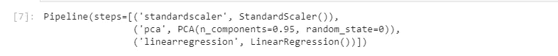

# MLflow:跟踪模型的更好方法

> 原文：<https://towardsdatascience.com/mlflow-a-better-way-to-track-your-models-756fc03254ee?source=collection_archive---------35----------------------->

在一个完美的世界里，你会得到干净的数据，你将输入到一个单一的机器学习模型，瞧，完成了。但幸运的是，现实比完美的世界有趣得多:一个性能良好的 ML 模型只有在一系列试验之后才能准备好。你将不得不尝试不同的算法以及一堆超参数、不同的训练数据变量，甚至可能是目标变量的不同变量。

这种复杂的混合和匹配使挑战变得有趣，但也是一个棘手的问题。解决方案？并非如此剧透警报:MLflow 来拯救

***MLflow*** 是一个帮助我们管理机器学习生命周期的平台。它有四个不同的模块:跟踪、项目、模型和注册表。

在本文中，我们将从跟踪模块开始，您可以使用它来跟踪您的不同模型。

本教程源代码推送到 GitHub:

<https://github.com/Deena-Gergis/mlflow_tracking>  

# 3 分钟后开始:

那么，你如何用三个步骤来管理不同的试验呢？

使用“pip install mlflow”或“conda install-c conda-forge Mlflow”在您的系统上安装 ml flow 后，继续执行这三个简单的步骤:

## 1.训练你的模型

我们的玩具模型将是非常简单的逻辑回归，之前有标准缩放和 PCA。我们将尝试 PCA 的方差截止值，看看哪一个是最好的。

## 2.跟踪您的模型:

为你的项目建立一个新的实验。对于每个实验，您可以跟踪多个模型，每个模型称为一次运行。

对于每次运行，您可以跟踪以下内容:

*   ***参数*** :您为您的模型设置了哪些参数？例如，你的树的深度，你的学习率，估计数，等等。对于我们的玩具模型，我们将跟踪 PCA 的截断**方差作为我们的参数。**
*   ***指标*** :你的模型执行的如何？您可以自由选择您选择的任何指标。您还可以跟踪多个指标。对于我们的玩具模型，我们将跟踪 **MSE** 作为我们的度量。
*   ***工件*** :可以是任何可以导出到文件的文件。例如:Pickle 文件用于模型，CSV 文件用于数据，甚至 JPEGs 文件用于绘图。对于我们的玩具模型，我们将把 **sklearn 管道存储为一个 pickle 文件**，并将其作为一个工件进行跟踪

现在，**更改每个新运行的 PCA 方差**，MLflow 将处理其余的。

## 3.检索最佳:

在训练和跟踪您的不同模型之后，是时候看看您有什么，并为进一步的工作检索它们了。只需获得实验的 ID 并查询运行。

请注意，每次运行都被分配了一个唯一的标识符，您可以保存该标识符并在下次运行时使用。我们还可以自动选择 MSE 最小的模型，并将其加载回去。

恭喜你，你现在正式有资格解开跟踪混乱，如果你的模型！

# 那么幕后发生了什么呢？

MLflow 的跟踪机制其实相当简单: **YAML +目录结构。**

你会发现创建了一个名为` [mlruns](https://github.com/Deena-Gergis/mlflow_tracking/tree/master/mlruns) '的新目录，其中包含每个实验的子目录。每个实验还将包含一个带有配置的 [YAML](https://github.com/Deena-Gergis/mlflow_tracking/blob/master/mlruns/1/meta.yaml) 文件和[子目录](https://github.com/Deena-Gergis/mlflow_tracking/tree/master/mlruns/1/41e1628508fc4a2f83651ceceede6d8a)，每个子目录包含一次运行。在运行的子目录中，您将找到另一个 [YAML](https://github.com/Deena-Gergis/mlflow_tracking/blob/master/mlruns/1/77c97ff7b2fe46d9becba4c230dd3193/meta.yaml) 文件，以及其他[子目录](https://github.com/Deena-Gergis/mlflow_tracking/tree/master/mlruns/1/77c97ff7b2fe46d9becba4c230dd3193)，在这些子目录中可以跟踪参数、度量和工件。

## 其他后端:

尽管我们一直使用的本地存储后端的设置和使用非常简单，但它在多用户和功能性方面也是有限的。这就是为什么 MLflow 还为后端提供了多种选择，以防您决定在更大范围内采用该平台。MLflow 还支持[分布式架构](https://www.mlflow.org/docs/latest/tracking.html#scenario-4-mlflow-with-remote-tracking-server-backend-and-artifact-stores)，其中跟踪服务器、后端存储和工件存储驻留在远程主机上。这里是他们奇特的图形用户界面的一个预览图，你也可以得到。

***还有，快乐追踪！***