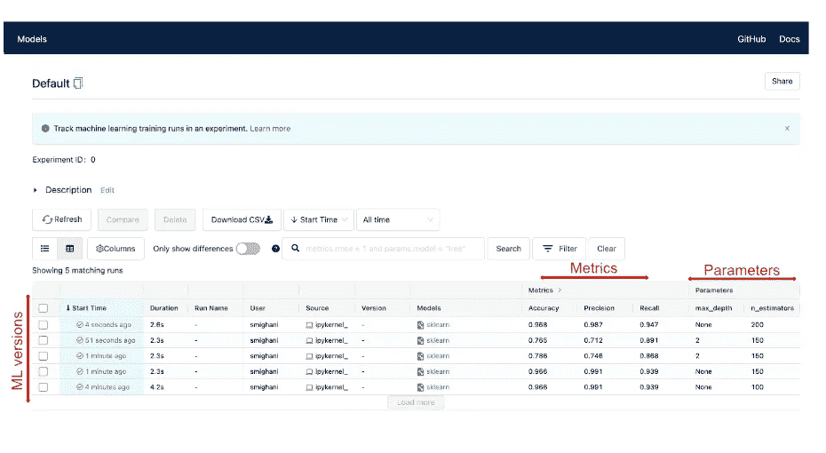
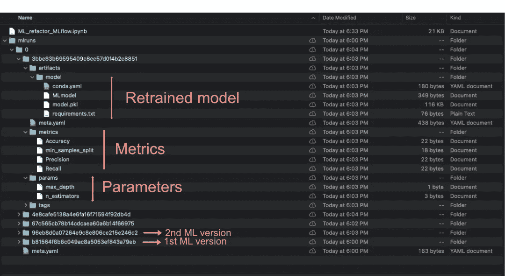

# MLflow:初级读本

> 原文：<https://towardsdatascience.com/mlflow-a-primer-6dfe6be48353?source=collection_archive---------22----------------------->

## 为什么/如何将内部 ML 框架转变为统一的框架

# 一行摘要:

通过遵循这篇博文中的具体步骤，您将能够简单地将您的内部 ML 项目纳入 MLflow 框架。

# 1.MLflow 有什么用？

*   促进 ML 模型版本化，以简化生产中 ML 模型的性能调整和再培训工作。
*   显著增强数据科学/ML 团队跟踪所有 ML 模型库的能力。
*   将整个数据清理、处理、培训和注册生命周期统一到一个统一的框架中。

# 2.介绍

如果你曾经参与过生产级的基于人工智能的项目，你可能在处理 ML 模型和将更新的模型集成回 ML 管道的过程中经历过一定程度的脱节。为所有 ML 模型的不同版本建立一个统一的存储库，并跟踪模型度量的发展，这将是非常好的。此外，如果需要更新模型，只需点击一次即可在存储库中记录和注册新模型，随时可用。

我观察到，第一手的情况是，诸如 GitHub 之类的代码版本控制工具的出现如何在团队成员之间的代码开发过程中革新了协作的质量。MLflow 通过在一个地方维护 ML 模型的版本以及分数和调整参数，对机器学习模型做同样的事情。

在这篇博文中，我将展示如何将任何 ML 代码基础转换成 MLflow 框架的步骤。图 1 显示了这个案例研究的 MLflow UI。从图 1 中可以看出，这里显示了模型的版本以及调优参数和模型度量。因此，每当团队成员更新模型时，都会添加一个新行，并与指标一起显示。现在，说了这么多，让我们更深入地了解达到这一水平所需的步骤。

图一。ML 模型不同版本的 MLflow UI 视图。在每次再训练中，模型都要经历整个 ML 循环。这个用例将在下一节解释(图片由作者提供)。

# 3.一个测试用例项目的逐步配方

构建 MLflow 框架的一般路线图如下所示:

*   安装 MLflow 软件包。
*   重构 ML 代码库。
*   ML 再培训。
*   通过 MLflow UI 跟踪 ML 版本。

下面，我详细解释每一个步骤。另外，在这里可以看到完整的代码库: [GitHub](https://github.com/saiedmighani/mlflow_primer)

## **3.a 安装 MLflow 包**

MLflow 是一个独立的包，受到许多云平台的支持，包括 Spark、GCP、Azure 等。它也可以在内部安装和使用。要安装该软件包，只需在您的终端(以及您的活动虚拟环境，如果您正在使用的话)中运行以下命令:

## **3.b 重构 ML 代码库**

为了这篇博文的目的，我选择了我之前的一个分类器模型，它已经在另一篇博文([链接](/global-warming-and-the-narrative-around-it-lessons-learned-from-nlp-exploration-of-reddit-posts-fb2918d500e9))中描述过了。总之，该模型使用自然语言处理(NLP)将 subreddit 帖子分类为二进制主题类。要深入阅读，我建议你参考上面的博文。

这个模型的一个特别有趣的方面是数据集(即 reddit 帖子)是实时更新的。这意味着随着数据集的发展，由于数据漂移等原因，模型可能需要更新。许多生产 ML 模型苦于从过时的数据集进行推断，因此往往表现不佳。

要使用 MLflow，最关键的一步是重构你的 ML 代码库。我准备了一个通用 ML 代码库的模板，以及如何将它包装成一个单独的模块，如下图和代码片段 1 所示:

1.  导入数据。
2.  清理数据集。
3.  转换特征。
4.  ML 构建和评分。
5.  在 MLflow 上注册模型、参数和指标。

代码片段 1。使用 MLflow 的通用代码结构。

在每一次再训练运行期间，都会为 ML 模型的新版本生成一个路径，其中包含了您的模型的度量、参数和 pickled 版本(当然这是一个简化的版本，您可以参考 MLflow 文档来了解更多的复杂情况)。

图二。在每次 MLflow 运行期间重新训练的模型的生成特征。这些特性在 MLflow UI 上的可视化过程中使用(见图 1)。

## **3.c ML 再培训**

为了重新训练和注册您的模型，如果您已经适当地重构了您的 ML 生命周期(参见上面的代码片段 1)，所需要做的只是简单地重新运行最终的函数。在每次重新训练运行期间，都会创建一个新文件夹，其结构如图 2 所示。

## **3d 通过 MLflow UI 跟踪 ML 版本**

要激活 mlflow ui，请在当前文件夹中的“终端”中运行以下命令(或者您可以在笔记本中将其作为神奇命令运行):

并通过以下路径访问浏览器中的用户界面(或根据您的端口号而有所不同):

您将在类似于图 1 的 UI 中看到所有的 ML 版本。好了，你的模型已经在 MLflow 上注册了！

# 4.建议

*   如果你已经非常熟悉 ML 模型训练的步骤，MLflow 有一个非常浅的学习曲线(对于轻量级的使用)。
*   MLFlow 目前集成并兼容多个云平台，包括 Spark、GCP、Azure 等。因此，这将是一个很好的候选杠杆 ML 项目在生产，在规模。

快乐学习！

感谢你阅读我的博文。对更多阅读感兴趣？请查看我的 [LinkedIn](https://www.linkedin.com/in/saiedmighani/) 和 [GitHub](https://github.com/saiedmighani) 简介。