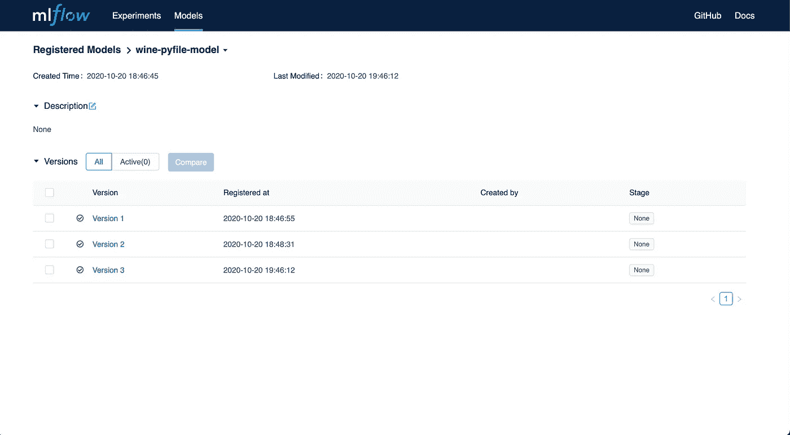
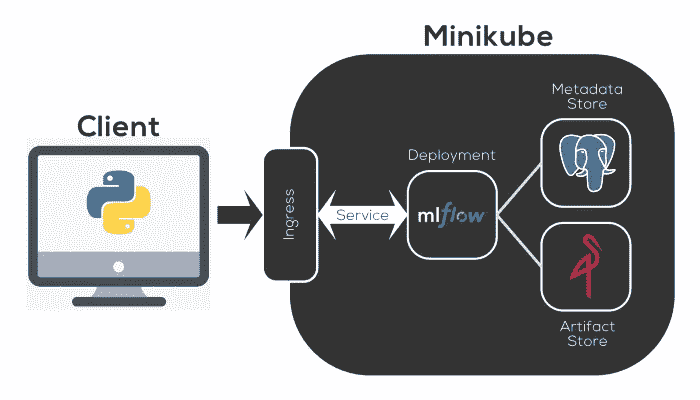
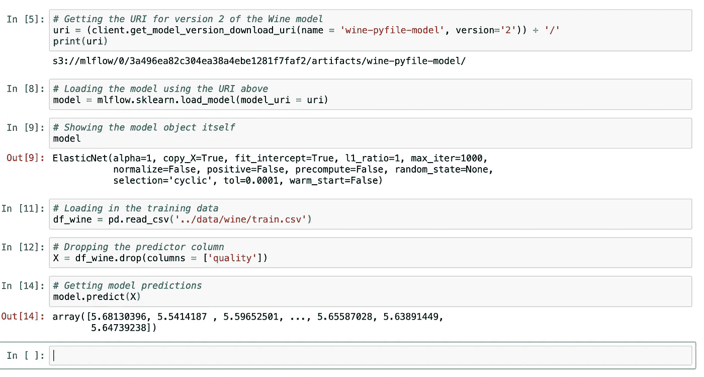

# MLflow 第 4 部分:与服务器客户端交互！

> 原文：<https://towardsdatascience.com/mlflow-part-4-interacting-with-the-server-client-20ec7747e5e4?source=collection_archive---------25----------------------->


## MLflow101

## 使用 MLflow 服务器客户端以编程方式与 MLflow 中的内容进行交互

大家好！好久不见，对吧？我在这个系列中的上一篇文章是在 2020 年 10 月发表的，巧合的是，这是一大堆新视频游戏推出的时间。因为我是在空闲时间写这些帖子的，我显然是在用我的空闲时间做其他事情。😂

这将是我们 MLflow 101 系列的第四篇，也可能是最后一篇。这是一个伟大的旅程，但所有美好的事情都要结束。如果你想了解以前的帖子，请点击以下链接查看:

*   [第 1 部分:MLflow 入门！](/mlflow-part-1-getting-started-with-mlflow-8b45bfbbb334)
*   [第 2 部分:将跟踪服务器部署到 Minikube！](/mlflow-part-2-deploying-a-tracking-server-to-minikube-a2d6671e6455)
*   [第 3 部分:将模型记录到跟踪服务器](/mlflow-part-3-logging-models-to-a-tracking-server-54b6aa3cd00f)

如果你想跟随这篇文章中的代码，你可以在[我的个人 GitHub 这里](https://github.com/dkhundley/ds-quick-tips/blob/master/011_mlflow_interacting_with_client/MLflow_client_interaction.ipynb)找到它。

简要回顾一下上一篇文章，我们最终将第一个模型登录到部署在 Kubernetes (Minikube)上的 MLflow 跟踪服务器中。我有意将模型记录为三个不同的版本，如果您在 MLflow 服务器界面中打开它们，您可能会记得看到以下内容:



作者捕获的 MLflow 屏幕截图

作为另一个快速复习，下图显示了我们如何部署该服务器的架构。简而言之，我们有一个 Postgres 实例来存放关于模型的元数据，我们有一个 Minio 服务器来存放 AWS S3 式接口中的模型工件。记住，Minio 是有意模仿 S3 的。这将是很重要的，在文章的后面要记住。



MLflow 架构图形；由作者创建

好了，现在让我们开始一些新的东西吧！虽然与 MLflow UI 的交互很棒，但为了一致性，如果我们能够以编程方式与服务器客户端进行交互，那就更好了。使用 Python 跟踪客户端，您可以做很多很酷的事情，并且您可以通过 MLflow 的文档了解所有关于它们的内容[。在这篇文章中，我们将只讨论几件事。](https://www.mlflow.org/docs/latest/python_api/mlflow.tracking.html)

首先，我们需要连接到客户端本身。为此，您需要回忆一下在本系列的第 2 部分中我们为跟踪服务器创建的 URI。在我的例子中，我的客户端的 URI 是`[http://mlflow-server.local](http://mlflow-server.local.).`用 Python 实例化 MLflow 客户端实际上非常简单。语法看起来是这样的:

```
# Importing our required libraries
import mlflow
import mlflow.sklearn
import pandas as pd
import os# Setting the MLflow client
client = mlflow.tracking.MlflowClient(tracking_uri = '[http://mlflow-server.local'](http://mlflow-server.local'))
```

在继续之前，我们必须对一些环境变量做另外一件特殊的事情，因为我们使用的是 Minio 工件存储。因为 Minio 模拟 AWS 和 S3，如果我们合法地使用 AWS，它将寻找与 AWS 相同的环境变量。您可以从命令行导出这些环境变量，或者如果您想在 Python 代码中直接导出，您所要做的就是:

```
# Setting the requried environment variables
os.environ['MLFLOW_S3_ENDPOINT_URL'] = '[http://mlflow-minio.local/'](http://mlflow-minio.local/')
os.environ['AWS_ACCESS_KEY_ID'] = 'minio'
os.environ['AWS_SECRET_ACCESS_KEY'] = 'minio123'
```

客户端实例化:检查！环境变量:检查！我们准备好了，伙计们！让我们从一些简单的东西开始。说实话，我不知道您希望在什么真实情况下执行下面的命令，但是知道它们在那里是很好的。第一个是迄今为止我们已经创建的所有模型实验的一个非常简单的列表，第二个显示了一个给定名称的特定模型的所有版本。下面是语法，下面显示了该语法的输出:

```
# Listing the MLflow experiments
client.list_experiments()# Getting the model versions for the wine-pyfile-model
results = client.search_model_versions("name='wine-pyfile-model'")for res in results:
    print(f'name={res.name}; version={res.version}')
```


作者捕获的屏幕截图

对于`client.list_experiments()`函数，您可以看到我们有一个实验和关于该实验的其他细节，包括工件在“S3”(又名 Minio)中的存储位置。在下一个函数中，我们使用“wine-pyfile-model”名称进行搜索(正如我们在第 3 部分中完成的那样)，它显示我在 MLflow 中有该模型的三个不同版本。

“好吧，”你可能会想，“我们什么时候去做一些真正有用的事情？”下面是我认为 MLflow 的客户端交互最有潜力的地方:模型部署。现在，对于那些熟悉 MLflow 的人来说，您会认识到这不是使用 MLflow 部署模型的推荐方式。MLflow 实际上有[另一个推荐的部署模型的方法](https://www.mlflow.org/docs/latest/models.html)，但是说实话……我对此不感兴趣。在我看来，我觉得太死板了。它遵循一种非常精确的语法和打包方式，我只是发现它太麻烦了，没有用。

与 MLflow 鼓励他们的方式不同，我将使用我们一直在使用的同一个 MLflow 客户端向您展示我的首选路线。在这个模式中，我们可以使用 MLflow 客户端在“S3”(Minio)中找到模型工件的精确位置，并直接加载模型以在 Python 文件中使用。在本例中，我将获取模型的版本 2，只是为了说明我们可以获取我们喜欢的任何版本。下面是使用客户端查找和加载模型的语法:

```
# Getting the URI for version 2 of the Wine model
uri = (client.get_model_version_download_uri(name = 'wine-pyfile-model', version='2')) + '/'
print(uri)# Loading the model using the URI above
model = mlflow.sklearn.load_model(model_uri = uri)
```

就是这样！现在，您已经将您的模型加载到内存中，从现在开始，您可以使用它进行推理。我不打算在这篇文章中展示它，但我已经成功地为 Kubernetes 部署了一个 Flask API，它直接从 MLflow 预先加载模型，并为所有传入的推理请求将它保存在内存中。

作为向您证明这一点的简单方法，我将根据我们最初训练该模型的相同训练数据来运行该模型。在下面的屏幕截图中，您可以看到我已经加载了数据集，删除了预测值，并在模型中运行了剩余的列。它像做梦一样产生推理输出！



作者截图

从理论上讲，如果您有所有适当的安全和网络措施，这意味着您可以有效地将您的模型部署到任何平台。例如，如果我在 Kubernetes 本地训练我的所有模型，并希望在 AWS、GCP 或 Azure 中使用它们，我需要做的就是调用 Kubernetes 并动态加载该模型。再见，供应商锁定！

这就是 MLflow 系列的全部内容！再次道歉，这篇文章被超级延迟。我希望你在这个系列中发现了很多价值，我自己也通过写这些帖子学到了很多。我还没有决定我的下一个系列的帖子会是什么，所以如果你想看到一些内容，请联系我并提出你的意见。再次感谢阅读！