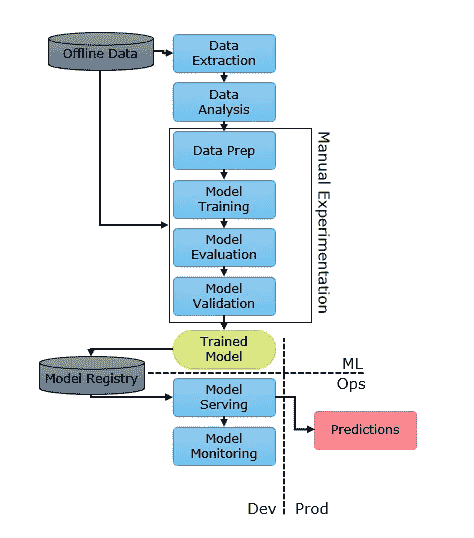
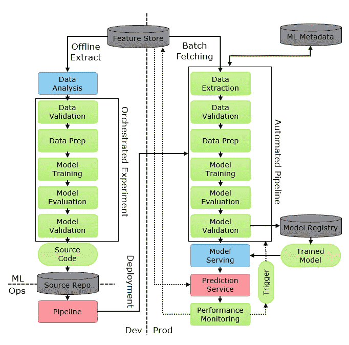
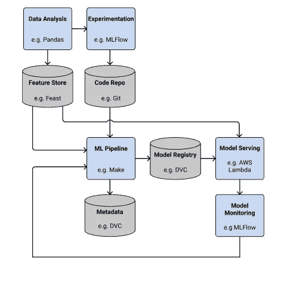

# 在家创建一个现代的、开源的 MLOps 堆栈

> 原文：<https://towardsdatascience.com/mlops-at-home-part1-4c60db29d4a2?source=collection_archive---------7----------------------->

## 第 1 部分:开发框架

[疾控中心](https://unsplash.com/@cdc?utm_source=medium&utm_medium=referral)在 [Unsplash](https://unsplash.com?utm_source=medium&utm_medium=referral) 拍摄的照片

# 介绍

过去几年，许多组织发现，尽管他们培养了优秀的模型，但并不总能从中获得长期价值。这样做的原因是部署和监控。

部署模型并不总是那么容易。有时它们很大。推理需要多长时间？你可能需要一个图形处理器。要不要批量预测？

监控是关键。如果我们对一个模特进行与时尚相关的训练，由于快速变化的趋势，它可能在几个月内无效。

MLOps 是这个问题的解决方案，但是它还涵盖了更多内容。

# 目录

*   [定义 MLOps](#39a2)
*   [为什么要为你的副业项目提供 MLOps？](#f50f)
*   [工具框架](#63d6)
*   [一些工具探索](#03e0)

# 定义 MLOps

[NVIDIA](https://blogs.nvidia.com/blog/2020/09/03/what-is-mlops/) 将 **MLOps** 定义为…

> 企业成功运行人工智能的一套最佳实践。

ml-ops.org 建议…

> MLOps 旨在统一机器学习和软件应用发布的发布周期。

[谷歌](https://cloud.google.com/architecture/mlops-continuous-delivery-and-automation-pipelines-in-machine-learning)给出了这个定义……

> MLOps 是一种 ML 工程文化和实践，旨在统一 ML 系统开发(Dev)和 ML 系统运营(Ops)。
> 
> 实践 MLOps 意味着您倡导 ML 系统构建的所有步骤的自动化和监控，包括集成、测试、发布、部署和基础设施管理。

因此 **MLOps** 是某种文化、**框架**或一套规则，允许我们更有效地执行和**实现**机器学习。它包括 DevOps 的许多功能，如**自动化**和**测试**，但通过改进**部署**和**模型监控**，它专注于机器学习和数据科学。

# 为什么你的副业要有 MLOps？

我相信您可以看到拥有数兆字节数据和大量数据科学家的大公司的好处，但在家从事小项目的普通数据科学家又如何呢？

我想说有几个好处...

*   相当一部分数据科学职位专注于**部署**，雇主通常希望在你的简历中看到部署经验。
*   通过**自动化**，它让你的生活变得更加轻松，并有助于从你的工作中创造更多面向外部的产出。
*   这使得你的工作**可扩展**意味着如果你的副业变成人们使用的东西，你可以很容易地扩大规模。
*   最后，它将你的项目提升到了其他项目中很少见到的水平。我从未见过有自动化再培训管道的副业项目！

# 开发工具框架

Google 有一个优秀的 MLOps 框架。他们定义了 3 个级别。让我们探索一下**0 级**并将其与**1 级**进行比较，然后看看我们如何将其与**工具**联系起来。

## 0 级:自动化程度低

0 级 MLOps。图片作者。

*   0 级看起来非常像投资组合或 Kaggle 项目。
*   数据存储几乎没有自动化，选项也很有限。
*   如果我们想重新训练我们的模型，我们必须再次重复所有这些步骤。这使得处理模型漂移变得困难。
*   如果我们想用不同的数据或笔记本重复这个过程，我们必须复制代码或修改笔记本。
*   在创建模型时，我们需要额外的工具来跟踪我们的实验。

## 级别 1:高度自动化

高度自动化。图片作者。

让我们从左到右消化这个。

*   这里的第一个新项目是一个**功能商店**。这是一个专门针对 ML 特性的数据库。我们在训练模型时会进行各种操作，如缩放、特征工程、编码和数学变换。这些特征中的许多对于典型分析是没有用的，因此特征库允许我们存储这些特征并更容易地访问它们。
*   在左边，我们有**精心安排的**实验。这是自动化数据科学工作流程中许多操作的概念。
*   左下角的红色方块是一个**管道**的创建。这是另一个自动化。当我们作为管道部署时，我们部署的是模型和从模型生成预测所需的转换。
*   许多验证步骤也可以自动化。
*   我们还允许**通过收集新数据并将其存储在特征库中来持续监控和重新训练**。

因此，这是一个伟大的**流程图**的 MLOps **过程。**但是明面上呢？

在企业中，有许多人、移动的部件和快速变化的工具。因此，行业级 MLOps 应该是工具不可知的。然而，在国内，我们可以使用的工具受到成本和规模的限制，我们正在创建一个个性化的流程。我认为家中的 MLOps 不应该是工具不可知的。

> MLOps 的一个关键规则是它应该是**工具不可知的**。我们可以在家里变通一下这条规则。

要从 0 级提升到 1 级，我们需要实施一些新技术。

## 选择我们的工具

下面的图表改编自[MLOps.org](https://ml-ops.org/content/state-of-mlops)&[瓦罗海](https://valohai.com/blog/the-mlops-stack/)是一个很好的方法来帮助我们找到我们可以使用的工具。

为 MLOps 选择工具。图片作者。

您可以使用此图表中的标题对您找到的工具进行分类。我包含了一些可能适合每个 h 下的示例工具

# 一些可以探索的工具

这篇 reddit 帖子启发了我写这篇文章，我建议去看看。以下是我计划在未来一年左右研究的工具列表。

*   **项目脚手架:** [CookieCutter](https://cookiecutter.readthedocs.io/en/1.7.2/) ， [Kedro](https://kedro.readthedocs.io/en/stable/)
*   **文献** : [狮身人面像](https://www.sphinx-doc.org/en/master/index.html)
*   **CI 与部署:** [詹金斯](https://www.jenkins.io/)、 [Docker](https://www.docker.com/) 、Gitlab
*   **数据建模:**DBT
*   **数据探索和准备:**熊猫(大的话 Pyspark)
*   **测试** : [远大前程](https://greatexpectations.io/)， [Pytest](https://docs.pytest.org/en/6.2.x/)
*   **特色店:** [DVC](https://dvc.org/doc) ，[盛宴](https://pypi.org/project/feast/)
*   **工作流引擎或协调器:** [路易吉](https://github.com/spotify/luigi)，[提督](https://www.prefect.io/)，[气流](http://airflow.apache.org/)
*   **模型注册表:** [MLFlow](https://www.mlflow.org/docs/latest/index.html) (使用 Kedro-MLFlow 或 [PipelineX](https://pipelinex.readthedocs.io/en/latest/) )
*   **模特上菜:**[FastAPI](https://fastapi.tiangolo.com/)[BentoML](https://github.com/bentoml/BentoML)[皮质](https://www.cortex.dev/)
*   **模型监控:** [詹金斯管道](https://www.jenkins.io/doc/book/pipeline/)， [MLFlow](https://www.mlflow.org/docs/latest/index.html)

一些工具在一个包中提供了许多这些特性

*   **端到端解决方案:** [Hopsworks](https://hopsworks.readthedocs.io/en/stable/) ， [ClearML](https://allegro.ai/clearml/docs/)

这里肯定有一些地方遗漏了——这将需要一些计算能力，我不认为这是免费的。除了特征存储之外，还需要有存储数据的地方。这可能缺乏可伸缩性，因为我不确定这将如何在多个集群上工作。

# 结论

在这篇文章中，我们着眼于开发一个 MLOps 框架。最棒的是，当我们找到合适的工具时，我们可以将工具插入到这个框架中。它也确实有助于评估新工具，因为我们可以了解它们如何适应我们的框架和任何现有的工具。

在接下来的几个月里，我计划将此付诸实践。我将试用工具，将它们连接在一起，并尝试在我的家庭工作站上获得一个真正的 MLOps 环境。如果您使用过本文中提到的任何工具，请留下您的评论！

## 了解更多信息

 [## 启动您的数据科学职业生涯的 5 个项目创意

### 成功项目的框架。

towardsdatascience.com](/5-project-ideas-91da0da17b31)  [## 面向数据科学家的高级 SQL

### 掌握 SQL 以节省时间和炫耀

medium.com](https://medium.com/analytics-vidhya/advanced-sql-for-data-scientists-8e99a3c7f24c) 

## 联系我

 [## 亚当·沙菲-数据科学家-凯捷| LinkedIn

### 拥有 4 年以上分析经验的数据科学家，包括管理团队、交付项目和转变…

www.linkedin.com](https://www.linkedin.com/in/adamshafi/)