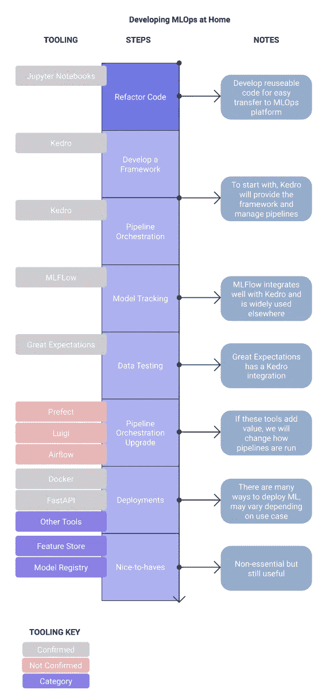

# 想在家里实现 MLOps？重构您的代码

> 原文：<https://towardsdatascience.com/mlops-at-home-part2-3c4282df7714?source=collection_archive---------20----------------------->

## 首先让您的代码可重用，然后看看工具


凯利·西克玛在 [Unsplash](https://unsplash.com?utm_source=medium&utm_medium=referral) 上的照片

# 介绍

MLOps 是目前机器学习和数据科学中最受**欢迎的**流行语之一，但也是在线课程、YouTube 视频和训练营最少涉及的领域之一。

**你可以在这里阅读我是如何定义 MLOps 的:**

</mlops-at-home-part1-4c60db29d4a2> [## 在家创建一个现代的、开源的 MLOps 堆栈

towardsdatascience.com](/mlops-at-home-part1-4c60db29d4a2) 

自从写了上面的文章，我一直带着以下问题研究 MLOps

> 我如何在家里开发和学习 MLOps，而不用昂贵的软件，以一种转移到现实世界问题的方式？

我的解决方案是开发**笔记本 MLOPs** 的思路；从 Jupyter 笔记本电脑无缝过渡到可重复、有效的 MLOps 渠道。

**第一步是重构或改变你的代码。**

> 为了开发 MLOps 实践，您的代码应该是干净的和可重用的；使用有限硬编码的函数。

**那么我们要怎么做呢？下面的流程图总结了这些步骤；第一步是重构您的代码，这将是本文的重点，以后的文章将依次处理每个阶段。我们正准备将代码加载到 [Kedro](https://kedro.readthedocs.io/en/stable/index.html) 上，我已经测试了它，发现它是进入 MLOps 的一个很好的网关工具。**



MLOps 家居流程图之旅。图片作者。

# 目录

*   [动机](#2b55)
*   [第一步:数据](#6f4e)
*   [第二步:清理](#297a)
*   [步骤 3:参数字典](#9a99)
*   [不变代码](#96d3)
*   [第四步:函数脚本](#d13c)
*   [运行代码](#d3d8)
*   [第五步:建模](#4a99)
*   [结论](#1843)

# 为什么我们需要重构我们的代码？

MLOps 的一个关键优势是**可重复性**和**自动化**，然而我们在机器学习的实验阶段编写的大多数代码都是不可重复的。我们通常在 Jupyter 笔记本的单元格中编写代码，一个接一个地运行，每次按下 *shift + enter* 。

为了开发一个管道，我们需要使我们的代码更加可重复，这意味着**将我们的预处理和建模阶段重写为 Python 函数。**

# 第一步:从一个“普通”的笔记本开始

我用的是 Kaggle 的[这个笔记本，它用的是](https://www.kaggle.com/serigne/stacked-regressions-top-4-on-leaderboard)[这个房价数据集](https://www.kaggle.com/c/house-prices-advanced-regression-techniques)。这是 Kaggle 上最受欢迎的笔记本之一，理由很充分。它使用了一些非常有趣的整体建模技术，如果你以前没看过，绝对值得一读。

[我也上传了这篇文章到我的 Github repo。](https://github.com/AdamShafi92/mlops-at-home/tree/main/1-refactoring_code)

从 MLOps 的角度来看，这是不合适的。一些清理与 EDA 混合在一起，可重用的功能非常少。当然，这是有意义的，因为这样做的目的是为了在 Kaggle 竞争中取得好成绩，而不是为了持续更新的生产部署。

然而，因为我们有一些真正可靠的代码，所以复制和粘贴代码以获得更清晰的东西是很简单的。

# 步骤 2:清理

我已经创建了这个笔记本的简化版，它被清晰地分成了几个部分，减少了 ed a 并简化了一些代码。在最初的 Kaggle 笔记本中，清洁阶段分布在整个笔记本中，有时中间还有图表。因为我们是从别人那里拿笔记本，所以对我们来说很好地理解它在做什么是很重要的，给它一个结构有助于做到这一点。

**您可以在这里查看笔记本:**

<https://github.com/AdamShafi92/mlops-at-home/blob/main/1-refactoring_code/2%20Simplified.ipynb>  

这款笔记本的核心元素是:

1.  **加载数据**
2.  **测试**:通过检查前几行并查看一些统计和分布来检查数据
3.  **EDA:** 了解数据的统计属性，并查看要清理的区域
4.  **预处理**:去除异常值、修正偏差、填充缺失值和编码分类变量
5.  **测试**:确保预处理工作正常。
6.  **建模**:训练几个模型，查看度量标准，挑选最佳模型

# 步骤 3:创建参数字典

MLOps 的另一个关键领域是**跟踪**。很容易训练一个模型并调整超参数，然后忘记哪个版本的模型表现最好。**我们可以(也愿意)实现工具来帮助这个**，但是在这个早期阶段，从字典中调用来访问我们的参数是一个很好的想法。参数字典还有助于我们减少硬编码，因为我们可以调用字典而不是硬编码一个值。

它应该包含(几乎)**我们做出的每一个会影响模型**的选择，所以如果我们移除任何异常值，它应该包含我们选择的值。删除列也是如此。它不需要不必要的选项。如果您已经缩放了数据，它不需要包括每个不同的缩放器选项。

您可以使用以下代码定义字典

```
parameters = {'outliers' : 4000}
```

然后，您可以通过调用字典来访问该值:

```
parameters['outliers']>>> 4000
```

你也可以嵌套字典

```
parameters = {'outliers' : {'feat1' : 4000
                            'feat2' : 50 }}
```

**要提升一个等级**，请尝试使用*。yml* 文件，可以作为字典加载到 Python 中。一旦我们开始使用 MLOps 工具，我们将不得不这样做。

# 旁注:代码我们保持不变

因为这不是我第一次这样做，我将把一些区域留在原来的笔记本中，这是因为有非常好的工具和解决方案，我将在以后的帖子中实现它们。

1.  **EDA** :探索性数据分析可以根据你正在做的事情而有很大的变化，也有一些软件包可以自动完成这个任务，比如 [pandas profiling](https://github.com/pandas-profiling/pandas-profiling) 。
2.  **测试**:我们将使用[远大前程](https://greatexpectations.io/)来自动化测试。
3.  **建模**:有很多工具，比如 [MLFlow](https://www.mlflow.org/docs/latest/index.html) ，我们需要将它们集成到我们的管道中。

# 步骤 4:将脚本转换成函数

如果你曾经尝试过 Kaggle 数据集，那么拥有一个看起来像上面这样的笔记本是很常见的。为了实现良好的 MLOps 实践，我们需要使用一个**可重用的**管道**来清理我们的数据。要做到这一点，我们需要将代码转换成函数。**

每个功能应该相当小，我们将使用[单一责任原则](https://en.wikipedia.org/wiki/Single-responsibility_principle)，因此每个功能只有一项工作。

> 单一责任原则是一项计算机编程原则，它规定计算机程序中的每个模块、类或函数都应对该程序功能的单一部分负责，并应封装该部分
> 
> —维基百科

这个笔记本在这里:

<https://github.com/AdamShafi92/mlops-at-home/blob/main/1-refactoring_code/3%20Refactored.ipynb>  

对于这个 MLOps 实现，我建议在函数中包含任何可能影响模型的关键字参数，这样我们就可以很容易地更改它们。我们还将使用一个参数字典来提供这些关键字参数。我在下面举了一个例子。

**原码**

```
train = train.drop(train[(train['GrLivArea']>4000) & 
                         (train['SalePrice']<300000)]
                   .index)
```

**功能+参数字典**

```
parameters = {'outliers' : {'GrLivArea' : 4000,
                            'SalePrice' : 300000}} def remove_outliers(train, parameters):
    train = train.copy()
    train = train.drop(
        train[
        (train['GrLivArea']>parameters['outliers']['GrLivArea']) & 
        (train['SalePrice']<parameters['outliers']['SalePrice'])]
        .index)
    return train
```

这实际上并不是一个重大的改变，因为列名仍然是硬编码的，所以我们并没有在这里做很大的改进。然而，这个函数现在可以很容易地重用，更重要的是，以后可以在管道中使用。我们将参数字典作为一个参数包含在函数中，以方便以后的工作。

总之，我已经创建了 8 个新的预处理函数。比较 repo 中的笔记本 2 和笔记本 3，比较代码是如何变化的。

<https://github.com/AdamShafi92/mlops-at-home/tree/main/1-refactoring_code>  

# 运行代码

为了实际运行我们的函数，我们需要运行一些代码。一旦我们转移到 MLOps，这些将被我们的工具定义为*管道*和*编排*，但现在我们将在笔记本上运行它们以确保一切正常。要运行代码，我们只需逐个调用每个函数。

要查看每个功能的细节，请查看 Github 上的笔记本 2。

```
train2 = train.copy()
train2 = remove_outliers(train, parameters)y_train = create_target(train2)train2 = drop_cols(train2, parameters)
train2 = fill_na(train2, parameters)
train2 = total_sf(train2)
train2 = to_str(train2, parameters)
train2 = fix_skew(train2, skewness)
train2 = one_hot(train2)
train2 = train2.astype(float)
```

# 第五步:建模

我们没有对这个笔记本的建模部分做太多的改动，因为稍后它会被 **MLFlow** 所取代。一个好的临时选择是在这里也使用参数字典。

这里我刚刚添加了一个功能，这个功能是**训练**和 **pickles** 模型，并输出一些**图表**；残差的直方图、训练数据和预测的散点图以及 QQ 图。

由于这是一个 Kaggle 数据集，我们没有带标签的测试数据。尽管我们使用交叉验证来挑选最佳模型，但为了简单起见，我们使用训练数据来绘制这些图。

```
def fit_model(model, X_train, y_train, filepath, n_folds=5):
    score = rmsle_cv(model, X_train, y_train, n_folds) model = model.fit(X_train,y_train)
    pickle.dump(model, open(filepath, 'wb'))

    print("\nmodel score: {:.4f} ({:.4f})\n".format(
    score.mean(), score.std()))

    y_pred = model.predict(X_train)

    fig,ax = plt.subplots(ncols=3,figsize=(20,4))
    ax[0].hist(x=y_pred-y_train,bins=20)
    ax[1].scatter(x=y_train,y=y_pred)
    ax[1].axline([0, 0], [1, 1])
    sm.qqplot(y_pred, ax=ax[2], fit=True,line="45")
    plt.show()
    return modellasso = make_pipeline(
RobustScaler(), Lasso(alpha=0.0005, random_state=1))lasso_fit = fit_model(lasso,train2,y_train,'lasso.pkl')
```

> 注意:我们必须缩放线性模型的数据，目前最简单的方法是使用 sklearn 的**make _ pipeline***函数，并在这一点上包括缩放器，而不是事先缩放所有数据。*

*就是这样！假设您已经理解了核心概念，那么您现在应该能够将一台以实验为重点的立式笔记本电脑转变为可用于所有重要开发部署阶段的产品。*

# *结论*

*我们已经学习了如何准备在 MLOps 管道中使用的代码。关键是编写**可重用的**函数，而不是一次性使用的、根据命令运行的代码。另一个关键的收获是**参数字典**，这是一个跟踪参数和运行实验的好方法，即使你不打算将你的笔记本开发成 MLOps 流水线。*

*在本系列的下一篇文章中，我们将创建一个 [Kedro](https://kedro.readthedocs.io/en/stable/index.html) 项目，并将我们的笔记本变成节点和管道，Kedro 可以根据命令运行。*

## *了解更多信息*

*</explainable-ai-9a9af94931ff>  

## 将我的内容直接发送到您的收件箱！

<https://adamsh.substack.com/p/coming-soon> *