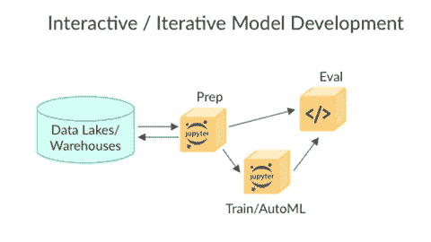
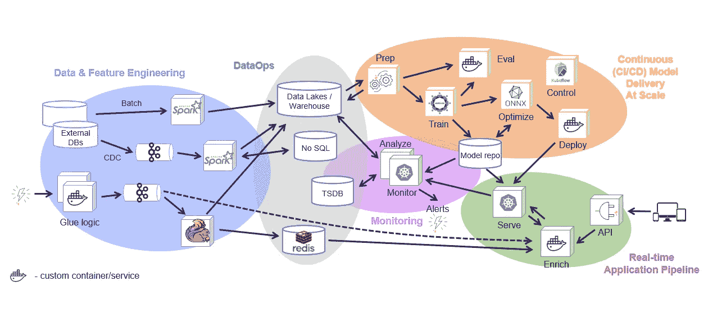
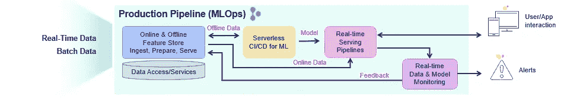

# 培训之外的 MLOps:简化和自动化操作流程

> 原文：<https://towardsdatascience.com/mlops-beyond-training-simplifying-automating-the-operational-pipeline-e028a21a269e?source=collection_archive---------19----------------------->

源 Shutterstock(根据许可)

# “MLOps”含义的演变

你说的“MLOps”是什么意思？随着围绕 ML 的技术生态系统的发展，“MLOps”现在似乎有(至少)两种截然不同的含义:

1.  “MLOps”的一个常见用法是指**训练人工智能模型的周期**:准备数据、评估和训练模型。这种迭代或交互模型通常包括 AutoML 功能，在训练模型范围之外发生的事情不包括在这个定义中。
2.  我对 MLOps 的首选定义是指**整个数据科学流程**，从数据的摄取到在业务环境中运行并在业务层面产生影响的实际应用程序。在本文中，我将解释这两种方法之间的区别，以及为什么它对您的数据科学团队以及整个组织的成功至关重要。

# MLOps 的研究优先方法

拥有数据科学用例和小型团队的组织的典型旅程是从他们认为是逻辑起点的地方开始:构建人工智能模型。选择基于数据科学的商业想法，并为数据科学家分配预算，以开始构建和训练机器或深度学习模型的工作。他们可以访问数据提取，搜索模式，并建立在实验室中工作的模型。

对于这个领域的资深人士来说，观察这个行业的变化是值得注意的。几年前，ML 模型用于为业务分析师生成静态或交互式报告，数据科学被视为一个筒仓，对历史数据进行批量预测，并将结果返回给其他人，以便手动整合到应用程序中。在这些条件下，对弹性、规模、实时访问或持续集成和部署(CI/CD)的需求非常少，但我们从模型中获得的价值也有限。

作为这种旧思维模式的残余，今天大多数数据科学解决方案和平台仍然从研究工作流开始，无法在将生成的模型转化为现实世界的人工智能应用时交付。甚至 CI/CD 管道的概念也经常被用来仅仅指训练循环，而不是扩展到包括整个操作管道。这种方法迫使 ML 团队重新设计整个流程，以适应生产环境和方法。这种重复工作的方式消耗了太多的资源和时间，并且经常导致不准确。

# 研究优先的方法:它是如何工作的，为什么它是不完整的

解决人工智能项目的常见方法是从开发模型开始。数据科学家接收从各种来源手动提取的数据，他或她以交互方式探索和准备数据(此阶段最常用的工具是笔记本)，在跟踪所有结果的同时运行培训和实验，生成模型并进行测试/验证，直到获得满意的结果。有了最终的模型，不同的 ML 或数据工程师团队将弄清楚如何将其构建到业务应用程序中，如何处理 API 集成，构建数据管道，应用监控，等等。在许多情况下，原始数据科学将被搁置一旁，并以适合生产的健壮且可扩展的方式重新实施，但这可能不是数据科学家最初的意图。

图 1:交互式模型开发流程(图片由作者提供)

许多工具在研究和开发阶段提供了版本化数据和跟踪实验或模型的方法，一些工具还允许模型开发管道的自动化，并可以生成服务于模型的端点。然而，它们在模型开发流程之后就停止了，并且它们对从自动化数据收集和准备、自动化培训和评估管道、实时应用程序管道、数据质量和模型监控、反馈循环等开始的生产管道没有多大贡献。

图 2:全面生产部署(图片由作者提供)

正如您从上面的两个图表中所看到的，模型开发阶段和生产环境之间没有太多的重叠。

生产部署:

*   涉及更多需要一起工作和版本控制的组件
*   在数据处理、应用程序集成和监控任务上投入了大量精力
*   交互式开发被可管理的微服务所取代，微服务可以处理规模和自动化(重新)部署
*   侧重于弹性、可观察性、安全性和持续运营。

在数据科学筒仓中开发模型的常见方法导致了宝贵资源的浪费和更长的生产时间。

# 训练结束了！现在怎么办？

人工智能模型提供实时建议、防止欺诈、预测故障和指导自动驾驶汽车的现代应用带来了更大的价值，但也需要大量的工程努力和新方法来实现这一切。业务需求迫使数据科学组件变得健壮、高性能、高度可扩展，并与敏捷软件和开发运维实践保持一致。每花一个小时开发一个模型，就会有十几个小时花在工程和部署上。

通常，更广泛的团队只有在实验室中建立了模型后，才意识到他们面前的操作化人工智能的挑战。在这个后期阶段，构建实际的 AI 应用程序，部署它，并在生产中维护它变得非常痛苦，有时甚至不可行。然后意识到创建一个可重复和可再现的过程，以便更多的人工智能应用程序可以在持续的基础上构建和部署，这是一个完全不同的游戏。

# 采用生产第一的思维模式

在考虑所有业务需求的意义上，操作化机器学习经常发生，例如联合数据源、规模需求、实时数据摄取或转换/在线功能工程的关键影响、处理升级、监控等。—这是一种事后想法，使得用人工智能创造真正的商业价值变得更加困难。

这就是为什么我提倡心态转变。**从最终目标开始**:也就是说，采用生产第一的方法来设计一个连续的运营管道，然后确保各种组件和实践都映射到其中。使尽可能多的组件自动化，并使流程可重复，以便您可以根据组织的需求进行扩展。

# 生产优先的 MLOps 方法及其优势

取代这种孤立、复杂和手动的过程，从使用模块化策略设计生产管道开始，其中不同的部分提供了从研发到可扩展生产管道的连续、自动化和简单得多的方式，而不需要重构代码、添加粘合逻辑以及在数据和 ML 工程上花费大量精力。

每条生产管道都应考虑四个关键组成部分:

1.  **特征存储**:收集、准备、编目和提供数据特征，以供开发(离线)和实时(在线)使用
2.  **ML CI/CD 管道**:使用生产数据(由特性库生成)的快照和来自源代码控制(Git)的代码，自动训练、测试、优化、部署或更新模型
3.  **实时/事件驱动的应用程序管道**:包括 API 处理、数据准备/丰富、模型服务、集成、驱动和测量动作等。
4.  **实时数据和模型监控**:监控数据、模型和生产组件，并为探索生产数据、识别偏差、异常或数据质量问题警报、触发再培训工作、衡量业务影响等提供反馈回路。

图 3:生产 ML 管道的集成方法(图片由作者提供)

虽然这些步骤中的每一步都可能是独立的，但它们仍然需要紧密集成。

例如:

*   培训作业需要从要素存储中获取要素，并使用元数据更新要素存储，这些元数据将在服务或监控中使用。
*   实时管道需要用存储在特征存储中的特征来丰富传入事件，并且可以使用特征元数据(策略、统计、模式等)。)估算缺失数据或验证数据质量。
*   监控层必须从实时管道收集实时输入和输出，并将其与来自特征存储的特征数据/元数据或由训练层生成的模型元数据进行比较，并且它需要将所有新的生产数据写回特征存储，以便它可以用于各种任务，例如数据分析、模型重新训练(对新数据)、模型改进。

# MLOps 自动化和流程编排

当我们更新上面详述的一个组件时，它会立即影响特征生成、模型服务管道和监控，因此我们需要对每个组件应用版本控制，以及跨组件的版本控制和滚动升级。

因为这四个组件紧密相连，所以不能在孤岛中管理它们。这就是 MLOps 编排的用武之地。ML 团队需要一种使用相同的工具、实践、API、元数据和版本控制的协作方式。这种协作可以在定制的平台上进行，该平台由必须粘合在一起并由大型内部团队维护的单个组件构建，或者使用现成的自动化解决方案，如 [Iguazio MLOps 平台](https://www.iguazio.com/)或开源 MLOps 编排框架 [MLRun](https://mlrun.org/) 。

# MLOps 应该提供真正的商业价值！

您的数据科学团队是否为您的组织防止了欺诈，减少了欺诈性交易，从而为您的组织节省了成本，为新客户提供了信用额度，并减少了法律纠纷？

您的组织是否能够预测哪些机器即将发生故障，并主动缓解问题以节省维修损坏机器或购买新机器的成本？

您的客户成功团队是否能够预测客户流失并产生留住客户所需的确切收益，从而直接影响您组织的底线？

如果这些问题的答案是否定的，并且软件/基础架构效率低下阻碍了您的组织看到您的数据科学团队可以提供的真正价值，那么现在是时候寻找使数据科学流程自动化、协调、加速和可重现的解决方案了。凭借坚实的 MLOps 基础，您将能够快速、持续地为企业提供新的人工智能服务，甚至是大规模和实时的。您将使您的数据科学、数据工程和 DevOps 团队能够更加高效地协作。最重要的是，整个组织将能够从您团队的创新解决方案中受益，并看到它们直接影响组织的目标和底线。