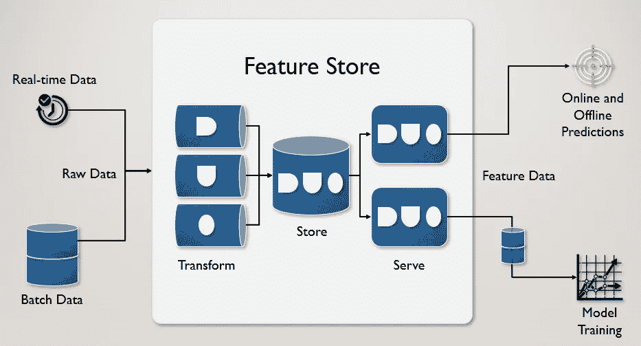
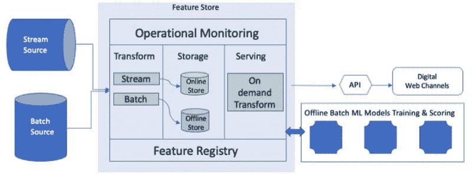
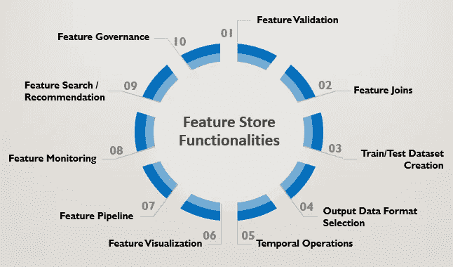
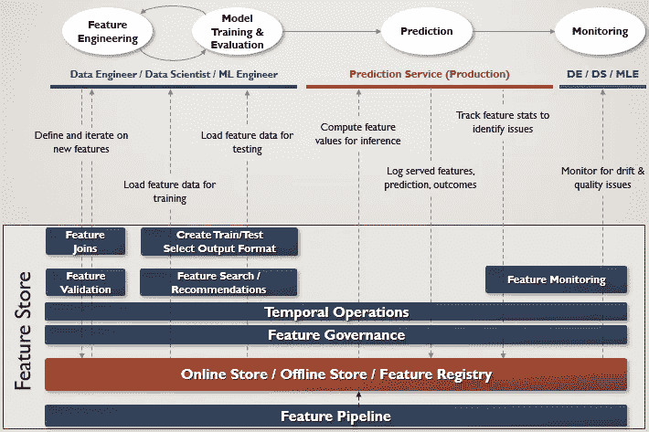

# MLOps:建立一个功能商店？以下是需要记住的几件事

> 原文：<https://towardsdatascience.com/mlops-building-a-feature-store-here-are-the-top-things-to-keep-in-mind-d0f68d9794c6?source=collection_archive---------2----------------------->

## [行业笔记](https://towardsdatascience.com/tagged/notes-from-industry)

## 一个功能商店应该有 3 个主要构件，并提供 10 个主要功能。这使得要素库能够改进原始数据的处理和编目方式，从而加快数据科学家的周转时间。

由[普罗诺吉特·萨哈](https://www.linkedin.com/in/pronojitsaha/) & [阿纳·博斯博士](https://www.linkedin.com/in/arnab-bose-phd-6369531/)

图 1:特征存储数据流(作者图片)

在我们关于特性商店的第一篇文章[中，我们定义了它是什么，为什么需要它，以及它如何填补 MLOps 生命周期中的一个重要空白。从上图中可以看出，特征存储有三层，转换(接收&过程数据并创建特征)、存储(存储创建的特征&的元数据)和服务(使存储的特征可用)。在本文中，我们将了解商店层应该具备哪些主要组件。我们还将了解在构建功能商店或评估供应商提供的任何现有功能商店时应该记住的主要功能。在下一篇文章中，我们将探讨如何使用各种技术来实现这三个层和功能。订阅](https://bit.ly/mlops-feature-stores)[此处的](https://pronojit.medium.com/about)以获得相同的通知。

# 功能存储:主要组件

功能商店的商店层应该具有的三个主要组件是:

1.  一个**离线特征库**，用于提供大批量特征，以(1)创建训练/测试数据集，以及(2)将特征用于训练作业和/或批量应用评分/推理作业。这些要求通常在超过一分钟的延迟时得到满足。离线商店通常实现为分布式文件系统(ADLS、S3 等)或数据仓库(红移、雪花、大查询、Azure Synapse 等)。例如，在优步的米开朗基罗调色板功能商店中，它从 lambda architecture 获得灵感，使用 HDFS 的 HIVE 实现。
2.  一个**在线特征存储库**，用于提供单行特征(一个*特征向量*)作为个体预测在线模型的输入特征。这些要求通常以几秒或几毫秒的延迟来满足。在线商店理想地实现为键值存储(例如 Redis、Mongo、Hbase、Cassandra 等)。)用于快速查找，具体取决于等待时间要求。
3.  一个**特征注册表**，用于存储所有具有血统的特征的元数据，供两个离线&在线特征存储使用。它基本上是一个实用程序，帮助了解商店中所有可用的功能以及它们是如何生成的信息。此外，用于下游应用/模型的一些特征搜索/推荐能力可以被实现为特征注册表的一部分，以使得能够容易地发现特征。

图 2:特征库框架(图片来自 ML 的特征库，2021)

# FeatureOps:功能库的主要功能

在我们的[上一篇文章](https://bit.ly/mlops-feature-stores)中，我们将特性操作确定为当前 MLOps 生命周期中的缺口。FeatureOps 的缺失导致数据科学家一次又一次地重复创建相同的功能，从而大大增加了上市时间。FeatureOps 使数据科学家能够使用功能库执行下面列出的功能，从而缩短他们的开发时间，并促进团队协作。现在让我们来看看这些功能。

图 3:特征存储功能(作者图片)

## 1.特征数据验证

功能存储应该支持定义用于检查数据完整性的数据验证规则。这些包括但不限于，检查值是否在有效范围内，检查值是否唯一/不为空，以及检查描述性统计数据是否在定义的范围内。可以集成到功能商店中的验证工具的示例有[远大前程](https://medium.com/analytics-vidhya/data-quality-assurance-with-great-expectations-and-kubeflow-pipelines-d83449fbaa81)(任何环境) [TFX 数据验证](https://www.tensorflow.org/tfx/data_validation/get_started)(深度学习环境) [Deequi](https://github.com/awslabs/deequ) (大数据环境)。

## 2.功能连接

对于不同的模型，需要重用不同训练/测试数据集中的特征。大部分在线下商店实施，而不是在线商店，因为这是一个昂贵的过程。

## 3.创建训练/测试数据集

数据科学家应该能够使用要素存储来查询、探索、转换和连接要素，以生成用于数据版本化系统的训练/测试数据集。

## 4.输出数据格式

特征库应该为数据科学家提供以适合 ML 建模的格式输出数据的选项(例如，TensorFlow 的 TFRecord，PyTorch 的 NPY)。数据仓库/SQL 目前缺乏这种能力。这一功能将使数据科学家在培训过程中多走一步。

## 5.时间操作

跨定义的时间粒度(每秒、每小时、每天、每周等)的自动特征版本化将允许数据科学家查询在给定时间点的特征。在下列情况下，这将很有帮助:

1.  创建培训/测试数据时(例如，培训数据是 2010-2018 年的数据，而测试数据是 2019-2020 年的数据)
2.  对功能进行更改(例如，回滚功能的错误提交)
3.  比较功能的统计数据并查看它们如何随时间变化(功能监控)
4.  回到过去并获取特征值。例如，由模型做出的预测也可以存储在特征存储中，这些预测的结果(基本事实)也可以存储在特征存储中。如果 6 个月前做出的预测的实际结果/标签现在可用，那么我们需要首先查找 6 个月前用于生成该结果的特征值，然后用该新结果/标签对其进行标记，以在需要时触发模型的重新训练。

## 6.特征可视化

要素存储应支持开箱即用的要素数据可视化，以查看数据分布、要素之间的关系和聚合统计数据(最小值、最大值、平均值、唯一类别、缺失值等)。这将有助于数据科学家快速了解特性，并做出使用特定特性的更好决策。

## 7.特征管道

要素存储应可选择定义具有定时触发器的要素管线，以便在将来自不同来源的输入数据存储到要素存储之前对其进行转换和聚合。这种特征流水线(通常在新数据到达时运行)可以以不同于训练流水线的节奏运行。

## 8.功能监控

特征存储应该能够监控特征以识别特征漂移或数据漂移。可以对实时生产数据计算统计数据，并与特征存储中的先前版本进行比较，以跟踪培训服务偏差。例如，如果特征的平均或标准偏差从生产/实况数据到存储在特征存储上的训练数据有相当大的变化，则重新训练模型可能是谨慎的。在我们之前关于模型监控的文章[中强调的许多概念，在这里](https://bit.ly/PRONOjit-mlops)也可以用来支持特性监控。

## 9.特色搜索/推荐

一个特征库应该索引所有的特征及其元数据，并使其便于用户查询检索(如果可能，基于自然语言)。这将确保特性不会在堆中丢失，并提高它们的可重用性。这通常由特性注册中心来完成(如前一节所述)。

此外，通过基于项目中已包含功能的某些属性和元数据推荐可能的功能，功能存储可以增强现有功能的可见性。这让初级到中级的数据科学家具备了经验丰富的高级数据科学家通常具备的洞察力，从而提高了数据科学团队的整体效率。

## 10.特征治理

如果没有适当的治理，功能库很快就会变成功能实验室，或者更糟，变成功能沼泽。治理策略会影响使用功能存储的各个团队的工作流程和决策。特征存储治理包括以下方面:

1.  实施访问控制，以决定谁有权使用哪些功能
2.  确定功能所有权，即与某人一起维护和更新功能的责任
3.  限制可用于训练特定类型模型的特征类型
4.  通过审核模型结果以检查偏差/道德，提高对特征数据的信任和信心
5.  通过利用功能沿袭来跟踪功能的来源、生成方式以及最终如何流入业务中的下游报告和分析，从而保持透明度
6.  了解适用于功能数据的内部政策和法规要求以及外部合规性要求，并对其进行适当保护

# **数据科学家工作流程中的功能存储使用情况**

下图描绘了前面提到的 3 个主要功能存储组件(红框)和上述 10 个主要功能(蓝框)在典型数据科学家的 ML 工作流程中不同时间点的使用情况。

图 4:DS 工作流程中的特性存储组件和主要功能(图片由作者提供)

# 结论

特征库通过抽象在 ML 训练和推理中获取、转换、存储和使用特征所需的大量工程工作，使数据科学家的工作更加方便和高效。它还支持组织的丰富数据发现和治理，从而释放其生成的每个数据字节的价值。希望利用这一点并决定购买/租赁/构建功能商店的组织应该考虑本文中提到的 3 个主要组件和 10 个主要功能，以从其实现中获得最大价值。