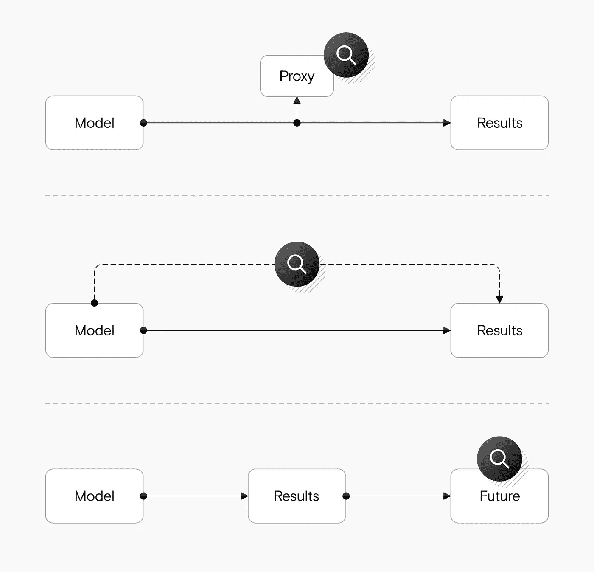
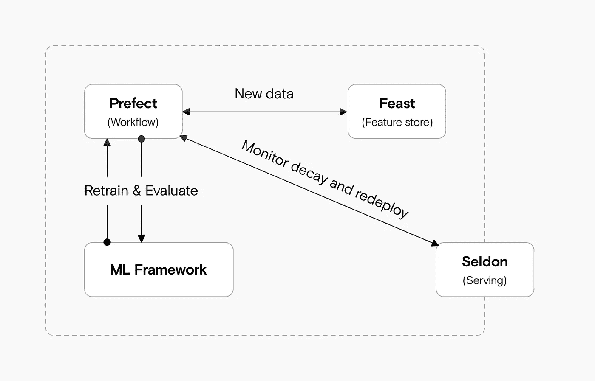

# MLOps 可以帮助修复模型衰退

> 原文：<https://towardsdatascience.com/mlops-can-help-fix-model-decay-f53573da6b1a?source=collection_archive---------42----------------------->

## 为什么您应该在发货后监控您的机器学习模型

来源:作者

机器学习团队通常会在测试集上获得很好的结果，将模型部署到现实世界中，花两周时间观察以确保它仍然获得良好的结果，然后转移到另一个项目。

然而，由于机器学习模型经常与现实世界的事件进行交互，而不仅仅是静态数据集，因此它们的准确性会随着时间的推移而下降。如果没有自动监控，很可能在相当长一段时间内没有人会注意到。

在某个时候，可能比理想状态晚得多，你可能会捡起来。您的团队将返回，重新训练模型，将更新推向生产，手动监控几个星期，然后再次前进。

虽然这种“假设事情按预期进行”的乐观心态可以在结果不那么重要的情况下发挥作用，但在影响更大的情况下可能是灾难性的。

以下是如何使用 [MLOps](https://datarevenue.com/en-blog/mlops-for-research-teams) 自动检测模型衰退、更新模型并将其部署到生产环境中。

# 如何看待自动化监控

自动化监控的第一步是检测问题。关键是主动识别模型衰退，而不是在问题出现时简单地做出反应。您可以防止许多问题，即使您需要投入一些时间来手动重新训练和重新部署模型。

理论上，这很简单。您设置了一个监控系统，当您的系统精度低于某个阈值时，它会向您发出警报。

实际上，这要困难得多。你可能有一个手动注释的“黄金”数据集用于训练，但是在生产中，你**不知道**你的模型是否出错了:如果你出错了，你首先就不需要这个模型了。

# 监控模型的三种策略

您可以直接监控您的模型，通过代理或追溯。来源:作者

要计算预测的准确性，您可以执行以下操作之一:

*   **监控与准确性相关的指标**。例如，如果一个垃圾邮件分类器通常预测 30%的邮件是垃圾邮件，但有一天预测了 75%，那么实际的垃圾邮件可能没有大幅增加；更有可能是模型坏了。
*   **人在回路样本。**例如，您可以手动检查所有预测的 5%,并监控这些预测的准确性..
*   **回顾性监测。如果你对未来做出预测，比如一个病人是否会在一个月后康复，那么你就能在以后验证你的准确性。**

一旦你有了一个可以作为合理质量检查的度量标准，你就需要一个工具来监控它。这可以是像 DataDog 这样的通用监控工具，也可以是专门的机器学习监控工具。一个专门的工具可以更容易地获得机器学习场景中更有用的指标，如误差分布或平均绝对误差。但是如果您的用例比较简单，并且您已经设置了另一个监控工具，那么从那个开始可能会更快。

# 自动重新训练和部署您的模型

检测衰变是最重要的一步，但它并不那么有价值，除非你能对此做些什么。手动重新训练一个模型并部署它是一种选择，但是你的团队需要不断地“待命”，等待警报触发。

手动再培训需要付出大量的努力，并且存在更大的人为错误风险，尤其是如果您需要经常这样做的话。

如果您已经建立了一个完整的 [MLOps 架构](https://datarevenue.com/en-blog/machine-learning-project-architecture)，那么您应该已经准备好自动重新训练您的模型并部署它们——或者按照固定的时间表，或者当您检测到模型衰退时。

在软件工程中，CI/CD 或“持续集成/持续部署”框架很常见。这意味着您已经做好了准备，新代码可以自动集成到现有代码中，并进行测试和部署。

在 MLOps 中，你还想对你的模型进行再培训，所以你需要 CT/CI/CD，或者说“持续培训/持续集成/持续部署”。

您需要在前期投入时间来建立 CT/CI/CD 管道，但是根据我们的经验，大多数团队手工做事情的时间太长了。

# 可以用来对抗模型衰退的工具

您可以将您的机器学习框架(如 TensorFlow)与工作流工具、特征存储和模型服务框架相结合，以对抗模型衰退。来源:作者

有大量的 MLOps 工具选项，但是这里是我们用来自动重新训练我们的模型以避免模型衰退的:

*   **提督**作为工作流和数据流工具。这让我们可以定义要运行的任务图，然后自动执行它们，并在必要时进行监控和重新运行。你可以阅读更多关于[的内容，了解我们对提督](https://datarevenue.com/en-blog/what-we-are-loving-about-prefect)的喜爱。Prefect 不仅处理模型的自动再训练，还负责定期监控，以帮助我们分析和检测衰减。
*   **盛宴**作为特色店。使用 Feast，您可以跟踪数据的变化，并在模型之间共享特性。在我们的文章[选择功能商店](https://datarevenue.com/en-blog/feature-store-feast-vs-hopsworks)中了解更多关于功能商店的信息。
*   **谢顿**为模特服务。使用 Seldon，您可以轻松地将任何模型转换为 API 并大规模提供服务，而无需从头开始编写服务代码。

# 您需要帮助为您的研究团队设置 MLOps 吗？

经常让团队在投资一个合适的架构上犹豫的是未知的数量:他们不知道需要多长时间或者如何开始。我们以前做过，很乐意帮你跳过这种繁重的工作，所以[如果你想聊天，请联系我们](https://datarevenue.com/en-contact)。