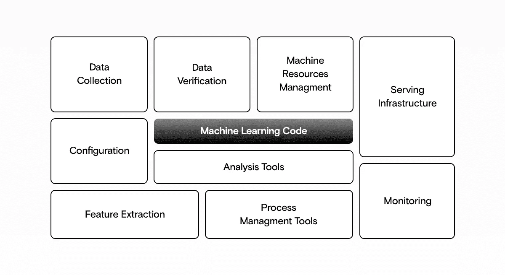
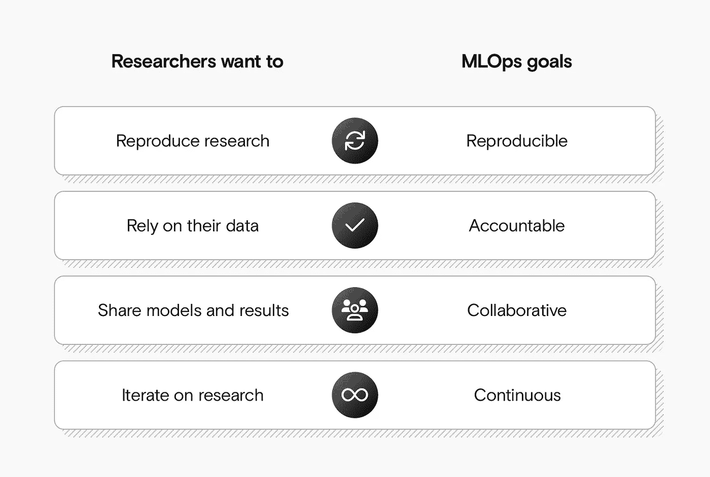
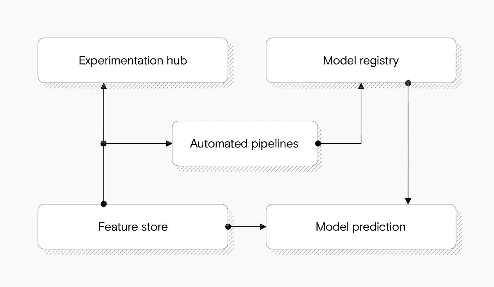

# 研究团队的 MLOps

> 原文：<https://towardsdatascience.com/mlops-for-research-teams-9d58ee8759f5?source=collection_archive---------31----------------------->

## 确保您团队的工作是可重复的、负责任的、协作的和连续的

来源:作者

机器学习团队经常面临同样的挑战。MLOps 是大多数机器学习团队解决这些问题应该遵循的一套流程。

为了使 MLOps 更具体，我们将看看它为研究团队解决了什么问题。

# 为什么您的团队需要 MLOps？

许多机器学习团队专注于构建新颖的算法或训练高性能的模型。虽然这些是任何机器学习解决方案的基本组件，但与真实解决方案中所需的所有周围过程相比，它们相对较小，例如数据工程和监控。

算法代码只是任何机器学习解决方案的一小部分。来源:作者——受[启发机器学习系统中隐藏的技术债务](https://papers.nips.cc/paper/2015/file/86df7dcfd896fcaf2674f757a2463eba-Paper.pdf)。

研究团队往往更关注机器学习代码，而不是周围的基础设施。随着协作、共享结果和重用在大型数据集上完成的工作的需求不断增加，研究团队很快就达到了这种方法的极限。MLOps 解决了这些问题，并允许研究团队实现他们的目标，尽管处理大型数据集、代码和机器学习模型会带来复杂性。

MLOps 的目标与研究团队的需求非常一致。来源:作者

# 如果没有 MLOps 架构，您可能会面临哪些挑战？

# 挑战#1:你不能重建现有的模型

你的团队有一个训练有素的模型，运行良好，但无法重建。数据和软件版本已经改变，或者在本地机器上建立培训管道的团队成员已经离开。您的团队可以直接共享训练好的模型文件，但是您不能改进或更新它，因为构建它的一些步骤现在已经丢失了。

# 挑战#2:您不能有效地审计或监控您的模型

在评估阶段，您团队的模型结果非常出色。但没有持续的审计或监控来确保模型的预测仍然有意义。您的团队需要盲目地相信模型正在按预期运行。

# 挑战 3:你不能轻易分享模型

您团队的每个成员都建立了自己的管道来管理数据和训练模型。很难进行协作或共享结果，因为您不能轻松地处理彼此的模型，或重用彼此的中间数据。

# 挑战#4:你的概念验证看起来很有希望，但是大规模培训会使你的硬件崩溃

您可以在笔记本电脑上的小数据集上训练您的模型，但很难扩展，无论是通过将其推到更强大的机器上，还是通过利用计算集群。

这意味着将概念验证转化为生产解决方案需要付出巨大的努力。

# 挑战 5:你发现错误太晚了

因为您的团队为每个项目从头开始构建基础结构和粘合代码，所以 bug 和其他问题经常发生，并且通常只在结果发布后才被发现。同样的问题会在每个项目中重复出现，因为您不容易重用代码。

# MLOps 架构如何应对这些挑战？

实施 MLOps 实践和使用标准化架构有助于解决所有这些挑战。大多数机器学习团队的架构应该包括以下内容:

我们的 MLOps 架构由几个集成组件组成，共同解决大多数团队面临的困难。来源:作者

# 实验中心

实验中心让您的研究人员开发笔记本电脑，试验新的模型和架构，并验证假设。它帮助团队成员共享代码，并确保他们可以复制彼此的模型。

你只需要设置一次，因为你们都在同一个环境中工作。共享集线器防止了硬件特定问题带来的麻烦，比如团队成员使用不同的操作系统或开发机器性能不足。

我们使用 **JupyterHub** 。

# 模型注册和实验跟踪器

模型注册中心存储您的团队生产的每个模型，带有一个名称和一个或多个版本。实验追踪器与此类似，但工作在更高的层次:为团队的实验定义名称、版本和元数据。

通过存储和版本化您的团队产生的每一个模型和实验，您总是可以再现在特定实验中执行的结果。你不会因为不知道哪个模型产生了具体的结果，也不知道你用了什么参数做了一个历史实验而被屏蔽。

这也将有助于您遵守任何必要的法律要求，以证明您的结果。

我们使用 **MLFlow** 。

# 模型服务工具

模型服务工具自动将您的模型部署到阶段或生产环境中，并使您的团队和最终用户可以访问统一的 API。

跨所有模型的统一 API 和基础设施使得使用和监控它们变得更加容易。将您的模型自动部署到试运行和生产环境意味着最新版本可以立即投入使用。

我们用**谢顿**。

# 数据流工具

数据流工具跟踪管道中的每一个步骤，并可以根据需要监控和重新运行步骤。这有助于防止模型无法重建的情况，因为您可以轻松地重新运行每次使用的完全相同的步骤。

它还可以节省团队的时间，并防止任何重复性工作中的人为错误。

我们用**提督**。

# 功能商店

有时，您的团队需要用于训练特定模型的确切特征，但是基础数据已经改变。或者，您可能已经花时间构建了特定的功能，现在想要在新的模型中重用这些功能。功能库保存了每个功能的版本，供您的团队重用，从而更容易地进行协作。

我们用**宴**。

# MLOps 是“值得拥有”还是必不可少？

虽然一些研究团队仍然没有 MLOps 工具或最佳实践，但我们相信 MLOps 已经成为几乎所有团队的重要组成部分。除非你的团队非常小或者只致力于琐碎的问题，否则你的机器学习研究也需要**可重复、可问责、协作、**和**持续。**如果没有 MLOps，实现这些目标将非常困难。

# 您需要帮助在您的研究团队中设置 MLOps 吗？

我们喜欢为机器学习研究团队找到合适的 MLOps 架构。[联系我们](https://datarevenue.com/en-contact)了解更多信息。