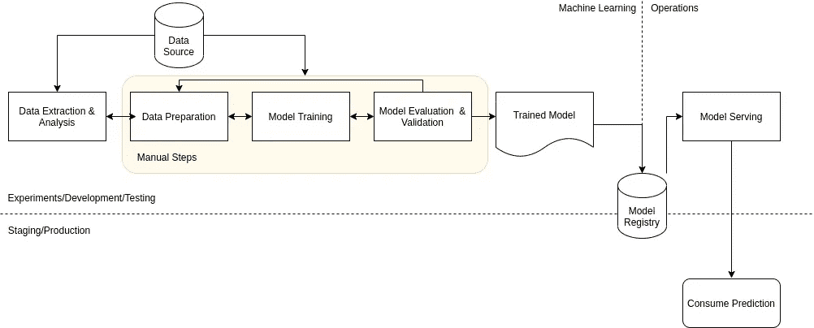

# MLOps 级—手动管线

> 原文：<https://towardsdatascience.com/mlops-level-0-manual-pipelines-7278b9949e59?source=collection_archive---------20----------------------->

## MLOps 级别 0 是机器学习过程的基本成熟度级别。对于一些组织来说，这可能就足够了，特别是当模型不经常需要重新训练时。这一级别的 MLOps 的特点是工作流程中的高度手动步骤。为了解决 MLOps 级中普遍存在的挑战，可以利用持续集成、持续部署和持续培训组件。

照片由[法比奥](https://unsplash.com/@fabioha?utm_source=unsplash&utm_medium=referral&utm_content=creditCopyText)在 [Unsplash](https://unsplash.com/s/photos/digital?utm_source=unsplash&utm_medium=referral&utm_content=creditCopyText) 上拍摄

在我之前的文章中，我回顾了组成机器学习过程的步骤([https://towards data science . com/steps-of-a-machine-learning-process-7 ACC 43973385](/steps-of-a-machine-learning-process-7acc43973385))。这些步骤的自动化程度决定了机器学习过程的成熟程度。在这篇文章中，我将更详细地介绍 MLOps 的第一级(0 级)，即成熟度的基本级别。

下图说明了将模型用作预测服务的各个步骤和管道(工作流),以便应用程序使用模型预测。

图片作者。MLOps 级别 0

**m lops 0 级的特性**

*   工作流程中的每一步都是手动的。每个步骤都是手动执行的，步骤之间的任何转换也是手动的。通常工作是在笔记本上完成的，如 Jupyter/Jupyter Lab/Zeppelin，代码仍然被认为是实验性的。
*   机器学习系统的机器学习和操作组件已断开连接。数据科学家通常会完成从数据源、数据提取和分析、数据准备、模型训练、模型评估和验证到最终注册模型的所有工作。然后，一个独立的工程团队从模型注册表中提取模型，并负责在生产环境中提供培训期间使用的功能，同时部署具有低延迟服务的模型。
*   模型发布很少。高度手工化的过程，模型训练很难有高速度。
*   代码的持续集成是不存在的。通常，测试是在笔记本电脑内或脚本执行期间完成的。用于训练和可视化的代码通常是源代码控制的。
*   连续部署是不存在的。由于模型重新训练和部署的频率很低，因此在此工作流中不考虑连续部署。
*   这个工作流的部署就是将模型放入预测服务，通常是一个带有 REST API 的微服务。该工作流不考虑整个机器学习系统的部署。
*   没有性能监控。没有跟踪模型在生产中的性能，因此，很难确定模型何时降级，必须进行重新训练。

**m lops 0 级的挑战**

对于一些组织来说，部署机器学习系统的这种高度手动的过程可能就足够了。然而，在现实中，模型经常在生产中断裂/变质。此外，数据会随着时间的推移而变化，过去的好模型将不再理想。

为了应对这些挑战，组织可以采取以下措施

*   监控生产中模型的质量。通过这样做，您可以检测模型性能的下降和模型的陈旧。这也有助于确定何时需要重新培训。
*   模型的频繁再训练。数据会随着时间的推移而变化，有时变化速度很快。因此，生产中的模型需要用生产中看到的最新数据来训练。
*   不断的实验。尝试各种特征工程变量、模型架构和超参数。

为了克服 MLOps 级的挑战，值得将持续集成(CI)/持续部署(CD)和持续培训(CT)工作流集成到机器学习系统中。通过部署机器学习管道，您可以启用 CT。使用 CI/CD，系统可以快速测试、构建和部署新的机器学习模型实现。

接下来，我将更详细地介绍 MLOps 级别 1，其中我们自动化了机器学习管道。