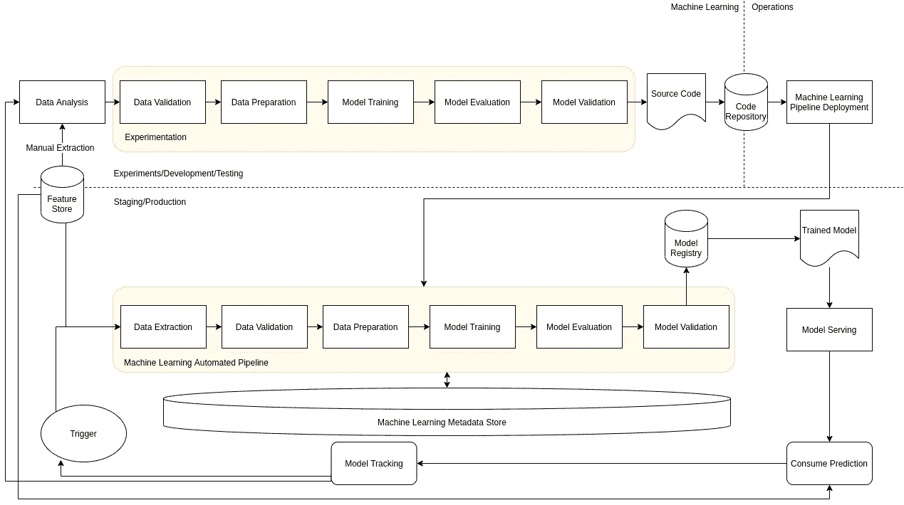

# MLOps 级:持续培训

> 原文：<https://towardsdatascience.com/mlops-level-1-continuous-training-b2a633e27d47?source=collection_archive---------10----------------------->

## 在 MLOps 级中，机器学习流水线是自动化的。通过这样做，您可以实现机器学习模型的持续培训以及模型预测服务的持续交付。

克里斯多夫·伯恩斯在 [Unsplash](https://unsplash.com/s/photos/artificial-intelligence?utm_source=unsplash&utm_medium=referral&utm_content=creditCopyText) 上拍摄的照片

**推荐预读**

为了从本文中获得最大收益，理解我将使用的术语是很重要的。为了让你自己熟悉这些术语，我在本文中非常详细地概述了机器学习服务的各个步骤:[https://towardsdatascience . com/steps-of-a-machine-learning-process-7 ACC 43973385](/steps-of-a-machine-learning-process-7acc43973385)。

所讨论的一些概念与 DevOps 理念重叠，而另一些则是 MLOps 所特有的。要阅读更多关于这两种实践的比较和对比，请查看我的文章:[https://towardsdatascience.com/mlops-vs-devops-5c9a4d5a60ba](/mlops-vs-devops-5c9a4d5a60ba)

如果你有兴趣了解更多关于这个级别的 MLOps 与 0 级有什么不同，请查看我的文章:[https://towardsdatascience . com/MLOps-level-0-manual-pipelines-7278 b 9949 e 59](/mlops-level-0-manual-pipelines-7278b9949e59)如下:

图片作者。MLOps 级别 0

**m lops 1 级的目的**

MLOps 一级旨在实现机器学习模型的持续训练。为了实现这一点，机器学习管道在这一级是自动化的。这包括自动化使用新数据的训练过程、生产中的模型再训练、自动化数据验证和模型验证、引入触发器以启动管道以及机器学习模型元数据存储。下图展示了这一概念:

图片作者。MLOps 一级

**m lops 1 级的特性**

*   快速实验:由实验管道组成的步骤是完全自动化和协调的。通过自动化和协调这一管道，它使数据科学家能够快速试验不同的模型和数据。此外，将机器学习管道从开发/测试转移到生产变得更加容易。
*   生产中模型的持续训练:通过使用触发器，使用新数据对生产中使用的模型进行训练。
*   机器学习和系统操作对称:开发/测试和生产中使用的机器学习管道是对称的。这是 MLOps 实践中整合 DevOps 理念的关键组成部分。
*   组件和管道的模块化代码:机器学习管道中的组件应该在机器学习管道中可重用、可组合和可共享。一些组件，如探索性数据分析(EDA)仍然可以在笔记本电脑内，但其他组件必须是模块化的。理想情况下，部件也应装箱。
*   模型的持续交付:在生产中，机器学习管道应该持续部署新模型的预测服务，这些新模型已经过新数据的训练。将经过训练和验证的模型部署为预测服务的管道必须自动化。
*   管道的部署:在 MLOps 级中，只有经过训练的模型人工制品被部署为生产的预测服务。在 MLOps 级别 1 中，部署了整个训练管道，作为生产中的预测服务部署的模型在生产中的最新数据上进行训练。

**m lops 1 级的新功能**

为了实现 MLOps 级的持续培训，架构中需要以下组件。

*数据和模型验证*

在 MLOps 级中，机器学习流水线是自动化的，并且被自动触发。一旦触发，就没有人工干预的机会，因此，在生产管道中需要自动数据验证和模型验证。

数据验证步骤至关重要，因为它用于决定是否应该重新训练数据或停止执行管道。两种情况将决定做出何种决定:

1.  数据模式偏斜:这些是异常的输入数据，这意味着下游处理和步骤可能会失败，因为它将接收到它不期望的数据。如果发生这种情况，必须停止管道执行，并调查异常数据，以确定是否需要更新管道。数据模式偏差的示例包括获取意外的模式、未接收所有模式以及接收具有意外值的要素。
2.  数据值偏差:这是指当要素值发生显著变化时，数据的统计属性发生了变化。这表明模型需要重新训练，以捕捉数据中统计属性的变化。

模型验证步骤验证训练好的模型，以确定它是否应该被提升到生产中。对于离线模型验证，遵循以下步骤:

*   根据测试数据(培训过程中未使用的数据)生成培训数据的评估指标。
*   生产中使用的新模型和当前模型之间的评估度量的比较。
*   确保不同数据段的模型性能一致。
*   测试用于部署的模型，包括基础架构兼容性和与预测服务 API 的一致性。

除了离线模型验证之外，还需要一个在线模型验证步骤，包括 canary 部署或 A/B 测试。

*功能商店*

这是一个可选组件，是一个集中的存储库，用于存储和访问用于训练和服务管道的特征。理想的特征存储需要能够为训练和服务过程处理高吞吐量批量服务和特征值的低延迟实时服务。

*元数据管理*

记录关于由训练机器学习流水线执行的不同实验的信息和数据。这是用来帮助数据和工件血统，再现性和比较不同的实验。理想情况下，元数据管理存储记录以下元数据:

1.  正在运行哪个版本的实验。
2.  实验的开始和结束日期和时间以及组成实验的步骤。
3.  管道中使用的参数。
4.  指向管道每一步产生的工件的指针。示例包括:实验中使用的数据位置、识别的异常、计算的统计数据、分类特征的词汇。
5.  正在管道中接受培训的模型的评估指标。

*ML 流水线触发器*

在管道中使用触发器来用新数据重新训练模型。触发管道的方法包括以下几种:

1.  临时手动触发。
2.  基于时间。例如，如果新数据按照固定的时间表到达系统，则可以在新数据到达之后执行管道。
3.  当新数据到达时触发。当特定数据到达数据源时，它会触发管道根据新数据重新训练模型。
4.  模型性能退化。如果生产中的模型恶化超过预定义的阈值，则应该触发模型的重新训练。
5.  数据分布发生显著变化，触发了模型的重新训练。

**挑战**

在 MLOps 级中，您需要手动测试管道及其组件。部署新的管道实现也将是手动的。此外，还依赖 IT 团队将新的源代码部署到目标环境中。

为了克服这些挑战，需要一个持续集成(CI)和持续部署(CD)流程设置来自动执行 MLOps 级中的这些手动步骤。如果一个系统有 CI/CD 设置，那么它已经达到了 MLOps 级别 2，我将在以后的文章中更详细地讨论这个级别。