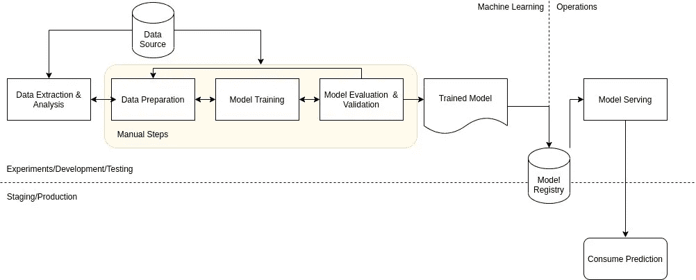
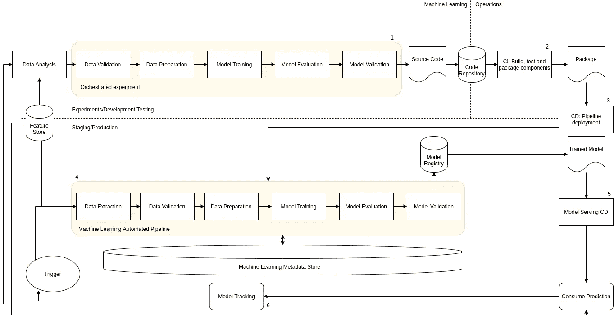

# MLOps 级— CI/CD +持续培训

> 原文：<https://towardsdatascience.com/mlops-level-2-ci-cd-continous-training-b9b64042368?source=collection_archive---------22----------------------->

## MLOps 级别 2 是关于利用自动化 CI/CD 对生产中的管道以及其他环境进行快速可靠的更新。

Anton Maksimov juvnsky 在 [Unsplash](https://unsplash.com/s/photos/technology?utm_source=unsplash&utm_medium=referral&utm_content=creditCopyText) 上的照片

**推荐预读**

本文是讨论各种级别 MLOps 的 3 部分系列的最后一篇文章。要了解各个级别之间的差异，请找到下面的链接和资源。

MLOps level 0(手动管道)可以在这里找到:[https://towardsdatascience . com/MLOps-level-0-Manual-Pipelines-7278 b 9949 e 59](/mlops-level-0-manual-pipelines-7278b9949e59)

图片作者。MLOps 级别 0

MLOps 一级(连续训练)可以在这里找到:[https://towardsdatascience . com/MLOps-level-1-Continuous-Training-B2 a 633 e 27d 47](/mlops-level-1-continuous-training-b2a633e27d47)

图片作者。MLOps 一级

为了从本文中获得最大收益，理解我将使用的术语是很重要的。为了让你自己熟悉这些术语，我在本文中非常详细地概述了机器学习服务的各个步骤:[https://towardsdatascience . com/steps-of-a-machine-learning-process-7 ACC 43973385](/steps-of-a-machine-learning-process-7acc43973385)。

所讨论的一些概念与 DevOps 理念重叠，而另一些则是 MLOps 所特有的。要阅读更多关于这两种实践的比较和对比，请查看我的文章:[https://towardsdatascience.com/mlops-vs-devops-5c9a4d5a60ba](/mlops-vs-devops-5c9a4d5a60ba)

**m lops 2 级的目的**

MLOps level 2 旨在使用自动化 CI/CD 对生产中的管道以及其他环境进行快速可靠的更新。通过自动化 CI/CD 系统实现流水线自动化，可以快速实现新想法和实验，同时自动构建、测试和部署新的流水线工件和组件到适当的目标环境。下图展示了 MLOps 级的概念:

图片作者。MLOps 二级

**m lops 二级特性**

构成 MLOps 级别 2 的组件与 MLOps 级别 1 非常相似。不同之处在于添加了

*   测试和构建服务(持续集成)。
*   部署服务(持续部署)。
*   管道协调。

管道可以分为 6 个阶段:

1.  开发和实验。这是尝试不同算法和建模技术的地方，每个实验步骤都是精心安排的。阶段 1 的最终输出是被推送到代码库的流水线步骤的源代码。
2.  管道的持续整合。一旦代码被推送到代码仓库，它就会触发一个测试管道，并构建需要在后续阶段部署的必要组件(包、工件等)。
3.  管道连续输送。阶段 2 中产生的工件被部署到目标环境中。这一阶段的输出是一个已部署的管道，其中包含来自阶段 1 的模型的新实现。
4.  自动触发。生产中流水线的执行或者基于时间表或者响应于事件触发器而被自动触发。这一阶段的最终输出是被推送到模型注册中心的训练模型。
5.  持续交付模型。最终训练好的模型被部署为服务，其中应用程序可以获得模型预测。此阶段的最终输出是一个已部署的模型预测服务。
6.  模型监控。通过收集模型性能的统计数据，对生产中的模型进行实时监控。当模型偏离或恶化到可接受的阈值时，该阶段应该触发生产中的流水线的执行，以使用新数据重新训练模型，或者执行新的实验流水线。

**MLOps 2 级的新功能**

MLOps 级的新概念是流水线自动化。这是通过持续集成和持续交付实现的。

在持续集成阶段，当新代码被推送到代码库中时，管道和组成管道的组件被构建、测试和打包。此阶段的测试非常重要，可包括以下测试:

*   特征工程逻辑的单元测试。
*   模型中实现的单元测试方法。例如，测试是否将正确的数据类型传递给函数。
*   测试在训练期间模型收敛。
*   测试模型的输出是明智的，不会产生 NaN 值。
*   测试流水线中的组件输出预期的假象。
*   测试管道组件之间的集成。

在连续交付阶段，新的管道实现被部署到目标环境，目标环境进而输出提供新训练的模型预测的服务。此阶段要考虑的事项包括:

*   检查新模型在目标基础架构上的兼容性。是否有足够的资源，目标环境中是否安装了所需的包/库等。
*   测试预测服务的性能。
*   验证新模型满足所需的最低预测性能。
*   根据环境进行分阶段部署。例如，将管道自动部署到测试环境，半自动部署到预生产环境，在预生产环境中成功运行几次后手动部署到生产环境。

**结论**

将机器学习模型实施到生产中涉及几个阶段、组件和管道。您不必将所有进程从一个 MLOps 级别移动到另一个级别。一个团队可以从 MLOps 级逐步实现实践到他们当前的系统中，以提高自动化水平。