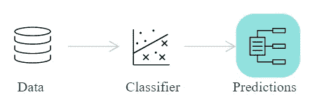
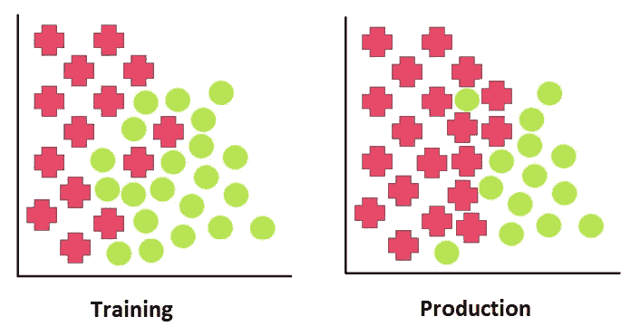
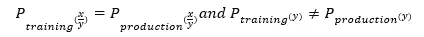
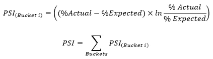
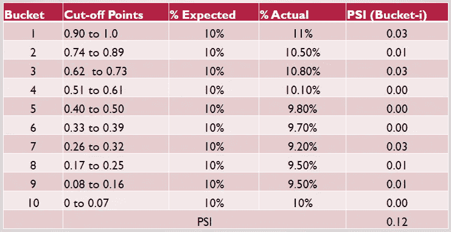
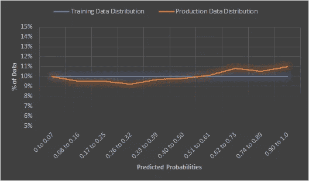
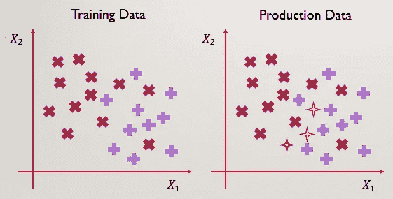

# 保持检查你的人工智能/人工智能模型预测

> 原文：<https://towardsdatascience.com/mlops-model-monitoring-prior-probability-shift-f64abfa03d9a?source=collection_archive---------22----------------------->

## 模型监控指标确保生产化的人工智能模型按预期执行。先验概率转移是一种现象，当在模型预测中检测到时，表明模型已经变得陈旧。

由 [**普罗诺吉**](https://www.linkedin.com/in/pronojitsaha/) 和[**阿纳博士**](https://www.linkedin.com/in/arnab-bose-phd-6369531/)

# 背景

在我们的 **MLOps 模型监控系列** [的第一篇文章中，我们探讨了使用模型监控框架背后的动机。在人工智能系统中，它在完成从模型部署到模型构建的基本反馈循环中起着非常重要的作用。这进一步确保了生产化的模型保持了在模型训练阶段所承诺的性能水平。此外，我们定义了三大类指标(即稳定性指标、性能指标&运营指标),我们可以跟踪这些指标来实现相同的目标。向前发展，稳定性度量可以进一步分为两个主要的子类型，即用于检测先验概率偏移的稳定性度量类别 I 和用于检测协变量偏移的稳定性度量类别 II。在本文中，我们将讨论稳定性度量类别 I，并深入探讨它的工作方式。我们将在本系列的后续文章中研究其他指标。](/mlops-model-monitoring-101-46de6a578e03)

# 先验概率转移

图 1:在人工智能系统监控的三个主要方面中，即数据、模型和预测，稳定性度量类别 I 监控人工智能系统的预测输出，以检测先验概率变化。(图片来自[aif360.mybluemix.net](http://aif360.mybluemix.net/))

先验概率偏移捕捉训练数据和生产数据之间或者生产数据的不同时间范围之间的预测输出的分布偏移(要了解关于这些时间范围的更多信息，请查阅本系列的第一篇文章)。在贝叶斯统计推断[2]中，不确定变量(预测产量)的先验概率分布是在考虑一些证据(新的生产数据)之前表达个人对该变量的信念的概率分布。因此，潜在的假设是，训练时预测输出的分布(即先验概率)不应在生产过程中发生显著变化(即有新的证据)。

图 2:训练和生产数据之间的先验概率转移。预测输出类别的分布在培训和生产之间有很大的不同。(图片由作者提供)

假设在贷款违约数据集中，训练数据具有相等的贷款违约的先验概率(即，贷款违约的概率是 0.5)。因此，我们预计 50%的训练集包含贷款违约者，50%包含良好贷款。然而，在现实中，只有 5%的贷款可能违约，然后贷款违约变量的先验概率发生了变化。数学上，我们可以将其表示为

# 稳定性度量标准类型 I

稳定性度量标准类型 I 帮助我们检测先验概率变化。它由两个主要 KPI 组成，即群体稳定性指数(PSI)和分化指数(DI)。

# 1.人口稳定指数

群体稳定性指数(PSI)比较两个数据集(训练和生产)的预测概率(分类)或连续预测输出(回归)的分布。因此，它有助于评估先验概率(即训练期间的预测产量分布)是否随着生产期间新数据的流入而发生了显著变化(新证据)。

计算 PSI 的步骤如下。这里，为了便于理解，我们考虑了训练数据和生产数据之间的比较(本系列第一篇文章中的场景 I[这里](/mlops-model-monitoring-101-46de6a578e03))。但是这可以很好地应用于比较不同时间的两个生产数据实例(第一篇文章中的场景 II)。

1.  按降序对训练数据集预测概率进行排序
2.  将预测的概率分成 10 个桶(十分位数)
3.  对于步骤(2)中形成的每个桶，找到概率值的最小值和最大值，即训练数据集中每个桶的分界点
4.  计算落入每个这样的桶中的观察值的百分比(下表 I 中的预期百分比)
5.  根据生产数据集中 10 个时段的概率分界点，计算生产数据集中每个时段的观测值百分比(下表 I 中的实际百分比)
6.  最后，根据下面的公式计算 PSI。

上面的例子是在分类问题设置中使用预测概率。在回归的情况下，边界值将是输出预测值的连续值桶。

表一:人口稳定指数计算

图 3:分类问题中的 PSI。从训练数据到生产数据的预测输出概率分布变化。我们得到 PSI = 0.12，从而在预测输出中捕捉到这一微小的先验概率变化。(图片由作者提供)

## **如何作用于 PSI 值？**

根据经验，以下是 PSI 的几个决策值点。

1.  如果 PSI < 0.1 then there is not much prior probability shift in the predicted output and no change is required in the existing production model.
2.  However, if PSI > =0.1 且<0.2 then slight change may be required in the production model and it’s best to review some of the other KPIs as well to make a decision.
3.  If PSI> =0.2，则在预测输出中检测到显著的先验概率偏移，应根据最新数据重新训练生产模型。

关于什么是合适的决策点的进一步讨论可以从 Bilal Yurdakul 的作品中得到[1]

# 2.分歧指数

差异指数(DI)比较两个数据集(训练和生产)之间输出的聚合统计数据。与 PSI 一样，DI 也有助于评估先验概率(即培训期间的输出分布)是否在生产中发生了显著变化。但是 DI 是在总体水平上这样做的，并且使用实际的输出值(地面实况)而不是预测的输出。因此，DI 的一个限制是，由于采集生产数据地面实况可能会延迟或不总是可用，因此可能不总是能够进行计算。计算 DI 的步骤如下。

对于分类问题，我们计算训练数据集和生产数据集上的实际类别分布(对于每个类别)。我们确定预测类变量中唯一级别的数量，然后计算每个级别的交集并除以它们的并集。例如，如果训练数据集中的给定类变量有三个唯一级别，即良好、非常好和优秀，而生产数据集中有五个唯一级别，即差、一般、良好、非常好和优秀，则 DI 将计算为:

1.  DI = 1-(培训和生产中的普通级别/培训和生产中的级别的联合)= 1-(3/5) = 0.4
2.  此外，在没有添加新水平的情况下，DI = 0，而对于两个数据集中完全不同的水平，DI = 1。

对于回归问题，我们简单地计算两个数据集之间的连续值输出的平均值的百分比变化。

图 4:分类问题中的 DI。生产数据有一个新类(黄色)，该类在培训数据中不存在。因此，DI = 1-(2/3) = 0.33，这捕获了预测输出类别中的先验概率变化。(图片由作者提供)

## **如何作用于 DI 值？**

前面针对 PSI 提到的相同的经验法则也可以用于 DI，以检测预测输出中的先验概率偏移的存在，并且因此可以采取模型再训练决策。

# 结论

机器学习模型预测提供洞察力并定义可操作性。监控模型以保持预测的有效性和相关性是至关重要的。第一类稳定性指标，如 PSI 和 DI，通过检测模型预测中的先验概率变化来帮助我们做到这一点。这些指标是人工智能系统中重要的监控工具。

# 参考

1.  Bilal Yurdakul，[人口稳定指数的统计特性](https://scholarworks.wmich.edu/cgi/viewcontent.cgi?article=4249&context=dissertations) (2018)，WMU 的 ScholarWorks
2.  约翰·克鲁施克等人，[新人贝叶斯数据分析](https://link.springer.com/article/10.3758/s13423-017-1272-1) (2017)，施普林格