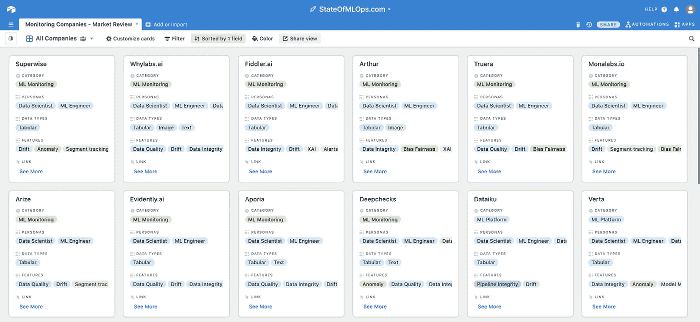

# MLOps 监控市场回顾

> 原文：<https://towardsdatascience.com/mlops-monitoring-market-review-66904f0863bb?source=collection_archive---------27----------------------->

卡观点，MLOps 监测公司市场评论 2021，[https://stateofmlops.com](https://stateofmlops.com)，奥里科恩博士。

来自 stateofmlops.com 的

以下是 MLOps 监控领域公司的详尽列表，并按人物角色、支持的数据类型(表格、图像、音频等)、产品特性(数据完整性、数据质量、健康、漂移、偏见和公平、XAI 等)、产品关注点(以数据为中心或以管道为中心)、迄今为止的总资金(2021 年 8 月)、公司类型(创业、开源、公司)等进行了细分。我通过研究博客帖子、文档、产品演示和营销材料来收集数据。

图 1:2021 年 MLOps 监测公司市场回顾，【https://stateofmlops.com】T4，Ori Cohen 博士。

首先，如果您是数据科学家或 ML 工程师，并且正在问自己为什么我们需要一个专用的解决方案来监控 ML 系统，请阅读" [Monitor！不要再做一个盲目的数据科学家。](https://medium.com/p/66904f0863bb/edit#:~:text=https%3A//towardsdatascience.com/monitor-stop-being-a-blind-data-scientist-ac915286075f)

</monitor-stop-being-a-blind-data-scientist-ac915286075f>  

如果你在问自己怎么没人监控依赖关系，那么我也写了一篇关于[监控依赖关系](/monitor-your-dependencies-stop-being-a-blind-data-scientist-a3150bd64594)的文章，由 O'Reilly 发表在[《每个云工程师都应该知道的 97 件事》](https://www.oreilly.com/library/view/97-things-every/9781492076728/)。

</monitor-your-dependencies-stop-being-a-blind-data-scientist-a3150bd64594>  

最后，如果您是一名高管或投资者，并且您想知道为什么模型监控对[企业和企业高管](/data-science-observability-for-executives-a054411faecc)很重要，请阅读以下文章。

</data-science-observability-for-executives-a054411faecc>  

## 分析

图 2:人物角色聚焦，MLOps 的状态，Ori Cohen 博士。

通过分析 MLOps 的当前空间(图 1)我们看到，这个空间中的大多数公司都是专注于数据科学家(图 2)、机器学习工程师和开发人员的初创公司，并且专注于表格数据(图 3)；不足为奇的是，有相当多的人来自以色列。

图 3:数据类型焦点，MLOps 的状态，Ori Cohen 博士。

大多数公司专注于数据监控，少数公司专注于数据管道(例如 Dag，不要与传统的 APM 混淆)。

图 4:亚马逊，Azure，谷歌，MLOps 的状态，Ori Cohen 博士。

三大云提供商(图 4)正在提供相对基础到中级的功能，并且似乎没有成为同类最佳的计划。

图 5:卡维，[https://stateofmlops.com](https://stateofmlops.com)，奥里·科恩博士。

AirTable 的一个很棒的特性是，您可以看到一个卡片视图，并按任意一个字段对其进行排序，如图 5 所示。

我们可以看到市场已经爆炸，有许多新的参与者分享相同的功能，但有自己的观点。投资于 MLOps 领域的金额高达 38 亿美元。我们看到小型但成熟的创业公司没有形成规模，因此过早退出。

  

我预见到该领域的整合，我相信最终，大公司会收购小公司，小公司会收购小公司，以吸引大公司。

最后，如果你问自己应该选择哪个解决方案，答案并不容易，尽管它们都有相同的基本功能，但现在还没有一个明确的赢家。每个公司都选择了自己的道路，无论是流程编排、洞察力、自定义指标、可配置性、集成、ML 特性等等。我现在的建议是了解您的模型监控需求，阅读他们的文档，请求演示，然后自己决定。

如果您发现任何不准确之处或想要添加您的公司，请通过以下方式联系我:[LinkedIn](https://www.linkedin.com/in/cohenori/)|[Medium](https://medium.com/@cohenori)|[OriCohen.com](https://www.oricohen.com/)|[MLCompendium.com](http://www.mlcompendium.com/)

Ori Cohen 博士拥有计算机科学博士学位，主要研究机器学习。他是新遗迹 TLV 的首席数据科学家，在 AIOps 领域进行机器和深度学习研究。