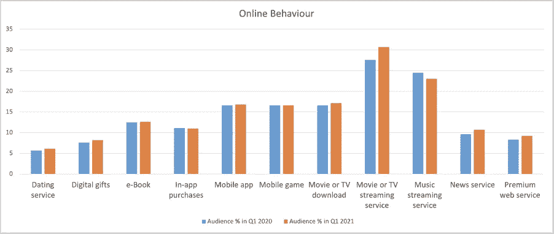
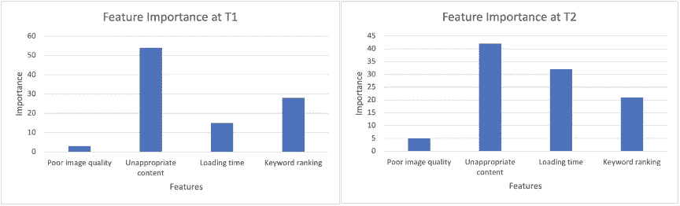

# MLOps:部署后挑战

> 原文：<https://towardsdatascience.com/mlops-post-deployment-challenges-fa0089a87e5?source=collection_archive---------38----------------------->

## 在生产中部署模型后，数据科学家面临的挑战

作为一名学生，当我过去学习和实现机器学习模型时，我认为部署是数据科学家的最后一步。但是当我开始职业生涯时，我的看法完全改变了。我很快意识到，在大多数实际的数据科学用例中，ML 模型的首次部署意味着工作只完成了一半。即使在部署之后，我们仍然面临着一些挑战。

它们可以分为两大类:

1)机器学习或统计学相关

2)软件工程问题

# ML 相关:

**数据漂移** : X 变化

数据漂移是数据分布随时间的变化。

例如:从 2020 年的 Q1 到 2021 年的 Q1，在线行为发生了怎样的变化。如果我们利用这些投入为营销团队开发了一些预算分配模型(如图所示)，我们可能应该重新训练我们的模型，因为我们可以看到电影或电视流媒体服务随着时间的推移越来越受欢迎。

作者图片

**概念漂移** : X- > Y 变化

当模型学习的模式不再适用时，就会出现概念漂移。

例如:如果我们部署了一个模型来预测客户流失，一段时间后，我们可以观察到不同功能的重要性随时间而变化。因此，模型需要重新训练。

作者图片

我们可以看到，随着时间的推移，装载时间变得越来越重要。

# **软件工程问题:**

环境变化:一些使用的库可能会失去支持。最好密切关注它们，并在需要时更新它们

**停止服务的云**:假设我们在云上部署了一些 ML 模型，而云停止服务了一段时间。在这种情况下，我们可以在浏览器上部署一个可以离线运行的混合模型。人们可以检查这个[链接](/how-to-deploy-your-ml-models-into-the-browser-f52ea62bfa60)以便更好地理解。

**计算资源**(CPU/GPU/内存):可能发生的情况是，我们已经使用非常强大的机器训练了我们的模型，但这对项目来说变得太昂贵了。

**安全和隐私**:这些都是我们不能妥协的领域。有许多与之相关的最佳实践。比如——在代码中不直接使用 ID 和密码等。如果你想深入了解，可以参考[链接](/security-and-privacy-in-artificial-intelligence-and-machine-learning-part-1-c6f607feb94b)。

# **结尾注释**:

如果您正在寻找或者刚刚在生产中部署了您的模型，我希望这篇文章能够帮助您预见挑战。数据科学世界正与日俱增。我很想知道您是否面临过任何其他部署后挑战。请写在评论区。

参考资料:-

1.[https://evident lyai . com/blog/machine-learning-monitoring-data-and-concept-drift](https://evidentlyai.com/blog/machine-learning-monitoring-data-and-concept-drift)

2.[https://towards data science . com/how-to-deploy-your-ml-models-to-the-browser-f 52 ea 62 BFA 60](/how-to-deploy-your-ml-models-into-the-browser-f52ea62bfa60)

3.[https://towards data science . com/security-and-privacy-in-artificial-intelligence-and-machine-learning-part-1-c 6 f 607 feb 94 b](/security-and-privacy-in-artificial-intelligence-and-machine-learning-part-1-c6f607feb94b)