# MLOps 数据科学家最佳实践

> 原文：<https://towardsdatascience.com/mlops-practices-for-data-scientists-dbb01be45dd8?source=collection_archive---------3----------------------->

## 构建生产机器学习系统

你可能已经听过很多了，但只有一小部分机器学习模型投入生产。对于大多数已经开始将 ML 应用于其用例的行业来说，部署和操作机器学习模型一直具有挑战性。在本文中，我将分享一些 MLOps 最佳实践和技巧，让您能够在生产中正确地使用您的 ML 模型。在开始之前，我们先来谈谈我们可能都知道的典型的 ML 项目生命周期。

# **ML 项目生命周期**

一个典型的 ML 生命周期可以用下图来概括，主要由 3 个阶段组成。

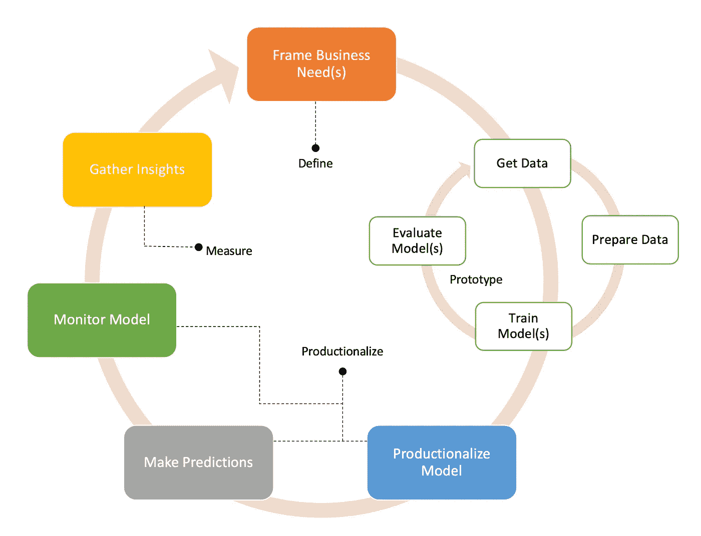

ML 项目生命周期——受优步机器学习启发，来源:[https://www . LinkedIn . com/pulse/do-Machine-Learning-Uber-way-five-lessons-from-first-Rodriguez/](https://www.linkedin.com/pulse/doing-machine-learning-uber-way-five-lessons-from-first-rodriguez/)

在第一阶段，在我们深入研究数据之前，为成功做好准备是很重要的。因此，与业务专家一起，我们需要仔细定义我们的问题和业务目标！我们需要回答一些重要的问题，这些问题允许我们就模型和生产流水线的设计做出培训和服务决策。例如:

*   理想的结果是什么？
*   我们的评估标准是什么？我们如何定义 ROI？
*   成功和失败的标准是什么？
*   延迟要求是什么？我们能否在延迟要求范围内获得每项服务功能？…

在第二阶段，我们建立第一个 ML 模型的原型，或者换句话说，我们执行 ML 可行性研究。

因此，我们使用第一阶段定义的指标来证明 ML 业务价值。记住，ML 工程规则 1 的最佳实践是保持第一个模型简单，并获得正确的基础设施。第一个模型为我们的产品提供了最大的推动力，所以它不需要在一开始就是最花哨的模型。

在第三阶段，我们转向生产。这是本文的主题，因此我们将在接下来的章节中看到更多的细节。一旦我们的生产管道准备就绪并且设计良好，我们就可以更快更有效地收集见解和迭代新想法。

# **如今，数据科学家主要在做什么？**

今天，大多数 ML 将机器学习模型投入生产的过程看起来都是这样的。作为一名数据科学家，它从一个 ML 用例和一个业务目标开始。有了这个用例，我们开始收集和探索来自不同数据源的相关数据，以理解和评估它们的质量。

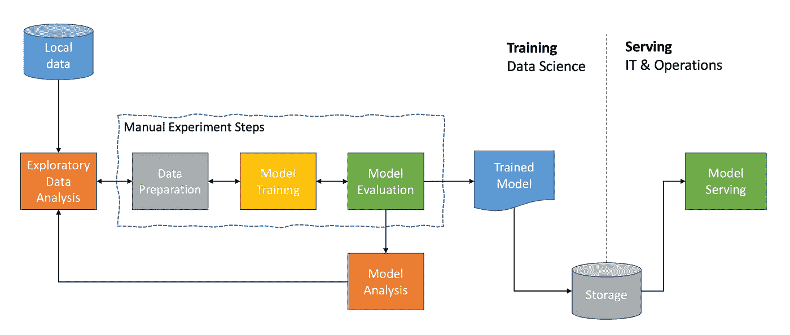

如今，数据科学家主要在做什么？—受谷歌云技术启发，来源:[https://cloud.withgoogle.com/next/sf/sessions?session=AI212](https://cloud.withgoogle.com/next/sf/sessions?session=AI212)

一旦我们对我们的数据有了感觉，我们就开始制作和设计一些我们认为对我们的问题有意义的特性。然后，我们进入建模阶段，并开始处理一些实验。在这个阶段，我们定期手动执行不同的实验步骤。对于每个实验，我们会做一些数据准备，一些功能工程和测试。然后，我们对我们认为特别有前途的任何模型或模型架构进行一些模型训练和超参数调整。

最后但并非最不重要的一点是，我们将评估所有生成的模型，根据维持数据集测试它们，评估不同的指标，查看性能，并将这些模型相互比较，看哪一个效果最好，哪一个产生的评估指标最高。整个过程是迭代的，反复手动执行，直到我们得到具有最佳性能的最佳模型。

一旦我们获得了性能最佳的模型，我们通常会将它放在某个存储中，然后将它扔给 it 和运营团队，他们的工作是将模型作为预测服务部署到生产中。不幸的是，我们认为我们的工作已经结束了。

# **ML 运营陷阱—** 这种方法有什么问题？

以下是上述方法的错误之处。

**手工**:步骤高度手工化，每次都是从头开始写。每次数据科学家需要进行新的实验时，他都需要检查自己的笔记本，更新它们并手动执行。如果需要用新的训练数据刷新模型，数据科学家需要再次手动执行他的代码。

**耗时**:这种手动过程耗时且效率不高。

**不可重用**:写在笔记本上的自定义代码只能由作者自己理解，不能被其他数据科学家或跨其他用例重用或利用。甚至作者自己也可能在一段时间后发现有时很难理解他们的作品。

**不可再现性**:再现性是指被重新创造或复制的能力。在机器学习中，能够复制精确的模型非常重要。对于这里的手动过程，我们可能无法重现一个旧版本的模型，因为底层数据可能已经改变，代码本身可能已经被覆盖，或者依赖项和它们的确切版本可能没有被记录。因此，在出现问题的情况下，任何回滚到旧版本模型的尝试都是不可能的。

**易错**:这个过程会导致许多错误，如培训服务偏差、模型性能衰退、模型偏差、基础设施随时间崩溃…

*   **培训服务偏差**:当我们部署模型时，我们有时会注意到模型的在线性能完全低于我们在维持数据集上预期和测量的性能。对于操作机器学习模型，这种现象非常常见。训练和服务流水线之间的差异会引入训练服务偏差。训练服务偏差可能很难检测，并且可能使模型的预测完全无用。为了避免这个问题，我们需要确保对训练和服务数据都执行准确的处理功能，监控训练和服务数据的分布，监控模型的实时性能并将其与离线性能进行比较。
*   **模型衰减**:在大多数用例中，数据概要文件是动态的，并且随着时间而变化。当底层数据发生变化时，模型性能会下降，因为现有模式不再是最新的。静态模型很少继续服务于一个价值。我们需要确保使用新数据定期更新模型，并监控所服务模型的实时性能，以触发模型衰减。下图显示了一个已部署的模型是如何随时间衰减的，以及用一个新的模型更新模型的持续需求。

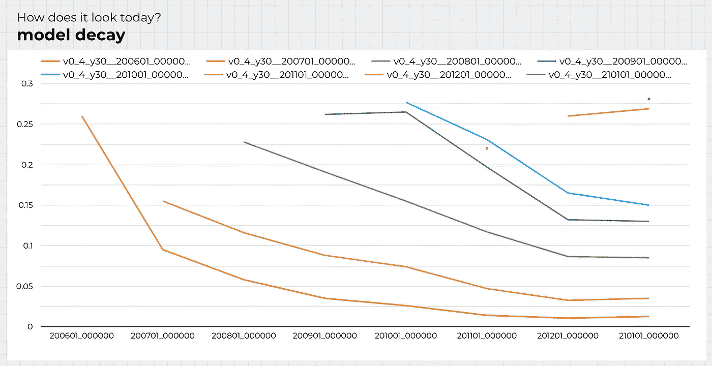

作者图片

*   模型偏差:人工智能系统的应用可能具有关键的性质，例如医疗诊断或预测，将人们的技能与工作配对，或者测试一个人是否有资格获得贷款。尽管这些应用看起来很实用，但这类系统中任何偏差的影响都可能是有害的。因此，未来人工智能系统的一个重要属性是对所有人的公平和包容。因此，对于任何机器学习模型来说，跨敏感特征(性别、种族……)衡量公平性都很重要。敏感特征取决于上下文。即使对于不敏感的功能，评估 AI 系统在不同子组上的性能也很重要，以确保我们在部署模型之前知道任何表现不佳的子组。

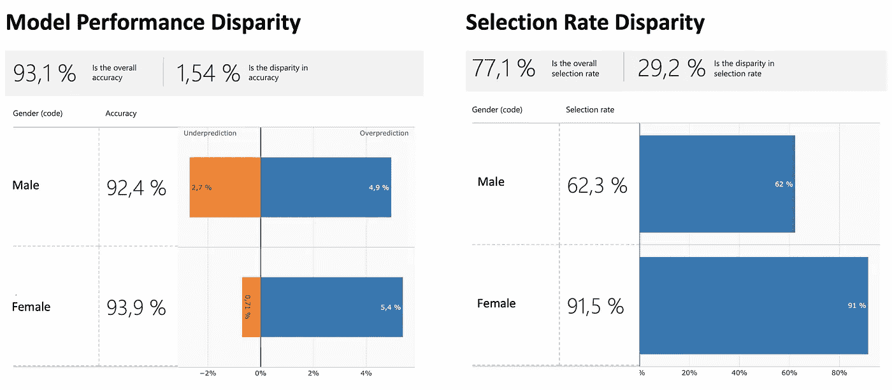

按作者分类的图片—由微软的 Fairlearn 工具生成的图片

*   可扩展性:可扩展性在机器学习中很重要，因为训练一个模型可能需要很长时间，因此优化一个需要数周训练的模型是不可行的。一个模型可能会太大，以至于无法放入训练设备的工作存储器中。即使我们决定纵向扩展，成本也会比横向扩展高。在某些情况下，数据量可能不大，因此在开始时可能不需要可伸缩性，但是我们应该考虑，随着持续的训练，我们预期接收的训练数据量是否会随着时间的推移而增加，并且可能会给我们设置的基础架构带来内存问题。

# ML 系统的主要组件

在这一节中，我们将描述 ML 系统的主要组成部分和围绕它们的最佳实践，这将使我们避免上述缺陷。

交付集成 ML 系统并在生产中持续运行该系统的过程包括以下步骤:

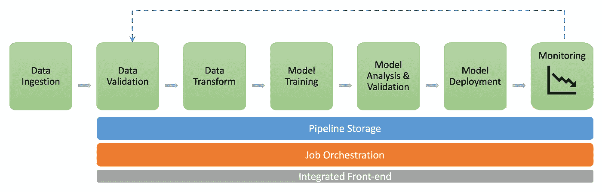

ML 系统的主要组成部分—作者图片

让我们详细讨论一下每个管道组件。

## **数据摄取**:

这个组件通常在我们用例的 ML 管道之外。在成熟的数据流程中，数据工程师应优化持续的数据接收和转换，以持续向组织内的不同数据分析实体提供最新数据，这些实体期待发现数据驱动的见解和更明智的决策。

## **数据验证**:

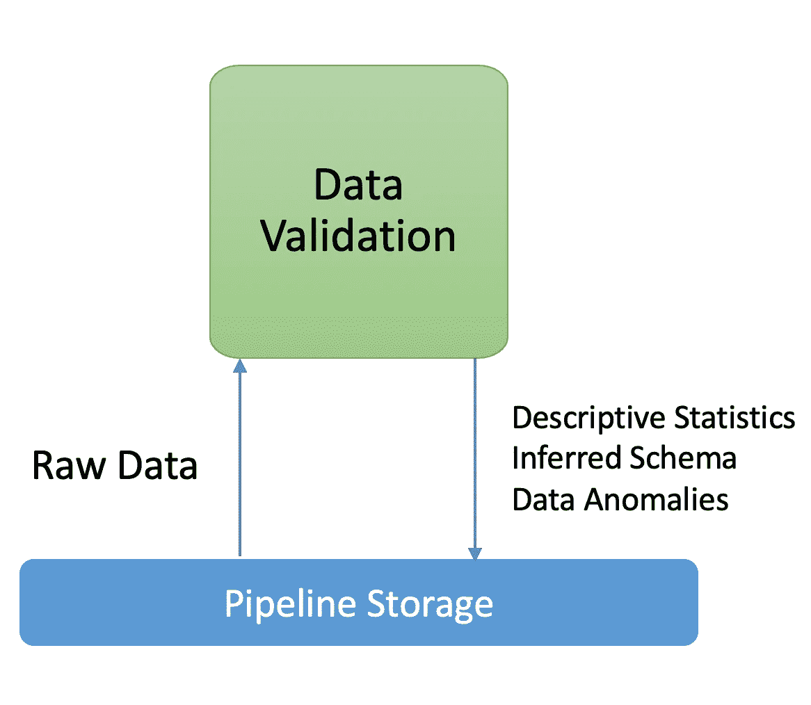

作者图片

在这个组件中，我们的重点是验证提供给管道的输入数据。人们不能低估这个问题在 ML 系统中的重要性。不管采用什么样的 ML 算法，数据中的误差都会严重影响生成模型的质量。正如一个流行的数据科学概念所说的“垃圾进，垃圾出”。因此，及早发现数据错误至关重要。

无误差数据的另一个作用是在模型输出分析方面。该组件允许我们正确理解和调试 ML 模型的输出。因此，数据必须被视为 ML 系统中的一等公民，就像算法和基础设施一样。在每次执行 ML 流水线时，都必须对其进行持续监控和验证。

在模型训练之前也使用该步骤来决定我们是否应该重新训练模型(在数据漂移的情况下)或者停止流水线的执行(在数据异常的情况下)。

以下是数据验证组件的典型行为:

*   它计算并显示关于数据的描述性统计，它还可以显示连续数据范围(即，在当前管道执行 N 和最后管道执行 N-1 之间)的描述性统计，以查看数据分布如何变化。

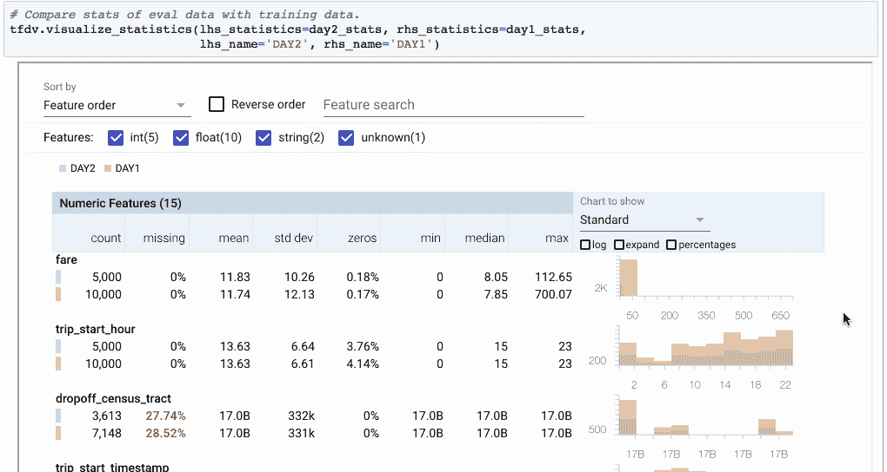

来源:[https://medium . com/tensor flow/introducing-tensor flow-data-validation-data-understanding-validation-and-monitoring-at-scale-d38e 3952 c2f 0](https://medium.com/tensorflow/introducing-tensorflow-data-validation-data-understanding-validation-and-monitoring-at-scale-d38e3952c2f0)

*   它推断出代表使用中数据的数据模式。

来源:[https://medium . com/tensor flow/introducing-tensor flow-data-validation-data-understanding-validation-and-monitoring-at-scale-d 38 e 3952 C2 f 0](https://medium.com/tensorflow/introducing-tensorflow-data-validation-data-understanding-validation-and-monitoring-at-scale-d38e3952c2f0)

*   它检测数据异常。它应该检查数据集是否匹配预定义的经验证的模式。它应该检测连续数据跨度之间(即，当前流水线执行 N 和最后流水线执行 N-1 之间)的数据漂移，例如不同天的训练数据之间的数据漂移。它还应该通过比较训练数据和在线发球数据来检测**训练发球偏斜**。

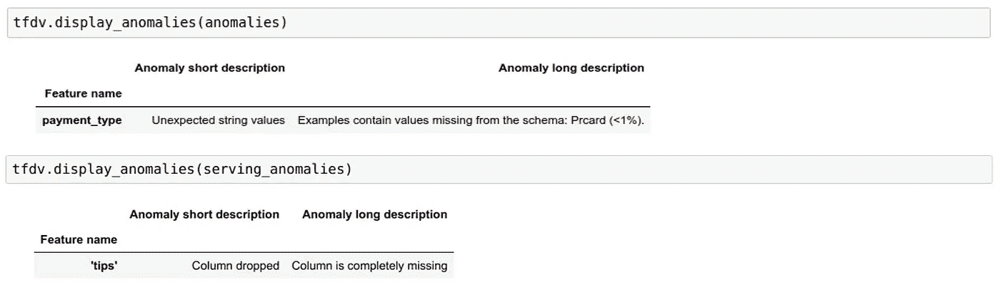

来源:[https://github . com/tensor flow/tfx/blob/master/docs/tutorials/data _ validation/tfdv _ basic . ipynb](https://github.com/tensorflow/tfx/blob/master/docs/tutorials/data_validation/tfdv_basic.ipynb)

在生产中，通过不断的训练，下面是一个示意图，它生成关于新到达的数据的统计数据，对其进行验证，并生成异常报告:

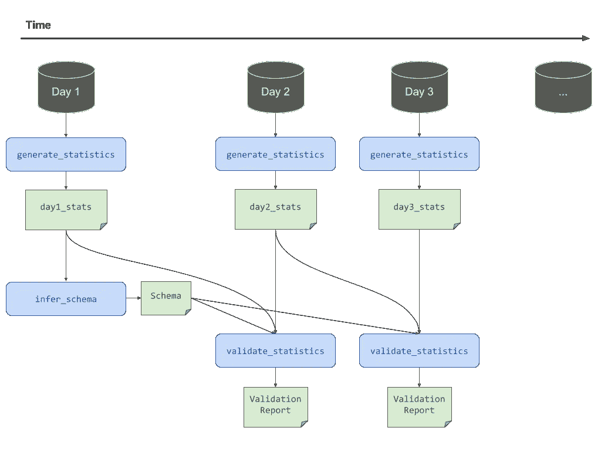

来源:[https://medium . com/tensor flow/introducing-tensor flow-data-validation-data-understanding-validation-and-monitoring-at-scale-d 38 e 3952 c2f 0](https://medium.com/tensorflow/introducing-tensorflow-data-validation-data-understanding-validation-and-monitoring-at-scale-d38e3952c2f0)

**数据转换**

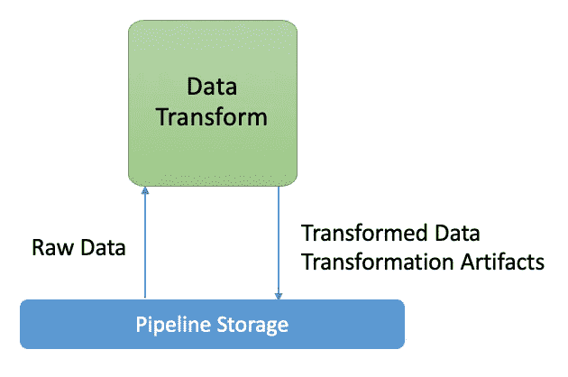

作者图片

在这一步中，数据是为 ML 任务准备的。这包括数据清理、过滤、数据转换和功能争论。它应该做一些事情，比如生成特征到整数的映射。此外，该组件准备训练器组件中可能需要的特征元数据(例如，这包括特征标准化的训练步骤中需要的元参数、分类变量编码所需的字典等)。这些被称为转换工件；他们帮助构建模型输入。

重要的是，无论生成什么映射**，都必须保存并在服务时间**重用(当训练好的模型用于进行预测时)。如果不能始终如一地做到这一点，就会导致我们前面谈到的培训服务不对称问题。

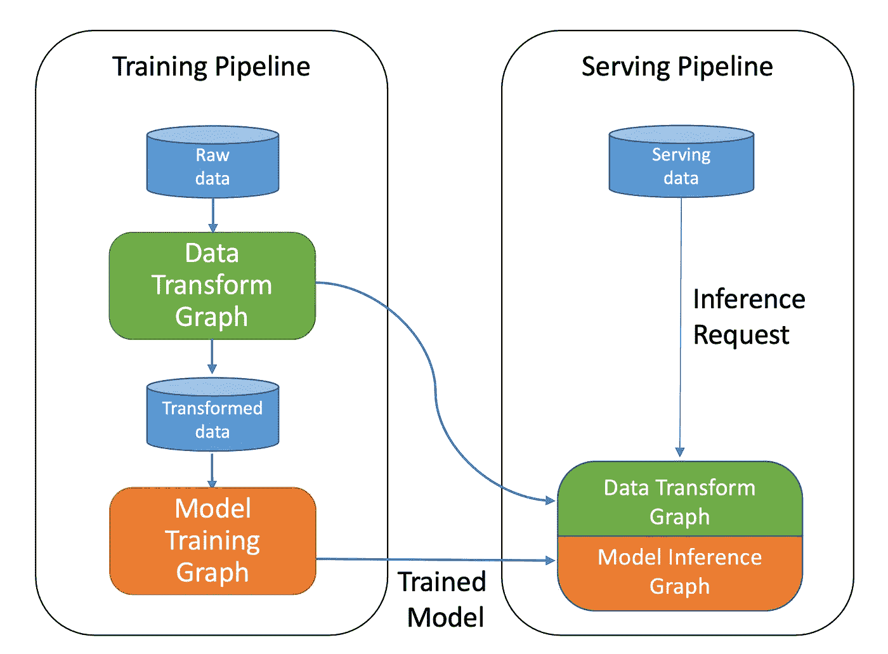

作者图片

## 模特培训

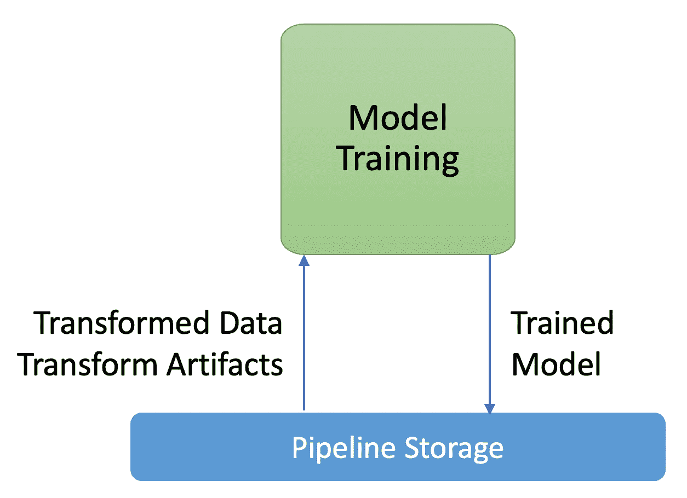

作者图片

模型训练组件负责训练我们的模型。在大多数用例中，模型可以训练几个小时，几天，甚至几周。优化一个需要数周训练的模型是不可行的。在其他情况下，用于训练模型的数据甚至不适合内存。

在这种情况下，模型训练组件应该能够支持**数据和模型并行性**；并且扩展到大量的工人。它还应该能够**处理内存不足的数据**。

理想情况下，**我们的 ML 系统的所有组件都应该是可伸缩的**，并且运行在支持可伸缩性的基础设施上。

这个模型训练组件还应该能够在训练时**自动监控和记录一切。我们无法在很长一段时间内训练一个机器学习模型，而不看看它是如何做的，并确保它被正确配置以最小化迭代次数的损失函数。最后，训练组件还应该**支持超参数调整**。**

## 模型分析

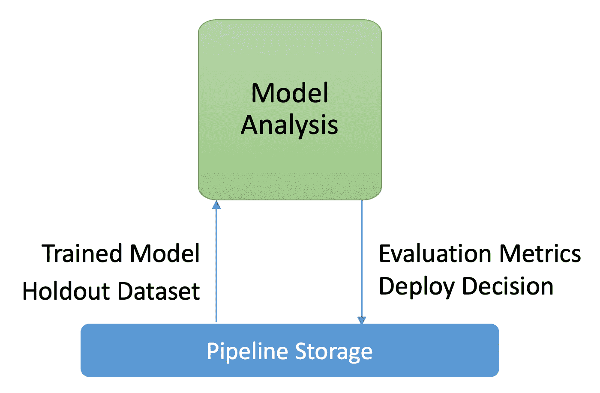

作者图片

在模型分析组件中，我们对训练结果进行深入分析，并确保我们导出的模型具有足够的性能，可以推向生产。

这一步有助于我们保证，只有当模型满足我们在框架阶段预设的质量标准时，它才会被提升用于服务。标准必须包括与以前部署的模型相比改进的性能，以及在各种数据子集/切片上的公平性能。在下图中，我们在特征切片 *trip_start_hour* 上显示了我们的训练模型的性能。

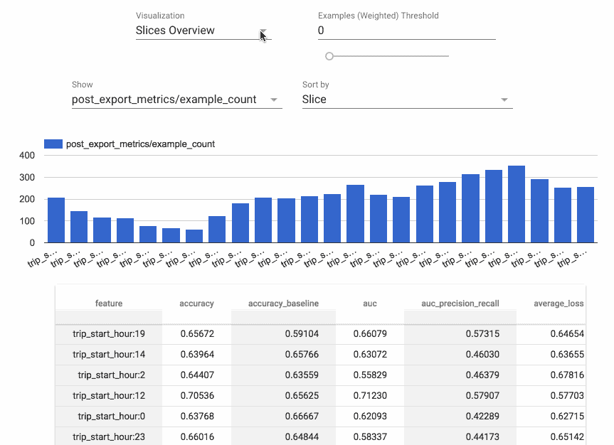

来源:[https://blog . tensor flow . org/2018/03/introducing-tensor flow-model-analysis . html](https://blog.tensorflow.org/2018/03/introducing-tensorflow-model-analysis.html)

这一步的输出是一组**性能指标**和一个关于是否将该模型推广到生产的**决策**。

## **模特上菜**

与我们通常关心数据和模型复杂性的训练组件相反。在服务组件中，我们感兴趣的是通过最小化响应延迟和最大化吞吐量来响应可变的用户需求。

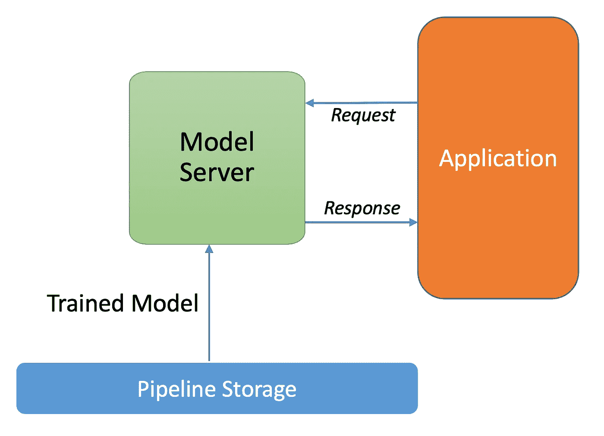

作者图片

因此，服务组件应该具有低延迟以快速响应用户，高效以便在需要时可以同时运行许多实例，水平伸缩，可靠并对故障具有鲁棒性。

我们还需要我们的服务组件能够轻松地更新到模型的新版本。当我们获得新数据或触发新的管道运行，或测试新的模型架构想法时，我们会希望推出新版本的模型，我们希望系统无缝过渡到这个新版本。

## **监控**

正如我们前面提到的，由于不断发展的数据配置文件，我们部署的 ML 模型的性能会随着时间的推移而下降，我们需要确保我们的系统正在监控并响应这种下降。

因此，我们需要跟踪数据的汇总统计，并监控模型的在线性能，以便发送通知，在值偏离我们的预期时回滚，或者潜在地调用 ML 流程中的新迭代。

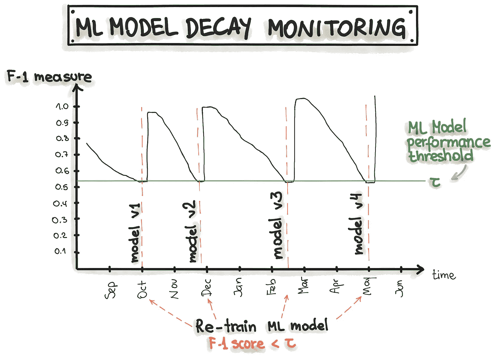

来源:https://ml-ops.org/content/mlops-principles

因此，在线监控是检测性能下降和模型过时的关键。它作为新的实验迭代和基于新数据的模型再训练的线索。

## 管道编排组件

我们刚刚描述的步骤的自动化水平定义了我们的 ML 系统的成熟度，它也反映了由模型衰减或给定的新数据触发的训练新模型的速度。

在当前的许多用例中，手动过程碰巧非常普遍。当模型由于静态数据分布而很少改变时，这可能就足够了。但在实践中，这种情况很少发生。数据通常是动态的，模型在现实世界中部署时会经常崩溃。静态模型肯定无法适应描述环境的数据的变化。

手动过程也可能是危险的，因为它会造成 ML 培训和 ML 服务之间的脱节。它将创建模型的数据科学家和作为预测服务操作模型的工程师分开。并且这个过程会导致训练服务偏斜问题。

编排组件的目标是连接系统的不同组件。它按顺序运行管道，并根据定义的条件自动从一个步骤移动到另一个步骤。这是自动化的第一步，因为我们现在可以使用基于实时管道触发器的新数据自动训练生产中的新模型。

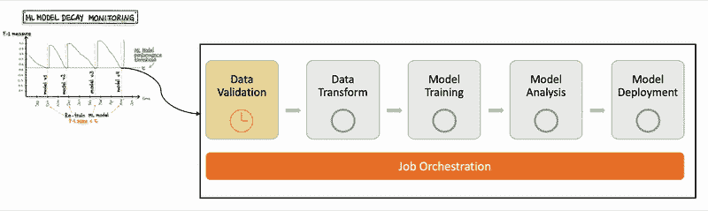

作者图片

我们需要注意的是，在生产中，我们不会将一个经过训练的模型作为预测服务来部署。实际上，我们正在部署一个完整的训练管道，它会自动循环运行，为经过训练的模型提供预测服务。

## 管道元数据存储

管道元数据存储的作用是记录 ML 管道执行的所有细节。这对于保持组件之间的血统和在任何需要的时候重现部署的模型是非常重要的。它还帮助我们调试遇到的任何错误。

每次我们执行管道时，商店都会记录有关管道执行的所有详细信息，例如:

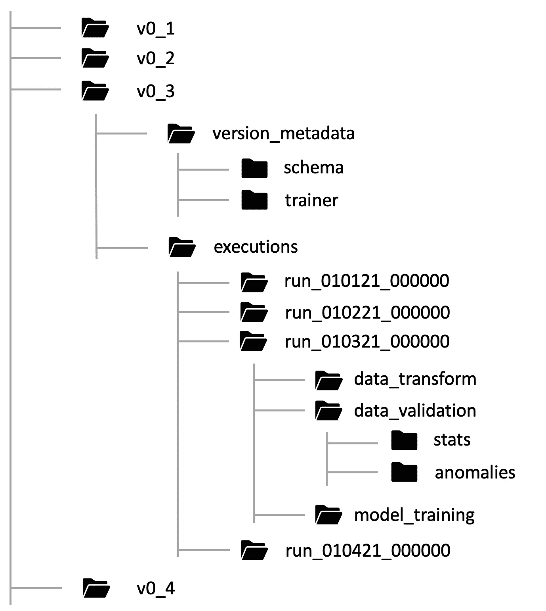

作者图片

*   执行的管道和组件源代码的版本。
*   传递给管道的输入参数。
*   由我们的管道的每个执行组件产生的工件/输出，例如到原始数据、转换数据集、验证统计和异常、训练模型的路径…
*   模型评估度量，以及关于模型部署的模型验证决策，它是在模型分析和验证组件中产生的…

# CI/CD 流水线自动化

到目前为止，我们只讨论了如何自动化 ML 管道的连续执行，以根据触发器(如新数据的可用性或模型衰退)重新训练新模型，从而捕获新的新兴模式。

但是如果我们想要测试一个新的特性，一个新的模型架构，或者一个新的超参数呢？这就是自动化 CI/CD 管道的意义所在。CI/CD 管道允许我们快速探索新的想法和实验。它让我们能够自动构建、测试和部署新的管道及其组件到预期的环境中。

以下是 CI/CD 管道自动化对连续 ML 管道自动化的补充:

*   如果给定新的实现/代码(新的模型架构、特征工程和超参数…)，一个成功的 CI/CD 管道部署一个新的连续 ML 管道。
*   如果给定新数据(或模型衰减触发器)，成功的自动化连续管道部署新的预测服务。为了用新数据训练新的 ML 模型，对新数据执行先前部署的 ML 管道。

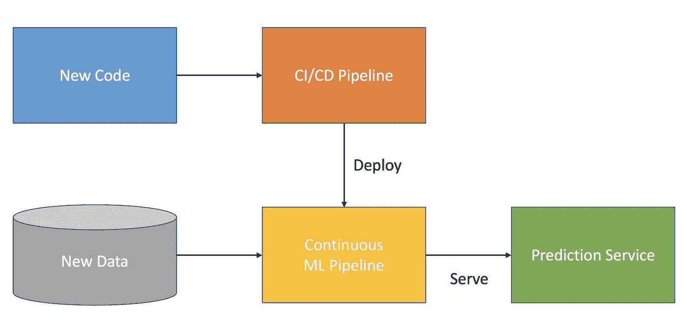

作者图片

完整的端到端自动化管道应该是这样的:

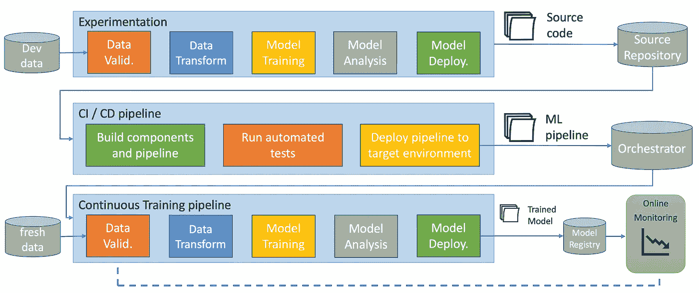

作者图片——灵感来自谷歌云技术，来源:[https://cloud.withgoogle.com/next/sf/sessions?session=AI212](https://cloud.withgoogle.com/next/sf/sessions?session=AI212)

*   我们迭代地尝试新的 ML 想法，其中我们的一些管道组件被更新(例如引入一个新的特性将看到我们更新数据转换组件……)。这个阶段的输出是新的 ML 管道组件的源代码，然后这些组件被推送到目标环境的源存储库。
*   新源代码的出现将触发 CI/CD 管道，CI/CD 管道将反过来构建新的组件和管道，运行相应的单元和集成测试以确保所有内容都正确编码和配置，并且如果所有测试都已通过，则最终将新管道部署到目标环境。ML 系统的单元和集成测试本身值得一篇独立的文章。
*   新部署的管道在生产中基于时间表、新训练数据的存在或响应触发器而自动执行。此阶段的输出是一个经过训练的模型，该模型被推送到模型注册中心并被持续监控。

# 为什么是 Tensorflow？

在这最后一节，我想提到为什么 Tensorflow 是我开发集成 ML 系统的首选框架。当然，TensorFlow 可能并不适合所有用例，有时甚至可能是大材小用，尤其是在不需要深度学习的时候。然而，我倾向于尽可能使用 Tensorflow，原因如下:

*   Tensorflow 附带 Tensorflow Extended (TFX)。TFX 允许我们专注于优化 ML 管道，而不去关注每次都重复的样板代码。像数据验证和模型分析这样的组件可以很容易地完成，而不必开发定制代码来读取我们的数据并检测 2 个管道执行之间的异常。使用 TFX，这可以用很少的几行代码来完成，从而节省了我们开发管道组件的大量时间。数据验证和模型分析组件中的屏幕截图来自 TFX。将来我会努力写一篇关于 TFX 的文章。
*   我们可以使用 TF layers API、TF losses APIs 等从层中构建定制模型。如果我们正在构建一些相当标准的东西，TensorFlow 有一套预制的评估工具，我们可以试用。Tensorflow 2 适用于 Keras 模型。
*   随着数据和训练时间的增长，我们的需求也会增加。检查点允许我们在需要的时候暂停和恢复训练，如果预设的次数不够，可以继续训练。
*   Tensorflow 设计有 dataset API，可以很好地处理内存不足的数据集。
*   模特训练可能需要几个小时，有时甚至几天。我们不能在不检查模型是否按预期运行的情况下长时间训练我们的模型。Tensorboard 是 TensorFlow 的可视化工具包。TensorBoard 提供了机器学习实验所需的可视化和工具。它允许我们在训练过程中显示实时生成的 TensorFlow 关键指标，并在训练集和验证集上可视化它们，以查看我们的模型是否正确配置为收敛。如果不是这样，这将允许我们停止训练。
*   我们可以在集群上分布 TensorFlow，让它更快。从一台机器到多台机器可能听起来很复杂，但有了 Tensorflow，我们可以开箱即用地进行分发。TF 抽象出了用于训练和评估的分布式执行的细节，同时还支持跨本地/非分布式和分布式配置的一致行为。

# 参考

    

Eric Breck，Neoklis Polyzotis，Sudip Roy，Steven Euijong Whang，Martin Zinkevich，[机器学习的数据验证](https://mlsys.org/Conferences/2019/doc/2019/167.pdf) (2019)，SysML 大会【https://systemsandml.org 

[使用 TFX、Kubeflow 管道和云构建的 MLOps 架构](https://cloud.google.com/solutions/machine-learning/architecture-for-mlops-using-tfx-kubeflow-pipelines-and-cloud-build)