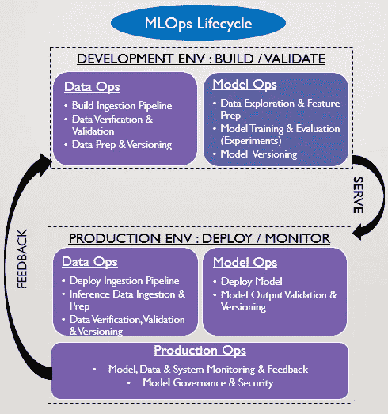
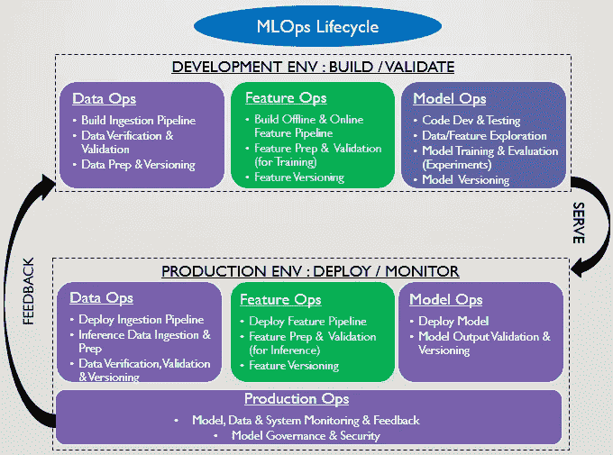

# MLOps:特性存储的作用

> 原文：<https://towardsdatascience.com/mlops-the-role-of-feature-stores-d30108dedf0?source=collection_archive---------8----------------------->

## 要素存储就像数据科学的数据仓库。他们的主要目标是使数据科学家能够缩短从数据摄取到 ML 模型训练和推理的时间。因此，它们填补了 MLOps 生命周期中的一个重要空白。

由[普罗诺吉特·萨哈](https://www.linkedin.com/in/pronojitsaha/)、[阿纳·博斯](https://www.linkedin.com/in/arnab-bose-phd-6369531/)、&纳文·阿胡贾博士

# 什么是功能商店？

特征库是一个数据管理系统，用于管理机器学习特征，包括特征工程代码和特征数据。**它是一个中央保险库，用于存储文档化、管理化和访问受控的功能，这些功能可以在整个组织的许多不同 ML 模型中使用。**它从各种来源获取数据，并执行定义的转换、聚合、验证和其他操作来创建特征。特征存储注册可用的特征，并使它们准备好被 ML 训练管道和推理服务发现和使用。

# MLOps 生命周期

图 1: MLOps 生命周期(图片由作者提供)

我们在很高的层次上定义了 MLOps 生命周期，包括图 1 所示的开发(“Dev”)和生产(“Prod”)环境中的以下组件。

**开发环境**

1.  **data ops**:ml ops 生命周期的第一步涉及数据的所有方面，从构建数据接收管道到从各种来源获取数据。随后是数据验证&验证，在摄取管道中整合验证逻辑。接下来是数据准备，通过处理、转换，最后用适当的版本保持它。这些步骤构成了在开发环境中根据批处理或实时数据构建和测试的数据管道。
2.  **ModelOps** :获取数据后，进行探索性数据分析(EDA)以获得初步见解并生成报告。理解 EDA 后的数据有助于下一步——特征工程。然后使用这些特征开发 ML 算法。然后使用版本控制系统(例如 git)对算法代码进行理想的版本控制，并进行测试以确保代码按预期运行。最后，部署数据和模型管道，以便在开发环境中执行和测试。一旦部署了管道，就会使用不同的输入值和不同的模型架构进行各种实验。根据模型度量来评估结果。此外，还对模型进行了解释和误差分析，以便更好地理解模型并改进其性能。最后，从各种实验中选择最佳模型，部署到产品中。

**生产环境**

1.  **DataOps & ModelOps** :使用服务工具将内置于 Dev 中的数据和模型管道部署在 Prod 中。部署后，数据管道获取、验证和准备要进行推理的数据。然后，模型管道使用推断数据来生成预测/报告。
2.  **生产操作**:跨生产中的数据操作&模型操作，持续监控数据&模型性能，以确保无漂移。各种度量帮助我们做同样的事情，我们可以从本系列的早期文章[这里](/mlops-model-monitoring-101-46de6a578e03)了解更多。这种监控启动了一个重要的反馈循环，返回到开发周期，用于进一步的模型重新训练和/或其他更改(如果需要),并完成我们的 MLOps 生命周期。此外，还处理各种治理(用户控制、道德、偏见等)和安全(数据、模型)方面。

# MLOps 生命周期的差距

有人可能想知道为什么特性存储在上面的讨论中被忽略了。组织已经实现了各种风格的功能存储，并且在大多数情况下，它作为 ModelOps 的一部分。然而，一个特征库应该被单独划分出来(如下图 2 所示)，因为它可以使**特征操作，**引导在模型操作期间加快&实验时间。它还减少了组织内多个用例中模型操作的冗余。

图 MLOps 生命周期中的差距—功能操作

> **差距:**功能操作是当前 MLOps 生命周期中的差距。在没有 it 的情况下，组织&数据科学家做大量重复的工作，一次又一次地创建相同的功能，然后针对不同的用例验证它们。这大大加快了上市时间。进一步的初学者数据科学家可能无法在他们的建模中构思重要的特征，而这些特征可能已经由高级团队成员在更早的时候完成了。这阻碍了敏捷开发和有效的团队协作。

我们将在下一篇文章中讨论 FeatureOps 的更多细节，在那里我们将了解特性库的主要组件和功能。现在，重要的是要注意到，在 2020 年之前，没有一个大的 ML 平台提供商(AWS，GCP，Azure)有一个针对该功能的定义良好的产品。最近在 2020 年 12 月，亚马逊宣布了 SageMaker [功能商店](https://aws.amazon.com/about-aws/whats-new/2020/12/introducing-amazon-sagemaker-feature-store/)，随后谷歌在 2021 年 5 月发布了他们的 MLOps 平台 VertexAI，该平台具有[功能商店组件](https://cloud.google.com/vertex-ai/docs/featurestore)。最后，Databricks 在 2021 年 6 月发布了 Azure 平台支持的特性商店实现的[公开预览版](https://docs.microsoft.com/en-us/azure/databricks/applications/machine-learning/feature-store)。除此之外，我们还有像 [Hopsworks](https://www.logicalclocks.com/) 和 [Tecton](http://tecton.ai) 这样的初创公司，以及像 [Feast](https://feast.dev/) 这样的开源项目，它们在功能商店中处于领先地位。Abzooba Inc .有一个名为 [xpresso.ai](http://Xpresso.ai) 的 MLOps 平台，它建立在这里讨论的许多概念之上。因此，整个行业都在努力填补 MLOps 生命周期中的这一空白。

# 结论

人们常说，数据科学家 80%的时间都花在了数据争论上，包括获取数据、接收数据、清理数据和分析数据特征等任务。一个定义良好的功能库使功能可以在一个地方使用，从而缩短了时间。它还促进团队协作、重用，并导致更快的模型实验和推理结果。