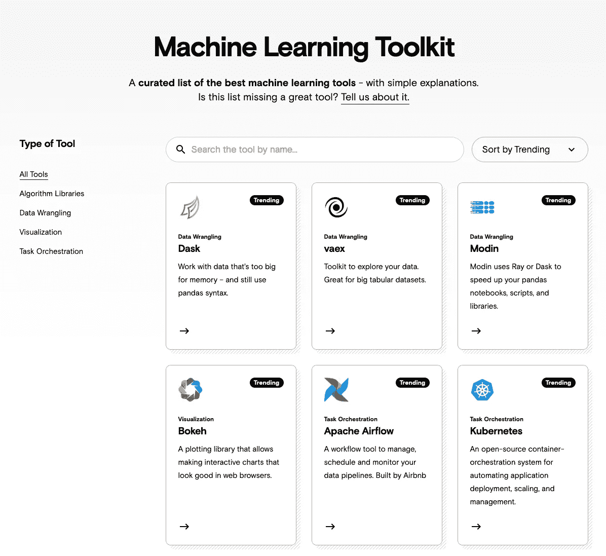
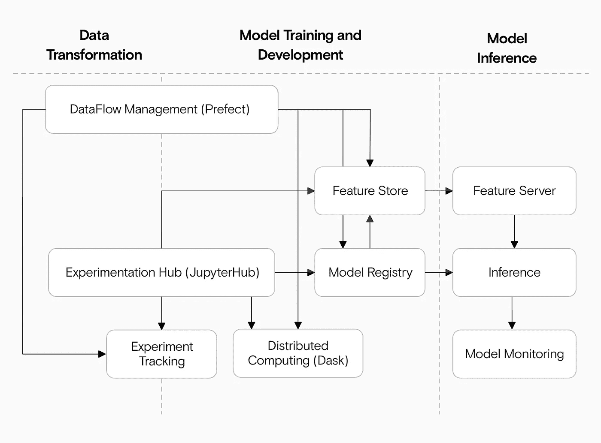

# MLOps:终极指南

> 原文：<https://towardsdatascience.com/mlops-the-ultimate-guide-9d902c752fd1?source=collection_archive---------21----------------------->

## 一本关于 MLOps 和如何思考它的手册

来源:作者

# ‍What 是 MLOps？

你会在 MLOps 上发现相互矛盾的定义:它是一场运动，一种哲学，一个平台，还是一个职位？大多数要么太模糊——一种“哲学”——要么太具体，仅仅指一个特定的工具集。

以下是我们对 MLOPs 的定义:

> MLOps 是一个行业公认的最佳实践的集合，用于管理您的机器学习团队中的代码、数据和模型。

这意味着 MLOps 应该在以下方面帮助您的团队:

*   **管理代码:** MLOps 鼓励标准的软件开发最佳实践，并支持持续的开发和部署。
*   **最佳实践:**指导方针确保您从创意到实验，再到在生产中部署可靠的模型，实现无缝过渡。
*   **管理数据:**框架和工作流有助于处理、保存和跟踪数据集的版本。
*   **高效协作:**团队可以共享代码、数据、模型和实验；跑一跑，了解一下对方的工作；并重复以前的工作。
*   **管理模型:**您可以轻松地训练模型，跟踪实验结果，并部署健壮的 API。

MLOps 是一个广阔的领域，因此我们将从较高的层面来看待这个领域，然后深入探讨采用它时会遇到的主题。

# MLOps 前景

决定使用最好的工具以及如何开始可能很难。[我们的机器学习工具页面](https://datarevenue.com/machine-learning-software-tools)提供了最有用工具的概述和简单解释。

概述了许多 MLOps 架构中最有用的机器学习工具和平台。来源:作者

这些 MLOps 工具涵盖了从数据争论、可视化和任务自动化到培训和部署的所有内容。我们专注于开源选项，但也有这么多专有平台可用，这值得吗？

# MLOps:构建与购买

许多商业平台旨在使 MLOps 更简单，而“构建 vs 购买”是许多团队提出的问题。人们经常“购买”是因为他们对构建自己的工具或使用开源选项缺乏信心。昂贵的专有平台有望简化所有的复杂性。

但是专有工具经常不能兑现它们的承诺，最终反而会耗费和限制你的团队。他们保证的捷径往往是不可能的；您的团队仍然需要内部的 MLOps 专业知识来有效地使用它们。

这就是为什么我们强烈支持为 MLOps 开发开源工具的原因。免费的开源工具通常是正确的选择:它们导致更低的成本、更大的灵活性、更多的学习、**和**更容易入职——不管专有平台会让你相信什么。

如果您信任您的工程团队，我们建议从现有的开源组件构建您自己的解决方案，而不是试图将您的独特需求融入到其他人的专有平台中。

但是，如果你想建立自己的，你如何开始没有浪费几个月的时间研究所有的选项？我们寻找一个开源的 MLOps 蓝图，但找不到，所以我们建立了它。

现在，您可以跳过我们几个月的研究和工程工作，在几个小时内建立一个开源的、以生产为中心的 MLOps 框架。

# 开源、现成的 MLOps 架构

生产机器学习解决方案需要处理数据流、实验、特征和服务。来源:作者

如果您既想要自己解决方案的强大和灵活性，又想要托管专有解决方案的简单和快速，请看看[我们的开放式 MLOps 架构](https://github.com/datarevenue-berlin/OpenMLOps/)。这是一套 terraform 脚本，用于设置我们在 Kubernetes 上内部使用的相同系统，您可以在不到一天的时间内完成设置。

以下是开放式 MLOps 的优势:

*   免费、灵活、开源:我们完全使用开源工具构建了开放的 MLOps。这意味着，如果您有其他需求，很容易适应:只需将组件换成其他工具或您自己的定制解决方案。
*   **容易上手:**很多 MLOps 工具都有很陡的学习曲线。我们已经编写了[逐步指南](https://github.com/datarevenue-berlin/OpenMLOps/tree/master/tutorials)，这样你可以在几个小时内完成一个示例项目，然后开始运行你自己的项目。
*   **可扩展** : Open MLOps 运行在 Kubernetes 上，因此可以根据您的需求轻松扩展或缩小。如果您正在运行巨大的工作负载，您可以增加更多的计算能力。如果预算有限，可以在小型集群上运行。

开放式 MLOps 包括以下组件:

*   [**JupyterHub**](https://jupyter.org/hub) ，一个供你的团队协作的共享笔记本环境。
*   [**ml flow**](https://mlflow.org/)**跟踪你的实验和模型。**
*   **[**提督**](https://prefect.io) 管理您的工作流程和预定任务。**
*   **[**谢顿**](https://www.seldon.io/) 把你的模型生产化，变成 API。**

**您可以在现有的 Kubernetes 集群中设置一切，或者运行我们的简单设置脚本，使用 AWS EKS 创建一个新的集群。即使您使用预构建的解决方案，您可能仍需要构建 MLOps 的内部专业知识，因此我们列出了一些好的资源来帮助您开始。**

# **MLOps 资源**

**我们已经写了很多关于 MLOps 的文章。以下是我们的最爱，在您 MLOps 旅程的不同阶段为您提供帮助。**

# **MLOps 和机器学习入门**

**如果您希望采用 MLOps，并希望在开始构建之前了解更多信息，您应该从以下几点开始:**

*   **[进行机器学习的四种方式](https://datarevenue.com/en-blog/the-4-ways-of-doing-machine-learning):在高层次上理解采用机器学习的不同方式。**
*   **[面向研究团队的 MLOps](https://datarevenue.com/en-blog/mlops-for-research-teams):理解为什么 MLOps 不仅面向行业，对研究团队也很重要。**
*   **[机器学习架构组件](https://datarevenue.com/en-blog/machine-learning-project-architecture):了解大多数机器学习解决方案的重要部分。**
*   **[面向 MLOps 的开源软件](https://datarevenue.com/en-blog/own-your-mlops-pipeline-using-oss):理解为什么开源通常比专有解决方案更好。**
*   **[软件开发 vs 机器学习工程](https://datarevenue.com/en-blog/software-development-vs-machine-learning-engineering):理解为什么机器学习工程有额外的挑战，甚至会绊倒有经验的软件工程师。**
*   **[MLOps for Model Decay](https://datarevenue.com/en-blog/mlops-for-model-decay) :理解为什么你不能“解雇并忘记”你的模型，即使它们表现得很好。**
*   **[为什么模型注册中心很有价值？](https://datarevenue.com/en-blog/why-is-a-model-registry-valuable) : 理解跟踪你的模型是如何以及为什么重要。**
*   **[为什么您需要模型服务工具](https://datarevenue.com/en-blog/why-you-need-a-model-serving-tool-such-as-seldon):了解如何在生产环境中服务您的模型。**

# **选择工具来设置您自己的 MLOps 平台**

**一旦您选择采用 MLOps，您将需要一些特定的工具和平台。鉴于选项的广泛性，这可能是最难的部分，所以我们比较了我们最喜欢的，并删减了营销用语，以使您更容易理解。**

*   **[选择特色店](https://datarevenue.com/en-blog/feature-store-feast-vs-hopsworks):**为什么需要特色店，如何选择。****
*   **[为什么我们喜欢将 Prefect 作为一个数据和工作流平台](https://datarevenue.com/en-blog/what-we-are-loving-about-prefect):为什么你应该考虑将 Prefect 作为你的任务调度器和工作流工具。**
*   **[Kubeflow:还没准备好生产？](https://datarevenue.com/en-blog/kubeflow-not-ready-for-production):我们在切换到 Prefect 之前发现的 Kubeflow 的问题。**
*   **[比较 MLOps 平台:data iku vs Alteryx vs SageMaker vs data bricks](https://datarevenue.com/en-blog/ml-platforms-dataiku-vs-alteryx-vs-sagemaker)**
*   **[比较仪表板解决方案:流线型与破折号与闪亮与瞧吧](https://datarevenue.com/en-blog/data-dashboarding-streamlit-vs-dash-vs-shiny-vs-voila)**
*   **[比较工作流平台:air flow vs Luigi vs Prefect vs ml flow vs kube flow](https://datarevenue.com/en-blog/airflow-vs-luigi-vs-argo-vs-mlflow-vs-kubeflow)**
*   **[对比数据角力工具:熊猫 vs Dask vs Vaex vs 摩丁 vs Ray](https://datarevenue.com/en-blog/pandas-vs-dask-vs-vaex-vs-modin-vs-rapids-vs-ray)**

# **设置打开的 MLOps**

**一旦你选择了你的工具，你需要设置和配置它们。如果您想模仿我们在 Data Revenue 内部使用 Open MLOps 的设置，我们已经创建了一些分步指南来快速启动和运行 JupyterHub、Prefect、Seldon、Dask 和 MLFlow。**

*   **[建立开放的 MLOps:一个用于机器学习的开源产品架构](https://github.com/datarevenue-berlin/OpenMLOps/blob/master/tutorials/set-up-open-source-production-mlops-architecture-aws.md)**
*   **[在打开的 MLOps 上使用 JupyterHub、提督和 ml flow](https://github.com/datarevenue-berlin/OpenMLOps/blob/master/tutorials/basic-usage-of-jupyter-mlflow-and-prefect.md)**
*   **[使用 MLFlow、Prefect 和 Seldon 将您的模型部署为 API](https://github.com/datarevenue-berlin/OpenMLOps/blob/master/tutorials/deploy-model-seldon.md)**

# **获得帮助**

**如果你需要帮助建立你的 MLOps 团队，请随时联系。**