# 与 Docker 和 Jenkins 的 MLOps:自动化机器学习管道

> 原文：<https://towardsdatascience.com/mlops-with-docker-and-jenkins-automating-machine-learning-pipelines-a3a4026c4487?source=collection_archive---------7----------------------->

## 如何用 Docker 将你的 ML 模型容器化，用 Jenkins 将管道自动化


在 [Unsplash](https://unsplash.com?utm_source=medium&utm_medium=referral) 上由 [Bernd Dittrich](https://unsplash.com/@hdbernd?utm_source=medium&utm_medium=referral) 拍摄的照片

# 介绍

这篇文章的目的是提供一个例子，说明我们如何使用 Docker 和 Jenkins 这样的 DevOps 工具来自动化机器学习管道。在这篇文章的最后，你将知道如何用 Docker 封装一个机器学习模型，并使用 Jenkins 创建一个管道，该管道自动处理原始数据，训练模型，并在每次我们对我们的存储库进行更改时返回测试准确性。

这个帖子需要的所有代码都可以在 [Github](https://github.com/Adricarpin/MLOps-with-Docker-and-Jenkins) 中找到。

对于这项任务，我们将使用[成人人口普查收入数据集](https://www.kaggle.com/uciml/adult-census-income)。目标变量是收入:一个二元变量，表示个人年收入是否超过 5 万英镑。

📒注意:由于本文的目的是自动化机器学习管道，我们不会深入研究 EDA，因为这超出了范围。如果你对此感到好奇，你可以查看这个 [Kaggle 笔记本](https://www.kaggle.com/adro99/from-na-ve-to-xgboost-and-ann-adult-census-income)，但这并不是强制性的，以便了解这里做了什么。

好，那我们开始吧！

# 制定战略

在开始编码之前，我认为重要的是理解计划是什么。如果你看一下 [Github 库](https://medium.com/@adro99/mlops-with-docker-and-jenkins-automating-machine-learning-pipelines-a3a4026c4487)你会看到三个 python 脚本:通过查看它们的名字就很容易知道它们是做什么的:)。我们还有原始数据集:成人. csv 和一个 docker 文件(我们将在后面讨论)。但现在我想让你了解这个项目的工作流程，为此，我们需要做的第一件事是了解我们的 Python 脚本的输入和输出是什么:

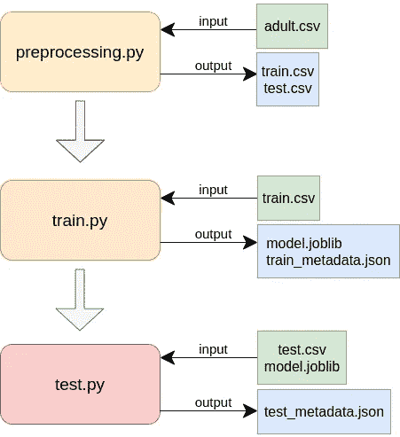

作者图片

正如我们在图中看到的，preprocessing.py 将原始数据作为输入，输出处理后的数据，分成训练和测试两部分。train.py 将训练处理后的数据作为输入，并输出模型和一个 json 文件，我们将在其中存储验证准确性。test.py 将测试处理后的数据和模型作为输入，并输出一个具有测试精度的 json 文件。

考虑到这一点，现在我们有了一堆必须按一定顺序运行的脚本，它们创建了一堆我们需要存储和访问的文件。此外，我们希望自动化所有这一过程。

现在，处理这个问题的最好方法是使用 Docker:使用这个工具，你可以创建一个独立的环境，拥有运行你的代码所需的所有依赖关系(解决“它在我的机器上工作”的问题！)那就更容易了。一旦我们有了这些，我们就能自动处理 Jenkins 的所有流程。

Docker 基于 3 个概念:容器、图像和 Docker 文件。为了与 Docker 合作，了解他们的工作是不可或缺的。如果你不熟悉它们，这里有一个直观的定义:

*   容器:一个标准的软件单元，它打包了运行应用程序所需的一切(依赖项、环境变量……)
*   Dockerfile:这是一个文件，你可以在其中定义你想在容器中包含的所有内容。
*   图片:这是运行容器所需的蓝图。您可以通过执行 Dockerfile 文件来构建映像。

所以，为了使用 Docker，你将遵循以下步骤:

1.  定义 Dockerfile 文件
2.  建立形象
3.  运行集装箱
4.  在容器内运行命令

我们一步一步来。

# 定义 Dockerfile 文件

在这里，我们必须定义运行管道所需的一切。你可以看一下[库](https://github.com/Adricarpin/MLOps-with-Docker-and-Jenkins)中的 Dockerfile，但是如果你不熟悉语法，一开始可能会有些不知所措。所以我们在这里要做的是谈论我们想要在它里面指定什么，并且一步一步地看语法。

首先，我们需要指定我们希望在哪里运行管道。对于大多数容器化的应用程序，人们会选择轻量级的 Linux 发行版，比如 alpine。然而，对于我们的管道，我们将只使用一个名为`jupyter/scipy-notebook`的 jupyter 图像。在 Dockerfile 文件中，我们指定以下命令:

```
FROM jupyter/scipy-notebook
```

然后，我们必须安装一些软件包。为此，我们使用命令`RUN`:

```
USER root RUN apt-get update && apt-get install -y jq RUN pip install joblib
```

📒注意:现在这可能没有多大意义，但是我们需要`jq`来访问 json 文件中的值，还需要`joblib`来序列化和反序列化模型。

接下来我们要设置的是容器中文件的分布。我们想建造一个内部具有这种结构的容器:

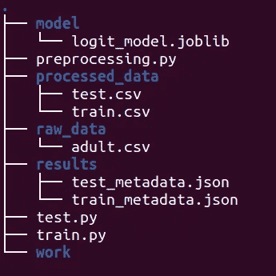

作者图片

📒注意:“工作”文件夹由 Docker 自动生成。我们不会在里面放任何东西。

首先，我们创建文件夹:

```
RUN mkdir model raw_data processed_data results
```

然后我们将目录设置为环境变量(这样我们就不会在整个代码中硬编码路径)

```
ENV MODEL_DIR=/home/jovyan/modelENV RAW_DATA_DIR=/home/jovyan/raw_dataENV PROCESSED_DATA_DIR=/home/jovyan/processed_dataENV RESULTS_DIR=/home/jovyan/resultsENV RAW_DATA_FILE=adult.csv
```

最后，我们设置从存储库中复制脚本和原始数据的顺序。一旦我们创建了容器，它们就会被粘贴到我们的容器中。

```
COPY adult.csv ./raw_data/adult.csv COPY preprocessing.py ./preprocessing.py COPY train.py ./train.py COPY test.py ./test.py
```

# 建立形象

一旦我们指定了 docker 文件，我们就可以构建映像了。执行此操作的命令是:

```
sudo -S docker build -t adult-model .
```

我们用`-t adult-model` (-t 代表标签)指定图像的名称，用`.`指定 Dockerfile 的路径。Docker 会自动选择名为“Dockerfile”的文件。

# 运行容器

现在我们有了一个图像(一个容器的蓝图)，我们可以构建一个容器了！

📒注意:我们将只构建一个容器，但是如果你不知道，一旦我们有了一个图像，我们就可以构建任意多的容器了！这带来了广泛的可能性。

运行容器的命令如下:

```
sudo -S docker run -d --name model adult-model
```

其中-d 标志表示分离(在后台运行容器)。我们将其命名为“模型”，并指定我们使用的图像(成人模型)。

# 在容器内运行命令

现在我们已经运行了我们的容器，我们可以通过使用`docker exec`在里面运行命令。在这个项目中，我们需要按顺序执行脚本，然后显示结果。我们可以通过以下命令来实现:

*   运行预处理. py

```
sudo -S docker container exec model python3 preprocessing.py
```

*   运行 train.py

```
sudo -S docker container exec model python3 train.py
```

*   运行 test.py

```
sudo -S docker container exec model python3 test.py
```

*   显示验证准确性和测试准确性

```
sudo -S docker container exec model cat \
/home/jovyan/results/train_metadata.json \
/home/jovyan/results/test_metadata.json
```

📒注意:如果你足够好奇(我猜你是)，你会想知道每个脚本实际上是做什么的。别担心，如果你熟悉基本的机器学习工具(这里我基本用的是熊猫和 SKlearn 库)，你可以打开脚本看一下代码。没什么大不了的大部分台词都被评论了。如果你想深入了解或者你正在寻找比这里显示的更复杂的模型，你可以看看[这个笔记本](https://www.kaggle.com/adro99/from-na-ve-to-xgboost-and-ann-adult-census-income)。

# 测试步骤

在构建管道时，通常会有一个专门的步骤来测试应用程序是否构建良好，是否足以部署到生产中。在这个项目中，我们将使用一个条件语句来测试验证准确性是否高于阈值。如果是，则部署该模型。如果没有，该过程停止。执行此操作的代码如下:

```
val_acc=$(sudo -S docker container exec model  jq .validation_acc \ /home/jovyan/results/train_metadata.json)threshold=0.8

if echo "$threshold > $val_acc" | bc -l | grep -q 1
then
	echo 'validation accuracy is lower than the threshold, process stopped'
else
   echo 'validation accuracy is higher than the threshold'
   sudo -S docker container exec model python3 test.py
   sudo -S docker container exec model cat \ /home/jovyan/results/train_metadata.json \ /home/jovyan/results/test_metadata.json 
fi
```

如您所见，首先我们设置两个想要比较的变量(验证准确性和阈值)，然后我们通过一个条件语句传递它们。如果验证准确性高于阈值，我们将为测试数据执行模型，然后我们将显示测试和验证结果。否则，该过程将停止。

我们做到了！我们的模型是完全容器化的，我们可以运行管道中的所有步骤！

## Docker 初学者的问题:我们所做的有什么意义？

如果你不熟悉 Docker，现在你可能会问:好吧，这些都是好东西，但最终我只有我的模型和我的预测。我也可以通过运行我的 Python 代码来获得它们，而不需要学习 Docker。那么，这一切有什么意义呢？

我很高兴你问了😎。

首先，将您的机器学习模型放在 Docker 容器中对于将该模型部署到生产环境中非常有用。举个例子，你有多少次在教程或库中看到你试图复制的代码，当在你的机器上运行相同的代码时，你的屏幕充满了红色？如果我们不愿意经历这些，想象一下我们的客户会有什么感受。有了 Docker 容器，这个问题就解决了。

Docker 真正有用的另一个原因可能与您阅读本文的原因相同:帮助自动化整个管道。

所以，事不宜迟，我们开门见山吧！

# 利用 Jenkins 实现 ML 管道的自动化

对于这一步，我们将使用 Jenkins，这是一个非常著名的开源自动化服务器，它提供了一系列插件来支持构建、部署和自动化任何项目。

这一次，我们将使用名为 jobs 的工具来构建管道的步骤。每项工作都将是我们工作流程中的一步。

📒注意:为了让事情顺利运行，您可能需要配置一些东西:

*   如果您在本地主机上使用 Jenkins，那么您在尝试将 Jenkins 与 Github 连接时可能会遇到一些问题。如果是这种情况，请考虑创建一个到本地主机的安全 URL。我发现最好的工具是 [ngrok](https://ngrok.com/) 。
*   由于 jenkins 使用自己的用户(称为 Jenkins ),您可能需要授予它权限，以便在没有密码的情况下执行命令。你可以通过用`sudo visudo /etc/sudoers`打开 sudoers 文件并粘贴`jenkins ALL=(ALL) NOPASSWD: ALL`来实现。

话虽如此，我们还是看看有什么计划吧。我们将创造 4 个就业机会:

1.  “github-to-container”工作:在这项工作中，我们将 Jenkins 与 github“连接”,每次在 Github 中提交时都会触发这项工作。我们还将构建 Docker 映像并运行一个容器。
2.  “预处理”作业:在这一步中，我们将执行 preprocessing.py 脚本。该作业将由“github 到容器”作业触发。
3.  “train”作业:在这个作业中，我们将执行 train.py 脚本。该作业将由“预处理”作业触发。
4.  “测试”工作:在这项工作中，我们将通过我们的条件语句传递验证分数。如果它高于阈值，我们将执行 test.py 脚本并显示元数据(验证和测试准确性)。如果验证分数低于阈值，则该过程将停止，并且不会提供元数据。

一旦我们知道该做什么，让我们去做吧！

# 创造詹金斯就业机会

## github 到容器的工作

对于 github 到容器的工作，首先我们需要在 github 和 Jenkins 之间创建一个“连接”。这是使用 webhooks 完成的。要创建 Webhook，请转到 Github 中的存储库，选择 settings 并选择 webhooks。选择添加 webhook。在有效负载 URL 中，传递运行 Jenkins 的 URL 并添加“//github-webhook/”。对于内容类型，选择“应用程序/json”。对于“您希望哪个事件触发这个 webhook？”，选择“仅推送事件”。在底部选择活动。选择添加 webhook。

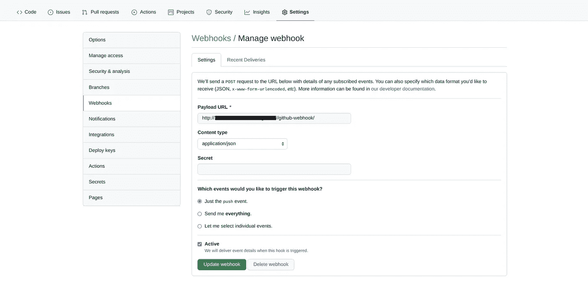

作者图片

然后，您需要在 Jenkins 中创建一个凭证来访问 Github。在詹金斯，转到管理詹金斯

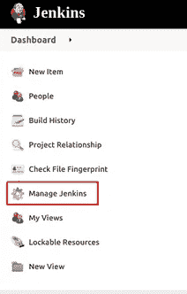

作者图片

然后选择管理凭据，

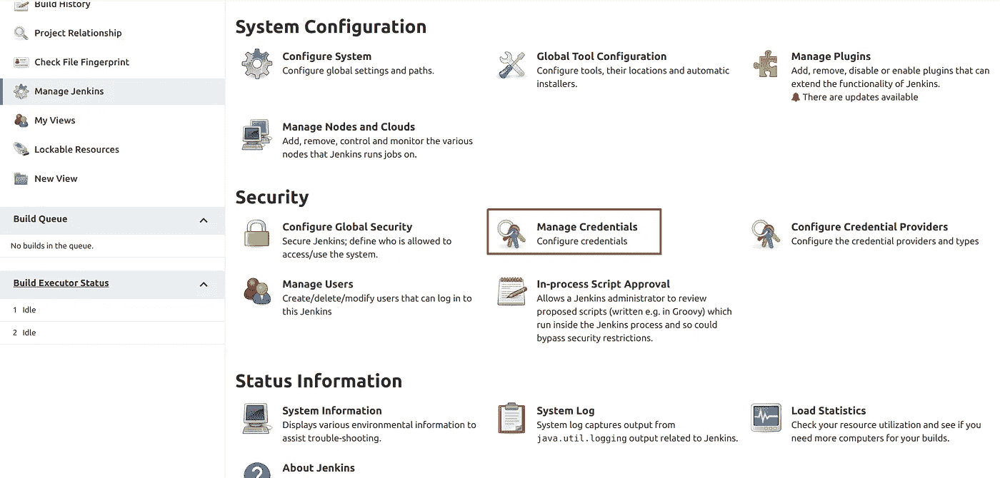

作者图片

在“Jenkins 范围内的商店”中，选择 Jenkins

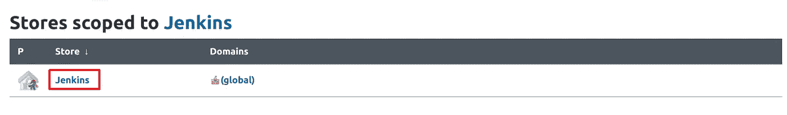

作者图片

然后选择“全局凭证(无限制)”

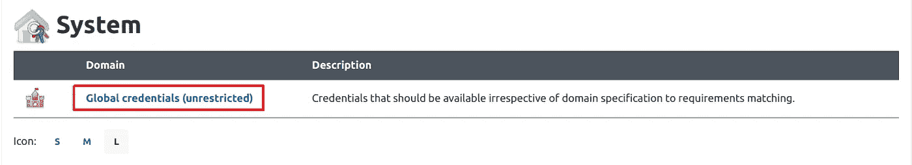

作者图片

并添加凭据

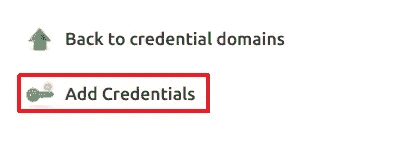

作者图片

在这里，对于范围选择“Global (Jenkins，nodes，items，all child items，etc)”，对于用户名和密码填写您的 Github 用户名和密码。您可以将 ID 留空，因为它将自动生成。您也可以添加描述。最后，单击确定。

现在让我们建立第一个工作！

在 Jenkins 中，转到新项目，

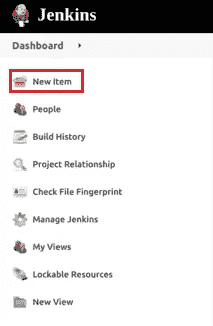

作者图片

然后给它起个名字，选择自由式项目。

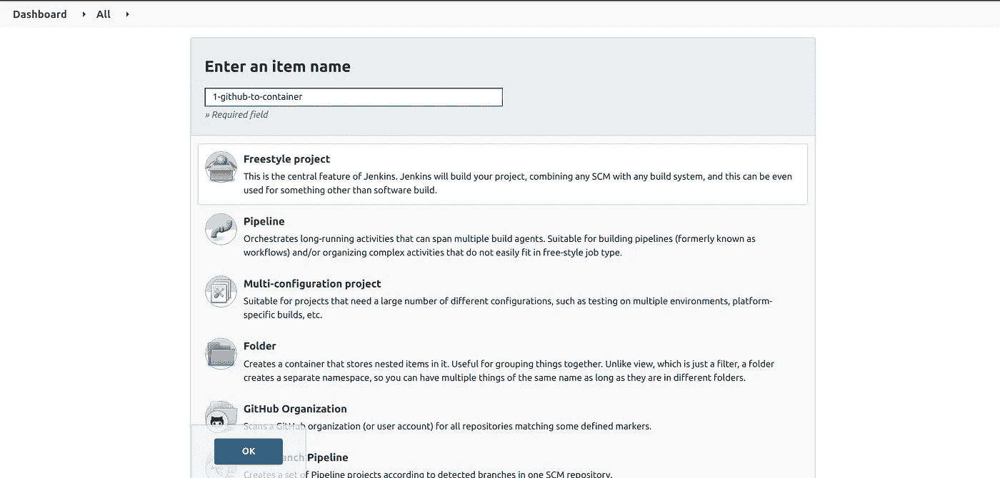

作者图片

下一步是设置配置。对于这一步，在源代码管理中选择 Git，然后粘贴您的存储库的 URL 和您的 Github 凭证。

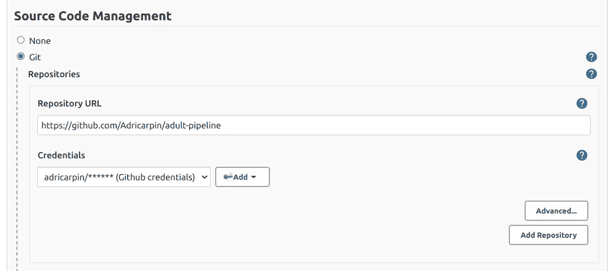

作者图片

然后，在构建触发器中选择“GitHub hook trigger for git SCM polling”。最后在 build 部分选择 Add build step，然后执行 shell，然后编写构建映像和运行容器的代码(我们已经讨论过了):

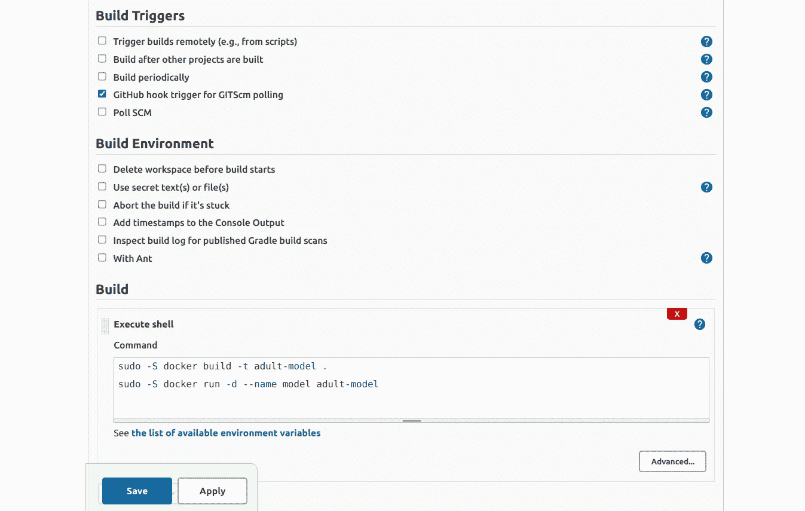

作者图片

选择保存。

## 预处理作业

对于“预处理”作业，在源代码管理中将其保留为无。在“生成触发器”中，选择“在其他项目生成后生成”。然后在要监视的项目中输入第一个作业的名称，并选择“仅当构建稳定时触发”。

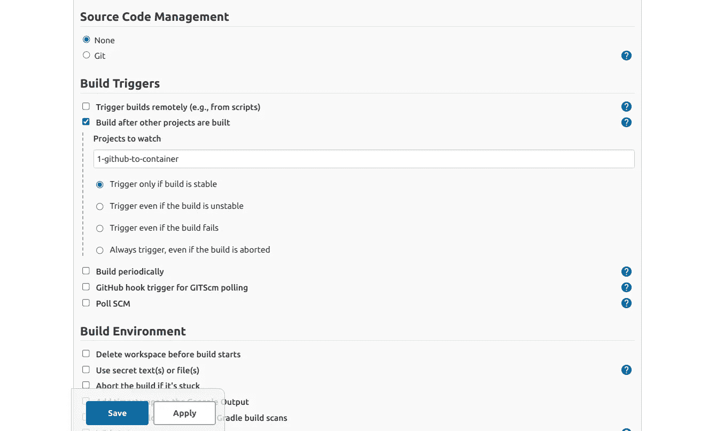

作者图片

在 Build 中，选择 Add build step，然后执行 shell，并编写运行 preprocessing.py 的代码:

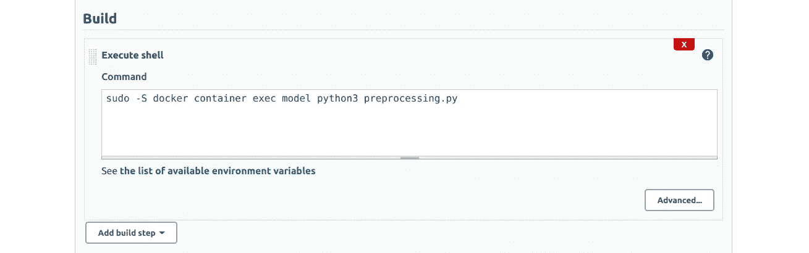

作者图片

## 火车工作

“训练”作业与“预处理”作业的方案相同，但有一些不同。正如您可能猜到的，您需要在 Build triggers 部分写下第二个作业的名称:

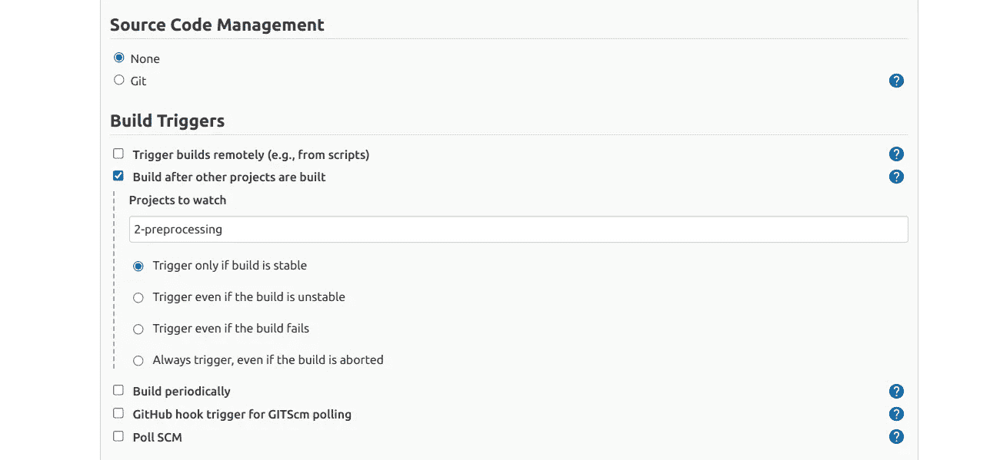

作者图片

在构建部分编写运行 train.py 的代码。

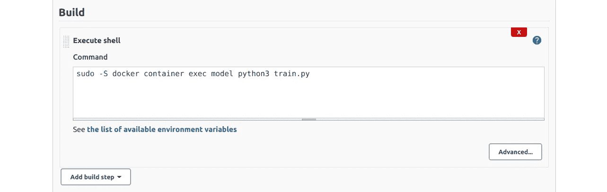

作者图片

## 测试工作

对于“测试”作业，为构建触发器部分选择“训练”作业，

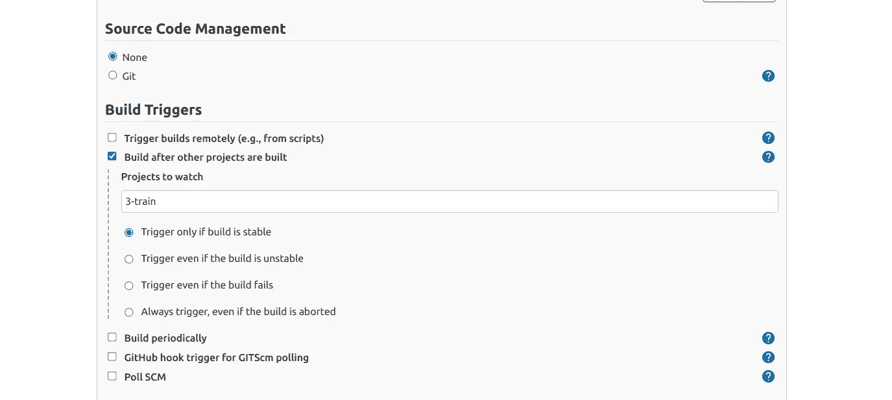

作者图片

并在构建部分编写以下代码:

```
val_acc=$(sudo -S docker container exec model  jq .validation_acc \ /home/jovyan/results/train_metadata.json)threshold=0.8

if echo "$threshold > $val_acc" | bc -l | grep -q 1
then
	echo 'validation accuracy is lower than the threshold, process stopped'
else
   echo 'validation accuracy is higher than the threshold'
   sudo -S docker container exec model python3 test.py
   sudo -S docker container exec model cat \ /home/jovyan/results/train_metadata.json \ /home/jovyan/results/test_metadata.json 
fi    

sudo -S docker rm -f model
```

我已经写了，以防你想复制粘贴，但在詹金斯它应该是这样的:

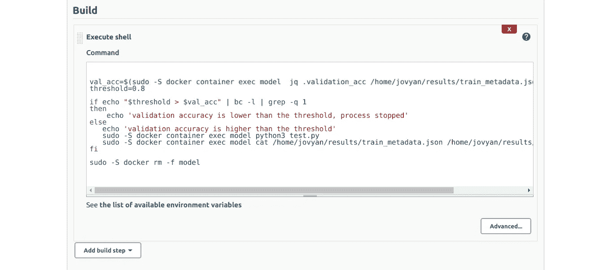

作者图片

点击保存，我们就有了！我们的流水线现在完全自动化了！

您现在可以使用它了:尝试在 Github 中提交，看看每一步是如何自动进行的。最后，如果模型验证精度高于阈值，模型将计算测试精度并返回结果。

📒注意:为了查看每个步骤的输出，选择该步骤，单击左下方构建部分的第一个数字，然后选择控制台输出。对于最后一步，您应该看到验证和测试的准确性。

希望你学到了很多！感谢阅读！

## 参考

[机器学习的 Docker 第三部分](https://mlinproduction.com/docker-for-ml-part-3/)

[从 DevOps 到 MLOPS:使用 Jenkins 和 Docker 整合机器学习模型](/from-devops-to-mlops-integrate-machine-learning-models-using-jenkins-and-docker-79034dbedf1)

[从天真到 XGBoost 和 ANN:成人人口普查收入](https://www.kaggle.com/adro99/from-na-ve-to-xgboost-and-ann-adult-census-income)