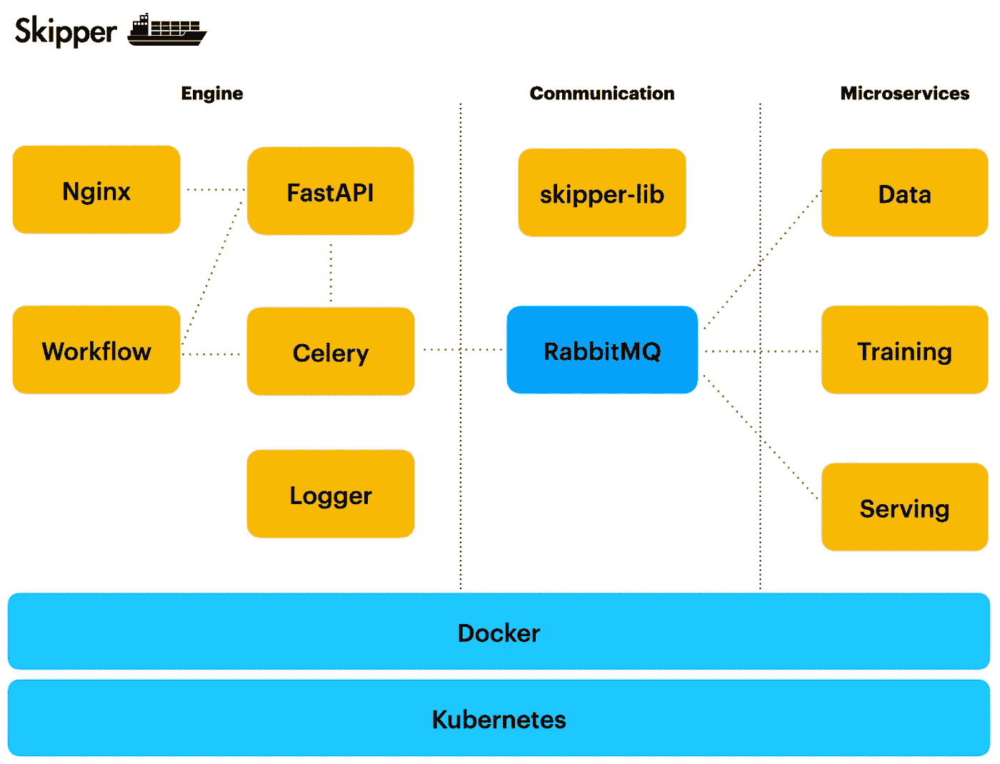

# 使用 Kubernetes、RabbitMQ 和 FastAPI 的 MLOps

> 原文：<https://towardsdatascience.com/mlops-with-kubernetes-rabbitmq-and-fastapi-b67d82e35fa4?source=collection_archive---------8----------------------->

## Skipper 是一个简单灵活的开源 ML 工作流引擎。它有助于在生产中运行和扩展 ML 服务。


作者:安德烈·巴拉诺夫斯基

你经常会听到人们说——许多 ML 项目在进入生产阶段之前就停止了。其中一个原因是，典型的 ML 项目从一开始就被实现为一个整体，当在生产中运行它们的时候，管理、转换和维护代码是不可能的。ML 项目代码被实现为几个甚至一个大笔记本，其中数据处理、模型训练和预测都被粘在一起。这使得在需要修改代码和引入用户请求时，很难维护如此繁琐的代码。结果，用户不高兴，这导致项目终止。

从一开始就构建 ML 系统并遵循微服务架构会有效得多。您可以使用容器来封装逻辑。可以有单独的容器用于数据处理、ML 模型训练和 ML 模型服务。当运行单独的容器时，不仅简化了代码维护，而且您还可以单独伸缩容器并在不同的硬件上运行它们。这可以提高系统性能。

问题来了，如何实现这些服务之间的通信。我正在研究可用的工具，比如 [MLFlow](https://mlflow.org) 。这些工具很棒，但是对于任务来说，它们通常太复杂太庞大。特别是当你想简单地在不同的容器中运行 ML 逻辑时，差不多就是这样。这就是为什么我决定构建自己的小型简单开源产品 [Skipper](https://github.com/katanaml/katana-skipper) 来运行 ML 工作负载。

在本文中，我将解释如何使用 Skipper 在 Kubernetes 上扩展 TensorFlow 模型。同样的方法可以应用于 PyTorch 模型或任何其他与 ML 无关的功能。



Skipper structure，作者:Andrej Baranovskij

*   公共端口通过 [Nginx](https://www.nginx.com) 暴露
*   [FastAPI](https://fastapi.tiangolo.com) 正在服务 REST 端点 API。目前提供两个通用端点，一个用于异步请求，另一个用于同步
*   负责请求路由的工作流容器
*   记录器容器提供通用的日志记录功能
*   [芹菜](https://docs.celeryproject.org/en/stable/getting-started/introduction.html)容器用于执行异步请求
*   RabbitMQ 是一个消息代理，它支持 Skipper 容器之间基于事件的通信
*   SkipperLib 是一个 Python 库，它封装了特定于 RabbitMQ 的 API 代码
*   创建了一组微服务作为样本容器，以展示 Skipper 如何处理特定于 ML(也可以是非 ML)的服务

# REST API

您可以通过多种方式运行 Skipper 容器:

*   直接与 Python 虚拟环境在你的机器上
*   通过 Docker compose 在 Docker 容器上。按照自述文件中的说明进行操作
*   在库伯内特。按照自述文件中的说明进行操作

在生产环境中，您应该在 Kubernetes 中运行 Skipper，使用 Kubernetes 可以更容易地扩展容器。

Skipper REST API 通过 Kubernetes NGINX 入口控制器公开:

```
apiVersion: networking.k8s.io/v1
kind: Ingress
metadata:
  name: api-ingress
spec:
  rules:
    - host: kubernetes.docker.internal
      http:
        paths:
          - path: /api/v1/skipper/tasks/
            pathType: Prefix
            backend:
              service:
                name: skipper-api
                port:
                  number: 8000
  ingressClassName: nginx

---

apiVersion: networking.k8s.io/v1
kind: IngressClass
metadata:
  name: nginx
spec:
  controller: k8s.io/ingress-nginx
```

入口重定向到/api/v1/skipper/tasks/

定义了两个通用端点。一个服务异步请求，另一个服务同步请求。异步请求执行对训练模型的调用，这是一个长期运行的任务。同步请求处理模型预测调用，并将请求路由到模型服务。所有请求都经过 RabbitMQ 消息队列。

所有对 RabbitMQ 的调用都是通过 SkipperLib 执行的。这允许将 RabbitMQ 特定的代码封装在库中并对其进行修改，而无需接触容器中的代码。

# 模特培训

用于模型训练的 Kubernetes Pod 运行两个容器。首先是一个主容器，它训练一个模型。第二个是边车容器，负责数据准备和处理。

我们在同一个 Pod 中运行这两个容器，因为不需要分别扩展它们，并且当它们在同一个 Pod 中运行时，在容器之间共享数据更方便。这对于预测逻辑来说是不正确的，我们在单独的 Pod 中运行预测逻辑，以便能够单独对其进行扩展，下一章将对此进行详细介绍。

模型训练和数据准备容器共享相同的 Kubernetes 卷用于数据存储。

模型培训容器:

```
volumeMounts:
  - name: data
    mountPath: /usr/src/trainingservice/models
```

数据准备容器:

```
volumeMounts:
  - name: data
    mountPath: /usr/src/dataservice/models
```

挂载路径不同，但目标位置相同。通过这些路径访问的数据将是相同的。因为两个容器使用相同的卷“数据”:

```
volumes:
- name: data
  persistentVolumeClaim:
    claimName: training-service-claim
```

当模型被训练并且模型文件被保存时，我们需要在模型预测容器运行时将它传输到服务 Pod。解决方案之一是使用外部云存储，并在那里上传模型文件。但是如果模型文件不太大，Skipper 允许将它直接从训练舱转移到服务舱。模型被存档、编码成一个字符串、与其他元数据一起打包成 JSON，并被发送到 RabbitMQ 队列以交付给 serving Pod。

模型结构被归档到一个文件中:

```
shutil.make_archive(base_name=os.getenv('MODELS_FOLDER') + str(ts),
                    format='zip',
                    root_dir=os.getenv('MODELS_FOLDER') + str(ts))
```

存档的模型文件被编码成 base64 字符串:

```
model_encoded = None
try:
    with open(os.getenv('MODELS_FILE'), 'rb') as model_file:
        model_encoded = base64.b64encode(model_file.read())
except Exception as e:
    print(str(e))
```

在最后一步中，我们将所有东西都包装到 JSON 中:

```
data = {
    'name': 'model_boston_' + str(ts),
    'archive_name': 'model_boston_' + str(ts) + '.zip',
    'model': model_encoded,
    'stats': stats_encoded,
    'stats_name': 'train_stats.csv'
}
content = json.dumps(data)
```

该消息被提交给 RabbitMQ 进行传递。模型通过 RabbitMQ 上的“扇出”交换发送，这允许一次向所有订户发送相同的数据。默认情况下，RabbitMQ 会一次向一个订阅者发送消息，这在集群中作为负载平衡非常有效。但在这种情况下，我们希望集群中的所有接收器都获得新模型，这就是我们使用“扇出”交换的原因。

这是消息通过 RabbitMQ 发布到“扇出”交换的方式:

```
credentials = pika.PlainCredentials(self.username, self.password)
connection = pika.BlockingConnection(
    pika.ConnectionParameters(host=self.host,
                              port=self.port,
                              credentials=credentials))channel = connection.channel()
channel.exchange_declare(exchange='skipper_storage',
                         exchange_type='fanout')channel.basic_publish(exchange='skipper_storage', 
                      routing_key='', 
                      body=payload)
connection.close()
```

# 模型服务

用于模型服务的 Kubernetes Pod 运行两个容器。主容器负责使用 TensorFlow API 执行预测请求。当新的模型文件被发送时，边车容器监听来自 RabbitMQ 的消息，解码文件并提取模型。

两个容器共享同一个存储空间。

服务容器:

```
volumeMounts:
  - name: data
    mountPath: /usr/src/servingservice/models/serving
```

用于模型文件处理的边车容器:

```
volumeMounts:
  - name: data
    mountPath: /usr/src/servingservice/storage/models/serving/
```

存储被装载到同一个卷声明:

```
volumes:
- name: data
  persistentVolumeClaim:
    claimName: serving-service-claim
```

当负责模型文件处理的容器接收到模型时，它会执行与模型训练窗格中的容器类似的步骤，其中模型准备通过 RabbitMQ 发送:

```
data_json = json.loads(data)

model_name = data_json['name']
archive_name = data_json['archive_name']
stats_name = data_json['stats_name']
model_decoded = base64.b64decode(data_json['model'])
stats_decoded = base64.b64decode(data_json['stats'])
```

它解码字符串，提取文件。

模型服务单元可以扩展到多个实例。如果实例运行在不同的集群节点上，那么每个节点都会收到来自 RabbitMQ 消息的新模型。但是，如果几个实例将在单个节点上运行，它们都将尝试将模型写入同一个存储中。如果其中一个实例失败，我们将处理异常。

# 结论

本文的目标是介绍 Skipper。我们面向 MLOps 的开源产品。目前，该产品已准备好投入生产使用。我们的目标是进一步增强它，特别是添加 FastAPI 安全配置，添加更复杂的工作流支持和改进日志记录。我们计划测试 Skipper 的 Kubernetes 自动缩放功能。我们使用 Skipper 平台来实现我们的 ML 服务。

## 源代码

*   Skipper [GitHub](https://github.com/katanaml/katana-skipper) repo。按照自述文件获取设置说明

## YouTube 教程