# 使用 MLFlow 和 Amazon SageMaker 管道的 MLOps

> 原文：<https://towardsdatascience.com/mlops-with-mlflow-and-amazon-sagemaker-pipelines-33e13d43f238?source=collection_archive---------3----------------------->

## 将 MLflow 用于 SageMaker 项目的分步指南

今年早些时候，我发表了一篇关于在 AWS Fargate 上部署 MLflow，并在 Amazon SageMaker 上使用它的分步指南。这有助于简化 ML 项目的实验阶段。


由[阿图尔·科尔纳科夫](https://unsplash.com/@arturkornakov?utm_source=unsplash&utm_medium=referral&utm_content=creditCopyText)在 [Unsplash](https://unsplash.com/?utm_source=unsplash&utm_medium=referral&utm_content=creditCopyText) 上拍摄的照片

在这篇文章中，我们将更进一步，使用 MLflow 和 [Amazon SageMaker Pipelines](https://aws.amazon.com/sagemaker/pipelines/) 自动化端到端的 ML 生命周期。

SageMaker Pipelines 将 ML 工作流编排、模型注册和 CI/CD 结合成一把伞，这样您就可以快速地将您的模型投入生产。

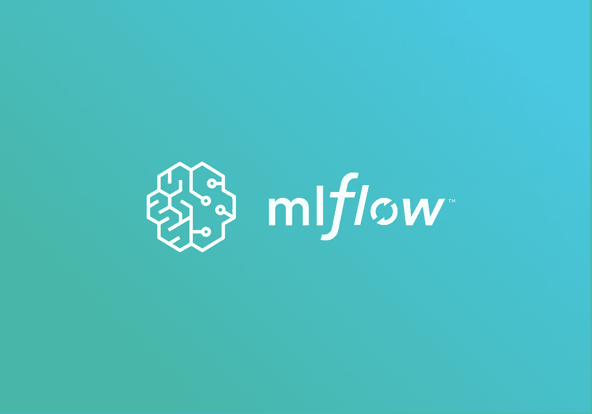

作者图片

我们将为[模型构建、培训和部署](https://www.youtube.com/watch?v=Hvz2GGU3Z8g)创建一个 MLOps 项目，以培训一个示例随机森林模型并将其部署到 SageMaker 端点中。我们将更新项目的 modelBuild 端，以便它可以将模型记录到 MLflow 模型注册表中，并更新 modelDeploy 端，以便它可以将它们发布到产品中。

# 演练概述

我们将分三步解决这个问题:

*   我们将首先在 AWS 上部署 MLflow，并在 SageMaker 中启动一个 MLOps 项目。
*   然后，我们将更新 modelBuild 管道，以便将模型记录到我们的 MLflow 模型注册中心。
*   最后，我将展示如何使用 modelDeploy 管道将 MLflow 模型部署到生产中。

以下是该项目的架构概述:

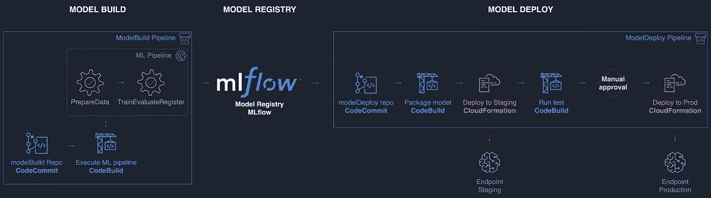

作者图片:架构概述

# 先决条件

要浏览此示例，请确保您具备以下条件:

1.  如果您对 SageMaker Pipelines 听起来不熟悉，请访问[介绍亚马逊 SageMaker Pipelines](https://www.youtube.com/watch?v=Hvz2GGU3Z8g) 。
2.  熟悉使用 MLflow 和 Amazon SageMaker 及其[示例实验室](https://github.com/aws-samples/amazon-sagemaker-mlflow-fargate/tree/main/lab)管理您的机器学习生命周期。
3.  访问亚马逊 SageMaker 工作室环境并熟悉 T2 工作室用户界面。
4.  [Docker](https://www.docker.com/) 构建 MLFlow 推理容器映像并将其推送到 ECR。
5.  这个 [GitHub 库](https://github.com/SofianHamiti/amazon-sagemaker-pipelines-mlflow)克隆到您的工作室环境中

# 步骤 1:在 AWS 上部署 MLflow 并在 SageMaker 中启动 MLOps 项目

## 在 AWS Fargate 上部署 MLflow

首先，我们需要设置一个中央 MLflow 跟踪服务器，这样我们就可以在我们的 MLOps 项目中使用它。

如果没有，可以[按照说明](https://github.com/aws-samples/amazon-sagemaker-mlflow-fargate)和[博客解释](https://aws.amazon.com/blogs/machine-learning/managing-your-machine-learning-lifecycle-with-mlflow-and-amazon-sagemaker/)在 AWS Fargate 上部署 MLflow 的开源版本。

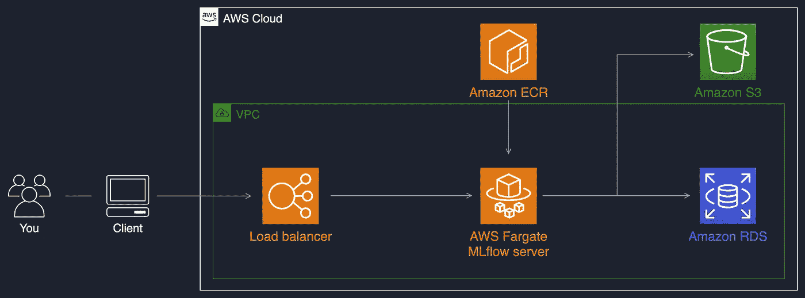

作者图片:在 AWS Fargate 上托管 MLflow，Amazon S3 作为工件商店，Amazon RDS for MySQL 作为后端商店。


图片由作者提供:一旦部署，确保你把负载平衡器 URI 放在某个地方。我们将在我们的 MLOps 项目中使用它，以便管道可以与 MLflow 通信。

## 启动您的 MLOps 项目

现在，我们需要启动一个基于 MLOps 模板的 SageMaker 项目，用于模型构建、培训和部署。

你可以按照朱利安·西蒙的视频来做:

项目模板将为 *modelBuild* 和 *modelDeploy* 创建 2 个 CodeCommit repos，为 *CI* 和 *CD* 创建 2 个 CodePipeline 管道，为打包和测试工件创建 CodeBuild 项目，以及运行项目的其他资源。

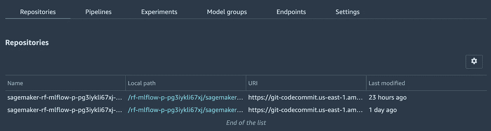

作者图片:您可以在您的环境中克隆 repos。

## 允许项目访问 MLflow 工件存储

我们使用亚马逊 S3 作为 MLflow 的工件存储，您需要更新 MLOps 项目角色，以便它可以访问 MLflow S3 存储桶。

这个角色叫做*AmazonSageMakerServiceCatalogProductsUseRole*，你可以像我下面做的那样更新它的权限:

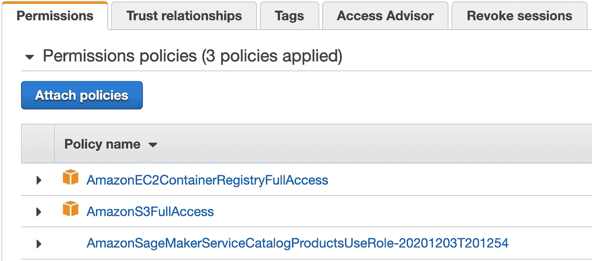

作者图片:我在这个例子中使用了托管策略。您可以在您的环境中收紧权限。

# 步骤 2:更新 modelBuild 管道以将模型记录到 MLflow 中

在将 modelBuild 存储库克隆到您的环境中之后，您可以使用来自 [model_build 文件夹](https://github.com/SofianHamiti/amazon-sagemaker-pipelines-mlflow/tree/main/model_build)的代码来更新代码。

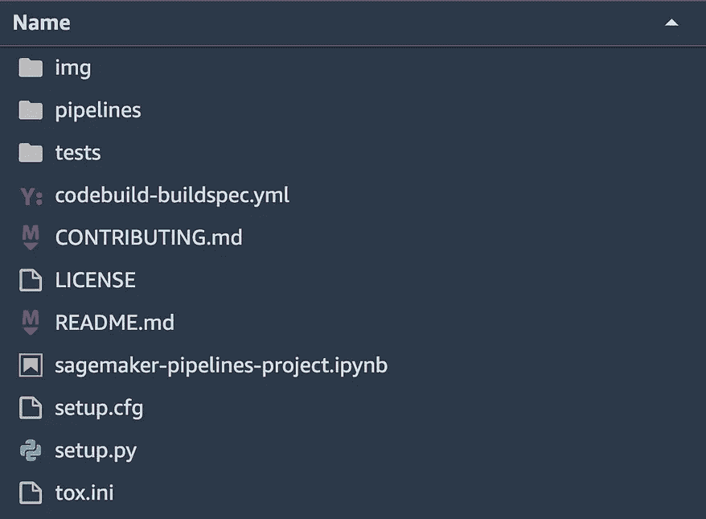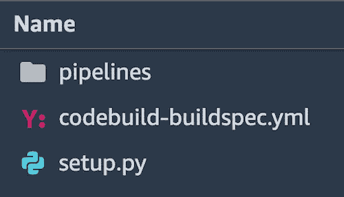

作者图片:您的模型构建报告在更新前(左)和更新后(右)应该是什么样子

你可以在 [pipeline.py](https://github.com/SofianHamiti/amazon-sagemaker-pipelines-mlflow/blob/main/model_build/pipelines/mlflow/pipeline.py) 中找到 ML 管道的例子。它有两个简单的步骤:

*   **PrepareData** 从 sklearn 获取数据集，并将其分成训练/测试集
*   **traineevaluateregister**训练一个随机森林模型，将参数、度量和模型记录到 MLflow 中。

在 [pipeline.py](https://github.com/SofianHamiti/amazon-sagemaker-pipelines-mlflow/blob/main/model_build/pipelines/mlflow/pipeline.py) 的第 22 行，确保将您的 MLflow 负载平衡器 URI 添加到管道参数中。它将被传递给**traineevaluateregister**，这样它就知道在哪里找到 MLflow。

现在，您可以将更新后的代码推送到回购的主分支。

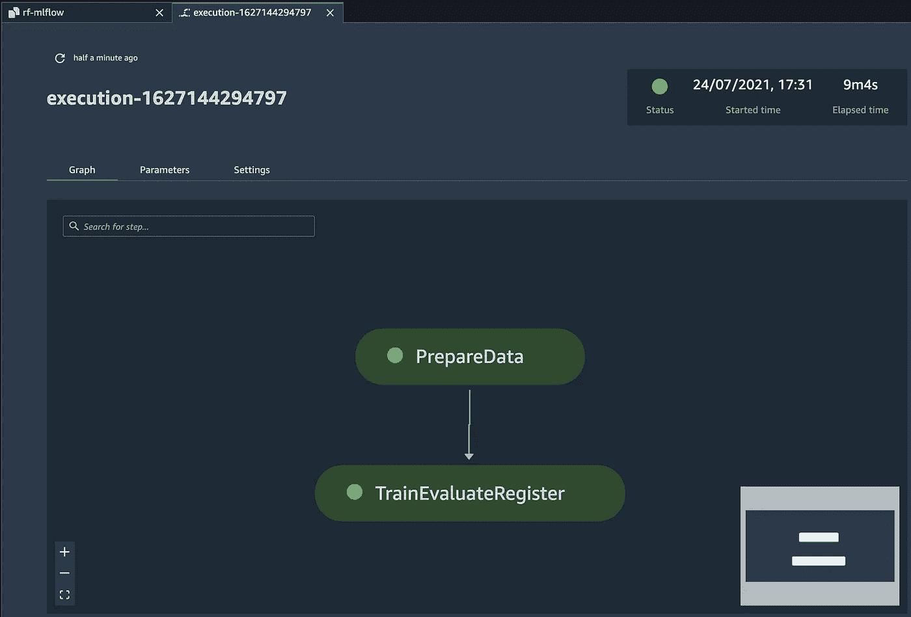

图片作者:您的管道将被更新，需要几分钟来执行。

从现在开始，管道将在每次执行时在 MLflow 中注册新的模型版本。

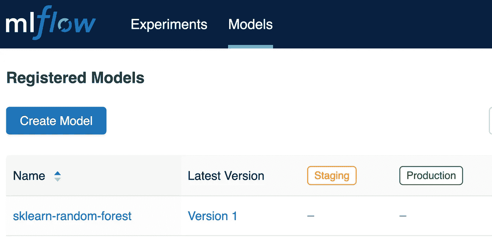

作者图片

为了进一步自动化，您可以使用 [Amazon EventBridge](https://aws.amazon.com/eventbridge/) 来调度管道，或者使用其他类型的触发器和[start _ pipeline _ execution](https://boto3.amazonaws.com/v1/documentation/api/latest/reference/services/sagemaker.html#SageMaker.Client.start_pipeline_execution)方法。

# 步骤 3:使用 modelDeploy 管道将 MLflow 模型部署到生产环境中

我们现在可以将新的模型版本引入 MLflow 模型注册中心，并将使用 MLOps 项目的 modelDeploy 端将它们部署到生产中。

## 将推理容器映像推送到 ECR

除了 ML 模型，我们还需要一个容器映像来处理 SageMaker 端点中的推理。让我们把 MLflow 提供的推送到 ECR。确保这与您的 MLOps 项目在同一个 AWS 区域中完成。

在我的例子中，我使用以下命令从我的笔记本电脑推送它:

```
pip install -q mlflow==1.23.1mlflow sagemaker build-and-push-container
```

## 更新模型部署报告

接下来，您可以使用来自[这个文件夹](https://github.com/SofianHamiti/amazon-sagemaker-pipelines-mlflow/tree/main/model_deploy)的代码来更新 modelDeploy repo。

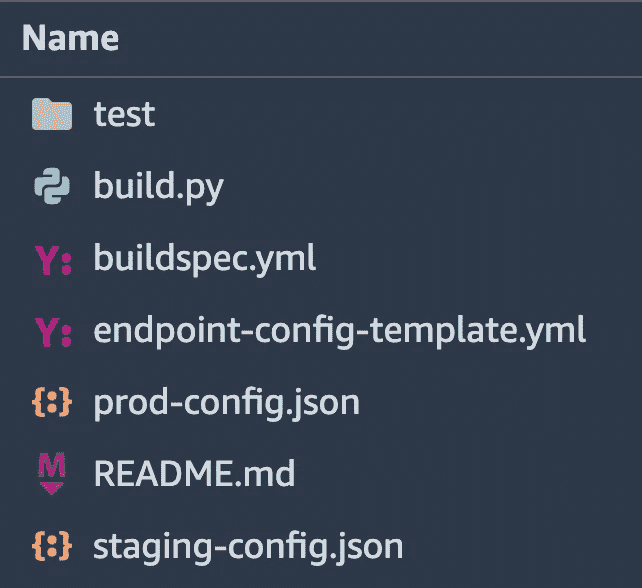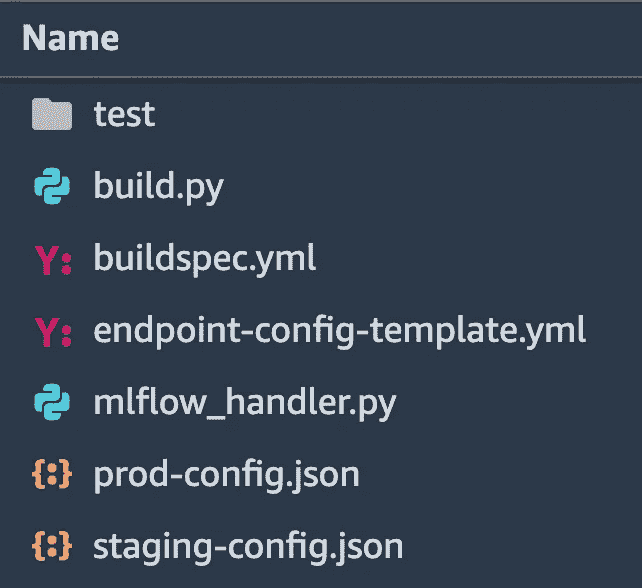

作者图片:modelDeploy repo 在更新之前(左)和之后(右)的样子

在 [buildspec.yml](https://github.com/SofianHamiti/amazon-sagemaker-pipelines-mlflow/blob/main/model_deploy/buildspec.yml) 中，您可以定义部署到生产中的模型版本。您还需要输入您的 MLflow 负载平衡器 URI 和推理容器 URI。

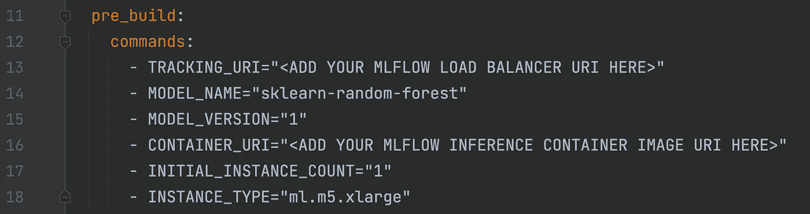

作者图片

我更新了 [build.py](https://github.com/SofianHamiti/amazon-sagemaker-pipelines-mlflow/blob/main/model_deploy/build.py) 以从 MLflow 获取所选的模型版本二进制文件，并将其 model.tar.gz 上传到 S3。

这是由 [mlflow_handler.py](https://github.com/SofianHamiti/amazon-sagemaker-pipelines-mlflow/blob/main/model_deploy/mlflow_handler.py) 完成的，当模型通过 modelDeploy 管道时，它也转换 mlflow 中的模型阶段。

## 触发部署

现在可以将代码推送到 repo 的主分支，这将触发 CodePipeline 中的 modelDeploy 管道。一旦测试在试运行中成功，您就可以导航到 CodePipeline 控制台并手动批准端点投入生产。

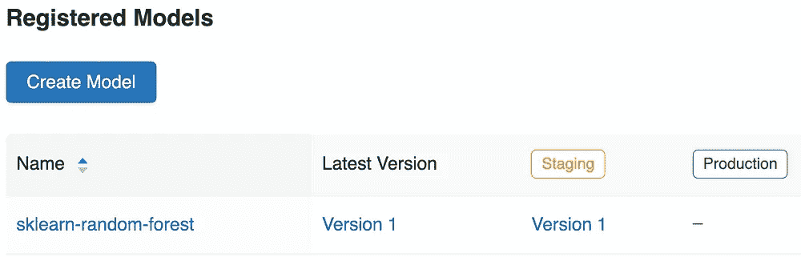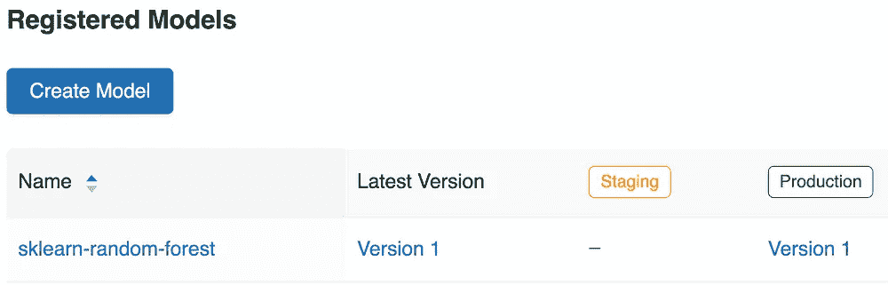

作者提供的图片:模型阶段将在 MLflow 中过渡，因为它在管道中前进

当部署新版本时，管道将存档以前的版本。

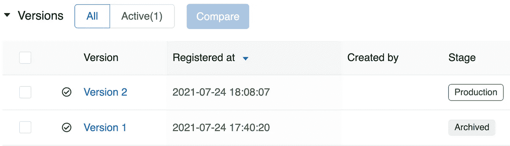

作者图片

您可以看到您的 SageMaker 端点已准备好生成预测。

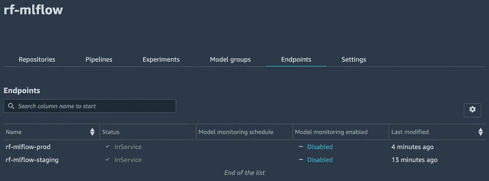

作者图片

# 结论

Amazon SageMaker Pipelines 将 MLOps 工具纳入一个保护伞中，以减少运行端到端 MLOps 项目的工作量。

在这篇文章中，我们使用了 SageMaker MLOps 项目和 MLflow 模型注册中心来自动化端到端 ML 生命周期。

更进一步，您还可以学习如何使用 Amazon SageMaker Pipelines 部署无服务器推理服务。