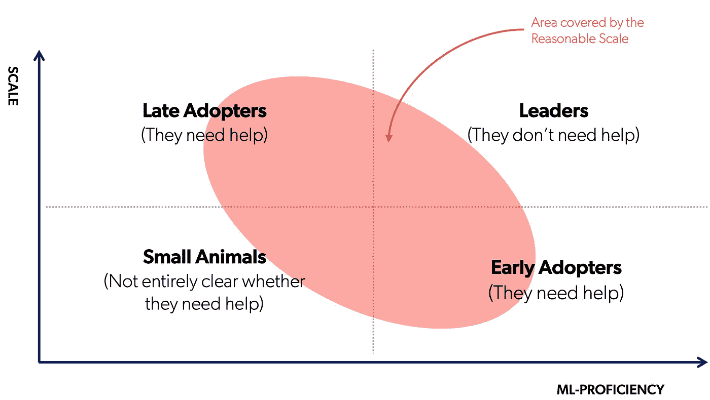

# 没有太多操作的 MLOps

> 原文：<https://towardsdatascience.com/mlops-without-much-ops-d17f502f76e8?source=collection_archive---------14----------------------->

## [在启动阶段有效地进行 ML](https://towardsdatascience.com/tagged/mlops-without-much-ops)

## 一部由[西罗·格列柯](https://medium.com/u/1a8912e69301?source=post_page-----d17f502f76e8--------------------------------)和[安德里亚·波洛尼奥利](https://medium.com/u/97c0c65d3de7?source=post_page-----d17f502f76e8--------------------------------)主演的迷你剧

## “合理规模”的生活

如果你不在大型科技公司工作，比如谷歌、Facebooks、亚马逊，那么你很有可能在一家规模合理的公司工作。

*合理规模的公司不像谷歌*。他们无法雇用他们梦想的所有人，也无法通过他们拥有的云基础架构每天为数十亿用户提供服务。合理规模公司处理数百万个数据点，而不是数十亿；他们可以雇佣几十名数据科学家，而不是几百名，而且他们必须针对计算成本进行优化。

与此同时，规模合理的公司有大量有趣的商业问题，可以通过使用机器学习来解决。事实上，用机器学习来解决这些问题完全有意义，也许他们已经在尝试了。当人才、预算和数据量受到限制时，很难实施正确的流程。

合理规模用例所涵盖的概念领域。拥有小团队的先进人工智能初创公司(右下)，以及开始制定 ML 路线图的较晚、较大的采用者(左上)，是没有太多运营的 MLOps 的理想目标[图片由作者提供]。

事实是，除了大型技术和先进的创业公司，人工智能系统仍然远远没有产生承诺的投资回报率:人工智能项目从试点到生产平均需要 9 个月的时间。)让企业[从试点转向运营](https://www.gartner.com/en/newsroom/press-releases/2020-06-22-gartner-identifies-top-10-data-and-analytics-technolo)。随着人工智能项目数量的不断增加，对成熟的 MLOps 方法的需求变得越来越明显:由于在这样的基础领域做出错误选择的机会成本可能会削弱甚至是最好的业务，因此高管和管理层理解合理的 MLOps 策略的含义至关重要。现在是研究它的最佳时机。

在过去的几年中，我们了解到，即使在合理的规模下，ML 也可以实现正的投资回报。我们之所以知道这一点，是因为我们在帮助数百家中大型企业实现数字化转型的过程中处于某种特殊的地位。最重要的是，

> 我们知道这一点，因为我们本身就是一家规模合理的公司。

我们决定在一个多部分的系列中分享我们在这一过程中所学到的东西，重点是如何构建和扩展 ML 系统，以在面对上述限制时更快地交付结果:小型 ML 团队，有限的预算，万亿字节的数据。我们的目标是为您提供一份经过验证的最佳实践手册，帮助您在设计端到端生产系统时成功驾驭快速发展的 MLOps 环境。

已经有很多关于工具 *X* 或者框架 *Y* (包括[我们自己的](/noops-machine-learning-3893a42e32a4)！)，但是(出于良好的教学原因)他们关注孤立的工具，通常是在玩具世界的场景中。我们决定走一条更长，但更有希望获得回报的路线:我们的讨论在设计上更加细致入微，包括来自[学术论文](https://dl.acm.org/doi/10.1145/3460231.3474604)、[开源代码](https://github.com/jacopotagliabue/you-dont-need-a-bigger-boat)和第一手创业经验的证据。

> 我们(雄心勃勃的)目标是为你提供一个建立 AI 公司的模板，而不是一个微小的功能。

## 用开源和 SaaS 有效地构建人工智能

这个系列的核心思想可以非常简明地表述如下:

> 要想在合理的规模上实现大规模生产，你应该把时间投入到你的核心问题上(不管是什么)，并购买其他所有东西。

虽然陈述主要原则很容易，但以合理的规模生活涉及到各种微妙的分歧，从争夺人才到控制 P&L。我们原则的推论是，我们应该尽我们所能从 ML 开发者那里抽象出基础设施。由于我们正在处理合理的规模，投入资源来部署和维护今天可以作为 PaaS/SaaS 解决方案找到的功能(例如[雪花](https://www.snowflake.com/)、[元流](https://metaflow.org/)、 [SageMaker](https://aws.amazon.com/it/sagemaker/) )没有太大的价值。

在合理的范围内生活涉及到各种微妙的分歧。但鉴于 MLOps 是一个全新的领域，高管和管理层并不总是完全了解它:我们在设计这个系列时考虑了许多不同的角色，允许我们从不同的角度探索 ML 生产力。作为一个小预告片，这些是一些重点领域:

*   面向所有人的 ML 工具: MLOps 是 20 年来致力于拥抱开源技术的种子。如今，开源在企业中的采用正在加速，这使得小团队越来越容易在大规模下获得极高的生产力。然而，使用开源工具的想法经常被团队领导和高管们所反对:我们将解释公司和企业领导如何降低他们的开放堆栈战略的风险，并从开源软件中获得最大收益。
*   **少即是多:**通过用少得多的人力来换取更多的计算，我们得出这样的结论:一个快乐的小型人工智能团队要比一个更大、更不专注的团队好得多。换句话说，可能更大的 AWS 账单通常会被更高的保留率和更高的 ML 生产率所抵消。其影响是深远的:例如，考虑一下研发人员数量等传统指标可能需要如何重新评估，以及可能需要不同的基准。现代 MLOps 方法可能会导致传统的研发指标和基准变得几乎过时。
*   **被授权的开发人员成长得更好:**在竞争激烈的市场中招聘和留住人才对公司来说是一个持续的挑战，尤其是在 ML 领域。事实证明，ML 从业者更替的主要原因之一是将相当一部分时间投入到低影响的任务中，如数据准备和基础设施维护。

## 好奇想了解更多？

在接下来的几个月里，我们将探索合理规模的 ML 生产力的所有方面。通过 Medium 或 [Linkedin](https://www.linkedin.com/in/jacopotagliabue/) 关注我们的最新动态！

雅格布·塔利亚布埃 *、* [西罗·格列柯](https://medium.com/u/1a8912e69301?source=post_page-----d17f502f76e8--------------------------------)和[安德里亚·波洛尼奥利](https://medium.com/u/97c0c65d3de7?source=post_page-----d17f502f76e8--------------------------------)。

## **常见问题解答**

*   **你有 TL；DR 版**？不完全是，这就是为什么我们开始了一个(小)系列:我们*真的*试图把所有的东西都放进*的一个* 帖子里，但是我们的第一批读者似乎同意它太密集了，没有意义。如果你想在跑步的时候听点什么，这些主题*中的一些*已经在斯坦福 MLSys 的[MLOps in Reasonable Scale](https://www.youtube.com/watch?v=Ndxpo4PeEms)讲座中被预见到了。
*   **新锐 ML 真的能活在大 Tech 之外吗？** 是的，它*真的*可以。为团队成员和外部合作者创建一个自助服务系统，以通过端点(不是幻灯片)旋转 GPU、执行查询、共享发现！)是快速进行[产品开发和研究的好方法](https://research.coveo.com/)。
*   **空谈不值钱，给我看看代码**！如果你不耐烦，想直接跳到它的工程方面，我们共享了一个[开源库](https://github.com/jacopotagliabue/you-dont-need-a-bigger-boat)来实现我们的原则，从解析原始数据到服务预测(注意:该项目在真实的数据负载下工作，这要感谢[我们最近发布的一个大规模电子商务数据集](https://github.com/coveooss/SIGIR-ecom-data-challenge))。

## **致谢**

我们要感谢 Ville、Savin 和 Oleg 对项目先前迭代的宝贵反馈； [Piero Molino](https://www.linkedin.com/in/pieromolino/) 和斯坦福 MLSys 集团邀请我们参加[一场精彩的会议](https://www.youtube.com/watch?v=Ndxpo4PeEms)；Mike Purewal ，他优雅地拒绝了我们的初稿，并推动我们变得更好；最后[卢卡·比贡](https://www.linkedin.com/in/bigluck/)，他以合理的尺度生活和呼吸。

当然，没有我们*开源贡献者*的承诺，这个系列是不可能的:

*   Patrick John Chia :局部流量和基线模型；
*   Luca Bigon :通用工程和基础优化；
*   [Andrew Sutcliffe](https://www.linkedin.com/in/asutcl/) :远程流；
*   [Leopoldo Garcia Vargas](https://www.linkedin.com/in/leopoldo-garcia-vargas-29932a89/) : QA 和测试。