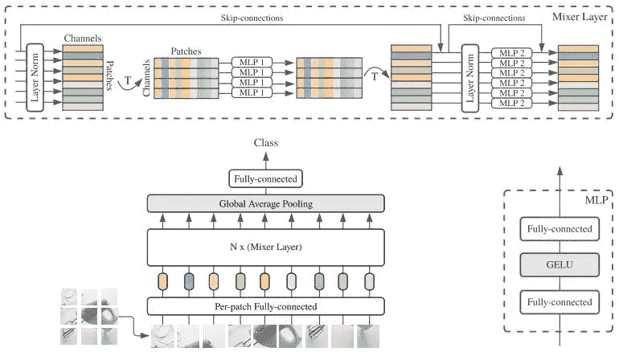
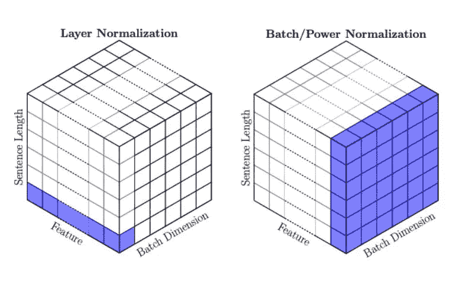
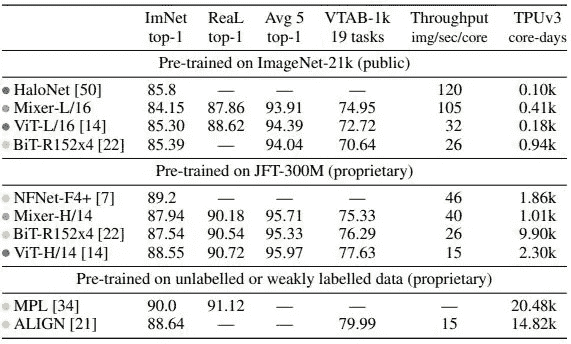
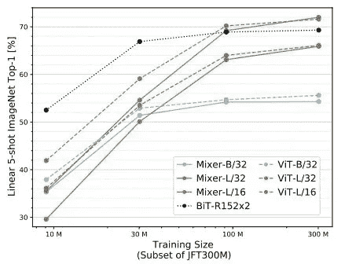

# MLP 混合器:全 MLP 的视觉建筑

> 原文：<https://towardsdatascience.com/mlp-mixer-an-all-mlp-architecture-for-vision-7438fac99a06?source=collection_archive---------19----------------------->

## 回到美好的老 MLP？

# 介绍

来自 Google Research &的研究人员 Google Brain 团队发布了一种新的架构 MLP 混合器，它没有 CNN 或注意力层，但仍然可以实现与 ViT(视觉变压器)、BiT(大传输)、HaloNet 和 NF-Net 等架构相当的性能。它在训练中的速度提高了 3 倍，并且随着训练数据量的增加而出色地扩展。作者将这种架构放在一起，因为他们觉得我们可以在没有非常重要的 CNN 和注意力层的情况下获得出色的结果，这些层需要大量的计算。在这个过程中，他们还展示了更高的吞吐量/秒/核，以及该模型比大多数当前最先进的模型更好地扩展到更大的数据集

# 背景

在这篇论文发表之前，CNN 和自我关注通常是图像分类和计算机视觉的首选机制。这在最近最先进的视觉变压器(ViT)中得到了展示，该变压器成功地将注意力层应用于计算机视觉任务。虽然这些操作是非常计算密集型的，需要花费数天时间在 TPU 上训练，但作者提出了深度学习中的一个基本概念——MLP(多层感知器)！该架构依赖于在空间和特征通道上重复的各种矩阵乘法。

这怎么可能呢？难道我们不是从 MLP、CNN、剩余 CNN(即 ResNets、DenseNets、NF-net、ViT 等等)发展而来的吗？现在，作者说回到 MLP？是的，你没听错，

> 虽然回旋和注意力对于良好的表现都是足够的，但它们都不是必需的

这些都是巨大的索赔，让我们理解为什么这个架构的工作，他们的索赔是正确的！

# 体系结构

谈到 MLP 混合器模型，有相当多的事情正在发生。我们有补丁形式的输入，就像 ViT 一样。然后是混合器层，其中发生两个操作，具有 GELU 激活的完全连接的层，以及最后的线性分类头。跳过连接和正则化，如 Dropout 和 Layer Norm 也进入了体系结构。

MLP 混频器架构。图片鸣谢——MLP 混合器[论文](https://arxiv.org/pdf/2105.01601.pdf)

正如我们在该架构底部看到的，网络的输入是图像补丁的形式。这些面片被线性地投影到一个 H 维的潜在表示(它是隐藏的)中，并被传递到混合器层。这里需要注意的一点是，H 值与面片数量或面片大小无关，这使得网络能够线性增长，而不是像 ViT 那样呈二次方增长。这减少了计算参数，提高了吞吐量，约为 120 张图像/秒/核，几乎是 ViT 32 张图像/秒/核的 3 倍。

现在，事情变得有趣了。参考展示混合器层的图像的顶部，当投影时，补丁被转换成类似表格的形式，我们称之为 x。补丁在彼此之上分层。

混合器层由 2 个 MLP 块组成。第一块(令牌混合 MLP 块)作用于 X 的转置，即线性投影表(X)的列。所有补丁的每一行都具有相同的通道信息。这被馈送到 2 个完全连接的层的块。该块保存相同类型的信息——跨片识别图像中的特征，即聚集出现该特征的所有通道。权重在图中所示的 MLP 1 图层中共享。

第二个块(通道混合 MLP 块)在 x 的另一个转置之后作用于行。这里，获取每个面片并在该面片的所有通道上应用计算。这是仅在该补丁中寻找特征并将其与通道相关联，而在令牌混合块中，它在所有通道中搜索特征。

这种结构是作者引用的独特的 CNN，

> 我们的架构可以被视为一个独特的 CNN，它使用(1×1)卷积进行信道混合，使用单通道深度卷积进行令牌混合。然而，反之则不然，因为 CNN 不是混频器的特例。

此外，该架构使用变压器架构中常见的层规范。下图说明了层规范与批处理规范，以便快速理解。更多关于层定额[这里](https://leimao.github.io/blog/Layer-Normalization/)。GELU 激活包括用于非线性的跳过连接和用于正则化的丢弃连接。

层规范化与批规范化。图片来源——power norm[论文](http://proceedings.mlr.press/v119/shen20e/shen20e.pdf)

# 基准和结果

跨数据集比较 Mixer 与其他模型。图片鸣谢——MLP 混合器[论文](https://arxiv.org/pdf/2105.01601.pdf)

正如我们在表中看到的，与其他 SOTAs 相比，ImageNet top-1 验证准确性方面的性能相当不错。但是对于 MLP 混合器来说，真正的交易是双倍的——图像/秒/核心的吞吐量和 TPU 训练时间。混合器在图像/秒/核的吞吐量方面远远领先于 ViT，比 ViT 的 32 (ImageNet)高出 105 分，比 ViT 的 15(JFT-300)高出 40(图像/秒/核)。

当谈到 ImageNet 上的 TPU 训练时间时，ViT 胜过 Mixer，但不是 JFT-300。因此，当我们看到桌面上更多的数字时，我们可以说,“混音器 table 正在挑战其他索塔。不一定胜过他们，但仍然很有竞争力”。

到了“它随更多数据而扩展”的部分，下图说明了当训练集大小增加时，Mixer、ViT 和 BiT 的性能。

训练子集大小与 ImageNet top-1 val 准确性的关系。图片鸣谢——MLP 混合器[论文](https://arxiv.org/pdf/2105.01601.pdf)

混合器在图的右侧紧密匹配，这表明 5 次拍摄 ImageNet top-1 精度。但是我们需要从左侧观察曲线，其中训练子集大小从 10M 开始，一直到 300M。在所有情况下，混合器具有更好的曲线缩放，并且不会在任何时间点使曲线变平。这意味着，它不会因为更多的训练数据而饱和，而 ViT 和 BiT 模型一旦超过 100M 的训练数据子集大小就会饱和(精度不会提高)。

此外，在该模型的所有变体与其他 SOTAs 的其他全面比较中，考虑到与性能相关的预训练方面，当有更多数据时，混合器会受益。预训练数据越小，其在验证准确性方面与 SOTAs 的差距就越大。一定要看看报纸上的这篇文章。报纸上还有一个非常有趣的部分——**MLP 混频器的设计思想如何可以追溯到 CNN&变形金刚？。**这就是为什么要确保阅读这篇论文，了解消融术、相关工作、不同的实验设置、重量的可视化以及没有成功的事情！

# 结论

MLP 混合器在吞吐量和训练时间等各种重要指标上都名列前茅。在 ImageNet top-1 验证准确性方面，它并不落后，在 JFT-300 上进行了预训练，得分为 87.78。就所提供的训练数据量而言，与 ViT & BiT 相比，该网络具有极佳的扩展性。但是，有一点需要深思——归纳偏差。根据本文中的训练子集大小与 ImageNet top-1 val 准确度图，ViT 在 300 米处变平，而 Mixer-MLP 仍在上升。如果数据的规模是 600M，可能会发生什么？密切关注预训练数据集大小和归纳偏差的作用。说到这里，作者的一个更有趣的评论是——“这种设计对 NLP 是否适用？”。时间会证明一切。

# 参考

[1]https://arxiv.org/pdf/2105.01601.pdfMLP-混频器:

[2]维特:【https://arxiv.org/pdf/2010.11929】T2

[3]位:【https://arxiv.org/pdf/1912.11370】T4

[4]光环网:[https://arxiv.org/pdf/2103.12731](https://arxiv.org/pdf/2103.12731)

[5]层定额:[https://arxiv.org/pdf/2003.07845](https://arxiv.org/pdf/2003.07845)

[6]NF-Nets:[https://arxiv.org/pdf/2102.06171v1.pdf](https://arxiv.org/pdf/2102.06171v1.pdf)

[7]ImageNet:[http://www.image-net.org/](http://www.image-net.org/)