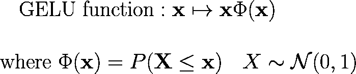

# 你只需要 MLP 搅拌机。

> 原文：<https://towardsdatascience.com/mlp-mixer-is-all-you-need-20dbc7587fe4?source=collection_archive---------11----------------------->

## 🤖[深度学习](https://equipintelligence.medium.com/list/deep-learning-techniques-methods-and-how-tos-01015cf5f917)

## 从头到尾了解 MLP 混频器，带 TF Keras 代码

来源:[***【MLP-混音器:一个全 MLP 架构的设想】***](https://arxiv.org/abs/2105.01601)

今年 5 月初，谷歌的一组研究人员发布了一篇论文[***“MLP 混合器:一个全 MLP 的视觉架构”***](https://arxiv.org/abs/2105.01601) 介绍了他们的 MLP 混合器(简称为*混合器*)模型，用于解决计算机视觉问题。该研究表明，MLP 混合器在图像分类基准测试中取得了有竞争力的分数，如 [ImageNet](https://www.image-net.org/) 。

有一件事会引起每个 ML 开发者的注意，那就是他们没有在他们的架构中使用卷积。自从卷积能够有效地从图像和视频中提取空间信息以来，它就一直统治着计算机视觉。最近，最初用于 NLP 问题的[变形金刚](https://arxiv.org/abs/1706.03762)，在计算机视觉问题上也表现出了显著的效果。MLP 混合器的研究论文表明，

> 在本文中，我们表明，虽然卷积和注意力对于良好的性能都是足够的，但它们都不是必要的。

> 关于 MLP 混合器是否是“无 conv”的，曾经有过一些争议。从[权重和偏见](https://medium.com/u/6fb4b78f0265?source=post_page-----20dbc7587fe4--------------------------------)浏览此博客以了解更多信息，

 [## MLP 混合器是一个伪装的 CNN 吗？

### 最近，一种新的建筑——MLP 混合器:全 MLP 视觉建筑(Tolstikhin 等人，2021 年)——

wandb.ai](https://wandb.ai/wandb_fc/pytorch-image-models/reports/Is-MLP-Mixer-a-CNN-in-Disguise---Vmlldzo4NDE1MTU) 

我们将更多地讨论 MLP 混合器的架构和相关的底层技术。最后，我们提供了一个使用 TensorFlow Keras 的 MLP 混合器的代码实现。

此外，这个博客已经在[谷歌开发库](https://devlibrary.withgoogle.com/authors/equipintelligence)上展示。

> 你现在可以在 TensorFlow Hub，[https://tfhub.dev/sayakpaul/collections/mlp-mixer/1](https://tfhub.dev/sayakpaul/collections/mlp-mixer/1)上找到预训练的 MLP 混合器模型

我也使用 MLP 混合器进行文本分类，

 [## 基于 MLP 混合器的推文分类

### 使用 Kaggle 笔记本探索和运行机器学习代码|使用自然语言处理中的数据应对灾难…

www.kaggle.com](https://www.kaggle.com/shubham0204/tweet-classification-with-mlp-mixers-tf-keras) 

## 📃 ***内容***

1.  👉 [***独霸卷积，变形金刚***](#c567) 问世
2.  👉 [***【多层感知器】(MLP)和***](#de7d) 的 GELU 激活功能
3.  👉[***MLP-密炼机架构组件***](#7418)
4.  👉 [***终局***](#6ad7)
5.  👉 [***更多项目/博客/资源来自作者***](#e61e)

# 👼回旋的优势，变形金刚的出现

在计算机视觉问题中使用[卷积](https://machinelearningmastery.com/convolutional-layers-for-deep-learning-neural-networks/)是由 [Yann LeCun](https://en.wikipedia.org/wiki/Yann_LeCun) 推广的，从那时起卷积就成为了计算机视觉问题的支柱。每个滤波器在输入体积上进行卷积，以计算由神经元构成的激活图，如下所示。

图 1:内核大小=3，步长=1 的卷积运算(没有填充)。[来源:卷积运算](https://github.com/vdumoulin/conv_arithmetic)

输出图中的每一个神经元都连接到输入体积的特定部分，这可以在**图 1** 中清晰观察到。输出映射然后被传递给激活函数(例如 [ReLU](https://arxiv.org/pdf/1803.08375.pdf) )。为了降低输出图的维数，使用了[池](https://machinelearningmastery.com/pooling-layers-for-convolutional-neural-networks/)操作。卷积用于学习图像的局部特征，这是计算机视觉问题的目标。几乎所有的架构像 [MobileNets](https://arxiv.org/abs/1704.04861) 、 [Inception](https://arxiv.org/abs/1409.4842) 、 [ResNet](https://arxiv.org/abs/1512.03385) 、 [DenseNet](https://arxiv.org/abs/1608.06993) 等等。使用卷积层(也就是卷积+激活)来学习图像特征。

[Transformers](https://arxiv.org/abs/1706.03762) 是为 NLP 问题而创造的，但在图像分类方面已经显示出相当大的成果。我将在这里为[视觉变形金刚](https://arxiv.org/abs/2010.11929) ( ViTs)留下一些资源，

 [## Keras 文档:使用视觉转换器进行图像分类

### 作者:Khalid Salama 创建日期:2021/01/18 最近修改时间:2021/01/18 描述:实现愿景…

keras.io](https://keras.io/examples/vision/image_classification_with_vision_transformer/)  [## 一幅图像相当于 16x16 个字:用于大规模图像识别的变形金刚(视觉变形金刚)

### 这篇文章作为数据科学博客的一部分发表。简介虽然变压器架构具有…

www.analyticsvidhya.com](https://www.analyticsvidhya.com/blog/2021/03/an-image-is-worth-16x16-words-transformers-for-image-recognition-at-scale-vision-transformers/)  [## 你准备好接受视觉变形器(ViT)了吗？

### 《一张图像抵得上 16x16 个字:大规模图像识别的变形金刚》可能会给计算机带来又一次突破…

towardsdatascience.com](/are-you-ready-for-vision-transformer-vit-c9e11862c539) 

# 🤠多层感知器(MLP)和 GELU 激活函数

## 多层感知器(MLP)

> 如果你是一个有经验的 ML 开发者，你可能在古代就已经学会了。

图 2:多层感知器。来源:[多层感知器示例](https://github.com/rcassani/mlp-example)

[多层感知器](https://en.wikipedia.org/wiki/Multilayer_perceptron)是一个人工神经网络，有一个输入层、多个隐含层和一个输出层。除了输入节点，每个节点都使用一个[非线性激活函数](/activation-functions-neural-networks-1cbd9f8d91d6)。

在我们的例子中，研究论文提出了一个具有两个全连接(密集)层的 MLP，带有一个 [GeLU](https://arxiv.org/abs/1606.08415) (我们将在接下来的部分中对此进行更多讨论)激活函数，

图 3:混频器架构的 MLP。来源:[*《MLP 混合器:一个全 MLP 的建筑愿景》*](https://arxiv.org/abs/2105.01601)

每个混合器层将由两个 MLP 组成，一个用于 ***令牌混合*** ，另一个用于 ***通道混合*** 。我们将在后面的章节中详细讨论 ***令牌混合*** 和 ***通道混合*** 。下面是我们将用来堆叠两个`Dense`层(带有一个 GELU)激活的代码，从而向现有的层(`x`)添加一个 MLP，

片段 1:MLP

> 注意:图 3 中看不到[叉头](https://jmlr.org/papers/v15/srivastava14a.html)。我们添加它是为了规范我们的模型。你也可以在这个[例子](https://keras.io/examples/vision/mlp_image_classification)中注意到它们。

注意，我们大多数人会认为`Dense`层接受形状为`( batch_size , input_dims )`的输入，输出形状为`( batch_size, output_dims )`的张量。但在我们的例子中，这些`Dense`层将接收三维形状的输入，即形状`( batch_size , num_patches , channels )`或其转置`( batch_size , channels , num_patches )`。

图 4:关于密集层的输入/输出形状的信息。来源:[致密层张量流文件](https://www.tensorflow.org/api_docs/python/tf/keras/layers/Dense)。

我们将在故事的后面部分了解更多关于`num_channels`和`num_patches`的内容。

## 高斯误差线性单位激活

> 现代但不太流行的激活功能

图 5:雷鲁、葛鲁和 eLU 的曲线图。来源:[ArXiv](https://arxiv.org/abs/1606.08415)上的高斯误差线性单位(GELUs)

[高斯误差线性单位](https://arxiv.org/abs/1606.08415)是一个激活函数，使用标准[高斯累积分布函数](https://en.wikipedia.org/wiki/Normal_distribution#Standard_deviation_and_coverage)对输入进行加权。在 ReLU(校正线性单位)的情况下，使用其符号对输入进行加权。

图 6: ReLU 和 GELU 激活函数。来源:作者创作。

随着 ***x*** 减少，输入很有可能被丢弃。 ***x*** 上的变换是随机的，但它取决于 ***x*** 的值。

图 7:作者提供的 GELU 的近似值。来源:[ArXiv 上的高斯误差线性单位](https://arxiv.org/abs/1606.08415)

选择[正态分布](https://en.wikipedia.org/wiki/Normal_distribution)的原因是当使用[批量归一化](https://arxiv.org/abs/1502.03167)层时，神经元的输出遵循正态分布。GELU 激活在变压器模型中广泛用于解决 NLP 问题。

正如在**片段 1** 中观察到的，我们将使用`[tf.nn.gelu](https://www.tensorflow.org/api_docs/python/tf/nn/gelu)`将 GELU 激活添加到 MLPs 中。如果你想要一个 Keras 层，在 [TensorFlow Addons](https://www.tensorflow.org/addons) 包中有一个`[tfa.layers.GELU](https://www.tensorflow.org/addons/api_docs/python/tfa/layers/GELU)`层。

这里有一个很好的博客解释了各种激活功能(包括 GELU)，

 [## 激活功能解释-格卢，SELU，ELU，雷卢和更多

### 在计算每一层的激活值时，我们使用一个激活函数…

mlfromscratch.com](https://mlfromscratch.com/activation-functions-explained/#/) 

# 🔧MLP 混频器架构组件

我们将详细讨论每个组件，然后将它们集成到一段代码中。

## ⚙️Mixer 层

图 8:混合层。来源:作者创作

代码片段 2:混音器层

混频器层是 MLP 混频器架构的构建模块。每个混合器层包含两个 MLP，一个用于**令牌混合**，另一个用于**通道混合**。在 MLPs 旁边，你会注意到图层正常化，跳过连接和箭头上面写的***【T】***。指张量的 ***转置**** ，保持批量维度不变。

> [**转置**](https://math.stackexchange.com/questions/906254/how-do-you-transpose-tensors) ***** :我们将使用`*tf.keras.layers.Permute*`层，通过在该层的参数中设置`*dims=[ 2 , 1 ]*`来进行转置。我们不会在接下来的章节中详细讨论这个问题。

我建议您彻底理解该图，因为在讨论组件时，我会不时地引用它。在以下部分中，我们将讨论，

1.  *什么是补丁(混音器层的输入)*
2.  *令牌混合 MLPs*
3.  *通道混合 MLPs*
4.  *图层归一化*

## 🧽什么是补丁？

> 我们如何使用 RGB 图像(MLP 混合器模型的典型输入)来创建它们？

一个混合层将接受一个形状为`( batch_size , num_patches , num_channels )`的张量，并产生一个相同形状的输出。你可能想知道我们如何从 RGB 图像(这是 MLP 混合器模型的实际输入)中产生这样的张量？参考下图，

图 9:使用 2D 卷积从图像创建补丁。来源:作者创作

假设，给我们一个大小为 *4 * 4* 的 RGB 图像。我们使用 2D 卷积来创建**非重叠*** 的面片。假设，我们需要大小为 *2 * 2* 的正方形小块。如图 9 所示，我们可以从 *4 * 4* 输入图像中创建 4 个**不重叠的**面片(图中一个面片用阴影表示)。同样，使用 ***C*** 过滤器，我们将尺寸`image_dims * image_dims * 3`的输入图像转换为形状`num_patches * num_patches * C`的张量，其中`num_patches = image_dims / patch_size`。注意，我们假设`image_dims`可以被`patch_size`整除。考虑到**我们的例子*** ，`num_patches = ( 4 * 4 ) / ( 2 * 2 ) = 4`。

在上面的例子中，我们有`num_patches=2`。

> **我们的例子*** :特别感谢我们的读者[Abder-Rahman Ali](https://abderhasan.medium.com/)博士[指出了`num_patches`计算中的错误](https://abderhasan.medium.com/thanks-so-much-for-your-nice-tutorial-bde39fd71fe0)。我们非常感谢他为改进这个故事所做的努力。
> 
> **不重叠*** :为了创建不重叠的面片，我们在 Keras 的`Conv2D`层设置了`kernel_size=patch_size`和`strides=patch_size`。

图 10:调整补丁大小。来源:作者创作

最后，我们调整形状为`num_patches * num_patches * C`到`num_patches^2 * C`的面片的大小。

## 🧱令牌混合 MLPs

图 11:令牌混合 MLP。来源:作者创作

如前所述，每个混合器层由一个**令牌混合 MLP** 组成。我们想了解记号的含义，这在论文中被强调为，

> 它[ MLP 混合器]接受形状为“面片*通道”表的一系列线性投影图像面片(也称为标记)作为输入，并保持这种维数。

下面是令牌混合 MLPs 的代码(从**图 8** 中可以看出`LayerNormalization`和`Permute`的作用)

代码片段 3:令牌混合 MLP

顾名思义，它*混合*令牌，或者换句话说，允许同一通道中不同补丁之间的通信。如图**图 11** 所示，通道 ***C*** 的数量没有被修改，只有*P 即面片数量被扩展到某个维度(`token_mixing_mlp_dims`)并被带回 ***P*** 。*

## *🧱通道混合 MLPs*

**

*图 12:通道混合 MLP。来源:作者创作*

*通道混合 MLP 的工作类似于令牌混合 MLP。它们混合信道信息，从而实现信道间的通信。*

*代码片段 4:通道混合 MLP*

*如图**图 12** 所示，面片 ***P*** 的数量没有修改，只有 ***C*** 即通道的数量扩展到某个维度(`channel_mixing_mlp_dims`)并恢复到 ***C*** 。*

## *⚖️层标准化*

> *这不同于批量标准化*

**

*图 13:批量标准化与层标准化。来源:[图层归一化说明| PapersWithCode](https://paperswithcode.com/method/layer-normalization)*

*[批量标准化](https://arxiv.org/abs/1502.03167)使用整批的平均值和方差来标准化激活。在[层归一化](https://arxiv.org/abs/1607.06450v1)的情况下(特别是对于 RNNs)，使用一个神经元的所有求和输入的平均值和方差来执行归一化。正如论文中提到的，*

> *在本文中，我们通过计算用于归一化的均值和方差，将批量归一化转换为层归一化，这些均值和方差来自单个训练案例中一层中神经元的所有求和输入。像批量归一化一样，我们也给每个神经元它自己的自适应偏置和增益，它们在归一化之后但在非线性之前被应用。*

*TF-Keras 团队提供了一个`tf.keras.layers.LayerNormalization`层来执行这个操作。以下是一些了解图层规范化的资源，*

* [## 解释了层标准化

### 最近我在机器翻译的 Transformer 模型中遇到了层规范化，我发现…

雷猫. github.io](https://leimao.github.io/blog/Layer-Normalization/)  [## 深度学习中的不同规范化层

### 目前，深度学习已经彻底改变了许多子领域，如自然语言处理，计算机视觉…

towardsdatascience.com](/different-normalization-layers-in-deep-learning-1a7214ff71d6)  [## 批规范化和层规范化的区别-程序员寻求

### 网上有很多解释，包括下面这张图光靠图片是不够理解的…

www.programmersought.com](https://www.programmersought.com/article/62405248279/) 

现在，有了混频器层的完整知识，我们可以继续实现我们的 MLP 混频器模型进行分类。该模型将接受输入 RGB 图像并输出类别概率。

# ⚔️终结游戏

代码片段 5:组装模型

我们将逐行检查这段代码。

1.  首先创建一个输入层，它接收一些所需大小的 RGB 图像。
2.  实现一个创建补丁的`Conv2D`(记住，我们几十年前讨论过这个问题)。此外，添加一个`Reshape`层来重塑令牌，并将其转换为 3D 张量。
3.  在模型中添加`num_mixer_layers`混合器层。
4.  最后，一个`LayerNormalization`层加上一个`GlobalAveragePooling1D`层。
5.  最后，我们最喜欢的 softmax 激活的`Dense`层。

下面是`tf.keras.utils.plot_model`的输出，描绘了一个单独的混合器层，

图 14:绘图模型的输出。来源:作者创作。

`model.summary()`的输出，

图 15:模型摘要()的输出。来源:作者创作

就这样，我们刚刚在 TensorFlow 中实现了一个 MLP 混合器模型！

# 💪🏼来自作者的更多项目/博客/资源

# 谢谢

皮特·佩德罗萨在 Unsplash[上的照片](https://unsplash.com?utm_source=medium&utm_medium=referral)

希望你喜欢这个故事！请随时拨打 equipintelligence@gmail.com 的*联系我。谢谢你，祝你有美好的一天！**