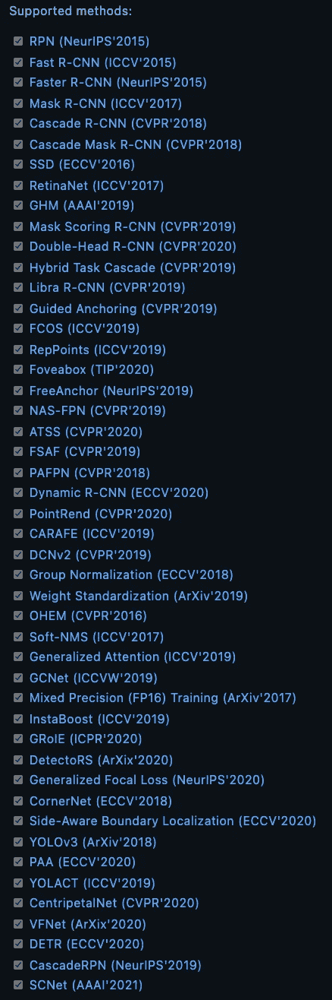
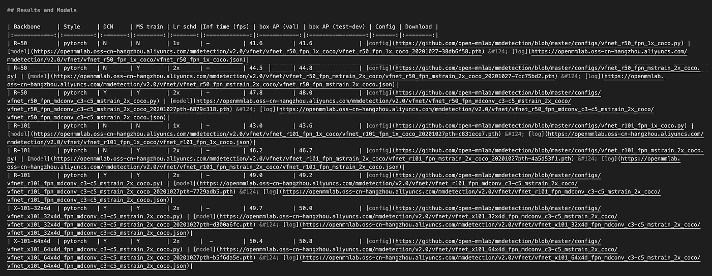

# MMDetection 教程——最先进的对象检测库

> 原文：<https://towardsdatascience.com/mmdetection-tutorial-an-end2end-state-of-the-art-object-detection-library-59064deeada3?source=collection_archive---------4----------------------->

## MMDetection 为使用许多 SOTA 对象检测模型提供了巨大的潜力，例如 FasterRCNN、DETR、VFNet 等等！


照片由[阿尔方斯·莫拉莱斯](https://unsplash.com/@alfonsmc10?utm_source=medium&utm_medium=referral)在 [Unsplash](https://unsplash.com?utm_source=medium&utm_medium=referral) 拍摄

在进行一次物体探测比赛时，我通过其他一些参赛者偶然发现了 [MMDetection](https://github.com/open-mmlab/mmdetection) 。而且，我对网上缺乏教程感到很有趣。MMDetection 为大约 30 个对象检测模型的训练和推理提供了一个包装器！它提供了一个编码库和一个命令行界面，使得对象检测原型非常快速。实际上，我很惊讶地看到 VFNet(最近的 SOTA 物体探测网络之一)已经在那里实现了。如果您不熟悉 VarifocalNet，它提供了非常有竞争力的性能，尤其是与 YoloV5 相比(我见过它几次胜过 YoloV5)。

所有的 MMdetection 模型都基于 PyTorch，但是老实说，它使用的代码要少得多(我将在这里展示)。我发现使用这个库的最大好处是，一旦你完成了初始设置，你可以通过修改 1-5 行代码来非常容易地改变你正在使用的模型！所以它对快速实验非常有用。

以下是 MMdetection 支持的所有型号的列表:



来源: [Github](https://github.com/open-mmlab/mmdetection)

## 让我们开始—安装所需的软件包

我们要做的第一件事是安装“mmcv-full ”,这是一个 mm 库，提供了我们需要的大部分东西。然后克隆 mmdetection Github 存储库并安装需求。请注意，这需要大约 12 分钟，所以有点耐心。

```
!pip install mmcv-full
!git clone [https://github.com/open-mmlab/mmdetection.git](https://github.com/open-mmlab/mmdetection.git)
%cd mmdetection!pip install -r requirements.txt
```

接下来要做的是打开存储库文件并导航到“configs”目录。在 configs 目录中，您将找到每个受支持型号的文件。选择其中一个模型后，您将需要下载其预训练重量。为此，打开模型目录，然后打开相应的自述文件。

在自述文件中，您将找到该模型各种实现的权重的所有链接。在本文中，我们将实现 VFNet。它的自述，看起来是这样的:



你可以找到不同骨干的细节和他们的表现。让我们先用 R-50，然后我们可以选择另一个。要下载预训练的重量，只需运行以下命令:

```
!mkdir checkpoints
!wget -c [https://openmmlab.oss-cn-hangzhou.aliyuncs.com/mmdetection/v2.0/vfnet/vfnet_r50_fpn_mdconv_c3-c5_mstrain_2x_coco/](https://openmmlab.oss-cn-hangzhou.aliyuncs.com/mmdetection/v2.0/vfnet/vfnet_r50_fpn_mdconv_c3-c5_mstrain_2x_coco/$CHECKPOINT\)vfnet_r50_fpn_mdconv_c3-c5_mstrain_2x_coco_20201027pth-6879c318.pth[\](https://openmmlab.oss-cn-hangzhou.aliyuncs.com/mmdetection/v2.0/vfnet/vfnet_r50_fpn_mdconv_c3-c5_mstrain_2x_coco/$CHECKPOINT\)
      -O checkpoints/vfnet_r50_fpn_mdconv_c3-c5_mstrain_2x_coco_20201027pth-6879c318.pth
```

wget 将安装权重，O 标志指定它们的安装位置。这些是可可预训练的重量。

## 进口

```
from mmcv import Config
from mmdet.apis import set_random_seed
from mmdet.datasets import build_dataset
from mmdet.models import build_detector
from mmdet.apis import train_detector, init_detector, inference_detector
import torch 
```

## 构建模型和数据集

接下来要做的是配置模型和数据集。这是大部分工作需要完成的地方，也是很多错误发生的地方。两种最常见的数据集格式是 COCO 和 PASCAL VOC。您当然可以实现自己的格式，但这超出了本文的范围。

由于 COCO 是更常见的一种，我们将在这里使用它。如果你不熟悉这些格式，我建议你看看这篇伟大的文章[这里](https://pub.towardsai.net/understanding-coco-and-pascal-voc-annotations-for-object-detection-bb8ffbbb36e3?source=search_post---------1)。如果你想看看我们将要使用的数据集，你可以在[这里](https://www.kaggle.com/sreevishnudamodaran/vinbigdata-coco-dataset-with-wbf-3x-downscaled)找到它

首先，我们需要指向我们模型的配置文件(来自“configs”的那个)。然后我们需要指向数据集并提供一些其他属性。

```
cfg = Config.fromfile('./configs/vfnet/vfnet_r50_fpn_mstrain_2x_coco.py')
cfg.dataset_type = 'CocoDataset'cfg.classes = ("Aortic_enlargement", "Atelectasis", 
               "Calcification", "Cardiomegaly", 
               "Consolidation", "ILD", "Infiltration", 
               "Lung_Opacity", "Nodule/Mass", "Other_lesion", 
               "Pleural_effusion", "Pleural_thickening", 
               "Pneumothorax", "Pulmonary_fibrosis")
# number of classescfg.model.bbox_head.num_classes = 14
```

接下来，我们需要指定每个训练、测试和验证数据集:

```
PREFIX = '/kaggle/input/vinbigdata-coco-dataset-with-wbf-3x-downscaled/vinbigdata-coco-dataset-with-wbf-3x-downscaled/'cfg.data.train.img_prefix = PREFIX
cfg.data.train.classes = cfg.classes
cfg.data.train.ann_file = PREFIX + 'train_annotations.json'
cfg.data.train.type = 'CocoDataset'cfg.data.val.img_prefix = PREFIX
cfg.data.val.classes = cfg.classes
cfg.data.val.ann_file = PREFIX + 'val_annotations.json'
cfg.data.val.type = 'CocoDataset'cfg.data.test.img_prefix = PREFIX
cfg.data.test.classes = cfg.classes
cfg.data.test.ann_file = PREFIX + 'val_annotations.json'
cfg.data.test.type = 'CocoDataset'
```

由于测试文件实际上没有注释，我们现在只将它指向 val 注释。

现在，我们几乎完成了数据集，让我们做模型，然后建立两者。这一部分是关于指定您想要使用的超参数，例如:

```
cfg.optimizer.lr = 0.02 / 8
cfg.lr_config.warmup = None
cfg.log_config.interval = 600# Change the evaluation metric since we use customized dataset.
cfg.evaluation.metric = 'bbox'
# We can set the evaluation interval to reduce the evaluation times
cfg.evaluation.interval = 3
# We can set the checkpoint saving interval to reduce the storage cost
cfg.checkpoint_config.interval = 3# Set seed thus the results are more reproducible
cfg.seed = 0
set_random_seed(0, deterministic=False)
cfg.gpu_ids = range(1) cfg.load_from = 'vfnet_r50_fpn_mdconv_c3-c5_mstrain_2x_coco_20201027pth-6879c318.pth'
cfg.work_dir = "../vinbig"cfg.runner.max_epochs = 12
cfg.total_epochs = 12
```

现在，我们可以构建数据集和模型:

```
model = build_detector(cfg.model)
datasets = [build_dataset(cfg.data.train)]
```

然后我们可以开始训练:

```
train_detector(model, datasets[0], cfg, distributed=False, validate=True)
```

## 推理

在 MMdetection 中，您可以通过命令行进行推断，也可以通过 inference_detector 进行推断。我发现命令行更简单，所以让我们在这里使用它。

但是首先，让我们创建之前忽略的测试注释文件。它本质上是一个 JSON 文件，带有空的注释和一个列出每个图像的图像属性的字典。

```
test_files = f"/kaggle/input/vinbigdata-512-image-dataset/vinbigdata/test"
IMG_SIZE = 512
ids = os.listdir(test_files)
img_infos = []for i, _id in enumerate(ids):
    if '.png' in _id:
        img_infos.append({
                    "license": 0,
                    "url": 'null',
                    "file_name": _id,
                    "height": IMG_SIZE,
                    "width": IMG_SIZE,
                    "date_captured": 'null',
                    "id": _id
                })val_anno = '/kaggle/input/vinbigdata-coco-dataset-with-wbf-3x-downscaled/vinbigdata-coco-dataset-with-wbf-3x-downscaled/val_annotations.json'with open(val_anno) as f:
    val_anno_json = json.load(f)val_anno_json.keys()
val_anno_json['annotations']=[]
val_anno_json['images'] = img_infos
with open('./test_ann.json', 'w') as outfile:
    json.dump(val_anno_json, outfile)
```

现在，让我们运行推断命令。这个命令会有点长，因为我们需要指定配置。您可以通过将配置保存到一个文件并在命令行中使用该文件来缩短它，但我认为这样更容易快速更改。

```
classes_str='("Aortic_enlargement", "Atelectasis", "Calcification", "Cardiomegaly", "Consolidation", "ILD", "Infiltration", "Lung_Opacity", "Nodule/Mass", "Other_lesion", \
"Pleural_effusion", "Pleural_thickening", "Pneumothorax", "Pulmonary_fibrosis")'MODEL = './configs/vfnet/vfnet_r50_fpn_mstrain_2x_coco.py'
CHECKPOINT = 'checkpoints/vfnet_r50_fpn_mdconv_c3-c5_mstrain_2x_coco_20201027pth-6879c318.pth'!python mmdetection/tools/test.py\$MODEL\
 $CHECKPOINT\
 --cfg-options dataset_type='CocoDataset' classes=$classes_str\data.train.img_prefix=$cfg.data.train.img_prefix\
data.train.classes=$classes_str\ data.train.ann_file=$cfg.data.train.ann_file\
data.train.type='CocoDataset'\data.val.img_prefix=$cfg.data.val.img_prefix\
data.val.classes=$classes_str\ data.val.ann_file=$cfg.data.val.ann_file\ data.val.type='CocoDataset'\data.test.img_prefix=$cfg.data.test.img_prefix\ data.test.classes=$classes_str\
data.test.ann_file='../test_ann.json'\
data.test.type='CocoDataset'\
model.bbox_head.num_classes='14' evaluation.metric='bbox' work_dir='../vinbig_output' load_from=$cfg.load_from total_epochs='1' --out results.pkl
```

这与我们之前指定的训练配置基本相同，只是我们现在传递一个测试注释 JSON，运行 1 个时期(推断)，并将输出结果保存到“results.pkl”。

就是这样！您可以从 pickle 文件加载预测，如下所示:

```
import picklewith open('./results.pkl', 'rb') as f:
    data = pickle.load(f)
```

接下来的步骤就看你的了！

关于 MMdetection 最好的事情之一是，现在如果你想改变模型，你可以指向不同的配置文件，下载不同的检查点并运行相同的代码！如果你在其中一个步骤上卡住了，或者你想以不同的方式实现其中的一些，我建议查看他们的文档[这里](https://github.com/open-mmlab/mmdetection)。