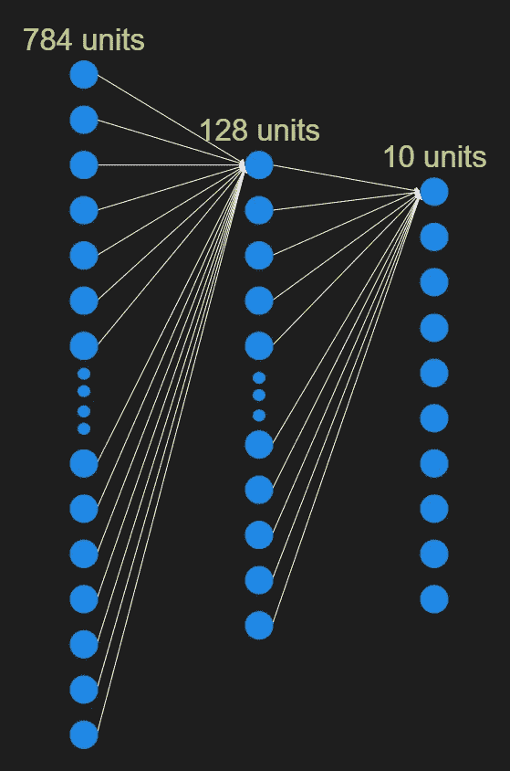
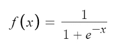
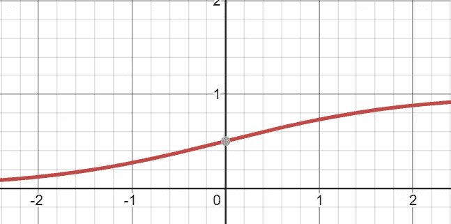
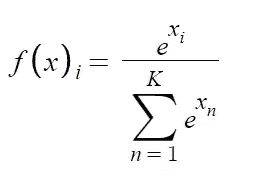
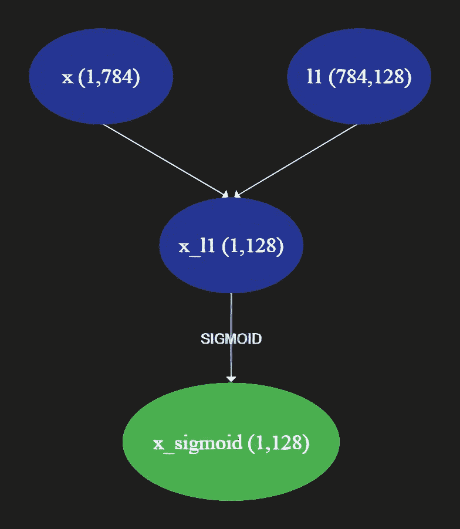
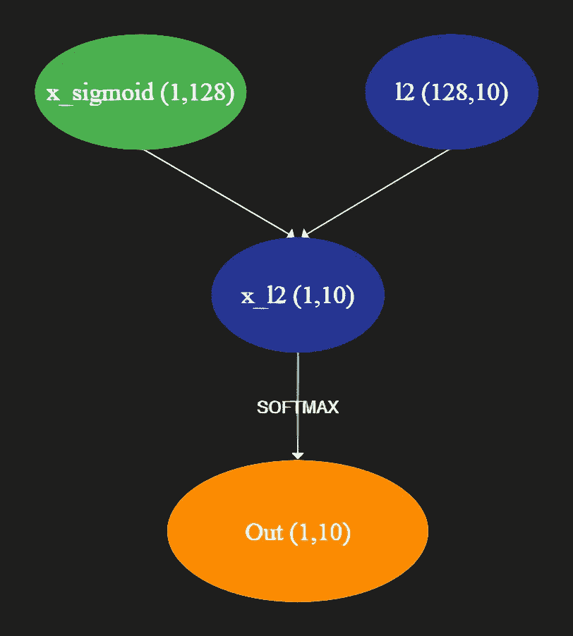

# MNIST 手写数字分类从零开始使用 Python Numpy。

> 原文：<https://towardsdatascience.com/mnist-handwritten-digits-classification-from-scratch-using-python-numpy-b08e401c4dab?source=collection_archive---------5----------------------->

照片由[波普&斑马](https://unsplash.com/@popnzebra)在[挡泥板](https://unsplash.com/photos/NZ-9RqsE06I)上拍摄

所以我最近用 PyTorch 为 MNIST 手写数字数据集做了一个分类器，后来，在庆祝了一段时间后，我对自己说，“我能用 vanilla python 重新创建同样的模型吗？”当然，我打算用 NumPy 来做这件事。我的目的不是试图复制 NumPy 漂亮的矩阵乘法，而是通过重新发明轮子来更好地理解这个模型。

我挑战自己在 numpy 中做一个类似的分类器，并在这个过程中学习深度学习的一些核心概念。你可以在我的 [GitHub 库](https://github.com/karynaur/mnist-from-numpy)中找到代码。

你的工作流程应该是这样的:

1.  从 [MNIST 网站](http://yann.lecun.com/exdb/mnist/)获取数据
2.  将训练图像分成训练集和验证集
3.  初始化权重
4.  定义我们的激活函数及其导数
5.  定义一个向前传递和向后传递的函数(费力！)
6.  使用 SGD 批量训练我们的模型，更新权重，并在验证集上测试我们的模型
7.  根据测试数据预测并打印精确度

对于这个模型，我决定使用 sigmoid 和 softmax 作为激活函数，以保持简单。

1.  **获取数据**

现在让我们欢迎我们故事的主角，努皮。

定义一个函数来获取 utf-8 编码的数据，将其解压缩并转换为 NumPy 数组。这段代码摘自**乔治·霍兹**的一个笔记本，你可以在这里找到[。](https://github.com/geohot/ai-notebooks/blob/master/mnist_from_scratch.ipynb)

2.由于数据只包含一个训练集和测试集，让我们把训练集分成训练( *X_train，Y_train* )和验证( *X_val，Y_val* )。

3.现在让我们定义一个函数，它接受矩阵的大小作为输入，并返回初始化的权重。

神经网络将是一个简单的三层网络。输入图层由 784 个单元组成，对应于 MNIST 数据集中 28 x 28 影像中的每个像素。第二层(*隐藏层*)下降到 128 个单位，最后是最后一层，10 个单位对应于数字 0-9。

为了简单起见，只显示了每个单元的一个连接。图片作者。

因此，l1 是大小为(784，128)的矩阵，l2 是大小为(128，10)的矩阵。

4.函数可以概括为接受输入和输出的过程。激活函数是那些将神经元的加权和作为输入(*在幅度上变化*)并将其转化为可以容易理解或馈入下一层的有意义数据的函数。Sigmoid 和 softmax 是我们将要使用的两个这样的激活函数。

**乙状结肠功能:**

sigmoid 函数定义为:

图片作者。

它可以通过绘制一个取 f(x) = y 的图形来可视化:

图片作者。

它可以接受任何东西，然后吐出一个 0 到 1 之间的数字。在 python 代码中，sigmoid 和它的派生代码如下所示:

在我们的模型中，我们使用 sigmoid 函数将第 1 层给出的随机输出压缩成 0 到 1 之间的数字。

**Softmax 功能:**

Softmax 函数接受一个向量作为输入，并输出一个大小相同的向量，其元素总和为 1。输出向量中的每个元素都在 0 和 1 之间，因此这些值可以被解释为概率。

图片作者。

python 代码中的 Softmax 函数如下所示:

为了理解 softmax 是如何工作的，让我们声明一个简单的 numpy 数组并在其上调用 softmax 函数。

从第二个结果可以清楚地看出，虽然 *out* 之和不是 1，但其 softmax 之和确实是 1。因此，我们可以将 softmax 数组的值视为父数组中各个元素的概率。

[1，2，3]的分布中的 1 是最不可能的，因为它的 softmax 值是 0.090，另一方面，同一分布中的 3 是很可能的，具有 softmax 值 0.6652。

在我们的模型中，输出层吐出具有不同大小的形状 10 的向量。因此，我们使用 softmax 来标准化我们的结果。例如，让我们取一个看起来与我们的模型输出相似的向量，并将其提供给 softmax 函数:

现在，如果我们对 softmax 结果运行 NumPy 的 argmax 函数，我们将获得具有最大值的元素的索引:

为了防止溢出，我们使用简化版本的 softmax。现在让我们来定义 softmax 及其导数:

5.现在让我们定义一个函数，在迭代过程中执行向前传递和向后传递。

让我们一行一行地检查代码，并理解它是如何工作的。

Y_train 本质上是一个 50，000 个元素的向量，具有与 X_train 中的图像相对应的正确的*数字。*

另一方面，我们的模型为每个训练示例输出 10 个元素的向量。因此，我们的主要任务是将 Y_train 转换为向量，其中 1 对应于“*正确的*位，0 对应于其余的位。

如您所见，第五个位置中索引为' *4* 的元素的值为 1，而其余元素的值为 0。

现在是正向传递，其中输入矩阵与权重相乘，并通过各自的激活函数。

在第一行中，x 是与第一层相乘的矩阵，并通过 sigmoid 函数进行归一化。

作者截图。

sigmoid 乘积稍后与第二层矩阵相乘，并通过 softmax 函数得到大小为 10 的输出向量，类似于我们的目标向量。

作者截图。

现在是时候反向传播并更新我们的权重了。我们的目标是找到与 l1 和 l2 形状相似的矩阵，可以从 l1 和 l2 中减去这些矩阵，通过最小化误差使*更接近于理想答案。*

但是*到底是什么错误*？

***误差=2*(出目标)***

这将计算当前历元中的误差及其方向。我们离实现理想的答案还有多远。

让我们看看'*出来的'*到底是什么:

***out = softmax(x _ L2)***

它是我们神经网络的产物。

我们现在需要找到一个实体来告诉我们，如果 *x_l2* 发生变化，那么 *out* 会变化多少。

没错。你猜对了。这个实体叫做导数！我们需要找到 softmax 在空间中的点 *x_l2* 处的导数，这样当我们*通过(**误差* soft max 在 x_l2** 处的导数)改变* x_l2 时，我们的 *out* 移动得更接近理想目标，python 代码中的情况如下:

但是 x_l2 到底是什么？

**x _ L2 = x _ sigmoid @ L2**

我们现在知道需要改变 x_l2 多少，但是 x_l2 是第一层的 sigmoid 输出和 l2 的乘积，我们不能改变它。我们只能控制重量！因此，为了将之前的误差转化为可以从 l2 中减去的误差，让我们定义一个 *update_l2。*

唷！我们已经完成了第二层，现在让我们做同样的第一层。我们将对空间中的点 *x_l1* 处的 sigmoid 求导，而不是对 softmax 求导。

并定义了可以从 l1 中减去的 *update_l1* 。

这样我们就结束了向前和向后的传递。

6.现在是训练部分。我们将通过以 0.001 的学习率分批发送 128 个训练集来执行随机梯度下降。我们可以通过简单地创建包含从 0 到 50000(X_train 的大小)中随机选择的 128 个元素的样本集，并从具有各自索引的 X _ train 和 Y_train 中提取所有元素来做到这一点。

现在让我们通过 *forward_backward()* 函数发送 x 和 y，并将其输出分别存储在 out、update_l1 和 update_l2 中。

选择类别并计算批次的精确度。

使用均方误差损失计算损失。

更新权重。

最后在一个它还没有见过的数据集上测试该模型，即验证集。

将所有内容放在一个 for 循环中:

是的。从输出可以清楚地看出，模型已经学会了如何预测。

现在让我们来想象一下训练和验证的准确性。

训练精度波动，但验证精度最初增加，随后趋于平稳，表明该模型已经达到其极限。

现在让我们在提供的测试集上测试我们的模型。

它能应付理想的测试吗？受乔治·霍兹从他的 [*笔记本*](https://github.com/geohot/ai-notebooks/blob/master/mnist_from_scratch.ipynb) 中得到的启发，让我们在看起来像 7 的东西上测试我们的模型。

可能是 1？

好了，我们已经成功地训练和测试了一个深度学习模型，完全由 python NumPy 制成！

如果你是深度学习的新手，请查看我之前的博客，深度学习的初学者指南:

 [## 给猫和狗分类。深度学习初学者指南

### 利用 fast.ai 的视觉库和渐变社区笔记本

towardsdatascience.com](/classifying-cats-vs-dogs-a-beginners-guide-to-deep-learning-4469ffed086c) 

此外，请查看由[普拉桑娜·德瓦迪加](https://medium.com/u/eabfa50e7559?source=post_page-----b08e401c4dab--------------------------------)撰写的关于 AGI 的一些精彩内容:

 [## 我对(xyz)的看法

### "一系列的博客文章，在这些文章中我表达了我对不同主题的想法."岗位 1: AGI

devadigaprasanna28.medium.com](https://devadigaprasanna28.medium.com/my-thoughts-on-xyz-61dc4ad833e) 

GitHub 资源库:

 [## karynaur/mnist-from-numpy

### 尝试从 python numpy-karynaur/mnist-from-numpy 创建 MNIST 数字分类器

github.com](https://github.com/karynaur/mnist-from-numpy)