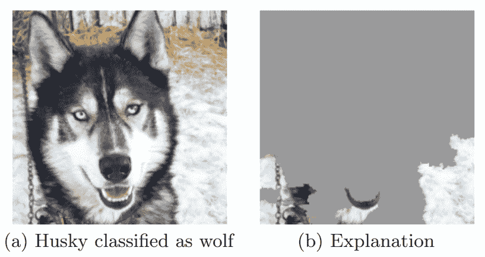
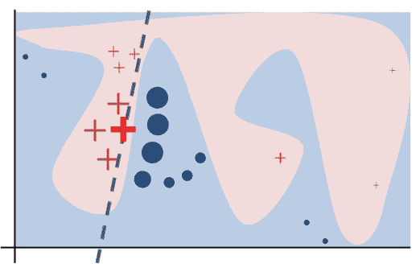
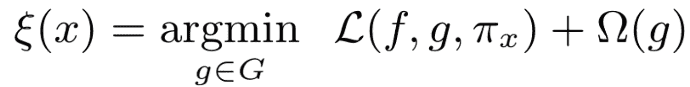
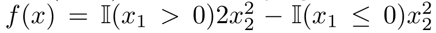
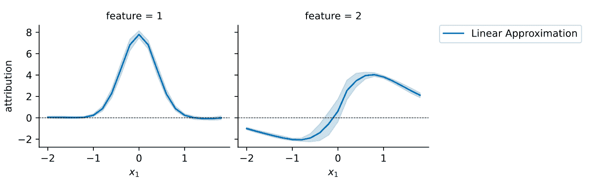

# 从统计学观点看模型不可知的局部解释模型

> 原文：<https://towardsdatascience.com/model-agnostic-local-explanation-models-from-a-statistical-viewpoint-i-bd04039c7040?source=collection_archive---------34----------------------->

## [思想和理论](https://towardsdatascience.com/tagged/thoughts-and-theory)

## 如果不理解局部解释方法的数学表达式，它们的属性可能是违反直觉的。这个博客文章系列介绍了最常用的局部解释方法，并讨论了它们的局部性。

# 1 导言

在最近的一篇[论文](https://arxiv.org/pdf/2106.14648.pdf) (Ghalebikesabi 等人，2021)中，我们已经表明，局部解释模型并不像人们可能假设的那样是局部的。随着越来越多的模型可解释性工具的开源实现变得可用，理解这些方法实际上在做什么以及为什么它们的本地解释是有限的变得越来越重要。在这个博客系列文章中，我们想要关注四个本地模型不可知的可解释性工具的统计分析和讨论:

*   切线近似
*   石灰
*   SHAP
*   SHAP 街区

如果你已经知道什么是模型可解释性、可解释人工智能或 XAI，那就等到[第二部](https://medium.com/@lucile.terminassian/shapley-values-model-agnostic-local-explanation-models-from-a-statistical-viewpoint-ii-4c279fb57974)！

# 模型可解释性介绍

那么什么是模型解释呢？模型解释可以通过对黑盒模型的解释来模糊地概括。通常，它们为用户提供特征属性，即每个特征的重要性分数。既然“解释一个模型”可能意味着任何事情，一个更好的问题是问解释模型回答了哪些问题。有不同的原因，用户可能对解释黑盒感兴趣，我们现在讨论其中的一些。

*   **理解。**首先，用户可能会对为什么黑盒会做出某种预测感兴趣。为什么美国有线电视新闻网把哈士奇的图片归类为狼？
*   **信任。**解释可以让用户信任或不信任模型。Ribeiro 等人(2016 年)表明，如果解释与 Husky 的例子相反，用户就不太可能相信黑盒模型。
*   **功能选择。**模型可解释性工具也可用于选择特征子集，以防止过度拟合。
*   **可行的建议。**特征属性形式的模型解释可用于向用户提供关于改变什么以接收不同黑盒响应的建议。被拒绝信贷的信贷申请人的高债务的负面归因暗示减少债务可以导致信贷批准。

根据数据分析师有兴趣回答的问题，应该使用不同的解释模型。解释模型可以根据以下维度进行分类(参见 Tanner (2019))

图片复制自[里贝罗等人(2016)](https://arxiv.org/pdf/1602.04938.pdf?ref=morioh.com) 。

*   **分析阶段。**解释模型可以是固有的，也可以是事后的。内在解释模型是简单的模型，如基于规则的模型或加法函数，即以 GAM 的形式，代替黑盒并进行预测。事后解释模型用于解释已经训练过的黑盒模型。
*   **模型特异性。**有些解释模型是针对底层黑盒的。例如，显著图只对可微函数起作用，而模型不可知的可解释性工具可以应用于任何模型。
*   **地点。最后但同样重要的是，可解释性工具可以根据它们的位置来区分。虽然它们中的一些解释了在感兴趣的实例 *x* 处的*局部*模型行为，但是其他的解释了黑盒的全局模型行为。**

在这个博客文章系列中，我们关注用于事后可解释性的本地模型不可知的解释模型。

# 2 切线近似值

在当地解释任何模型最简单的方法是什么？在任何分析课程中学习的第一个概念是一阶泰勒近似法:可以在感兴趣的实例 *x* 处通过拟合围绕 *x* 的切线来解释黑盒函数 *f(x)* 。当我们假设对模型进行黑盒访问时，必须通过在 *x* 周围的小邻域中评估模型拟合来近似这条切线，就像在局部线性核回归中所做的那样。正切近似值的示例有 MAPLE (Plumb，2018 年)或 MeLIME (Botari，2020 年)用于表格数据集。Ribeiro 等人(2016 年)提出的石灰是切线近似法的概括。

图片来自[里贝罗等人(2016)](https://arxiv.org/pdf/1602.04938.pdf?ref=morioh.com) 。

图为

*   一个黑盒分类模型 ***f*** :粉色和蓝色区域
*   一个正在被解释的例子:加粗的红十字
*   局部采样的实例，并根据其接近程度进行加权:红叉和蓝圈
*   局部忠实解释 ***g*** :虚线

根据 Ribeiro 等人(2016 年)的说法，可解释性模型要做到局部忠实，它“必须对应于模型在预测实例附近的行为方式”。正如我们将在后面看到的，这个定义留下了很多解释的空间！数学上，LIME 解决了以下优化问题

其中 *G* 是解释模型族(即切线逼近情况下的线性模型)， *L* 是损失函数，该损失函数确保 *g* 在围绕 *x* 的局部邻域中拟合到 *f* ，该局部邻域由加权核$\pi_x$标识，该加权核通常是距离函数的指数核，即欧几里德距离，具有固定带宽$\sigma$即$\pi_x=exp(-|x^*-x|/\sigma)$.最终，$ \适马(g)$是一个惩罚项，即 l1 损失，它可以防止过度拟合并增加 *g* 的简单性。

为了说明的目的，现在让我们考虑由下式给出的黑盒函数

当 x_1 为正时，在 x_2 中表现为正，当 x_1 为非正时，在 x_2 中表现为负。

使用带宽为 1 的局部岭回归计算的特征属性(图片由作者提供)。

如果我们用上述方程局部拟合一条切线到 x=(x_1，2)，特征-2 的属性对所有 x_1>0 都是正的，并增加较大的 x_1，这符合抛物线的递增梯度的性质。总而言之，切线逼近看起来很棒，不是吗？对于 x1 的绝对小负值，它们的归属是反直觉的。对于 x_1=-0.1，我们看到 x_1 的属性是正的，即使局部模型行为预期是负的！这是因为在 x 周围的邻居的 x_2 的积极影响超过了邻居的消极影响。

显然切线近似法丢失了黑盒模型中包含的信息。这并不奇怪:我们正试图用一阶泰勒近似来预测局部模型的行为。如果它在本地很合适，我们应该从一开始就使用本地线性黑盒。有关详细讨论，请参见 Rudin (2019)。

在下一篇[博文](https://medium.com/@lucile.terminassian/shapley-values-model-agnostic-local-explanation-models-from-a-statistical-viewpoint-ii-4c279fb57974)中，我们将深入探讨沙普利价值观，并解释为什么 SHAP 和莱姆并不像他们经常宣称的那样本地化！

# 参考

[1] T. Botari，F. Hvilshø，R. Izbicki，A. C. de Carvalho (2020 年)。MeLIME:对机器学习模型有意义的局部解释。 *arXiv 预印本 arXiv:2009.05818* 。

[2] S. Ghalebikesabi、L. Ter-Minassian、k . Diaz-奥尔达斯和 C. Holmes (2021 年)。论局部解释模型的局部性。 *arxiv 预印本 arXiv:2106.14648。*

[3] M .里贝罗、s .辛格和 C. Guestrin (2016 年)。“我为什么要相信你？”解释任何分类器的预测。第 22 届 ACM SIGKDD 知识发现和数据挖掘国际会议论文集。

[4] C .鲁丁(2019)。停止解释高风险决策的黑牛机器学习模型，而是使用可解释的模型。*自然机器智能*1.5:206–215

[5] G .普拉姆，d .莫里托尔，a .塔尔沃卡尔。(2018).模型不可知论者监督的局部解释。 *arXiv 预印本 arXiv:1807.02910* 。

[6] G .坦纳(2019)。机器学习模型解释导论。https://Gilbert tanner . com/blog/introduction-to-machine-learning-model-interpretation 的博文