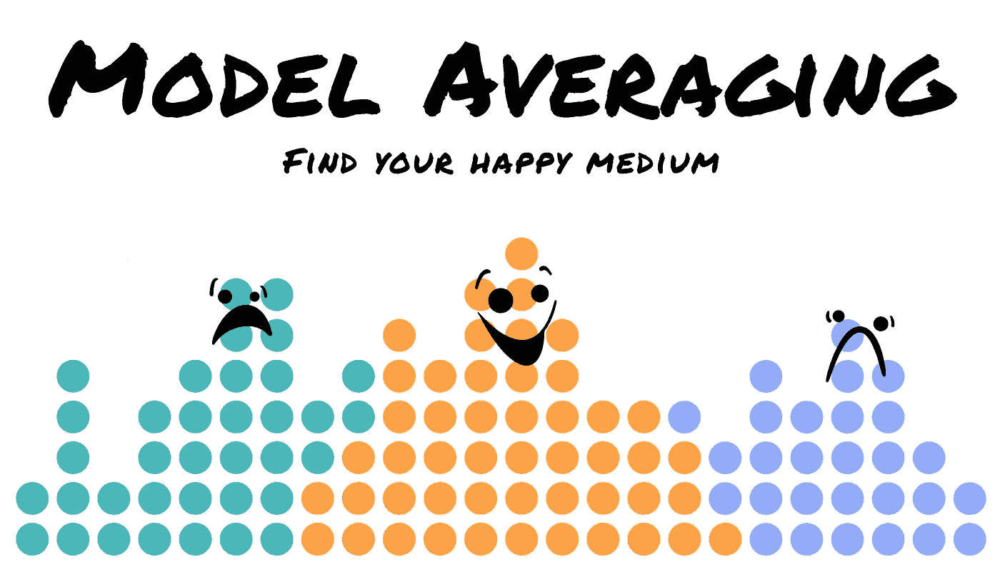
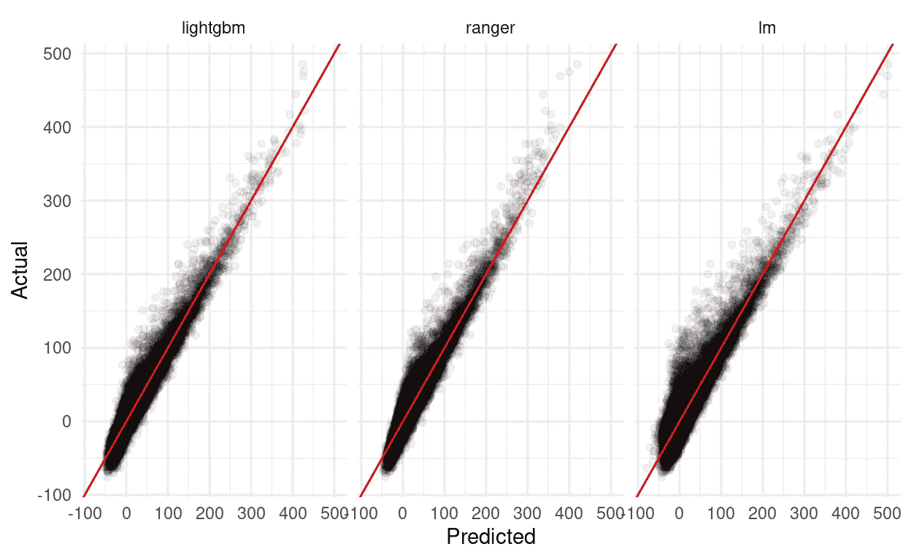
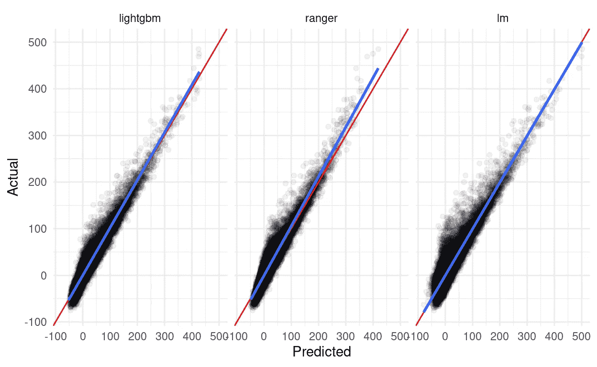
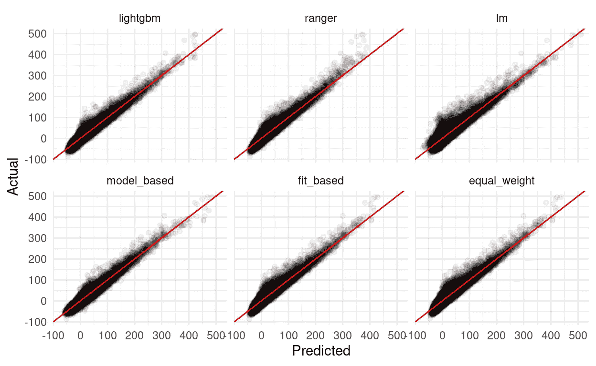

# 模式平均方法:如何和为什么建立集合模式

> 原文：<https://towardsdatascience.com/model-averaging-methods-how-and-why-to-build-ensemble-models-b4e5d97cbb4?source=collection_archive---------54----------------------->

## [实践教程](https://towardsdatascience.com/tagged/hands-on-tutorials)

## 平均预测的乐趣和利润，以及处理模型选择的不确定性。用 R 中的例子！



*卡通组件是 CC-BY 4.0 Allison Horst(*[*@ Allison _ Horst*](https://twitter.com/allison_horst)*上 Twitter)*

# 介绍

建立模型很难。选择构建什么样的模型可能更加困难。由于似乎有无限多种不同的建模方法可供选择(甚至有更多的独立实现)，很难猜测哪种方法最适合您的数据，尤其是当您处理的数据会随着时间的推移而发生变化，新的观察值或预测值会加入其中。

通常，我们用置信区间和标准误差来揭示这种不确定性。然而，在选择单个模型时，我们通常不会讨论我们对该模型是正确的有多大信心——相反，我们只展示和报告我们的最终选择，就好像其他候选模型不可能一样好或者甚至更好。

集合模型证明了处理这种不确定性的一种方法。通过对少数候选模型的预测进行平均，集合承认可能有多个模型可以用来描述我们的数据——通过对平均值进行加权，我们可以传达我们对每个模型的世界观有多自信。当然，虽然[这一切都很好，也很华丽，但它也需要工作](https://www.bloomberg.com/graphics/2015-paul-ford-what-is-code/)——模型平均提供了，通常会减少预测误差，甚至超过最佳的单个组件模型。

模型平均有很多方法。本文的其余部分将介绍一些最简单的方法——等权重平均法、基于拟合的平均法和基于模型的组合法——您可以轻松实现这些方法，而无需担心减缓迭代时间或使建模代码过于复杂。

# 入门指南

我们将使用以下库进行数据操作和可视化:

```
[library](https://rdrr.io/r/base/library.html)([dplyr](https://dplyr.tidyverse.org))
[library](https://rdrr.io/r/base/library.html)([tidyr](https://tidyr.tidyverse.org))
[library](https://rdrr.io/r/base/library.html)([ggplot2](http://ggplot2.tidyverse.org))
[library](https://rdrr.io/r/base/library.html)([knitr](https://yihui.org/knitr/))
```

此外，我们将使用`ranger`和`lightgbm`来开发组件模型:

```
[library](https://rdrr.io/r/base/library.html)([ranger](https://github.com/imbs-hl/ranger))
[library](https://rdrr.io/r/base/library.html)([lightgbm](https://github.com/Microsoft/LightGBM))
```

最后，我们需要建模的实际数据。对于这个例子，我们将使用航班详细信息和天气数据来构建模型，预测`nycflights13`包中包含的航班的到达延迟。下一段代码将把我们的数据预处理成适合模型的格式:

```
flights <- nycflights13::[flights](https://rdrr.io/pkg/nycflights13/man/flights.html)
weather <- nycflights13::[weather](https://rdrr.io/pkg/nycflights13/man/weather.html) %>% 
  [select](https://dplyr.tidyverse.org/reference/select.html)(-wind_gust) # About 80% missing values
# combine the two data frames into one complete set
flight_data <- flights %>% 
  [left_join](https://dplyr.tidyverse.org/reference/mutate-joins.html)(weather,
            by = [c](https://rdrr.io/r/base/c.html)("year", 
                   "month", 
                   "day", 
                   "origin", 
                   "hour", 
                   "time_hour")
    ) %>% 
  [drop_na](https://tidyr.tidyverse.org/reference/drop_na.html)()

flight_data <- flight_data %>% 
  # Drop 37 pretty dramatic outliers
  [filter](https://dplyr.tidyverse.org/reference/filter.html)(arr_delay <= 500) %>% 
  # Get rid of useless predictors -- 
  # these each cause problems with at least one of our regressions
  [select](https://dplyr.tidyverse.org/reference/select.html)(-year, -time_hour, -minute) %>% 
  # We'll only work with numeric predictors for now
  [select_if](https://dplyr.tidyverse.org/reference/select_all.html)(is.numeric)
```

对于最后一个预处理步骤，我们将把数据分成训练集、验证集和测试集(20%用于验证和测试，其余的用于训练)。我们将根据验证集使用模型性能来确定平均值的权重。

```
[set.seed](https://rdrr.io/r/base/Random.html)(123)
# Generate a random sequence to subset our data into 
# train/validate/test splits
row_index <- [sample](https://rdrr.io/r/base/sample.html)([nrow](https://rdrr.io/r/base/nrow.html)(flight_data), [nrow](https://rdrr.io/r/base/nrow.html)(flight_data))

# Testing gets the 20% of data with the highest random index values
flight_testing <- flight_data[
    row_index >= [nrow](https://rdrr.io/r/base/nrow.html)(flight_data) * 0.8, 
]

# Validation gets the next highest 20%
flight_validation <- flight_data[
    row_index >= [nrow](https://rdrr.io/r/base/nrow.html)(flight_data) * 0.6 &
    row_index < [nrow](https://rdrr.io/r/base/nrow.html)(flight_data) * 0.8, 
]

# Training gets the rest
flight_training <- flight_data[
    row_index < [nrow](https://rdrr.io/r/base/nrow.html)(flight_data) * 0.6, 
]

# LightGBM requires matrices, rather than data frames:
xtrain <- [as.matrix](https://rdrr.io/r/base/matrix.html)([select](https://dplyr.tidyverse.org/reference/select.html)(flight_training, -arr_delay))
ytrain <- [as.matrix](https://rdrr.io/r/base/matrix.html)(flight_training[["arr_delay"]])

xvalid <- [as.matrix](https://rdrr.io/r/base/matrix.html)([select](https://dplyr.tidyverse.org/reference/select.html)(flight_validation, -arr_delay))
xtest <- [as.matrix](https://rdrr.io/r/base/matrix.html)([select](https://dplyr.tidyverse.org/reference/select.html)(flight_testing, -arr_delay))
```

这样一来，是时候开始训练我们的模型了！

# 组件模型

# 线性模型

让我们从一个简单的线性回归模型开始，使用航班数据集中的所有预测值来尝试和估计到达延误:

```
linear_model <- [lm](https://rdrr.io/r/stats/lm.html)(arr_delay ~ ., flight_training)
[summary](https://rdrr.io/r/base/summary.html)(linear_model)Call:
lm(formula = arr_delay ~ ., data = flight_training)

Residuals:
    Min      1Q  Median      3Q     Max 
-58.895  -9.133  -1.538   7.076 159.388 

Coefficients:
                 Estimate Std. Error  t value Pr(>|t|)    
(Intercept)    -4.613e+00  5.992e+00   -0.770 0.441394    
month           3.825e-02  1.117e-02    3.424 0.000618 ***
day             2.220e-02  4.109e-03    5.404 6.51e-08 ***
dep_time        9.509e-05  2.795e-04    0.340 0.733722    
sched_dep_time -3.492e-03  1.894e-03   -1.844 0.065257 .  
dep_delay       1.013e+00  1.068e-03  948.332  < 2e-16 ***
arr_time        8.816e-04  1.182e-04    7.460 8.68e-14 ***
sched_arr_time -4.713e-03  1.478e-04  -31.884  < 2e-16 ***
flight         -4.692e-05  2.541e-05   -1.846 0.064863 .  
air_time        7.563e-01  3.074e-03  246.006  < 2e-16 ***
distance       -9.792e-02  3.925e-04 -249.500  < 2e-16 ***
hour            6.000e-01  1.871e-01    3.207 0.001341 ** 
temp            1.173e-01  2.232e-02    5.254 1.49e-07 ***
dewp            3.632e-02  2.405e-02    1.510 0.130928    
humid           1.860e-02  1.229e-02    1.514 0.130053    
wind_dir       -6.076e-03  4.009e-04  -15.158  < 2e-16 ***
wind_speed      1.920e-01  7.538e-03   25.471  < 2e-16 ***
precip          2.688e+01  3.014e+00    8.920  < 2e-16 ***
pressure       -1.634e-02  5.619e-03   -2.909 0.003631 ** 
visib          -4.603e-01  3.239e-02  -14.212  < 2e-16 ***
---
Signif. codes:  0 '***' 0.001 '**' 0.01 '*' 0.05 '.' 0.1 ' ' 1

Residual standard error: 14.82 on 170687 degrees of freedom
Multiple R-squared:  0.8707,    Adjusted R-squared:  0.8707 
F-statistic: 6.048e+04 on 19 and 170687 DF,  p-value: < 2.2e-16
```

酷！我们有了第一个模型——它看起来相当合适，R 为 0.87。我们或许可以通过更有选择性地使用我们的术语或加入一些交互术语来使这个模型变得更好——但作为我们将纳入我们平均值的模型的第一次尝试，这是非常好的。

当然，我们希望确保该模型能够在其训练数据之外进行推广，让我们也用它来针对我们的验证集进行预测:

```
flight_validation$lm_pred <- [predict](https://rdrr.io/r/stats/predict.html)(
  linear_model,
  newdata = flight_validation
)

[sqrt](https://rdrr.io/r/base/MathFun.html)(
    [mean](https://rdrr.io/r/base/mean.html)(
    (flight_validation$lm_pred - flight_validation$arr_delay)^2
    )
)[1] 14.73962[summary](https://rdrr.io/r/base/summary.html)([lm](https://rdrr.io/r/stats/lm.html)(arr_delay ~ lm_pred, flight_validation))$r.squared[1] 0.8684178
```

r 保持在大约 0.87，RMSE 在大约 14.74 分钟——考虑到验证集范围从-75 到 485 分钟的延迟，对于一个天真实现的线性模型来说，感觉还不算太坏。

# 随机森林

所以我们已经排序了我们的第一个模型，但是我们需要更多来取平均值！虽然我们可以平均出许多具有不同参数的线性模型，但是将一些不同的算法组合成组件模型感觉更有趣。因此，让我们使用 [ranger](https://github.com/imbs-hl/ranger) 实现一个随机森林来表示我们的数据——公平的警告，这个需要一点时间来训练！

```
ranger_model <- ranger::[ranger](https://rdrr.io/pkg/ranger/man/ranger.html)(
    arr_delay ~ ., 
    data = flight_training
)[sqrt](https://rdrr.io/r/base/MathFun.html)(ranger_model$prediction.error)[1] 11.08573ranger_model$r.squared[1] 0.9276561
```

因此，这个模型的 RMSE 为 11.09，R 为 0.93，比我们的线性模型有所改进！虽然我们可以通过仔细的调整来弥补一些改进，但看起来这个版本足够适合作为我们合奏中的一个例子。和以前一样，我们希望通过使用该模型为我们的验证集生成预测来检验该模型的泛化能力:

```
ranger_predictions <- [predict](https://rdrr.io/r/stats/predict.html)(
    ranger_model,
    data = flight_validation
  )

flight_validation$ranger_pred <- ranger_predictions$predictions

[sqrt](https://rdrr.io/r/base/MathFun.html)(
    [mean](https://rdrr.io/r/base/mean.html)(
        (
            flight_validation$ranger_pred -
            flight_validation$arr_delay
        )^2
    )
)[1] 10.96209[summary](https://rdrr.io/r/base/summary.html)([lm](https://rdrr.io/r/stats/lm.html)(arr_delay ~ ranger_pred, flight_validation))$r.squared[1] 0.9302306
```

我们的模型实际上在验证集上表现得(非常)好一点！

# 马恩岛

所以这是两个模型排序！为了完整起见，让我们实现第三个也是最后一个组件模型，这一次使用 [LightGBM](https://github.com/microsoft/LightGBM/tree/master/R-package) 包来安装梯度推进机器。与上两个相似，我们不会对这个模型进行太多的参数化，我对模型拟合默认值的唯一更改是使用 100 轮，让 boosting 算法达到与我们的其他两个模型相同的性能范围。

```
lightgbm_model <- lightgbm::[lightgbm](https://rdrr.io/pkg/lightgbm/man/lightgbm.html)(xtrain, 
                                     ytrain, 
                                     nrounds = 100, 
                                     obj = "regression", 
                                     metric = "rmse",
                                     # Suppress output
                                     force_col_wise = TRUE,
                                     verbose = 0L)
```

`lightgbm_model`没有像我们的线性模型和随机森林那样简单的方法来评估包内性能。我们将直接跳到验证集:

```
flight_validation$lightgbm_pred <- [predict](https://rdrr.io/r/stats/predict.html)(
  lightgbm_model,
  xvalid
)

[sqrt](https://rdrr.io/r/base/MathFun.html)(
    [mean](https://rdrr.io/r/base/mean.html)(
        (
            flight_validation$lightgbm_pred -     
            flight_validation$arr_delay
        )^2
    )
)[1] 10.4088[summary](https://rdrr.io/r/base/summary.html)([lm](https://rdrr.io/r/stats/lm.html)(arr_delay ~ lightgbm_pred, flight_validation))$r.squared[1] 0.9347398
```

所以看起来 LightGBM 模型的性能和我们的随机森林差不多(如果不是稍微好一点的话)!作为参考，以下是我们每个候选模型的 RMSE 值:

```
prediction_values <- flight_validation %>% 
  # Only select our y and y-hat columns
  [select](https://dplyr.tidyverse.org/reference/select.html)([ends_with](https://tidyselect.r-lib.org/reference/starts_with.html)("pred"), [matches](https://tidyselect.r-lib.org/reference/starts_with.html)("arr_delay"))

prediction_plots <- prediction_values %>% 
  [pivot_longer](https://tidyr.tidyverse.org/reference/pivot_longer.html)(cols = -arr_delay) %>% 
  [mutate](https://dplyr.tidyverse.org/reference/mutate.html)(
    name = [regmatches](https://rdrr.io/r/base/regmatches.html)(name, 
                      [regexpr](https://rdrr.io/r/base/grep.html)(".*(?=_pred)", name, perl = TRUE)),
    resid = value - arr_delay,
    name = [factor](https://rdrr.io/r/base/factor.html)(name, levels = [c](https://rdrr.io/r/base/c.html)("lightgbm", "ranger", "lm"))
  )

prediction_plots %>% 
  [group_by](https://dplyr.tidyverse.org/reference/group_by.html)(Model = name) %>% 
  [summarise](https://dplyr.tidyverse.org/reference/summarise.html)(RMSE = [sqrt](https://rdrr.io/r/base/MathFun.html)([mean](https://rdrr.io/r/base/mean.html)(resid^2)), .groups = "drop") %>% 
  [arrange](https://dplyr.tidyverse.org/reference/arrange.html)(RMSE)Model      RMSE     
lightgbm 10.40880   
ranger   10.96209   
lm       14.73962
```

当然，单个指标并不能说明全部情况——查看我们预测的诊断图，以尝试理解我们的预测与数据匹配的模式可能会有所帮助。例如，“线性模型平均差大约 4 分钟”在理论上是很好的，但是下图可以帮助我们看到，例如，线性模型在 0 分钟延迟(其中大部分数据是聚集的)左右表现稍差，而我们的随机森林在更高的极端情况下表现更差:

```
prediction_plots %>% 
  [ggplot](https://ggplot2.tidyverse.org/reference/ggplot.html)([aes](https://ggplot2.tidyverse.org/reference/aes.html)(value, arr_delay)) + 
  [geom_point](https://ggplot2.tidyverse.org/reference/geom_point.html)(alpha = 0.05) +
  [geom_abline](https://ggplot2.tidyverse.org/reference/geom_abline.html)(slope = 1, intercept = 0, color = "red") + 
  [facet_wrap](https://ggplot2.tidyverse.org/reference/facet_wrap.html)(~ name) + 
  [theme_minimal](https://ggplot2.tidyverse.org/reference/ggtheme.html)() + 
  [labs](https://ggplot2.tidyverse.org/reference/labs.html)(x = "Predicted",
       y = "Actual")
```



# 模型平均

有了我们的候选模型，我们现在已经完全准备好进入模型平均方法了！我们将介绍三种方法的基本实现(等权重、基于拟合的权重和基于模型的估计)，然后在最后评估我们的整体。

# 同等重量

也许平均模型最明显的方法是取模型预测的简单算术平均值。这种方法预先假定您的每个模型都是您的底层数据的同样好的表示；因为这里不是这种情况，我们可能期望这种方法不会从整体上大大减少误差。

不过，这种方法的一个好处是实现根本不需要时间:

```
prediction_values <- prediction_values %>% 
  [mutate](https://dplyr.tidyverse.org/reference/mutate.html)(
    equal_weight_pred = (lm_pred + ranger_pred + lightgbm_pred) / 3
  )
```

# 基于拟合的权重

一个稍微复杂一点的方法是基于模型性能的一些度量来加权模型。几乎任何具有跨组件模型的标准定义的度量标准都可以使用(例如，AIC 或 BIC 的嵌套模型或 MSE 和 MAPE)；到目前为止，我们一直在使用 RMSE，我们将使用它来衡量我们的错误。

在数据科学的宏大计划中，基于拟合统计的加权模型也相对容易。首先，计算每个模型的拟合统计数据:

```
model_rmse <- [vapply](https://rdrr.io/r/base/lapply.html)(
  prediction_values,
  function(x) [sqrt](https://rdrr.io/r/base/MathFun.html)(
    [mean](https://rdrr.io/r/base/mean.html)(
        (x - prediction_values$arr_delay)^2
    )
  ),
  [numeric](https://rdrr.io/r/base/numeric.html)(1)
  )[1:3] # Only our 3 component models!model_rmselm_pred   ranger_pred lightgbm_pred
14.73962   10.96209      10.40880
```

然后，根据您的统计数据，您可能需要取每个值的倒数，因为 RMSEs 越低越好，我们需要这样做:

```
rmse_weights <- (1 / (model_rmse))
```

最后，将您的权重计算为整个集合的比例-您可以将这些值视为每个组件贡献的集合预测的比例:

```
rmse_weights <- rmse_weights / [sum](https://rdrr.io/r/base/sum.html)(rmse_weights)
rmse_weightslm_pred  ranger_pred lightgbm_pred 
0.2659099  0.3575422   0.3765479
```

使用集合进行预测相对容易，只需将每个预测值乘以它们的比例，然后将结果相加:

```
prediction_values <- prediction_values %>% 
  [mutate](https://dplyr.tidyverse.org/reference/mutate.html)(
    fit_based_pred = (
        (lm_pred * rmse_weights["lm_pred"]) + 
        (ranger_pred * rmse_weights["ranger_pred"]) + 
        (lightgbm_pred * rmse_weights["lightgbm_pred"])
        )
  )
```

# 基于模型的权重

我们将走过的最后一个平均方法稍微复杂一点，但仍然很容易理解:取你的模型输出，转过来，用它们作为模型输入。


我们这里的玩具示例非常适合这种方法，我们已经在图表中看到，我们的预测和真实值之间存在很强的线性关系，这种关系对于每个模型都略有不同:



从该图中，我们可以猜测，将我们的组分预测作为特征组合的线性模型将非常适合对这些模型进行平均。为此，我们只需建立一个线性模型:

```
predictions_model <- [lm](https://rdrr.io/r/stats/lm.html)(
    arr_delay ~ lm_pred * ranger_pred * lightgbm_pred, 
    data = prediction_values
)
```

然后用它来生成预测，就像我们最初的分量线性模型一样:

```
prediction_values$model_based_pred <- [predict](https://rdrr.io/r/stats/predict.html)(
  predictions_model,
  newdata = prediction_values
)
```

请注意，如果我们看到我们的预测和真实值之间的非线性关系，我们会希望依靠非线性方法来平均预测；碰巧的是，我们的模型已经非常适合基础数据，并且可以用简单的线性回归很好地表示。

# 我们表现如何？

现在我们已经准备好了我们的集合模型，是时候根据我们的测试集来评估我们所有的模型了！

第一步是使用我们的组件模型为测试集生成预测:

```
flight_testing$lm_pred <- [predict](https://rdrr.io/r/stats/predict.html)(
  linear_model,
  newdata = flight_testing
)

ranger_predictions <- [predict](https://rdrr.io/r/stats/predict.html)(
    ranger_model,
    data = flight_testing
  )

flight_testing$ranger_pred <- ranger_predictions$predictions

flight_testing$lightgbm_pred <- [predict](https://rdrr.io/r/stats/predict.html)(
  lightgbm_model,
  xtest
)
```

我们可以使用这些预测来生成我们的集合预测。请注意，我们仍然使用根据验证数据校准的权重和模型——我们(理论上)不应该知道测试集的“真实”值，所以我们现在不能重新加权我们的平均值！

```
flight_testing <- flight_testing %>% 
  [mutate](https://dplyr.tidyverse.org/reference/mutate.html)(
    equal_weight_pred = (lm_pred + ranger_pred + lightgbm_pred) / 3
  )

flight_testing <- flight_testing %>% 
  [mutate](https://dplyr.tidyverse.org/reference/mutate.html)(
    fit_based_pred = (
        (lm_pred * rmse_weights["lm_pred"]) +
        (ranger_pred * rmse_weights["ranger_pred"]) + 
        (lightgbm_pred * rmse_weights["lightgbm_pred"])
    )
  )

flight_testing$model_based_pred <- [predict](https://rdrr.io/r/stats/predict.html)(
  predictions_model,
  newdata = flight_testing
)
```

我们表现如何？让我们来看看每个型号的 RMSE:

```
prediction_values <- flight_testing %>% 
  [select](https://dplyr.tidyverse.org/reference/select.html)([ends_with](https://tidyselect.r-lib.org/reference/starts_with.html)("pred"), [matches](https://tidyselect.r-lib.org/reference/starts_with.html)("arr_delay"))

prediction_plots <- prediction_values %>% 
  [pivot_longer](https://tidyr.tidyverse.org/reference/pivot_longer.html)(cols = -arr_delay) %>% 
  [mutate](https://dplyr.tidyverse.org/reference/mutate.html)(
    name = [regmatches](https://rdrr.io/r/base/regmatches.html)(name, 
                      [regexpr](https://rdrr.io/r/base/grep.html)(".*(?=_pred)", name, perl = TRUE)),   
    resid = value - arr_delay,
    name = [factor](https://rdrr.io/r/base/factor.html)(name, 
                  levels = [c](https://rdrr.io/r/base/c.html)("lightgbm", 
                             "ranger", 
                             "lm",
                             "model_based", 
                             "fit_based", 
                             "equal_weight")
                 )
  )

prediction_plots %>% 
  [group_by](https://dplyr.tidyverse.org/reference/group_by.html)(Model = name) %>% 
  [summarise](https://dplyr.tidyverse.org/reference/summarise.html)(RMSE = [sqrt](https://rdrr.io/r/base/MathFun.html)([mean](https://rdrr.io/r/base/mean.html)(resid^2)), .groups = "drop") %>% 
  [arrange](https://dplyr.tidyverse.org/reference/arrange.html)(RMSE)Model           RMSE     
model_based   9.492409
lightgbm     10.290113   
ranger       10.968544   
fit_based    11.057728   
equal_weight 11.311836   
lm           14.621943prediction_plots %>% 
  [ggplot](https://ggplot2.tidyverse.org/reference/ggplot.html)([aes](https://ggplot2.tidyverse.org/reference/aes.html)(value, arr_delay)) + 
  [geom_point](https://ggplot2.tidyverse.org/reference/geom_point.html)(alpha = 0.05) +
  [geom_abline](https://ggplot2.tidyverse.org/reference/geom_abline.html)(slope = 1, intercept = 0, color = "red") + 
  [facet_wrap](https://ggplot2.tidyverse.org/reference/facet_wrap.html)(~ name) + 
  [theme_minimal](https://ggplot2.tidyverse.org/reference/ggtheme.html)() + 
  [labs](https://ggplot2.tidyverse.org/reference/labs.html)(x = "Predicted",
       y = "Actual")
```



酷——我们基于模型的集合实际上比任何组件都表现得更好！虽然等权重和基于拟合的平均值相当中庸，但在其他情况下，这些方法也有助于减少预测中的偏差，并产生比任何组件模型方差都小的估计值。

# 结论

模型平均是一个强大的工具，可以减少模型偏差，并解决在试图选择“最佳”模型的情况下隐含的不确定性。虽然存在大量复杂且计算昂贵的平均方法，并且可以极大地提高模型性能，但更简单的集成方法可以提供相同的好处，而不一定会导致相同的成本。

*最初发表于*[*https://www . mm 218 . dev*](https://www.mm218.dev/posts/2021/01/model-averaging/)[*/posts/2021/01/model-averaging*](https://www.mm218.dev/posts/2021/01/model-averaging)*——参见该网站的文献引用和改进的语法突出显示。*