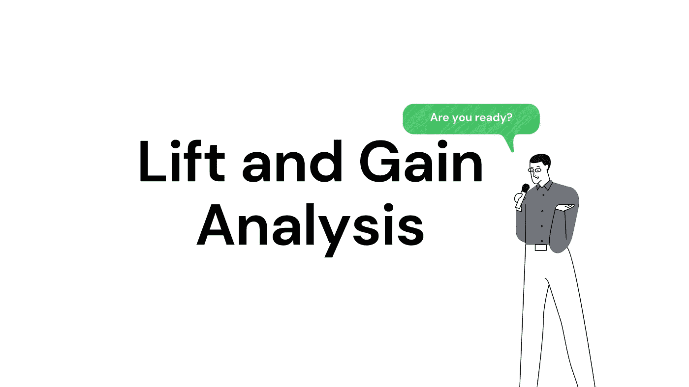
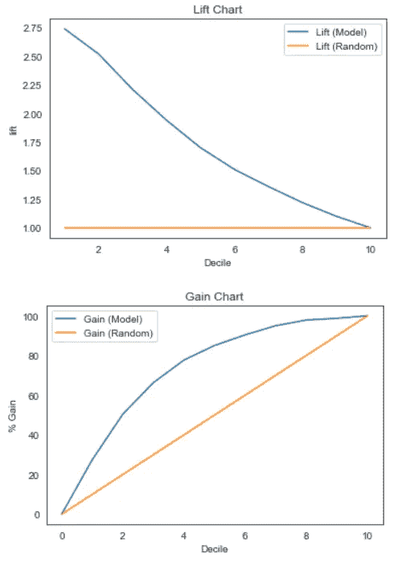
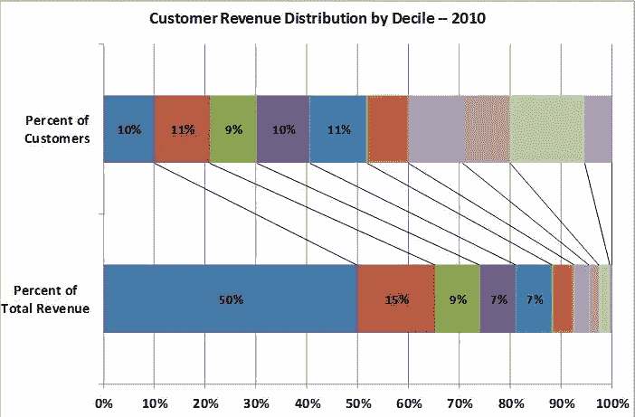
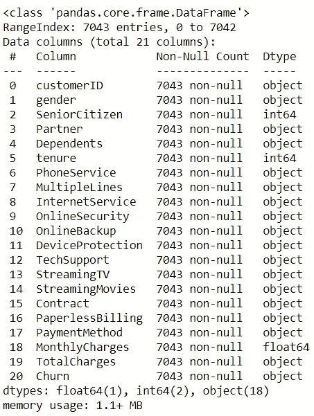
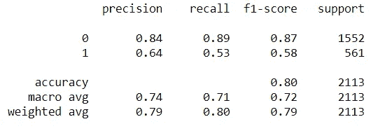
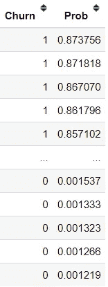
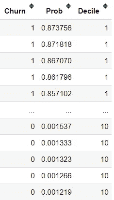
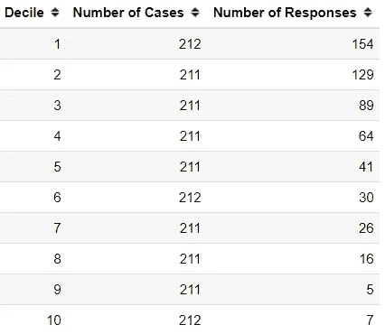
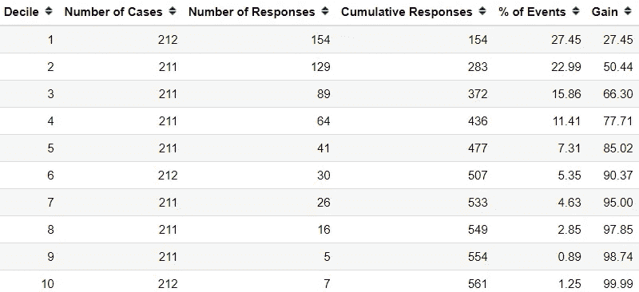
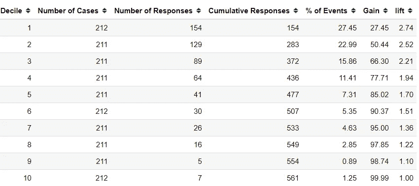

# 利用提升和增益分析进行模型效益评估

> 原文：<https://towardsdatascience.com/model-benefit-evaluation-with-lift-and-gain-analysis-4b69f9288ab3?source=collection_archive---------2----------------------->

## [行业笔记](https://towardsdatascience.com/tagged/notes-from-industry)

## 人们经常忽视的基本分析



作者图片

> 如果你喜欢我的内容，并想获得更多关于数据或作为数据科学家的日常生活的深入知识，请考虑在这里订阅我的[时事通讯。](https://cornellius.substack.com/welcome)

作为数据科学家，开发机器学习模型是我们日常工作的一部分，也是我们最初被雇佣的原因。然而，我们开发的机器学习模型不只是为了展示，而是解决业务问题的实际工具。这就是为什么我们需要评估我们的机器学习模型，以衡量我们的模型如何影响业务。

许多数据科学家会用技术指标来衡量人们，比如准确度、精确度、F1 分数、ROC-AUC 等等。这是一个必要的度量标准，但是有时这些度量标准并不能反映该模型在商业上的表现。尽管如此，商业人士需要知道我们的模型与随机目标相比，在商业上有何不同。这就是为什么我们使用升力和增益分析— **来衡量我们的预测模型比没有模型**时好多少。

事不宜迟，我们开始吧。

# 升力和增益分析

提升和收益分析是评估模型预测和业务收益的分析。它常用于营销目标分析，但不受限制。

在典型的升力和增益分析中，分析结果将显示在下图中。



作者图片

增益和提升图是评估分类模型性能的直观工具。与评估总体的混淆矩阵不同，增益和提升图评估部分总体的模型性能。这意味着我们根据在一部分人口中使用该模型可能获得的益处来评估该模型。

收益和提升分析的好处来自于我们 80%的收入来自于 20%的客户。这是增益和升力图计算中使用的**十分位数分析**的主要部分。十分位数分析如下图所示。



十分位数分析(资料来源:[http://www.totalcustomeranalytics.com/decile_analysis.htm](http://www.totalcustomeranalytics.com/decile_analysis.htm))

十分位数分析如何适用于增益和提升分析？让我们后退几步，解释一下如何从一开始就计算出增益和提升分析。

正如我前面提到的，增益和提升图用于评估分类模型。为了举例，让我们创建一个预测模型。在本文中，我将使用来自 [Kaggle](https://www.kaggle.com/blastchar/telco-customer-churn) 的流失数据。

```
import pandas as pd
churn = pd.read_csv('churn.csv')
```



作者图片

在这个数据集中，我们有 21 列，目标是客户流失。这意味着我们将开发一个分类预测模型来预测客户流失。为了简单起见，我将清理数据用于建模目的。

```
#Drop Customer ID
churn = churn.drop('customerID', axis = 1)#Change Ordinal data to numerical
for i in ['Partner', 'Dependents', 'PhoneService', 'OnlineSecurity', 
          'OnlineBackup', 'DeviceProtection', 'TechSupport', 'StreamingTV', 'StreamingMovies', 'PaperlessBilling', 'Churn']:
    churn[i] = churn[i].apply(lambda x: 1 if x == 'Yes' else 0)#OHE categorical data
churn = pd.get_dummies(churn, columns = ['gender', 'MultipleLines', 'InternetService', 'Contract', 'PaymentMethod'], drop_first = True)#Change object data into numerical
churn['TotalCharges'] = churn['TotalCharges'].apply(lambda x: 0 if x == ' ' else float(x))
```

清理完数据后，我们将尝试开发预测模型。对于本文，我将使用逻辑回归模型。

```
#Import the model
from sklearn.model_selection import train_test_split
from sklearn.linear_model import LogisticRegression#Splitting the model
X_train, X_test, y_train, y_test = train_test_split(churn.drop('Churn', axis =1), churn['Churn'], test_size = 0.3,stratify = churn['Churn'], random_state = 101)model = LogisticRegression()
model.fit(X_train, y_train)
```

当我们的模型设定后，我们将开始进行增益和升力分析来评估这个模型。作为比较，我们将使用通常的度量来评估模型。

```
from sklearn.metrics import classification_report
predictions = model.predict(X_test)
print(classification_report(y_test, predictions))
```



作者图片

正如我们从上图中看到的，我们的模型预测客户(类别 1)的能力较低。如果我们在业务中应用我们的模型，它还会有好处吗？让我们用增益和升力分析来看看。

增益和升力分析的第一步是**根据测试数据得到第一类**的模型预测概率，**按降序排列**。

```
#Getting the prediction probability of class 1 and order it by descending orderX_test['Prob']  = model.predict_proba(X_test)[:,1]
X_test = X_test.sort_values(by = 'Prob', ascending = False)
X_test['Churn'] = y_test
```



作者图片

当我们获得概率并按降序排序时，**我们会将数据分成十分位数**。这类似于我在上面的图片中展示的十分位数分析；我们把数据分成 10 组，贴上标签。

```
#Divide the data into decile
X_test['Decile'] = pd.qcut(X_test['Prob'], 10, labels=[i for i in range (10, 0, -1)])
```



作者图片

将数据除以十分位数后，**我们需要计算每个十分位数的实际流失率(实际类别 1，非预测值)**。这个动议我称之为**号响应。**

```
#Calculate the actual churn in each decile
res = pd.crosstab(X_test['Decile'], X_test['Churn'])[1].reset_index().rename(columns = {1: 'Number of Responses'})lg = X_test['Decile'].value_counts(sort = False).reset_index().rename(columns = {'Decile': 'Number of Cases', 'index': 'Decile'})lg = pd.merge(lg, res, on = 'Decile').sort_values(by = 'Decile', ascending = False).reset_index(drop = True)
```



作者图片

在上图中，我们获得了病例数(十分位数的数据数)和应答数(每个十分位数的实际阳性数据数)。有了这个数字，我们就能够计算出**增益数。**

供参考。**增益**是每个十分位数的累计响应数(实际阳性)除以数据中阳性观察总数的比值。让我们试着在我们的数据中计算一下。

```
#Calculate the cumulative
lg['Cumulative Responses'] = lg['Number of Responses'].cumsum()#Calculate the percentage of positive in each decile compared to the total nu
lg['% of Events'] = np.round(((lg['Number of Responses']/lg['Number of Responses'].sum())*100),2)#Calculate the Gain in each decile
lg['Gain'] = lg['% of Events'].cumsum()
```



作者图片

从上面的增益图中我们可以看到，每十分位数的增益数都在增加，但随着十分位数的增加，累积总数会减少。增益的解释是什么？增益是在给定的十分位数水平上覆盖的目标(实际阳性)的百分比。例如，在十分位数 2 中，我们的收益为 50.44。这意味着基于该模型的前 20%的数据覆盖了 50.44%的目标。在客户流失模型中，我们可以说，我们可以通过瞄准总客户的 20%来识别和瞄准可能流失的 50%的客户。从业务角度来看，这意味着利用更少的资源，我们可能会避免 50%的客户流失事件。

接下来，我们需要计算升力。lift 将测量与没有模型相比，使用预测模型我们可以预期做得多好。

```
lg['Decile'] = lg['Decile'].astype('int')
lg['lift'] = np.round((lg['Gain']/(lg['Decile']*10)),2)
```



作者图片

提升可以被解释为在给定的十分位数水平上的增益比率百分比与随机百分比。用外行的话来说，在十分位数 2 中，我们有 2.52 意味着当基于模型选择 20%的数据时，我们可以找到的目标(实际阳性)是随机选择的 20%的数据(没有模型)的 2.52 倍。

让我们试着想象一下与随机选择相比的收益和提升图。


作者图片

在上图中，我们可以通过测量模型与随机模型相比的增益和升力来评估模型——面积越大，模型的**越好**。我们可以看到，我们的模型在预测方面很好，因为图表显示，该模型比随机选择允许更大的增益和提升。从商业角度来看，使用该模型可以更好地发现客户流失；意味着花费更少的资源。

# **结论**

模型评估对数据科学家的工作很重要；然而，我们需要根据业务有用性来评估模型。仅仅依靠技术指标是不够的，还要依靠我们的模型如何影响业务。在本文中，我解释了提升和收益分析对于从业务的角度评估模型是有用的，使用了:

1.  增益数(每十分位数覆盖的目标百分比)
2.  提升数(在给定的十分位数水平上，增益率占随机百分比的百分比)

在我的[**LinkedIn**](https://www.linkedin.com/in/cornellius-yudha-wijaya/)**或 [**Twitter**](https://twitter.com/CornelliusYW) **上访问我。****

> **如果您没有订阅为中等会员，请考虑通过[我的推荐](https://cornelliusyudhawijaya.medium.com/membership)订阅。**