# 使用 TensorFlow Lite 进行模型压缩:降低模型大小的一种方法

> 原文：<https://towardsdatascience.com/model-compression-a-look-into-reducing-model-size-8251683c338e?source=collection_archive---------18----------------------->

## [理解大数据](https://towardsdatascience.com/tagged/making-sense-of-big-data)

## 无缝应用模型压缩必须知道的常见陷阱


[约翰·卡梅隆](https://unsplash.com/@john_cameron?utm_source=unsplash&utm_medium=referral&utm_content=creditCopyText)在 [Unsplash](https://unsplash.com/s/photos/chip?utm_source=unsplash&utm_medium=referral&utm_content=creditCopyText) 上拍照

# **为什么模型压缩很重要？**

在生产更精确模型的军备竞赛中，一个重要的问题是复杂性，这导致了尺寸的问题。这些模型通常是巨大的和资源密集型的，这导致了更大的空间和时间消耗。(与较小的模型相比，占用更多的内存空间，预测速度较慢)

# **车型尺寸的问题**

当试图在深度学习应用中预测看不见的数据时推动模型精度的极限时，大的**模型大小**是一个常见的副产品。例如，通过更多的节点，我们可以检测数据集中更细微的特征。然而，对于像在依赖快速预测的嵌入式系统中使用 AI 这样的项目需求，我们受到可用计算资源的限制。此外，主流边缘设备不具备联网功能，因此，我们无法利用云计算。这导致无法使用大规模模型，这将花费太长时间来获得有意义的预测。

因此，在设计我们的模型时，我们需要优化我们的性能。

# 对理论的直观理解

为了理解机器学习模型的要点而过度简化，神经网络是一组连接节点之间的具有权重(W)的节点。你可以认为这是一组我们优化的指令，用来增加生成我们想要的类的可能性。这组指令越具体，我们的模型规模就越大，这取决于我们的参数(我们的配置变量，如权重)的大小。

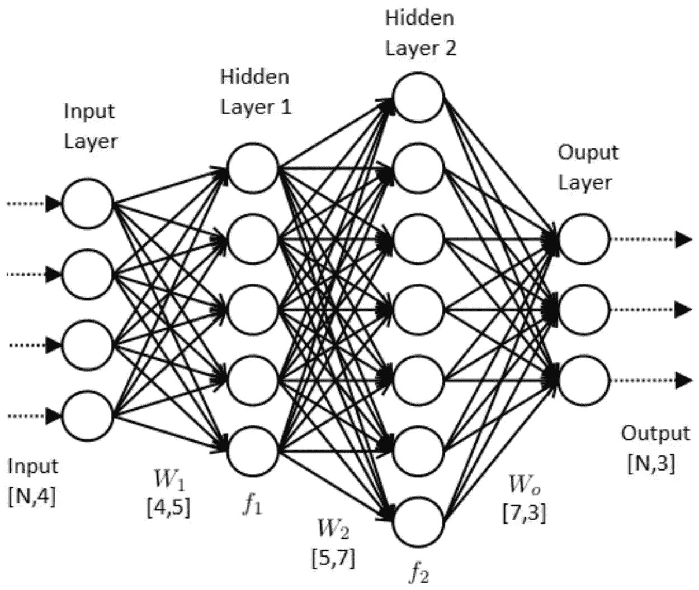

人工神经网络(图片由 Govind Bhattacharjee 在[科学记者](http://nopr.niscair.res.in/bitstream/123456789/45144/1/SR%2055%2810%29%2014-19.pdf)上提供)

# 让我们来看看我以前的一个项目

我们将在 Raspberry Pi(RPi)中的给定数据集的 3 个不同类之间进行分类。RPi 传统上不是嵌入式设备，然而，在我们的例子中，RPi 是向嵌入式设备迈进了一步。


作者的模型架构大小比较和模型准确性图表

有点难读？下面是一个更简单的视图。

这里我们有所有类别的平均预测准确度。

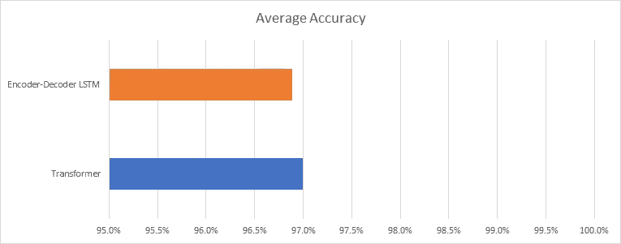

按作者列出的平均准确性图表

然而，如果我们将**的性能与模型尺寸**进行比较，似乎平均而言，变压器模型更胜一筹，因为它具有更高的平均精度。我们看到，转换器的总参数计数高于编码器-解码器 LSTM。

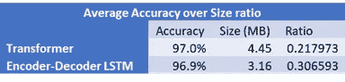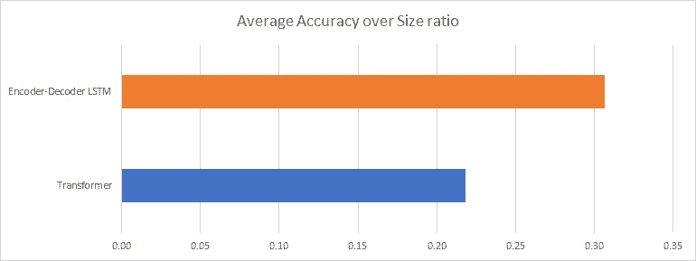

按作者分列的平均准确性表格和图表

对于变压器，0.1%的精度边际增加需要增加 1.39Mb 的参数，因此其精度相对于尺寸比较低。

因此，编码器-解码器模型是明显的赢家，然而，3.16MB 仍然是一个太大的模型，不允许嵌入式设备的有效使用。

重访我之前的文章[在树莓 Pi3+/4](https://itnext.io/installing-tensorflow-2-3-0-for-raspberry-pi3-4-debian-buster-11447cb31fc4) 中安装 TensorFlow 2.3.0，

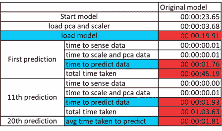

作者的原始模型基准表

使用我们的 autoencoder，平均需要 1760 毫秒才能在我们的嵌入式设备中进行预测，然而，由于我们的传感器每秒都在检测，这是不可能的。

**太好了，现在怎么办？**

这些是模型压缩方法，每种方法的实现难度都在增加。这里[对这些技术中的每一个都做了一个极好的全面的调查](https://arxiv.org/pdf/1710.09282.pdf)。

*   量化
*   修剪
*   低等级近似
*   知识蒸馏

# TensorFlow Lite 助您一臂之力！

TensorFlow Lite 处理前两种方法，在抽象模型压缩的困难部分方面做得很好。

TensorFlow Lite 外壳:

1.  训练后量化
    —降低浮动 16
    —混合量化
    —整数量化

2.训练期间量化

3.训练后修剪

4.训练后聚类

最常见和最容易实现的方法是训练后量化。量化的使用限制了我们的模型参数的精度，因此这减少了需要存储的数据量。

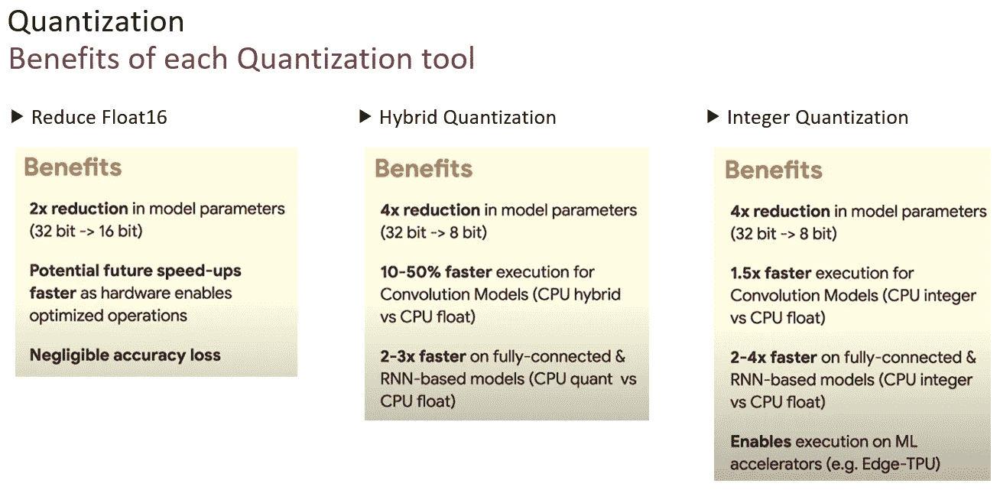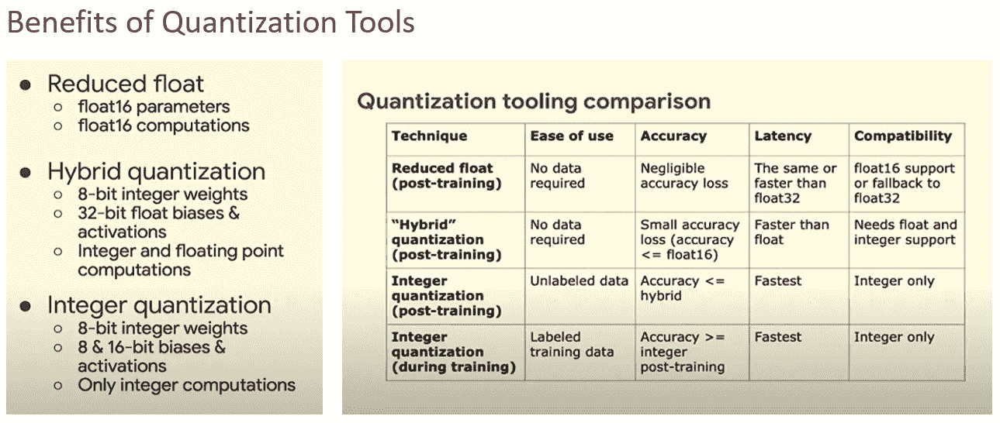

图片来自 [TensorFlow](https://www.youtube.com/watch?v=3JWRVx1OKQQ&ab_channel=TensorFlow)

我将只讨论**训练后混合/动态范围量化**，因为这是最容易实现的，对以最小损失减少尺寸有很大影响。

参考我们早期的神经网络图，我们的**模型参数(权重)**指的是连接每个音符的线，可以被视为代表其文字权重(重要性)或节点的**重要性，以预测我们期望的结果**。

最初，我们为每个权重赋予了 **32 位**，称为`[tf.float32](https://www.tensorflow.org/api_docs/python/tf#float32)` (32 位单精度浮点)，为了减小我们模型的大小，我们将根据所使用的量化类型，从 **32 位**削减到 **16 位** ( `[tf.float16](https://www.tensorflow.org/api_docs/python/tf#float16)`)或 **8 位** ( `[tf.int8](https://www.tensorflow.org/api_docs/python/tf#int8)`)。

我们可以直观地看到，随着模型越来越大、越来越复杂，节点数量越来越多，随之而来的**权重数量也越来越多，这导致了更显著的尺寸减小**，尤其是对于全连接神经网络，其每层节点都连接到下一层中的每个节点。

# 模型压缩的额外好处

*   更小的模型尺寸——模型实际上可以存储到嵌入式设备中(ESP32 有~ [4Mb 的闪存](https://www.electronics-lab.com/project/using-esp32s-flash-memory-for-data-storage/#:~:text=The%20ESP32%20has%20about%204MB,data%20even%20after%20power%20off.)
*   更快的预测率—这加快了可操作性，为实时决策提供了可行性。
*   降低功耗——这是一个经常被忽视的功能，因为训练模型的环境通常具有恒定的电源供应，嵌入式设备通常依靠电池运行，因此这是最重要的功能。

# 模型压缩的隐藏好处

你可能很快会认为，减少我们为每个权重存储的信息量总是对我们的模型有害，然而，**量化促进了泛化**，这对**防止过度拟合**是一个巨大的好处——过度拟合是复杂模型的常见问题。

由[梯度推进](https://medium.com/mlreview/gradient-boosting-from-scratch-1e317ae4587d)之父 [Jerome Friedman](https://en.wikipedia.org/wiki/Jerome_H._Friedman) 提出，经验证据表明**许多朝着正确方向的小步骤会导致用测试数据做出更好的预测**。通过量化，由于权重灵敏度的降低，有可能获得提高的精度。

想象一下，如果在我们的数据集中，我们很幸运，每次我们试图检测一个 cookie，我们的数据集都显示一个巧克力片 cookie，我们的 cookie 检测将获得很高的训练准确性，但是，如果在现实生活中我们只有葡萄干 cookie，它将具有很低的测试准确性。一般化就像模糊我们的巧克力片，这样我们的模型意识到只要有这个斑点，它就是一块饼干。

对于诸如修剪之类的其他压缩方法也是如此。正是在这种情况下，[退出](https://jmlr.org/papers/volume15/srivastava14a.old/srivastava14a.pdf)也可以**提高看不见的准确性**，因为在训练期间随机删除节点也有助于推广。

# 我们来试试吧！

我将使用 [Tensorflow 2.3.0](https://medium.com/analytics-vidhya/tensorflow-2-3-0-with-gpu-support-on-windows-10-f975a552ea7c) 。

要将训练后的模型转换为量化模型:

**首先**，将你的 tf.keras 模型保存为推荐的 **SavedModel 格式** ( `[tf.lite.TFLiteConverter.from_keras_model()](https://www.tensorflow.org/lite/api_docs/python/tf/lite/TFLiteConverter#from_keras_model)` 也可以，但是我遇到了很多错误，要注意):

```
import tensorflow as tf
tf.keras.models.save_model(model, str(saved_model_dir))
```

**其次**，确保 TensorFlow Lite 支持操作(ops)，在这里查看支持哪些操作[。](https://www.tensorflow.org/lite/guide/ops_compatibility)

截至 **06/09/20** ，TensorFlow(TF)不支持 **SELU** 的激活功能，我费了好大劲才发现，根据我的经验， **RELU** 是一个很好的替代品，损失最小。

> 由于 TensorFlow Lite 内置运算符库仅支持有限数量的 TensorFlow 运算符，因此并非每个模型都是可转换的。

如果您的模型需要不受支持的 TensorFlow 运算符，则不会全部丢失，应尝试使用`[converter.allow_custom_ops = True](https://www.tensorflow.org/lite/api_docs/python/tf/lite/TFLiteConverter#from_keras_model)` & `converter.target_spec.supported_ops = [tf.lite.OpsSet.TFLITE_BUILTINS]#, tf.lite.OpsSet.SELECT_TF_OPS`，以允许自定义实现。
ALLOW_CUSTOM_OPS —允许自定义实现不支持的操作符。
TF Lite _ BUILTINS-使用 TensorFlow Lite 内置运算符转换模型。
SELECT _ TF _ OPS-使用张量流运算符转换模型。

我有一个带 2 个 LSTMs 的自动编码器模型，使用`[allow_custom_ops = True](https://www.tensorflow.org/lite/api_docs/python/tf/lite/TFLiteConverter#from_keras_model)` & `tf.lite.OpsSet.TFLITE_BUILTINS`，没有我自己的定制实现。这应该会跳过任何不支持的运算符。

**第三个**，我们将转换文件。

```
import pathlibconverter=tf.lite.TFLiteConverter.from_saved_model(saved_model_dir)
tflite_models_dir = pathlib.Path.cwd() / "tflite_model_dir"
tflite_models_dir.mkdir(exist_ok=True, parents=True)
converter.allow_custom_ops = True
converter.optimizations = [tf.lite.Optimize.DEFAULT]
converter.target_spec.supported_ops=[tf.lite.OpsSet.TFLITE_BUILTINS]
#, tf.lite.OpsSet.SELECT_TF_OPS 
tflite_model_quant = converter.convert()
```

注意:pathlib 是一个可选库，用于简化 windows 路径。

**最后**，代替**使用我们的量化模型预测**，我们将运行一个**推理**。

> 术语“推断”是指在设备上执行 TensorFlow Lite 模型，以便根据输入数据进行预测的过程。
> 
> 要使用 TensorFlow Lite 模型执行推理，我们必须通过一个*解释器*来运行它。TensorFlow Lite 解释器的设计简洁而快速。解释器使用静态图排序和定制的(动态性较低的)内存分配器来确保最小的负载、初始化和执行延迟。

```
# Load the TFLite model and allocate tensors.    
interpreter = tf.lite.Interpreter(model_path=path_to_tflite_model)    interpreter.allocate_tensors()# Get input and output tensors.    
input_details = interpreter.get_input_details()    
output_details = interpreter.get_output_details()#Predict model with processed data             
input_shape = input_details[0]['shape']            
input_data = np.array(x_3d_pca_processed, dtype=np.float32)
#x_3d_pca_processed is the input, change to your input
interpreter.set_tensor(input_details[0]['index'], input_data)            interpreter.invoke()            
prediction = interpreter.get_tensor(output_details[0]['index'])  outcome = np.argmax(prediction.mean(axis=1),axis=1)
#outcome is my own implementation to get the class with the highest probability, remove if necessary
```

就是这样！

有关这些 TFlite 工具的更深入的解释，请单击此处的。
有关 TFlite 工具的更多信息，请点击[此处](https://www.tensorflow.org/lite/performance/model_optimization)。

# **结果分析**

以我们的原始模型为基线，在我们的“嵌入式”设备中实现我们的模型之前，我们在我们的计算机上比较了:
-原始模型
-后量化模型
-后修剪模型
-后量化和后修剪模型
。

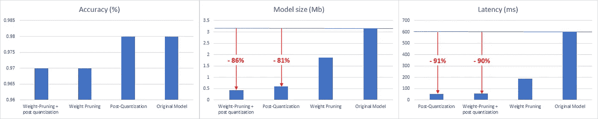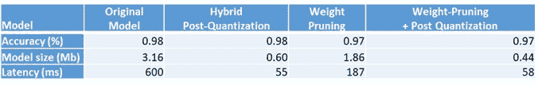

不同模型压缩工具的结果(表格和图表)

效果出奇的好！我们有一个明显的赢家，量化后的精度损失可以忽略不计，大小减少了 81%，延迟减少了 91%。

现在，我们将着手将 TFlite 模型集成到 RPi 中。我们的 RPi 将安装[tensor flow 2 . 3 . 0](https://itnext.io/installing-tensorflow-2-3-0-for-raspberry-pi3-4-debian-buster-11447cb31fc4)，它必须运行在 Debian buster 上，更多细节在我之前的文章中。一旦您将 TFLite 文件拖到我们的 RPi 中，就运行推理。

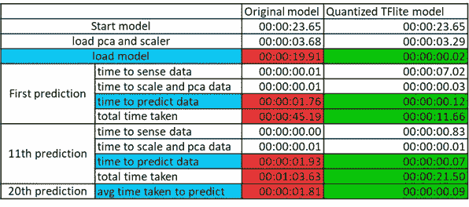

作者的 TFLite 模型基准表比较

在我们的 RPi 中，0.60Mb TFlite 模型的预测速度约为 90 毫秒，而 3.16Mb 原始模型的预测速度为 1760 毫秒！尽管有我的“定制实现”, TFlite 能够带来如此大的性能提升，RPI 能够如此好地处理 TF 模型，这让我大吃一惊。

# 这与 TF 的估计相比如何？

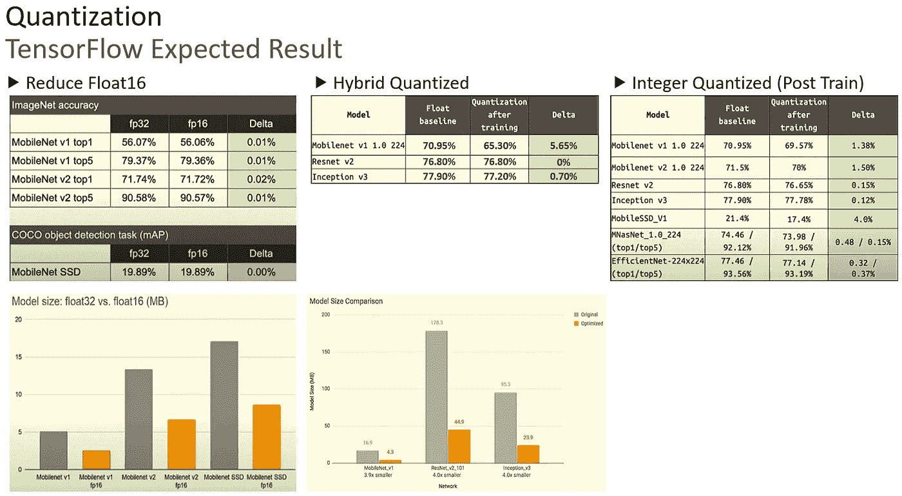

图片来自 [TensorFlow](https://www.youtube.com/watch?v=3JWRVx1OKQQ&ab_channel=TensorFlow)

如上所述，TensorFlow 的估计与我们的发现相符，与 Resnet V2 相似，我们经历了 0%的精度损失，甚至获得了 5.2 倍(3.16mb 至 0.60mb)的较小模型，超出了预期。

一定要考虑到，在扩展到模型压缩的深度学习中，没有任何问题的硬性解决方案。事实是，很难说我们会节省多少，我们能做的最好的事情是自己尝试，并分析模型大小是否有所改善，而准确性几乎没有损失。

也就是说，我认为尝试后量化是迈向模型压缩的第一步，因为它易于实现，显著减少，损失可以忽略不计。只有当其他方法都不起作用时，您才应该尝试更复杂的模型压缩方法。

# TensorFlowLite 的利与弊

优点:
-最简单也是唯一的工具( **06/09/20)** 实现模型压缩
-对准确性影响最小(取决于模型)
-预测速度大幅提升

缺点:
-需要最新的 Tensorflow 版本 2
-相对较新( **06/09/20)，**许多操作(ops)尚未得到支持，如 SELU
-需要转换可能会失败的模型
-与我们的好朋友`.predict()`相比，运行推理时可能会出现复杂情况，因为它更复杂。

# 结论

尽管有缺点，TensorFlow Lite 仍然是一个强大的工具，具有超出我预期的巨大潜力。我预见在不久的将来，随着嵌入式设备对人工智能的需求不可避免地增长，模型压缩将得到更广泛的应用，这给了 TFLite 提供更大操作覆盖范围的理由。TensorFlow Lite 的缺点可以通过定制实现来减轻，因此值得一试。

也就是说，模型压缩不应该被视为一种简单的方法，相反，它应该在我们试图将性能优化到模型大小，但无法在不显著降低精度的情况下减小模型大小之后使用。探索不同的可能模型并找到更好的模型架构通常是更好的解决方案，在选择我们的 Autoencoder 之前，我探索了 5 种不同的模型架构。找一个储物容器，而不是试图把冰箱塞进行李箱。

支持我的工作:

[](https://cawin-chan.medium.com/membership) [## 通过我的推荐链接加入媒体-陈嘉文

### 作为一个媒体会员，你的会员费的一部分会给你阅读的作家，你可以完全接触到每一个故事…

cawin-chan.medium.com](https://cawin-chan.medium.com/membership) 

参考资料:
[https://www.tensorflow.org/api_docs/python/tf/dtypes/DType](https://www.tensorflow.org/api_docs/python/tf/dtypes/DType)
[https://www . tensor flow . org/API _ docs/python/TF/keras/layers/layers](https://www.tensorflow.org/api_docs/python/tf/keras/layers/Layer)
[https://www.tensorflow.org/lite/guide/ops_compatibility](https://www.tensorflow.org/lite/guide/ops_compatibility)
[https://www.tensorflow.org/lite/convert](https://www.tensorflow.org/lite/convert)
[https://www.tensorflow.org/lite/guide/inference](https://www.tensorflow.org/lite/guide/inference)
[https://www . fatal errors . org/a/tensor flow-2.0-keras-conversion-TF lite . html](https://www.fatalerrors.org/a/tensorflow-2.0-keras-conversion-tflite.html)
[https://www.youtube.com/watch?v=3JWRVx1OKQQ【T2](https://www.youtube.com/watch?v=3JWRVx1OKQQ&ab_channel=TensorFlow\)