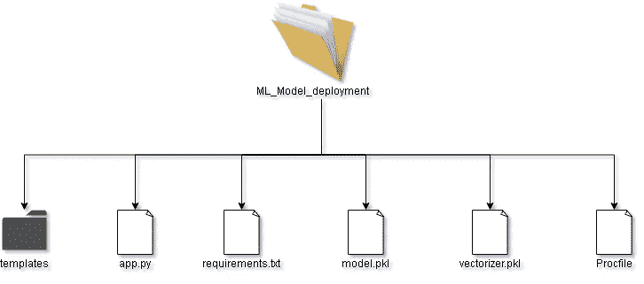
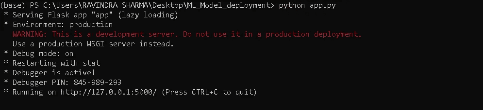
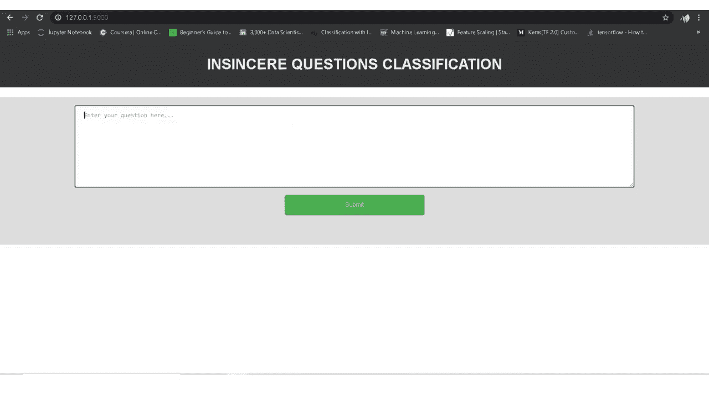
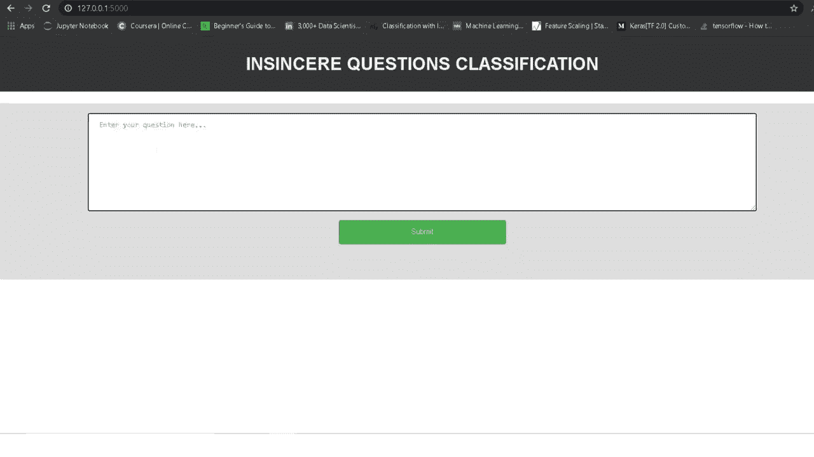

# 使用 Flask 的模型部署

> 原文：<https://towardsdatascience.com/model-deployment-using-flask-c5dcbb6499c9?source=collection_archive---------5----------------------->

## 制作可消耗的模型


来源:[名词项目](https://thenounproject.com/term/launch-project/2041279/)

# 介绍

> 无论你做了多么棒的模型，坐在 jupyter 笔记本上也不会有任何价值。

我们通常会在 EDA 模型开发部分投入很多精力，但是我们往往会忽略一个更重要的方面，即创建端到端的应用程序或部署模型，在您为开发模型付出了大量努力之后，以最终用户可以直接使用的可用形式提供模型也同样重要。此外，围绕您开发的代码构建应用程序有助于您使您的工作更有吸引力，并有助于您更好地展示您的工作。

# 瓶

Flask 是一个用 python 编写的 **web 应用框架，简单来说，它帮助最终用户直接从他们的 web 浏览器与你的 python 代码(在这种情况下是我们的 ML 模型)交互，而不需要任何库、代码文件等。**

Flask 使你能够非常容易地创建 web 应用程序，从而使你能够将精力更多地集中在 ML 生命周期的其他重要部分，如 EDA、特征工程等。在这篇博客中，我将向你展示如何用你的 ML 模型构建一个简单的 web 应用程序，并最终部署它。

# 目录结构

首先让我们看一下我们的目录结构，这将给我们一个整体项目的更广阔的画面，并且当你使用 flask 时知道它也是有用的，我已经将项目保存在一个名为 **ML_Model_deployment** 的主目录下



来源:作者图片

*   **模板** :-这个文件夹包含 html 文件 *(index.html，predict.html)*，我们的主文件 *(app.py)* 将使用这些文件来生成我们的应用程序的前端
*   app.py :-这是主应用程序文件，我们所有的代码都驻留在这里，它将所有的东西绑定在一起。
*   **requirements.txt**
*   **model.pkl** **:-** 这是我们将使用的分类模型，在这种情况下，它是一个逻辑回归模型，我已经训练过了。
*   **vectorizer.pkl :-** 这是一个矢量器文件，用于将文本转换成模型要处理的矢量，在本例中，我们使用了 tf-idf 矢量器
*   Procfile :- 这是一个特殊的文件，当我们在公共服务器(heroku)上部署应用程序时，将需要这个文件

# 理解代码

我在 Kaggle 上举办了一个名为 **Quora 不真诚问题分类**的比赛，基本上这是一个分类问题，Quora 试图识别不真诚的问题，即那些建立在错误前提上的问题，或者那些打算发表声明而不是寻找有用答案的问题，你可以在[这里](http://those founded upon false premises, or that intend to make a statement rather than look for helpful answers)阅读更多关于问题声明的内容。

既然我们已经完成了所有的介绍部分，让我们来谈谈代码吧！

```
**from** flask **import** Flask
app = Flask(__name__)
```

就像任何其他 python 类对象一样，最终这个应用程序只不过是 Flask 类的一个对象，它将为我们完成所有繁重的工作，比如处理来自浏览器的传入请求(在我们的例子中是用户输入的问题),并使用 html、css 以某种良好的形式提供适当的响应(在我们的例子中是模型预测)。我们将逐渐看到所有这些事情，以及这个应用程序对象如何适合解决所有这些问题。

下一部分可能看起来有点吓人，但是不要担心，我们会试着一点一点地理解它。

```
[**@app**](http://twitter.com/app)**.route('/')** def index():
    return flask.render_template('index.html')[**@app**](http://twitter.com/app)**.route('/predict', methods=['POST'])
def** predict():
    to_predict_list = request.form.to_dict()
    review_text = pre_processing(to_predict_list['review_text'])
    prob = clf.predict_proba(count_vect.transform([review_text]))
    if prob[0][0]>=0.5:
        prediction = "Positive"
   else:
        prediction = "Negative"**return** flask.render_template('predict.html', prediction = prediction, prob =np.round(prob[0][0],3)*100)
```

第一行 **@app.route ('/index')** 是一个 decorator，简单地说，它只是将它下面定义的方法映射到 decorator 中提到的 URL，也就是说，每当用户访问那个 URL **'/'** *(完整的地址也将有一个 ip 地址和一个端口号，类似 http://127.0.0.1:5000/)* ， **index()** 方法将被自动调用，而 index()将被调用

**flask . render _ template()**在我们在主目录中创建的 **templates 文件夹**中查找这个**index.html**文件，并为最终用户动态生成/呈现一个 HTML 页面，我稍后将解释动态部分

*(注意:因为 predict 一词在多个上下文中使用，所以为了避免混淆，我将把 predict()称为我们代码中定义的预测方法，把 predict.html 称为存储在模板文件夹中的预测模板，把/predict 称为预测 URL )*

现在我们有了另一个装饰器 **@app.route ('/predict')** ，它将 **predict()** 方法映射到**/predict***URL*，顾名思义，这个 predict()方法接受用户给定的输入，进行所有的预处理，生成最终的特征向量，对其运行模型并获得最终的预测。现在让我们把重点放在呈现动态 HTML 页面部分，有时我们需要在 HTML 页面中动态地放置信息，就像在这种情况下，我们的**predict.html**页面将需要预测值来正确地呈现页面，只有当用户在我们的**index.html**页面中输入文本并点击提交按钮时才可用，这就是 **render_template** 出现的地方。 在 predict.html 页面中，我们已经为这些变量值创建了占位符(稍后将讨论这些占位符)，**这个 render_template 将模板文件夹中的 predict.html 和预测值放在一起，最终生成/呈现最终的 HTML 页面，在这种情况下，HTML 页面包含预测，**对吗？**

**现在让我们快速地看一下主代码中的 **predict()** 方法，方法中的第一行，即**to _ predict _ list = request . form . to _ dict()，**它接受用户输入的文本，当单击表单中的提交按钮**时，返回一个 json，其中包含具有响应的键值对**， 当点击 submit 按钮时，这个 **/predcit URL 被调用，响应作为 json** 被发送到对应于这个 URL 的页面，我们在前面也看到过，一旦这个/predict URL 被调用，相关的 predict()方法被自动调用，它将这个 json 和输出模板(predict.html)放在一起生成我们的最终输出。 (我们在最后有一个输出部分，我们将实际查看这里讨论的所有内容的结果)**

**现在，在进一步研究代码之前，让我们看看我们的**index.html**，它负责从用户那里获取输入文本，并通过调用 **/predict** URL 最终显示最终输出**

```
**<form action="/predict" method="POST" target="_blank">
 <textarea name="review_text" placeholder="Enter your question here..." rows="10" cols="15"></textarea>
    <input type="submit" value="Submit">
  </form>**
```

**这里是 index.html 的一小部分，在这里**表单被创建**，我们可以看到一个叫做**动作**的字段，这意味着表单数据被发送到**动作属性**中指定的页面，而**方法属性**告诉我们这个表单数据是如何被共享的， 这里我们使用了 **POST 方法**，这意味着表单数据被共享为一个 json(以键-值对的形式)，同时让我们也看看我们的第二个模板文件，即**predict.html**模板，基本上它接受预测输出并根据输出值显示结果，因此我们在 predict.html 模板中需要两个主要的东西来实现这一点**

*   **用于预测输出的**变量/占位符****
*   **根据预测值显示结果的基本 if/else 逻辑**

****下面是来自 predict.html 页面的一小段代码，它根据预测结果打印了一条消息和一幅图像****

```
********

      <h1> THIS IS NOT A GENUINE QUESTION   </h1>
  
     <progress value= **{{prob}}** max="100">****
```

****在 html 页面中编写代码/变量非常简单，flask 使用一个名为 Jinja2 的 **web 模板引擎，帮助你将代码/变量嵌入到 html 中******

*   ******{{}}** 用于添加变量/占位符(这个 prob 变量已经由 predict()方法中的 render_template 传递)****
*   ******{ % %}** 写 if-else 条件/for 循环等语句****

****现在，回到 predict()方法中的原始代码，一旦我们从表单响应中获得输入文本，我们就将该文本传递给我们的预处理函数，在那里我们执行一些基本的 NLP 预处理，如转换为小写、一些标记化、单词词汇化。下面是预处理函数的定义****

```
******def** pre_processing(text):
    lemmatizer = WordNetLemmatizer()
    text = text.lower()
    text = re.sub('[0-9]+','num',text)
    word_list = nltk.word_tokenize(text)
    word_list =  [lemmatizer.lemmatize(item) for item in word_list]
    return ' '.join(word_list)****
```

****在预处理之后，我们调用我们的**矢量器和模型**，我们已经在训练阶段定义并保存了它们，我们的 count _ vectorizer 将文本转换为数字矢量，模型给出预测概率，稍后这些值被提供给 render_template 以生成包含输出的整个 html 页面。****

# ****部署和输出****

****现在让我们看看最终的结果，一旦我们部署它，一切看起来如何，首先我将它部署在我的本地机器上，然后我们将它部署在公共服务器上。部署非常简单，您只需设置您的 python 环境并运行 app.py 应用程序，因为我已经在我的计算机上安装了 anaconda，我将从那里运行 app.py 文件，否则您可以创建您单独的虚拟环境，安装所有依赖项并从那里运行它，您不需要整个 Anaconda 包来运行它，您只需要 python 和代码中使用的库。****

********

****来源:作者图片****

****打开 anaconda 提示符后，只需转到主文件夹(本例中为 ML_Model_deployement ),运行 maint python 代码文件(app.py ),只需查看最后一行，上面写着 running on[http://127 . 0 . 0 . 1:5000/](http://127.0.0.1:5000/)这是我们的 web 应用程序正在运行的地方，您可以复制这个 URL 并将其粘贴到您的 web 浏览器中，然后查看 web 应用程序。 这里 127.0.0.1 是本地主机的 **ip 地址**(就像我们有一个住宅地址一样，ip 地址是在互联网或本地网络上识别你的机器的唯一地址)，5000 是端口号，这是你的 web 应用程序驻留在服务器中的位置(把它看作是访问你的应用程序的入口)。 现在让我们在浏览器上复制这个 URL，看看主页是什么样子的(请原谅我的前端技能，我在这方面的经验非常有限)****

********

****来源:作者图片****

****现在让我们键入两个类中的一些问题，看看我们的预测页面看起来如何，首先让我们看一个真正的问题。****

********

****来源:作者视频****

****现在我们将键入一个不真诚/不真诚的问题，看看结果如何****

********

****来源:作者视频****

****就像我们部署在本地机器上一样，我们可以将它部署在公共 web 服务器上，让 web 上的每个人都可以访问我们的应用程序。这里我使用了 **heroku** 来部署我的应用程序。****

****Heroku 是 **PAAS(平台即服务应用)**它使开发者能够在网络上部署他们的应用程序，并且它确实提供了一个免费的计划！，在 heroku 部署很简单，你可以直接把你的 github repository 链接到 heroku(最后我会把 github repo 和 web 应用的链接都分享出来)。你只需要添加两个特殊的文件 **requirements.txt** 和 **Procfile(没有任何扩展名)**，我们在讨论目录结构的时候已经讨论过需求文件，现在让我们再来讨论一下这个 Procfile。基本上，Procfile 告诉 heroku 需要预先运行的一组进程/命令，Procfile 看起来像这样****

```
****web: gunicorn app:app****
```

******web** 命令告诉 heroku 使用 gunicorn(帮助您运行 python 应用程序的 web 服务器)启动 web 服务器，第一个应用程序引用我们的主 **app.py** 文件，第二个引用 **flask 实例应用程序**，它也可以有不同的名称，如果您对部署有任何疑问，您可以参考这个令人惊叹的[视频](https://www.youtube.com/watch?v=mrExsjcvF4o)教程，它包含在 hero 中部署的完整分步教程****

# ****结论****

****如果你觉得这个教程很有帮助，那么请与你的朋友分享，下面是 github 资源库和部署在 heroku 的 web 应用程序的链接。为了感受它，我强烈建议你自己尝试一次，如果你过去已经从事过一些 ML 项目，那么试着部署那些模型，这样你会有更好的理解。****

******Github 资源库:-**【https://github.com/ravi207/Model_Deployment ****

******网络应用**:-h[ttps://question-classification . heroku app . com/](https://question-classification.herokuapp.com/)****

*****(注意:我已经使用 tf-idf 矢量器在整个数据集的一个小子集上训练了一个非常基本的逻辑回归模型，因此模型预测不会太好，现在它能够识别特定类型的不真诚问题，这些问题具有它在训练期间从数据集学习的一些特定的仇恨词汇)*****

****如果您有任何建议或疑问，请随时联系我****

****领英:[https://www.linkedin.com/in/ravindra-sharma-832a04156](https://www.linkedin.com/in/ravindra-sharma-832a04156)****

****快乐学习！****