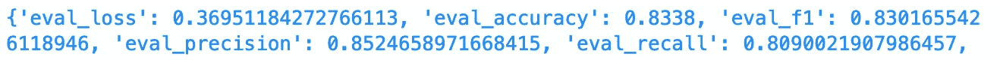
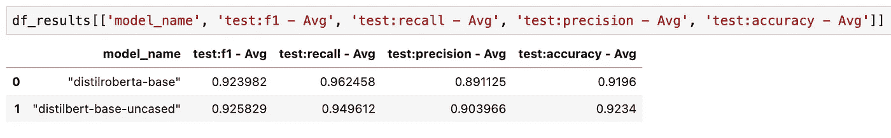

# 模型过载—我应该选择哪个 NLP 模型？

> 原文：<https://towardsdatascience.com/model-overload-which-nlp-model-should-i-choose-a8bfe05e77e1?source=collection_archive---------29----------------------->

## 如何用 Sagemaker 实验评估和比较 Huggingface NLP 模型

杰森·登特在 [Unsplash](https://unsplash.com?utm_source=medium&utm_medium=referral) 上拍摄的照片

# 这是怎么回事？

当我写这篇文章时，Huggingface 上的[模型库由 11256 个模型组成，当你读到这篇文章时，这个数字只会增加。有这么多模型可供选择，难怪许多人不知所措，不知道该选择哪个模型来完成 NLP 任务。](https://huggingface.co/models)

如果有一种便捷的方式来尝试相同任务的不同模型，并在各种指标上相互比较这些模型，那就太好了。Sagemaker Experiments 正是这么做的:它让你非常容易地组织、跟踪、比较和评估 NLP 模型。在本文中，我们将两个 NLP 模型进行对比，并比较它们的性能。

所有代码都可以在这个 [Github 库](https://github.com/marshmellow77/sm-hf-experiments)中找到。

# 数据准备

这个项目文章的数据准备可以在这个 [Python 脚本](https://github.com/marshmellow77/sm-hf-experiments/blob/main/1_data_prep.py)中找到。我们将使用来自 Huggingface 的 [IMDB 数据集，这是一个用于二元情感分类的数据集。数据准备是相当标准的，唯一需要注意的是，我们需要分别对每个模型的数据进行标记。然后，我们将数据存储在 S3 文件夹中，每个模型一个。](https://huggingface.co/datasets/imdb)

我们在本文中比较的型号将是[*distilbert-base-uncase*](https://huggingface.co/distilbert-base-uncased)和[*distilbert-base*](https://huggingface.co/distilroberta-base)。显然，Sagemaker 实验并不局限于两个模型，实际上允许跟踪和比较几个 NLP 模型。

# 度量定义

首先，重要的是要理解 Sagemaker 实验将如何度量我们随后用来比较模型的指标。这些指标的值是从模型训练期间生成的日志中收集的。这通常意味着训练脚本必须明确写出这些指标。

在我们的例子中，我们将使用 Huggingface 的 Trainer 对象，它将负责为我们将指标写入日志。我们所要做的就是在[培训脚本](https://github.com/marshmellow77/sm-hf-experiments/blob/main/scripts/train.py)中定义指标。然后，培训师对象会自动将它们写到培训日志中(注意，损失指标是默认写出的，所有指标都带有前缀*“eval _”*):

定义评估指标

培训日志中的评估指标

这意味着我们可以在培训工作期间通过正则表达式捕获这些指标，我们可以定义如下:

我们将把它们传递给我们将在下面进一步创建的估算器，以捕获这些指标，这将允许我们比较不同的 NLP 模型。

# 运行 Sagemaker 实验

为了组织和跟踪模型，我们需要创建一个 Sagemaker 实验对象:

一旦完成，我们就可以开始训练了。我们使用 *ml.p3.2xlarge* 进行 Sagemaker 培训工作，它将在大约 30 分钟内完成微调。注意，我们为每个培训作业创建了一个 [*试用*](https://sagemaker-experiments.readthedocs.io/en/latest/trial.html) 对象。这些试验与我们上面创建的实验相关联，这将允许我们跟踪和比较模型:

上面的代码并行启动了两个培训任务(每个模型一个)。但是，如果您的帐户不允许这样做(可能您的 AWS 帐户限制了培训作业实例的数量)，您也可以按顺序运行这些培训作业。只要它们通过*试验*对象与同一个实验相关联，您就能够评估和比较这些模型。

# 比较模型

大约 30 分钟后，两个模型都已训练完毕，现在是检索结果的时候了:

得到的数据帧包含了比较两个模型所需的所有信息。例如，我们可以检索我们定义的所有指标的平均值，如下所示:

我们可以看到， *distilroberta-base* 在*召回*方面表现稍好，而*distilbert-base-uncased*在 *F1 得分*、*精度*和*准确度*方面表现更好。数据框架中还有更多列，我将留给读者进一步探索。

# 结论

在本文中，我们创建了一个 Sagemaker 实验来跟踪和比较 NLP 模型。我们为每个模型创建了试验，并收集了各种评估指标。在对模型进行微调之后，我们能够通过 Pandas 数据框架访问这些指标，并以一种方便的方式对模型进行比较。