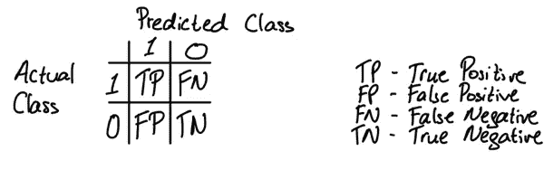
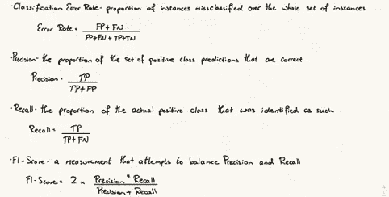
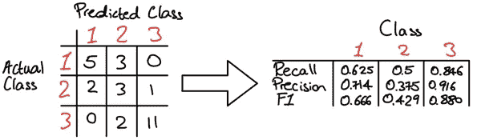
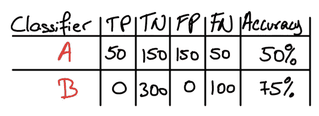
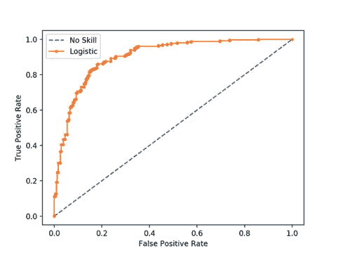
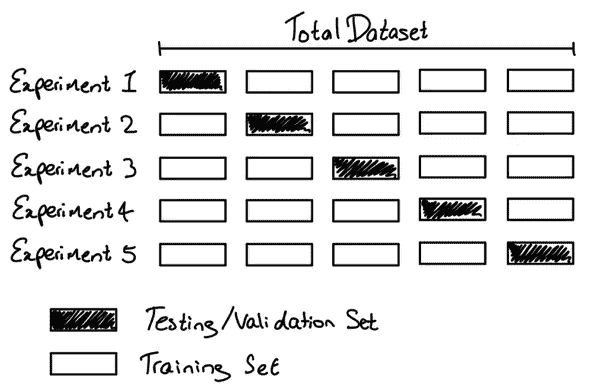

# 模型选择和评估

> 原文：<https://towardsdatascience.com/model-selection-and-evaluation-57701ff13c2b?source=collection_archive---------20----------------------->

## 讨论理解机器学习模型并从中获取更多信息的不同方法

本文是我正在撰写的关于机器学习关键理论概念的系列文章的延续。本系列其他文章在我的 [*页面*](https://dhruva-krishna.medium.com/) *均有。*

由 [Roman Synkevych](https://unsplash.com/@synkevych?utm_source=unsplash&utm_medium=referral&utm_content=creditCopyText) 在 [Unsplash](https://unsplash.com/s/photos/code?utm_source=unsplash&utm_medium=referral&utm_content=creditCopyText) 上拍摄的照片

模型选择和评估是机器学习工作流中非常重要的过程。这是我们工作流程的一部分，我们将在其中分析我们的模型。我们查看其性能的更深入的统计数据，并决定采取什么措施来改进该模型。这一步通常是表现好的车型和表现非常好的车型的区别。当我们评估我们的模型时，我们可以更好地了解它预测什么好，什么不好，这有助于我们将模型从预测数据集的 65%准确性水平提高到接近 80%或 90%。

## 度量和评分

假设我们有两个任务假设，h(x)和 h’(x)。我们怎么知道哪个更好。从高层次的角度来看，我们可以采取以下步骤:

1.  衡量两种假设的准确性
2.  确定两个结果之间是否有统计学意义。如果有，选择表现更好的假设。如果不是，我们不能用任何统计上的确定性说 h(x)或 h'(x)哪个更好。

当我们有一个分类任务时，我们将通过将一个实例分配到其正确的类的能力来考虑我们的模型的准确性。从二进制的角度来考虑这个问题。我们有两个类，1 和 0。因此，当模型将类 1 实例分类为类 1，或者将类 0 实例分类为类 0 时，我们会将正确的预测分类。假设我们的 1 类是“正类”, 0 类是“负类”,我们可以建立一个表，列出我们的模型可能产生的所有可能性。

作者图片

我们也为这些分类命名。我们的真正真负是我们正确的分类，正如我们在两种情况下看到的，实际类和预测类是一样的。模型预测不正确的其他两个类别可以解释如下:

*   假阳性—当模型预测为 1，但实际类别为 0 时，也称为**I 型错误**
*   假阴性—当模型预测为 0，但实际类别为 1 时，也称为**类型 II 错误**

当我们获取一系列实例，并用我们观察每个分类的频率填充上表时，我们就产生了所谓的**混淆** **矩阵**。这是开始评估一个比简单的准确率更进一步的假设的好方法。有了这个混淆矩阵，我们可以定义准确率，也可以定义一些其他指标来查看我们的模型执行得有多好。我们使用简称假阳性(FP)、假阴性(FN)、真阳性(TP)和真阴性(TN)。

作者图片

下面是一个 3 类混淆矩阵的例子，以及我们如何将它转化为每一类的回忆、精确和 f1 数字。这里需要提到的是，在超过 2 个类的情况下，我们的 0 类将是所有不是我们的 1 类的类。

作者图片

## 一个例子

这些额外的度量是有用的，因为它们让我们更深入地了解分类器的行为。例如，考虑以下两个分类器:

作者图片

通过简单的准确度测量，我们倾向于说分类器 B 是更好的分类器，因为它的准确度为 0.75 比 0.50 更高。然而，当我们引入我们的其他度量时，我们可以计算出分类器 B 的精度和召回率是 0。分类器 A 的准确率和召回率分别为 0.25 和 0.50。从这些信息中，我们看到了一幅完全不同的画面。分类器 B 是相对无用的，特别是因为它不能预测任何第 1 类例子，并且精度和召回反映了这一点，而精度数字不能。

另一个常用于理解分类器性能的度量是**接收器操作者特征** (ROC)曲线。这些图在 y 轴上绘出了真阳性率，在 x 轴上绘出了假阳性率。我们通过调整我们的分类器的决策阈值来生成这些数据点(即，对于概率分类器，我们将阈值从默认的 0.5 改变为 0.6、0.7 等，其中如果预测值大于该阈值，我们分配类别 1，否则我们分配类别 0)。

([https://machine learning mastery . com/roc-curves-and-precision-recall-curves-for-class ification-in-python/](https://machinelearningmastery.com/roc-curves-and-precision-recall-curves-for-classification-in-python/))

我们通常认为曲线下的面积越大，模型就越大，因为它告诉我们这个模型有机会以正确的阈值返回高 TP 率。典型的 ROC 曲线也将绘制从(0，0)到(1，1)的虚线，其代表随机分类器的性能(预测正确类别的概率为 50%)。

## 过度拟合

在查看模型质量时，过度拟合是一个关键的考虑因素。当假设在训练数据示例中的表现明显好于在测试数据示例中的表现时，就会发生过度拟合。这是机器学习中一个极其重要的概念，因为过拟合是我们想要避免的主要特征之一。正如我在第一篇[文章](/your-historical-theoretical-and-slightly-mathematical-introduction-to-the-world-of-machine-862b94fe8353)中所定义的那样，对于一个在“真实世界”中稳健有效的机器学习模型来说，它需要能够很好地预测看不见的数据，它需要能够概括。过度拟合本质上防止了一般化，并为我们提供了最初看起来很棒的模型，因为它非常适合我们的训练数据，但我们最终发现该模型将非常适合训练数据。该模型基本上没有确定数据中的一般关系，而是专注于计算如何准确预测这一个样本集。发生这种情况的原因有很多:

*   学习过程被允许持续太长时间
*   训练集中的示例不能准确代表测试集，因此也不能代表更广泛的情况
*   数据集中的一些要素没有提供任何信息，因此模型被分散了注意力，为这些没有实现任何正值的值分配权重

## 交互效度分析

在模型改进部分可以考虑交叉验证。对于较小的数据集，这是一种特别有用的方法。将我们的数据分为训练和测试数据将减少我们的模型接收到的用于训练的样本数量。当我们的实例数量相对较少时，这可能会对我们模型的性能产生很大影响，因为它没有足够的数据点来研究关系并构建可靠和稳健的系数。除此之外，我们还假设我们的训练数据与我们的测试数据在变量之间具有相似的关系，因为只有在这种情况下，我们才能真正生成一个合理的模型，该模型能够以较高的准确度对未知数据进行预测。
我们在这里可以求助的解决方案是一种叫做交叉验证的方法。在交叉验证中，我们在不同的数据子集上运行我们的建模过程，以获得模型质量的多个度量。考虑下面的数据集，分成 5 个部分，称为折叠。

作者图片

在实验 1 中，我们使用第一个折叠作为我们的测试集，其他的作为训练数据。在实验 2 中，我们使用来自第二次折叠的数据，我们也称之为“维持集”，并使用剩余的 80%来训练模型。我们重复这个过程，使用每个折叠一次作为维持集，以便 100%的数据在某个点被用作维持和训练。交叉验证模型的输出将是所有 k 个折叠的平均准确度(在上面的例子中 k 是 5)，这将为我们提供模型实际性能的更具代表性的数字。
交叉验证可以为我们提供更准确的模型质量衡量标准，但是这可能需要很长时间，因为它需要评估多个模型。对于小数据集，额外的计算负担不是大问题，我们可以运行交叉验证。

这就是你对评估模型的总结。我希望在以后的文章中更详细地介绍更多的概念，所以请密切关注这些概念！如果你对我以前的文章感兴趣，也可以关注我的[页面](https://dhruva-krishna.medium.com/)。在那之前，✌️.