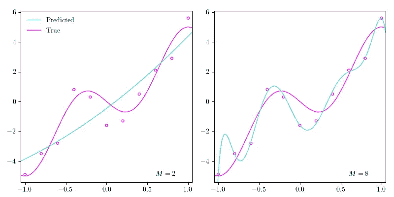
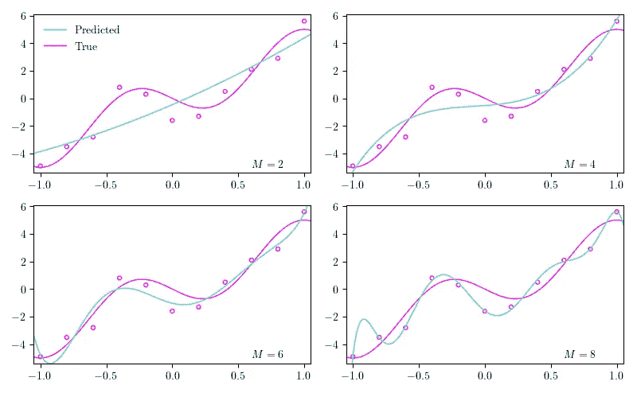
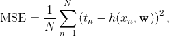

# 机器学习中的模型选择

> 原文：<https://towardsdatascience.com/model-selection-in-machine-learning-813fe2e63ec6?source=collection_archive---------6----------------------->

## 介绍过度拟合、超参数、使用 Python 实现的交叉验证

欠拟合(左)和过拟合(右)的图示。

# 内容

这篇文章是我将要发表的一系列文章的一部分。你可以点击这里在我的个人博客上阅读这篇文章的更详细版本。在下面，您可以看到该系列的概述

## 1.机器学习导论

*   [(一)什么是机器学习？](/what-is-machine-learning-91040db474f9)
*   **(b)机器学习中的模型选择**
*   [(c)维度的诅咒](/the-curse-of-dimensionality-5673118fe6d2)
*   [(d)什么是贝叶斯推理？](/what-is-bayesian-inference-4eda9f9e20a6)

## 2.回归

*   [(a)线性回归的实际工作原理](/how-linear-regression-actually-works-theory-and-implementation-8d8dcae3222c)
*   [(b)如何使用基函数和正则化改进您的线性回归](/how-to-improve-your-linear-regression-with-basis-functions-and-regularization-8a6fcebdc11c)

## 3.分类

*   [(a)分类器概述](/overview-of-classifiers-d0a0d3eecfd1)
*   [(b)二次判别分析(QDA)](/quadratic-discriminant-analysis-ae55d8a8148a#204a-71584f33e137)
*   [(c)线性判别分析](/linear-discriminant-analysis-1894bbf04359)
*   [(d)(高斯)朴素贝叶斯](/gaussian-naive-bayes-4d2895d139a)

# 模型选择和验证

在我之前的文章中，我们讨论了多项式回归。在 Python 实现中，我们选择了一个 4 阶多项式。然而，对于多项式的阶数来说， *M* =4 可能不是“最佳”选择——但是什么是“最佳”选择，我们如何找到它呢？

首先，在训练过程开始之前设置我们的多项式的阶，我们将我们的模型中的这些特殊参数称为“**超参数**”。其次，**计算出这些超参数值的过程称为超参数优化，是模型选择的一部分**。第三，正如在[之前的帖子](/what-is-machine-learning-91040db474f9)中提到的，机器学习主要与预测有关，这意味着**我们将“最佳”模型定义为概括未来数据的最佳模型**，也就是说，哪个模型在未经训练的数据上表现最佳？

为了弄清楚这一点，我们通常想出某种**评估指标**。然后，我们将我们的训练数据集分成 3 个部分:一个**训练**，一个**验证**(有时称为**开发**，以及一个**测试**数据集。然后，我们在训练数据集上训练我们的模型，在验证数据集上执行模型选择，并在测试数据集上对模型进行最终评估。这样就可以确定泛化误差最低的模型。**泛化误差是指模型在看不见的数据**上的表现，即模型没有被训练过的数据。

让我们回到多项式回归的例子。在下图中，我绘制了来自[前一篇文章](/what-is-machine-learning-91040db474f9)的数据点，以及真实函数和 4 个不同阶的 4 个不同估计多项式:2、4、6 和 8。随着我们增加多项式的阶数，我们增加了模型的复杂性，这可以粗略地看作与模型中参数的数量相关。所以我们的模型参数越多，它就越复杂。

由于模型复杂性增加而过度拟合的图示。

随着多项式的阶数(模型的复杂性)增加，它开始更好地逼近数据点，直到它完美地遍历所有数据点。然而，**如果我们完美地匹配训练数据集中的数据点，我们的模型可能不会很好地概括**，因为数据并不完美；总有一点噪音，上面也能看出来。**当我们最终将模型完美地拟合到我们的训练数据集时，我们说我们过度拟合了**。

在上图中，当阶数设置为 8 ( *M* =8)时，我们肯定是过度拟合了。相反，当 *M* =2 时，我们可以说我们**欠拟合**，这意味着我们的模型的复杂性不够高，不足以在我们的数据中“捕捉丰富的变化”。换句话说，它没有发现数据中的模式。

## 交叉验证

如果数据有限，将数据分成几部分可能会有不利的影响，因为验证和测试集的大小很小，因此不能恰当地代表整个定型集。在只有 10 个数据点的极端情况下，如果您进行 80–10–10 分割，这将导致验证和测试集的大小为 1，这对于查看模型的表现是否良好来说并不是一个很好的样本大小！

相反，可以应用称为**交叉验证**的不同技术。最常见的是***k*-折叠交叉验证**技术，将数据集分成 *k* 个不同的子集。通过选择 k 个子集中的一个作为验证集，其余的 *k 个*1 子集中的一个作为训练集，我们可以重复这个过程 *k 次*，每次选择不同的子集作为验证集。这使得重复训练-验证过程 *k* 次成为可能，最终遍历整个原始训练集作为训练和验证集。

## Python 实现

按照我上一篇文章中的例子，我们可以试着找出多项式的最佳阶数。我们开始定义我们的评估标准；我们将使用流行的**均方误差(MSE)** ，它与我们在上一篇文章中简要介绍的平方误差之和(SSE)函数密切相关。MSE 被定义为我们的预测和真实值之间的平方差的平均值，形式上

其中 *N* 是数据点的数量， *h* 是我们的多项式， **w** 是我们的多项式的系数(模型参数)，并且 *x* ， *t* 是输入-目标变量对。

下面是 MSE 的一个简单 Python 实现，它将 NumPy 数组作为输入。确保`true`和`pred`数组长度相同——如果需要，可以通过断言来实现。

而下面是 *k* 的一个实现——折叠交叉验证。它产生每个折叠的训练和验证集的索引。我们只需确保`n_splits`不大于`n_points`。

# 摘要

*   **超参数**是在训练模型之前**确定的模型中的参数。**
*   模型选择是指**选择最能概括**的模型的过程。
*   **训练和验证集**用于**模拟看不见的数据**。
*   **当我们的模型**在我们的训练数据集上表现良好，但泛化能力较差**时，就会发生过拟合**。
*   **当我们的模型**在我们的训练数据集和看不见的数据**上表现不佳时，就会发生**欠拟合。
*   我们可以看看我们的模型是否能通过交叉验证技术很好地推广。
*   **均方误差**或 **MSE** 是一个常见的评估指标。