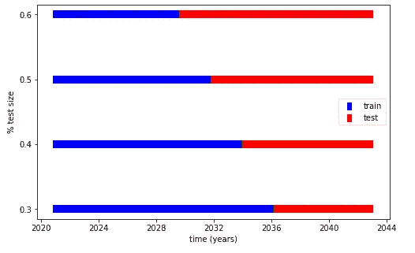
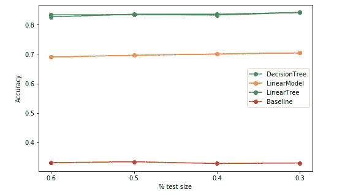
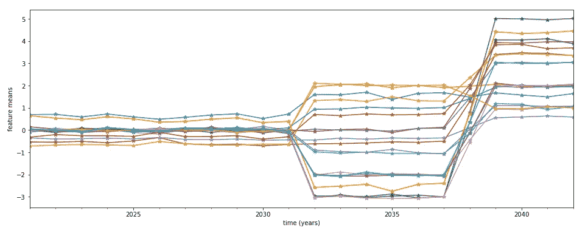
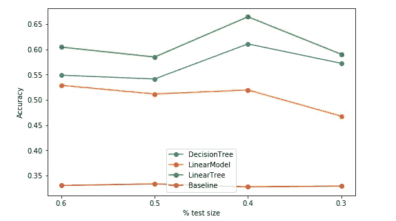
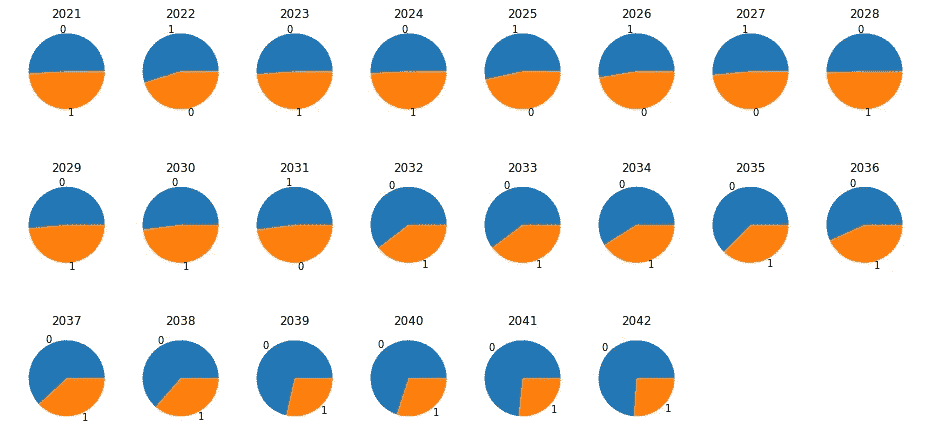
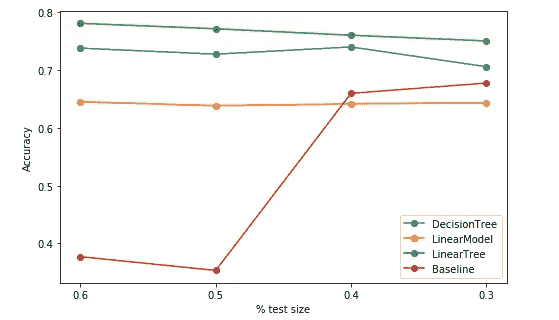

# 模型树:处理混合线性模型和决策树的数据转移

> 原文：<https://towardsdatascience.com/model-tree-handle-data-shifts-mixing-linear-model-and-decision-tree-facfd642e42b?source=collection_archive---------34----------------------->

## 模拟和建模特征和标签偏移

康纳·乐迪在 Unsplash[拍摄的照片](https://unsplash.com?utm_source=medium&utm_medium=referral)

所有训练出来的模型都容易变得陈旧无用。众所周知，一段时间后，所有的模型都不再准确。这是正常的，并且是由于数据流中可能发生的时间偏移。特别是，大多数涉及人类活动建模的应用程序都必须被监控并不断更新。例如，一些需求或市场趋势的变化可能会影响客户的购买力。如果我们不能考虑客户习惯的变化，随着时间的推移，我们的预测就会变得不可信。

给定一个监督训练的模型，我们可能会遇到两种相反的情况，影响未来的表现。**特征分布的变化或目标分布的变化**。特征分布的变化是有害的，因为我们的模型对以前看不到的数据进行预测。相反，标签分布的变化是不好的，因为我们的模型被训练成接近不同的基本事实。

在本帖中，**我们做了一个实验来测试一些模型随着时间的推移经受住数据变化的能力**。我们考虑线性模型、决策树和线性树。我们想看看不同的制度变化如何影响未来测试数据预测的准确性。这使我们能够详细阐述这三种算法处理不可避免的数据偏移的能力。

线性树，正如我在之前的文章中介绍的，是模型树的一个特例。他们在传递的数据上构建一个树，评估适合线性模型的最佳分割。拟合的模型产生基于树的结构，在叶子中具有线性模型。换句话说，它根据简单的决策规则计算对数据集进行分区的多重线性回归。每个人都可以使用 [**线性树**](https://github.com/cerlymarco/linear-tree) 包轻松实现线性树。它可以用作 scikit-learn BaseEstimator 来包装来自`sklearn.linear_model`的每个线性估计器，并构建一个最佳树结构。

# 实验设置

对于我们的实验，我们使用一些在分类环境中生成的人工数据。我们将数据集划分为一些时间块，用于训练(包括超参数搜索)和评估模型的性能。

训练测试时间分割策略(图片由作者提供)

正如上一节所介绍的，我们使用三种不同的模型:线性模型、决策树和线性树。我们通过改变测试起点来估算时间的流逝。我们考虑 4 个测试块，在不同的日期计算每个模型类型的评估。这使我们能够跟踪模型在一段时间内的行为。

我们提出了三种不同版本的实验:*无偏移*、*特征偏移*和*标签偏移*。

# 没有轮班

在*“无变化”*的背景下，我们假设未来会看到同样的数据分布。这是更完美也更不现实的场景。它是完美的，因为我们在相似的数据上训练和测试我们的模型，产生稳定的结果。这是不现实的，因为我们必须幸运地遇到这样的情况。我们生活在一个动态的世界中，一切都容易快速变化，破坏我们的模型性能。

但是，我们从这种情况出发来拟合我们感兴趣的模型。我们在选定的时间块上用超参数调谐来执行训练。对测试集的评估总结在下图中。

没有移位的表演(图片由作者提供)

正如所料，随着时间的推移，模型的精度保持不变。决策树和线性树达到相同的分数。

# 特征转移

在*“特性变化”*的环境中，我们可能会遇到一些特性分布随着时间的推移而变化。我们模拟两个不同时间段的两班倒。这可以简单地通过添加一些常量值来改变分布的中心位置。

多年来的特征分布(图片由作者提供)

预测看不见值可能会导致错误的预测。使用基于树的算法很容易成像，其中数据可能落在最未探索的分割部分。显然，在这种情况下，与*“无变化”*情况相比，我们必须预计性能会普遍下降。我们的模型没有经过处理分布变化的训练，所以我们记录的精度下降了至少 10 个点。我们观察到的是，关于决策树，线性树存活得更好。

功能变化的表演(图片由作者提供)

# 标签移位

在*“标签变化”*环境中，我们可能会遇到目标分布随时间的变化。我们模拟这种场景，保持相同的特征生成过程，但是在两个不同的时间段中改变标签平衡。

历年标签分布情况(图片由作者提供)

在这种情况下，我们使用一种算法，根据给定的标签分布进行训练，来预测具有不同标签平衡的数据。达到次优结果是正常的(特别是对于基于树的算法)，因为模型不期望特定类出现这么多。我们记录的性能随着时间的推移保持不变，但与*‘无变化’*的情况相比有所恶化。和以前一样，线性树在决策树中存活得更好。

标签转换的表演(图片由作者提供)

在我们所有存在移位的实验中，我们记录了线性树的良好生存行为。与标准决策树和简单线性模型相比，它们的性能下降较少。它们更好地概括的能力是线性近似和树状结构中的数据分割的联合的结果。这使得当数据落入未探索的分割区域时，线性树更加准确，这在时间数据移动的情况下尤其突出。

# 摘要

在这篇文章中，我们模拟了一些时态数据移动的情况。当我们预期时间变化时，线性树被证明是测试和验证的好模型。尽管它们没有被广泛采用，但它们是非常简单而强大的预测算法，代表了经典决策树的有价值的替代品。

[查看我的 GITHUB 回购 ](https://github.com/cerlymarco/MEDIUM_NoteBook)

保持联系: [Linkedin](https://www.linkedin.com/in/marco-cerliani-b0bba714b/)