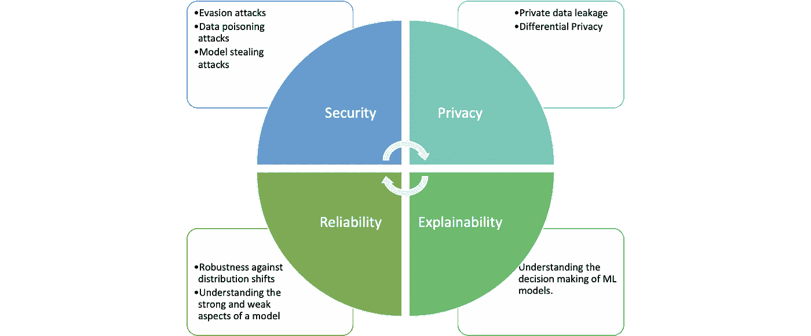

# 模型验证和监控:ML 生命周期的新阶段

> 原文：<https://towardsdatascience.com/model-validation-and-monitoring-new-phases-in-the-ml-lifecycle-1c57b86c9aa?source=collection_archive---------21----------------------->

ML 模型的验证/测试和**监控**在过去可能是一种奢侈。但是随着关于人工智能的**法规**的实施，它们现在是机器学习管道中不可或缺的部分。

鸣谢:除了带有 AI 的欧盟符号外，作者自己的作品，摘自欧盟委员会网站:[https://digital-strategy . EC . Europa . eu/en/library/ethics-guidelines-trust-AI](https://digital-strategy.ec.europa.eu/en/library/ethics-guidelines-trustworthy-ai)

在过去的十年中，机器学习(ML)的研究和实践在建立使用机器学习模型设计系统和应用程序的通用框架方面取得了很大进展。主要使用软件工程的最佳实践，所谓的 MLOps 生态系统最近也开始出现。一切都好，期待已久。然而，设计 ML 应用程序和服务的生命周期中的两个关键步骤仍然没有被触及。即 ML 车型的**测试/验证**和**监控**。

在这篇文章中，我将阐述为什么我们需要在投入生产之前测试我们的 ML 模型，以及我们如何将**质量** **保证(QA)** 实践带入 ML 领域。注意，我将在这里谈论的大多数概念也适用于**人工智能(AI)** 系统和应用。但是，由于人工智能在过去十年中推动了人工智能的发展，我将主要谈论人工智能。

在整篇文章中，我将首先讨论最近关于人工智能的**欧盟委员会法规**(在下面的讨论中，我将此称为**欧盟**法规)，然后谈论什么是**可信人工智能**。在调查可信的人工智能时，我们会看到伴随着人工智能模型而来的问题和风险。然后，我将尝试解释为什么验证和监控是必不可少的，以及我们如何通过采用合适的概念 ML 管道来使我们的模型可信。

# 1.走向管制人工智能

欧盟委员会最近宣布，为了使人工智能应用更加值得信赖，将提出一些规定。对于人工智能从业者来说，这是一个非常重要的发展，因为人工智能迄今为止仍然没有受到监管，存在各种风险和威胁。我们只关注使用人工智能的好处，却忽略了与之相关的风险。根据这项法规，欧洲各地的公司将需要验证他们的**【高风险】**人工智能系统，并遵守这些法规。这可能会蔓延到全世界(事实上，在英国、加拿大和美国的一些州已经有了一些规定)。**简而言之，欧盟法规根据人工智能系统的风险级别对其进行分类，并强制对高风险人工智能系统进行验证和监控。**

如果人工智能系统打算用于[附件文件](https://digital-strategy.ec.europa.eu/en/library/proposal-regulation-laying-down-harmonised-rules-artificial-intelligence)第 4 页和第 5 页中列出的 8 个领域中的任何一个，或者如果该系统对健康和安全构成危害的风险，或者对基本权利造成不利影响的风险，则欧盟法规将该系统分类为“高风险”。我不会在这篇文章中深究监管的细节。感兴趣的读者可以在这里阅读完整的监管提案[。本规范中提到的一些重要概念是这些系统的**安全性**、**健壮性**和**可信度**。尽管所有这些概念在许多方面都是相互交织和模糊的，但中心思想是明确的:*让人工智能系统安全可靠*。我更喜欢用“*可信度*”作为总括术语来研究这个问题。](https://digital-strategy.ec.europa.eu/en/library/proposal-regulation-laying-down-harmonised-rules-artificial-intelligence)

# 2.什么是值得信赖的 AI？

我更喜欢把值得信赖的 AI 概念化为四大支柱。如下图所示，它有**安全性**、**隐私**、**可靠性**和**可说明性**等方面。

可信人工智能的四大支柱

所有这些都是相互关联的，我们将逐一讨论。但在此之前，请注意欧洲法规是如何提及其中一些内容的:

> “高风险人工智能系统的设计和开发方式应使其根据预期目的实现适当水平的准确性、稳健性和网络安全，并在其整个生命周期内在这些方面保持一致。”(欧共体提案，第 51 页)

## 2.1.安全性:

机器学习模型展示出重要的安全漏洞，这些漏洞使黑客能够**操纵这些模型**、**窃取私人训练数据**或**在模型中留下后门**，这些后门稍后会被触发。过去 7 年的对抗性攻击文献清楚地表明，这些攻击非常强大，防御它们一点也不容易。所有这些安全问题都是可以实现的，并且会影响人们的健康和安全。

例如，在规避攻击中，对手(黑客)可以制造特殊的输入来操纵 ML 模型的预测。他们甚至可以手工输入，这样 ML 模型就可以预测这些攻击者想要什么！想象一下，如果一辆自动驾驶汽车看到停车标志就把速度提高到 150，那将是多么灾难性的一件事！欧盟法规明确表示，人工智能模型应该针对这些安全问题进行测试:

> “解决人工智能特定漏洞的技术解决方案应包括，在适当的情况下，预防和控制试图操纵训练数据集(“数据中毒”)的攻击、旨在导致模型出错的输入(“对抗性示例”)或模型缺陷的措施。”(欧共体提案，第 52 页)

## 2.2.隐私:

更多的时候，我们使用我们拥有或收集的私人数据来训练我们的机器学习模型。这种数据通常包含敏感内容，提供真实的人和机构的信息。所谓的“**成员推断**”攻击揭示了机器学习模型(尤其是深度学习模型)倾向于记忆训练数据，并可能泄露它们！这意味着我们需要采取正确的措施来防止我们的 ML 模型泄露私人数据。因此，这是模型测试/验证步骤的一部分。

请注意，甚至在我们使用这些数据来训练我们的模型之前，就可以对这些数据应用一些方法。匿名化(！)，假名化或应用不同的隐私技术可能对某些情况有效。即使在这种情况下，测试也可以在模型训练后进行，以确保一切都在预期的范围内。

## 2.3.可靠性和公平性:

你会毫不犹豫地相信自动驾驶汽车吗？你会依赖计算机视觉系统来检测癌症，而不咨询真正的医生吗？这些问题的答案与我们对这些人工智能系统的信任密切相关。我们希望他们是可靠的，这样他们就能在各种可能遇到的情况下持续工作。

理解我们的 ML 模型的优点和缺点使我们有信心信任它们。通过研究我们的模型在不同环境下的行为，我们可以了解我们的模型是如何表现的。这种情况的一个特例是调查 ML 模型决策过程中的**偏差**。了解 ML 模型是否有利于一个群体而不利于其他群体，可以帮助我们防止不公平的预测。因此，检查公平性和可靠性将在模型测试的议程中。欧盟条例是这样说的:

> “为了确保对高风险人工智能系统进行偏见监控、检测和纠正，此类系统的提供商可以处理……[GDPR 相关法规]中提及的特殊类别的个人数据，但需遵守对自然人基本权利和自由的适当保护，包括对再使用和使用最先进的安全和隐私保护措施的技术限制，如匿名化或加密(匿名化可能会严重影响所追求的目的)。”(欧共体提案，第 48 页)

## 2.4.可解释性:

众所周知，深度学习模型是**黑盒**，以至于我们无法真正知道为什么一个模型会对给定的输入产生特定的结果(局部可解释性)。此外，我们不能完全解释我们的模型从训练数据中学到了什么(全局可解释性)。缺乏可解释性是在可解释性和可解释性至关重要的应用领域中使用这些模型的主要障碍。一组主要的例子是金融部门中使用的一些模型，其中现有的法规要求它们是可解释的。

虽然可解释性不是我们在每种情况下都要寻找的东西，但在其他情况下，我们可能需要它来解释为什么一个特定的结果是由 ML 模型预测的。在这些情况下，在将 ML 模型投入生产之前，应该调查可解释性和可解释性边界。欧盟法规还强制要求:

> “高风险人工智能系统的设计和开发应确保其操作足够透明，使用户能够解释系统的输出并正确使用。”(欧共体提案，第 50 页)

# 3.我们如何测试/验证我们的机器学习模型？

这使我们开始讨论我们应该如何测试我们的模型，并验证它们的安全性、可靠性、健壮性等。不幸的是，目前的 ML 管道在将验证阶段放在适当的位置上还处于起步阶段。这在一定程度上是因为 ML 模型的安全问题到目前为止作为学术玩具而不是真实世界场景被忽视了。然而，越来越多的文献指出，使 ML 模型对安全问题更健壮也使它们对看不见的数据更一般化。因此，随着越来越多的人意识到测试 ML 模型的好处，将验证放在 ML 管道的正确位置是一种迫切的需要。

传统的 ML 管道建立了以下工作流程:

从收集数据到将最佳模型投入生产，这个工作流程是每个从业者或多或少都熟悉的。所以，我不会讨论这个过程背后的基本原理。我想谈的是，当我们合并模型验证和监控时，这个工作流会如何变化。具有验证和监控阶段的机器学习管道变成如下:

在上面的工作流程中，我们**在将**模型投入生产之前对其进行验证，**在生产过程中监控**它们的合规性。此外，对于高风险的人工智能系统来说，“T6”人工监督是必要的。现在，让我们试着简要解释一下它们:

## 3.1.验证模型:

正如我们之前提到的，机器学习模型容易受到对抗性攻击，当看到意外输入时，可能会表现出意外的行为。此外，公平性和偏差问题可能源于数据或算法本身。考虑到所有这些，在验证阶段，我们需要测试我们的模型，以确定这些漏洞有多重要，我们的模型有多健壮。这一事实带来了许多重要的观点。

**首先，我们现在需要在评估我们的模型时使用健壮性指标，如果一个模型落后于健壮性基准，我们不应该将该模型投入生产使用**。这与通常的**性能指标**类似，如准确度、F1 分数或其他指标。现在，我们不仅要考虑性能指标，还要考虑**健壮性指标**。这意味着在我们选择了性能指标方面的最佳模型之后，我们需要检查它的健壮性。如果一个模型通过了健壮性基准，这意味着它可以投入生产。但是，*这些健壮性指标是什么，我们应该如何确定健壮性基准？这是一个至关重要的问题。然而，这超出了本文的范围，我将在后续文章中讨论这些内容。*

**其次，如果一个模型未能通过健壮性基准测试，那么首先要做的就是努力使它更健壮，这样它就能通过基准测试**。我们可以尝试几种技术，例如对抗训练、差异隐私等。*但是请注意，这些技术通常在狭窄的环境中有效，你可能需要利用许多技术来解决特定的问题*。也就是说，如果我们的模型泄漏了私有数据，那么我们应该应用一种方法来防止数据泄漏。如果我们的模型容易受到规避攻击，那么我们应该使用对抗训练这样的技术来缓解这个问题。

**第三，如果我们无法解决模型的健壮性问题，那么我们应该考虑选择另一个不太容易出现健壮性问题的模型**。这需要使用性能指标返回到模型选择阶段，但这一次要消除以前的模型。事情可能会变得复杂，因为我们可能需要改变模型架构，甚至建模方法。

在这个阶段可以使用的技术和方法构成了一个很长的列表。因此，我不会在这里进一步挖掘它们，而是推迟到后面关于模型验证方法和技术的文章。话虽如此，我想补充一点，敌对攻击、数据隐私、人工智能的可解释性和公平性方面的文献在这个阶段都是相关的，并且一些最佳实践可用于启动。

## 3.2.监控模型:

故事并没有以将最好的模型投入生产而结束。没有完美的模型，因此每个模型都容易出错。为了能够对危险的或者至少是意想不到的事件做出反应，我们需要监控在生产中服务的模型。这需要记录模型预测并密切关注它们。正如欧盟法规所述，这也是高风险系统的强制性要求:

> “高风险人工智能系统的设计和开发应具备在高风险人工智能系统运行时自动记录事件(“日志”)的能力。这些测井能力应符合公认的标准或通用规范。”(欧共体提案，第 49 页)

欧盟法规要求监控实时模型，并对不可接受的事件采取相应措施。这通常需要“**人在回路中**”的方法，由真人来决定可疑事件是否可接受。在某些方面，这类似于网络安全行话中的 **SOC(安全运营中心)**团队的职责。也就是说，有些人应该监控服务中模型的行为。这种监控:

1.  这在实践中可能是困难的或者甚至是不可能的。
2.  可以是定期的，在预先定义的周期内，如一天或一周。

此外，来自系统用户的反馈循环也应该到位，以便在收到投诉时，团队应该调查模型的行为。简而言之，我们需要一个具体的**事件响应计划**！

# 4.结束语

人工智能现在和将来都是现代技术的一个规范领域。这个事实迫使从业者保证他们的人工智能系统的质量，就像保证软件系统的质量一样。这需要将人工智能系统的测试、验证、质量保证和合规性等概念纳入服务/产品开发管道。机器学习实践者尤其应该采用一个包含这些阶段的概念框架。无论如何，模型验证和监控已经伴随着我们的今天，并将在未来继续。